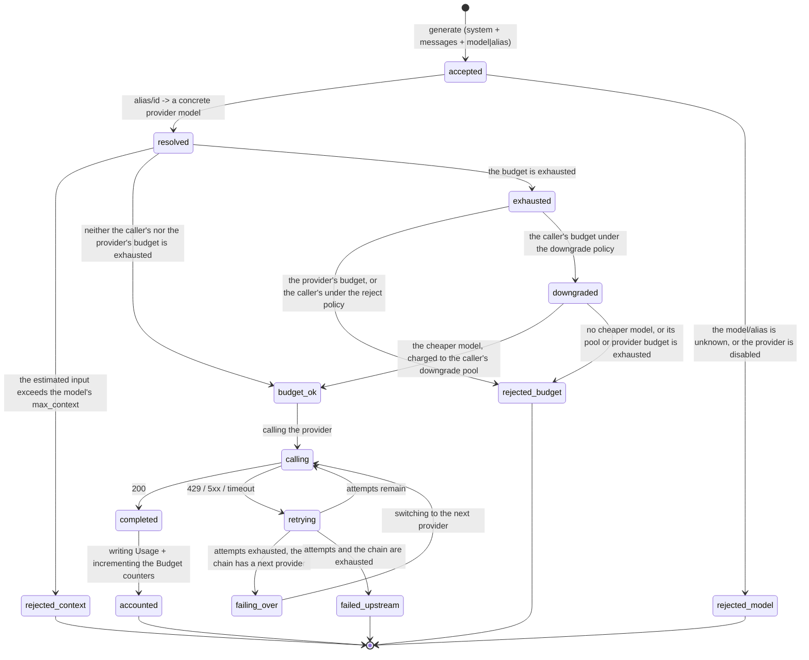
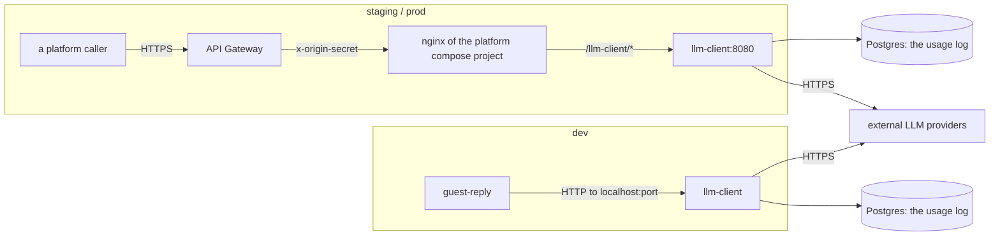
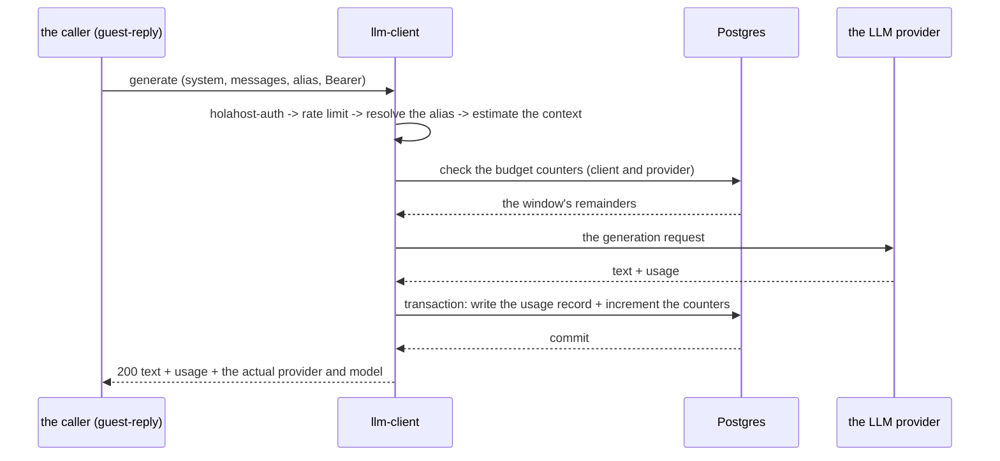

# llm-client — technical specification of the microservice

> A **Resource Service** of the Holahost platform (see `holahost/docs/holahost_frame.md`). A facade
> over external large-language-model providers; it owns the **Provider + Model + Budget + Usage**
> domain (the registry of providers and models comes from git config, not from the database).
>
> **Path convention:** `backend/…`, `infra/…`, `docs/…` are relative to the service's root
> (`holahost/services/llm-client/`); "the repository root" means the root of the monorepo.
>
> **Self-containedness:** this document reads without the specifications of other services.
> Everything shared platform-wide is in the framework specification, and that is what is referenced.
>
> **Dynamic sections** at the end of the document: "Deferred decisions", "Extensions", "Draft ADRs".

---

## Stage 1. Problem Statement + Opportunity Brief + User journey map

### 1.1 Problem Statement

The reason to build this: Holahost's services need access to external LLM providers. Without a shared
facade, every service duplicates the provider's SDK, its key, the retry policy for `429` and
overload, and usage accounting; the platform's spend is visible at no single point, and changing the
model requires edits in N services.

### 1.2 Opportunity Brief

We are building a Resource Service — the platform's single point through which calls to LLMs go. The
domain: `Provider` (the registry of providers), `Model` (a provider's model: `max_context`,
`max_output`, price per 1M tokens), `Budget` (a spend ceiling over a window plus the policy on
exhaustion), `Usage` (the fact of spend for one call). The only substantive operation is
**generate**: `system` + `messages` + parameters → text + usage. What the service gives everyone
else:

| Capability | What it takes off the caller |
|---|---|
| A single `generate` operation | knowing the provider's SDK and HTTP contract |
| Logical model aliases (`fast` / `quality` / `default`) resolved in config | hardcoded vendor model names; changing the platform's model becomes an edit to one service's config |
| Centralised retries with backoff on upstream `429` / overload / 5xx | a retry policy of its own in every service |
| Failover to the next provider in the chain once retries are exhausted | every LLM consumer failing when one provider goes down |
| Budgets with an active policy: `reject`, or `downgrade` to a cheaper model | uncontrolled spend, and a hard refusal where a cheaper answer would do |
| A usage log broken down by caller, provider and model | no visibility of the platform's spend |
| Provider keys held by this service alone | the secret spreading across services, and rotation in N places |

The service has no product domain: the prompt always arrives from outside, and the scenarios
("answer the guest" and others) live with the caller. How it joins the product: the service is part
of the platform's first vertical slice, on which the framework specification's topology is checked —
the `backbone` network, offline JWT validation, layered rate limiting, independent deployment.

**The iteration's success criterion** (an infrastructure service has no product metrics — recorded
deliberately): generation works end to end against the local dev stack when called by the
`guest-reply` CLI, and updating the service does not touch its neighbours. The technical metrics are
**Stage 8**.

### 1.3 User journey map

There are no direct human users. The actor is a calling client with an s2s token; in this iteration
the only client is the `guest-reply` CLI. The map has two parts: the lifecycle of a **generation
request** (§1.3.1) and the lifecycle of the service's **long-lived resources** — `Provider`, `Model`,
`Budget`, `Usage` (§1.3.3).

#### 1.3.1 State machine of a generation request



#### 1.3.2 Transitions and events

| State | Event | Next state | What the caller sees |
|---|---|---|---|
| `accepted` | the alias or `model_id` resolves to an available model | `resolved` | — |
| `accepted` | the alias or `model_id` is unknown, or the provider is disabled | `rejected_model` | 400 `UnknownModelError` |
| `resolved` | the input is longer than the model's `max_context` | `rejected_context` | 422 `ContextOverflowError` |
| `resolved` | the provider's budget is exhausted, or the caller's own under policy `reject` | `rejected_budget` | 429 `BudgetExhaustedError` plus the reset time |
| `resolved` | the caller's own budget is exhausted, policy `downgrade`, the cheaper model is set and neither the caller's downgrade pool nor that model's provider budget is exhausted | `budget_ok` | — (the actual model comes back in the response) |
| `downgraded` | there is no cheaper model, or the caller's downgrade pool or its provider's budget is exhausted too | `rejected_budget` | 429 `BudgetExhaustedError` plus the reset time |
| `calling` | the provider answered `200` | `completed` → `accounted` | 200 + text + usage + the actual provider and model |
| `calling` | the provider answered `429`/5xx or timed out, attempts remain | `retrying` → `calling` | — (invisible from outside) |
| `retrying` | attempts exhausted, there is a next provider in the chain | `failing_over` → `calling` | — (invisible from outside) |
| `retrying` | attempts and the chain are exhausted | `failed_upstream` | 502 `UpstreamLlmError` (retryable) |
| any | no JWT, an invalid one, or the wrong `aud` | unchanged | 401 |
| any | the per-service rate limit was exceeded | unchanged | 429 + `Retry-After` |

The numbers — the attempt limit, backoff, timeouts, the budget's window and size, the composition of
the fallback chain — are Stage 3. The error body's format and the full list are Stage 7.

The response always carries the **actual** provider and model: both a budget `downgrade` and a
`failover` on provider failure have to be visible to the caller, or it cannot tell a downgraded
answer from the one it asked for.

#### 1.3.3 Long-lived resources

| Resource | States | What changes them |
|---|---|---|
| `Provider` | `enabled` ⇄ `disabled` → `removed` | an edit to the service's config (git) plus a rollout |
| `Model` | `available` ⇄ `deprecated` → `removed`; belongs to a provider | the same; an alias is pointed at another model without the callers being involved |
| `Budget` | the current window's state: `open` → `exhausted`; a new window is a new budget with a new identity | it grows with every successful call; the repository assembles it as an aggregate over the usage log |
| `Usage` | an append-only, immutable record | a successful provider call |

`Usage` is written only from figures the provider confirmed: a successful call → a record in the
usage log and an increment of the counters. An unsuccessful call accrues no spend; on `failover` the
spend is charged to the provider that actually answered. The budget check happens before the provider
call, against the current window's counter; a partially consumed window does not block a call that
may exceed it — overspend within a single call is accepted.

#### 1.3.4 Entry points

| Caller | Token | Operations | In this iteration |
|---|---|---|---|
| the `guest-reply` CLI | s2s, `client_credentials` | `generate` | yes |
| an Orchestration Service (e.g. a chat assistant) | s2s or exchanged | `generate` | no (an extension point) |
| any Holahost service | s2s | reading its own spend and remaining budget | no (an extension point) |

---

## Stage 2. User Stories + Acceptance Criteria

The roles:
- **Caller** — a platform service or tool with an s2s token that calls generation; in this iteration
  that is `guest-reply-cli`.
- **Operator** — whoever deploys the service, keeps the registry of providers and the budgets, and is
  answerable for the platform's spend.

The acceptance criteria reference parameters by symbolic name; the values are fixed in Stage 3.

### 2.0 Parameter table

| Parameter | Purpose |
|---|---|
| `MODEL_ALIASES` | the "logical alias → provider + model" table |
| `MODEL_TOKENS_PER_SECOND` | a conservative generation speed for the model — an input to the pre-flight check |
| `IDEMPOTENCY_KEY_TTL` | the window in which a repeat request with the same key is recognised |
| `PROVIDER_CHAIN` | the order of providers during failover |
| `PROVIDER_TIMEOUT` | the timeout of one call to a provider |
| `RETRY_MAX_ATTEMPTS`, `RETRY_BACKOFF_BASE`, `RETRY_TOTAL_BUDGET` | the upstream retry policy |
| `MAX_INPUT_BYTES` | the maximum request size (`system` + `messages`) |
| `MAX_OUTPUT_TOKENS` | the ceiling on the answer's length |
| `BUDGET_WINDOW`, `BUDGET_CAP_PER_CLIENT`, `BUDGET_CAP_DOWNGRADE_PER_CLIENT`, `BUDGET_CAP_PER_PROVIDER` | the budget's window and ceilings |
| `ON_BUDGET_EXHAUSTED`, `DOWNGRADE_MODEL` | the caller's policy on exhaustion of its own budget and the target cheaper model |
| `GENERATION_P95_BUDGET` | the target p95 of generation time |
| `RATE_LIMIT_DEFAULT` | the per-service limit per `client_id`+`sub` pair |
| `JWT_CLOCK_SKEW` | the clock-skew allowance when checking `exp`/`iat` |
| an error's `code` | the error class's name; the list and the body are Stage 7 |

### US-L01: Generation from an external prompt

> As a Caller, I want to send my own system prompt and messages and get generated text back, so that I do not depend on any provider SDK.

**AC:**
- The request takes `system`, a list of `messages`, a model identifier (an alias or a `model_id`) and
  generation parameters; on success, `200` with the text.
- The service neither replaces nor augments the `system` it was sent: the provider receives exactly
  what the caller sent.
- The response contains: the text, `usage` (input and output tokens), the **actual** provider and
  model, and the reason generation stopped.
- A request larger than `MAX_INPUT_BYTES` → `413 PayloadTooLargeError`, before the body is read
  (§8.1).
- An empty `messages` list → `422 InvalidPayloadError` (platform validation, §7.4).
- A requested `max_tokens` above `MAX_OUTPUT_TOKENS` is truncated to the ceiling; the truncation is
  visible in the response.
- The response time with no retries is within `GENERATION_P95_BUDGET` (p95).
- No product prompt is stored in the service's codebase (checked by the absence of prompt templates
  in the repository).
- Roles are passed to the provider in the composition and order in which they arrived: `system` is
  not glued to `messages`, the order of messages is not changed, and the service adds no instructions
  of its own.
- The request accepts an idempotency key. A repeat with the same key within `IDEMPOTENCY_KEY_TTL`,
  while the first is in flight or already finished, → `409 DuplicateRequestError`; no second provider
  call is made and no second usage record appears.
- The answer to a duplicate does not carry the first generation's text: only the state and `usage`
  are kept against the key, and in process memory at that — the protection holds for the life of that
  process and on one instance.

### US-L02: Choosing a model through a logical alias

> As a Caller, I want to ask for `fast` or `quality` instead of a vendor model name, so that the platform can change models without touching my code.

**AC:**
- An alias from `MODEL_ALIASES` resolves to a "provider + model" pair; which one is visible in the
  response.
- An unknown alias or `model_id` → `400 UnknownModelError`, with the list of available aliases in
  `details`.
- An alias pointing at a disabled provider or a removed model → `400 UnknownModelError`.
- Changing an alias's target in the config changes the actual model with no change on the caller's
  side.

### US-L03: Transparent upstream retries

> As a Caller, I want transient provider failures retried inside the service, so that I do not implement backoff in every service.

**AC:**
- A provider answering `429` or `5xx`, or a `PROVIDER_TIMEOUT` timeout, causes a repeat with
  exponential backoff from `RETRY_BACKOFF_BASE`.
- The number of attempts is bounded by `RETRY_MAX_ATTEMPTS` and the total time by
  `RETRY_TOTAL_BUDGET`; exhausting either stops the repeats.
- Success after retries is returned to the caller as an ordinary `200` — how many attempts there were
  is invisible from outside, but is written to the log and to a metric.
- Errors that are not transient (`400`, `401`, a content refusal) are not repeated.
- If the provider sent a `Retry-After`, the pause is taken from it rather than from the backoff
  formula.

### US-L04: Failover between providers

> As a Caller, I want the service to switch to another provider when the primary is down, so that a single vendor outage does not stop the platform.

**AC:**
- Having exhausted the retries with the current provider, the service moves to the next one in
  `PROVIDER_CHAIN` and repeats the request there.
- The switch happens only for transient failures; an error in the request itself is not carried over
  to the next provider.
- Exhausting the chain → `502 UpstreamLlmError`, marked as retryable.
- The response returns the provider that actually answered, and the spend is charged to that one.
- Disabling a provider in the config excludes it from the chain without restarting the callers.

### US-L05: Refusal when the budget is exhausted

> As an Operator, I want calls to stop when a budget cap is reached, so that a runaway caller cannot drain the platform's account.

**AC:**
- The budget check happens **before** the provider is called.
- The `BUDGET_CAP_PER_CLIENT` or `BUDGET_CAP_PER_PROVIDER` ceiling being exhausted under the `reject`
  policy → `429 BudgetExhaustedError`, with which ceiling was exhausted and the start time of the
  next window in `details`.
- A budget refusal creates no usage record.
- One caller exhausting its budget does not affect the others — the ceilings are independent.
- The start of a new `BUDGET_WINDOW` restores access with no manual action.

### US-L06: A cheaper answer instead of a refusal

> As a Caller, I want an optional cheaper answer instead of a hard refusal when the budget is out, so that non-critical flows keep working.

**AC:**
- Under the `downgrade` policy, exhaustion of the caller's own budget (`BUDGET_CAP_PER_CLIENT`) moves
  the request to `DOWNGRADE_MODEL` rather than refusing it.
- A downgraded request is charged to a pool of its own, `BUDGET_CAP_DOWNGRADE_PER_CLIENT`, not to the
  exhausted one (B-4).
- Exhaustion of the provider's budget is refused whatever the policy.
- The cheaper model is set by a setting separate from `MODEL_ALIASES`; changing the alias table does
  not affect it.
- The response carries the actual model, so the caller can tell degradation from normality without
  guessing.
- If `DOWNGRADE_MODEL` is unset, or the caller's downgrade pool or the cheaper model's provider budget
  is exhausted too → `429 BudgetExhaustedError`.
- The policy is the caller's, not a budget's: it has a default and is overridden per `client_id`.

### US-L07: The bounds of input and output

> As a Caller, I want oversized requests rejected predictably, so that I learn about limits from the contract and not from a vendor error.

**AC:**
- An input estimate greater than the chosen model's `max_context` → `422 ContextOverflowError`, with
  the model's limit and the request's estimate in `details`.
- The check happens before the provider is called: a vendor context-overflow error is never passed
  through.
- On a `downgrade`, the context is re-checked against the **new** model's `max_context`.
- The response does not exceed `MAX_OUTPUT_TOKENS`.
- If the estimated generation time (`max_tokens` / `MODEL_TOKENS_PER_SECOND` plus processing the
  input) does not fit into what is left of `RETRY_TOTAL_BUDGET`, the request is refused **before** the
  provider is called, with an error code of its own; `details` carries the largest `max_tokens` that
  would have fitted.
- A pre-flight refusal takes milliseconds and creates neither a provider call nor a usage record.

### US-L08: Usage accounting

> As an Operator, I want every successful call recorded, so that I can see where the platform's LLM spend goes.

**AC:**
- Every successful call creates a record with: `client_id`, `sub`, the provider, the model, the input
  and output tokens, the duration, and the `X-Request-ID`.
- The figures come from the provider's response, not from an estimate of the service's own.
- An unsuccessful call creates no usage record and does not move the budget counters.
- The records are immutable: the contract provides for neither updates nor deletion.
- The texts of `system`, `messages` and the answer are not stored in a usage record.
- An exhausted ceiling survives a container restart: the budget's state is derived from the usage log,
  so a restart does not hand back a spent limit (unlike the rate limit, US-L10).
- A call that ended in a provider timeout creates no usage record — even though the provider has
  probably spent the tokens. This gap in accounting is recorded in ADR B-12 and is not closed by the
  service estimating the spend itself.

### US-L09: Authentication and authorization

> As an Operator, I want every route except health to require a valid token, so that provider keys are reachable only through authorised calls.

**AC:**
- The shared `holahost-auth` library (framework specification, "Reusable shared entities") is mounted
  on every route except `GET /api/llm-client/health`. Its `AuthConfig` reads its five variables from
  the environment itself — the names are the platform's, and the only value belonging to the service
  is `EXPECTED_AUDIENCE`.
- A missing `Bearer` token, a JWT that does not parse, an unexpected `alg`, an invalid signature, an
  expired `exp` (with the `JWT_CLOCK_SKEW` allowance), a foreign `iss`, or an `aud` without
  `llm-client` → `401`, with no reason disclosed in the body.
- An unknown `kid` → one JWKS re-fetch, then `401`.
- `403` only for a valid token without the rights.
- Provider keys never leave the service: they are returned in no response, written to no log, and
  accepted in no incoming request (there is no BYOK header in the contract).

### US-L10: Rate limiting

> As an Operator, I want per-caller request limits, so that one client cannot monopolise the service.

**AC:**
- The limit is applied after `holahost-auth` and before the handler; the key is `(bucket,
  is_service)` over `client_id`/`sub`. The mechanism is `holahost_http.RateLimitMiddleware` with
  `InMemoryRateLimiter`; the service declares the buckets and the ceilings.
- Exceeding it → `429` with `Retry-After`.
- The counters live in process memory and are not persisted — a restart zeroes the window. That is
  acceptable: the limit protects the service from overload. The budget (US-L05), by contrast, is
  persisted, because it is about money and has a long window.
- The rate limit and the budget are independent mechanisms: one firing does not cancel the other's
  check, and the error codes differ.

### US-L11: The error contract

> As a Caller, I want one machine-readable error shape across providers, so that I never parse vendor errors.

**AC:**
- The error body is `{ error: { code, message, details } }` from `holahost-http`; `code` is the
  **error class's name**, not a separate string taxonomy.
- The provider's vendor codes and messages are not passed through; they are written to the log.
- Every error has retry semantics attached; `UpstreamLlmError` is retryable, `ContextOverflowError`
  and `UnknownModelError` are not.
- `message` goes on the wire but is not in the published schema: it is for a human reading a log,
  while a caller branches on `code` and reads `details`.
- The message contains no fragments of the prompt, of the answer, or of provider keys.

### US-L12: Health and smoke

> As an Operator, I want a health endpoint, so that deploys can be verified automatically.

**AC:**
- `GET /api/llm-client/health` is reachable without authorization and answers `200` when the service
  is ready to take requests. The path is under the base path: the gateway routes `/api/<svc>/*`
  without rewriting, so a bare `/health` is reachable only from inside the compose network and the
  rollout's smoke check would never get to it.
- Readiness includes the accounting database being reachable; health makes no provider calls — it
  must neither spend money nor depend on a vendor.
- The container listens on port 8080 and is attached to the `backbone` network; the port is not
  published outside.

### US-L13: Logs without prompts or secrets

> As an Operator, I want logs that never contain prompt text or keys, so that observability does not leak content.

**AC:**
- What never reaches the logs: `system`, `messages`, the answer's text, provider keys, a token's body.
- What does reach the logs: `X-Request-ID`, `client_id`, `sub`, the provider, the model, the token
  counts, the number of attempts, whether a `downgrade` or `failover` happened, error codes, and
  durations.
- The incoming request's `X-Request-ID` is logged and propagated into the outgoing provider calls
  where the protocol allows it.
- The logs are structured (JSON) and the set of fields is governed by an allowlist; the mechanism is
  `holahost-observability`, and the service declares only its own fields beyond the platform core.
- The completion event is `op_completed`, one per request, with the platform's core fields (framework
  specification, "The operation-completion event contract").

### US-L14: Managing the provider registry

> As an Operator, I want to add, disable or re-point providers and models in config, so that vendor changes never require changes in calling services.

**AC:**
- Providers, models and the alias table are set by the service's config; callers are not notified of
  edits and change no code.
- Disabling a provider excludes it from alias resolution and from `PROVIDER_CHAIN`.
- A provider's key is read from Secrets Manager through a reference in the config; the secret's value
  never reaches git.
- An incorrect config — an alias pointing at a non-existent model, a provider with no key — is caught
  at startup: the service does not come up and writes the reason.

### 2.15 Coverage of the user journey map (§1.3)

| Transition on the map | Covered by |
|---|---|
| `accepted → resolved` | US-L02 |
| `accepted → rejected_model` | US-L02 |
| `resolved → rejected_context` | US-L07 |
| `resolved → budget_ok` | US-L05 |
| `resolved → exhausted → rejected_budget` | US-L05 |
| `exhausted → downgraded → budget_ok` | US-L06 |
| `calling → completed` | US-L01 |
| `calling → retrying → calling` | US-L03 |
| `retrying → failing_over → calling` | US-L04 |
| `retrying → failed_upstream` | US-L03, US-L04 |
| `completed → accounted` | US-L08 |
| The `Provider` / `Model` lifecycle (§1.3.3) | US-L14 |
| 401 / 403 on any operation | US-L09 |
| 429 rate limit on any operation | US-L10 |
| Every refusal branch | US-L11 |

---

## Stage 3. Tech Constraints Doc

### 3.1 System architecture

A self-contained deploy unit: the application container plus a Postgres container (the usage log) in
its own compose project, on the `backbone` network. The only service on the platform with outgoing
traffic to the internet.



| Environment | Entry | Who calls |
|---|---|---|
| staging / prod | API Gateway → the platform compose project's nginx → service:8080 (the port is not published) | the platform's services |
| dev | straight to the container's published port, with no gateway and no nginx | a developer's CLI tools |

The service behaves identically in both paths and compensates for the absent perimeter in no way:
there is no branching on environment and no generation of missing headers. `X-Request-ID` is set by
the caller — nginx on staging and prod, a CLI tool on dev.

### 3.2 Code architecture

Clean architecture, with the layers and the `import-linter` contract shared platform-wide (framework
specification, "Reusable shared entities").

```
backend/
  app/
    config/                 # typed settings and reading the provider registry's git config
                            # (the source for the provider repository, read once at startup)
    domain/
      entities/             # identifiable objects with a lifecycle
      value_objects/        # frozen dataclasses with invariants, and ID classes
      exceptions.py
    application/
      dto/                  # use-case commands and results, primitives only
      ports/                # Protocols for external dependencies: the generation provider, the
                            # accounting and budget repositories, the rate limit, the unit of work
      use_cases/            # orchestration on top of the ports
      exceptions/
    infrastructure/
      providers/            # provider adapters over langchain models
      db/                   # SQLAlchemy Core, repositories, migrations; the engine and UoW come from holahost-db
    interface/
      http/                 # FastAPI: the router, the schemas, the error contract, the edge's values
    scripts/                # the composition root
```

Retries, model selection, failover and the budget check are orchestration, so they live in the use
case rather than in the provider adapter. The adapter knows only "call this model with these
messages", and translates what the vendor answers into the port's terms: vendor errors into
`TransientProviderError` / `PermanentProviderError`, and the vendor's stop reason into `FinishReason`
— through a mapping table of its own for each provider. For `anthropic`:

| `stop_reason` | Result |
|---|---|
| `end_turn`, `stop_sequence` | `FinishReason.stop` |
| `max_tokens` | `FinishReason.max_tokens` |
| `refusal` (arrives with `200`) | `PermanentProviderError` |
| `tool_use`, `pause_turn` | unreachable: tools are out of scope (§3.9) |

There are no `infrastructure/auth/` or `interface/http/middleware/` directories: `holahost-auth`
hands over a ready-made middleware and `current_token`, so there is nothing to adapt, and the edge's
middleware and their order are assembled by `holahost_http.create_edge_app`. The service declares the
values — the limit's buckets, the body ceiling, the error for a missing `X-Request-ID`, its own error
contract — but not the sequence (§8.1).

### 3.3 Domain modelling

Lightweight DDD: `domain/entities/` with the `create()` and `from_repo()` factory methods,
`domain/value_objects/` as frozen dataclasses with invariants in `__post_init__`, and ID classes over
`uuid.UUID`. Domain services, aggregates and factories are not used; repositories are Protocols in
`application/ports/`, not in `domain/`. There are no `Clock` or `IdGenerator` ports:
`datetime.now(tz=UTC)` inline, and identifiers are self-generating. The registry of providers and
models is configuration, not persistent state (§3.6).

### 3.4 Technology stack

| Layer | Choice |
|---|---|
| Language | Python 3.12 |
| HTTP | FastAPI + uvicorn, with **synchronous** `def` endpoints (ADR B-7) |
| Provider client | the `langchain` stack: the providers' chat models (`langchain_anthropic` and the like) behind a port |
| Database | Postgres 16, a container in the service's compose project |
| Database access | SQLAlchemy Core 2.0 over `psycopg[binary,pool]`; no ORM |
| Migrations | Alembic |
| Validation | Pydantic v2 |
| Authorization | the shared `holahost-auth` library |
| Tests | pytest, with fakes for the ports; no test ever reaches a real provider |
| Logs | structured JSON on stdout, with a field allowlist |

### 3.5 Data storage and lifecycle

| Data | Where | Lifecycle |
|---|---|---|
| Usage records (the log) | Postgres, append-only | indefinitely; pruning is an extension |
| The budget's state | nowhere: an aggregate over the usage log for the current window | computed on every check (§6.1) |
| Idempotency keys | process memory | until `IDEMPOTENCY_KEY_TTL` expires, or until a restart |
| The registry of providers, models and aliases | the service's git config | changed by a rollout (§3.6) |
| Provider keys | Secrets Manager (staging/prod), `.env.dev` (dev) | rotation is replacing the value plus a restart |
| The texts of prompts and answers | **nowhere** | they live only in the request's memory |
| Rate-limit counters, the JWKS cache | process memory | until a restart |

There is one rule: what is promised to the outside lives in the database, and what protects the
service lives in memory. Spend is a promise — money, reporting — so the log is persistent and the
budget survives a restart through it automatically. The rate limit and the idempotency keys protect
against overload and double payment within the life of a process, so resetting them on a restart is
harmless (ADR B-9).

### 3.6 The registry of providers, models and aliases

Configuration in the service's git repository; only names and references to secrets go into the file,
while the key values live in SM. A change is applied by **rolling out the container**; hot reload is
not introduced — the config takes part in startup validation, and "half the processes on the old
config" is worse than a short restart.

```yaml
providers:
  anthropic:
    enabled: true
    api_key_ref: "holahost/<env>/llm-client/anthropic-api-key"   # the secret's name in SM
    models:
      claude-sonnet-4-6:  { max_context: 200000, max_output: 8192, price_in: …, price_out: … }
      claude-haiku-4-5:   { max_context: 200000, max_output: 8192, price_in: …, price_out: … }

aliases:
  default: { provider: anthropic, model: claude-sonnet-4-6 }
  quality: { provider: anthropic, model: claude-sonnet-4-6 }
  fast:    { provider: anthropic, model: claude-haiku-4-5 }

fallback_chain: [anthropic]          # the order of providers during failover
downgrade_model: { provider: anthropic, model: claude-haiku-4-5 }   # the downgrade policy's target
```

An incorrect config — an alias pointing at a non-existent model, an enabled provider with no secret
or no models, an empty `fallback_chain` — means the service does not start and writes the reason
(US-L14).

The exhaustion policy (`ON_BUDGET_EXHAUSTED`) is a caller's setting — a default overridden per
`client_id` — not an attribute of a budget: a provider's budget is shared by callers whose policies
differ (§4.3).

### 3.7 Parameters and limits (numbers)

The time figures below describe the **synchronous mode** and are derived from the API Gateway's
integration ceiling (30 s) with all the retries and failover taken into account. An important caveat:
the service cannot guarantee staying within that ceiling — the duration of a generation does not
follow from the size of the input, and a model is entitled to take longer on the same prompt. So the
ceiling states not a promise but the **boundary of the synchronous mode's applicability**: anything
that does not fit is served by the asynchronous mode (E-3) rather than by raising timeouts. Until E-3
exists, load that does not fit the budget is not served by the service.

| Parameter | Value | Rationale |
|---|---|---|
| `PROVIDER_TIMEOUT` | 20 s per attempt | a generation of `MAX_OUTPUT_TOKENS` fits with room to spare; more would not fit the overall budget |
| `RETRY_MAX_ATTEMPTS` | 2 (the first plus one repeat) | a third repeat does not fit into 30 s |
| `RETRY_BACKOFF_BASE` | 1 s, exponential, jitter ±20 % | the provider's `Retry-After`, when sent, takes priority |
| `RETRY_TOTAL_BUDGET` | 25 s for the whole request, failover included | leaves 5 s for the network and serialisation before the integration ceiling |
| `FALLBACK_CHAIN` | config; one provider in this iteration | with a chain of one element failover does not fire — the mechanism exists, the application of it does not |
| `MAX_INPUT_BYTES` | 256 KiB | more makes no sense in a synchronous path: a generation over such an input will not fit the budget |
| `MAX_OUTPUT_TOKENS` | 1000 | higher risks not fitting `PROVIDER_TIMEOUT` |
| `BUDGET_WINDOW` | a day, reset at 00:00 UTC, lazily on the first request of a new window | aggregated over the usage log on the fly, so no separate scheduler is needed |
| `BUDGET_CAP_PER_CLIENT` | 2,000,000 input and 200,000 output tokens per day | counted separately: the prices differ by a multiple, and one counter would lie |
| `BUDGET_CAP_PER_PROVIDER` | 10,000,000 input and 1,000,000 output tokens per day | protection of the platform's wallet on top of the per-client ceilings |
| `BUDGET_CAP_DOWNGRADE_PER_CLIENT` | input and output tokens per day, counted separately; the value is a deferred decision | the pool downgraded requests are charged to (US-L06) |
| `ON_BUDGET_EXHAUSTED` | `reject` by default, overridden per `client_id`; applies to the caller's own budget only | a silent downgrade by default should not come as a surprise |
| `DOWNGRADE_MODEL` | set in the config, applied only under the `downgrade` policy | separate from the alias table (ADR B-4) |
| `MODEL_TOKENS_PER_SECOND` | a conservative estimate of generation speed, set in the config per model | an input to the pre-flight check (§3.7.1) |
| `IDEMPOTENCY_KEY_TTL` | 15 minutes | the window in which a repeat with the same key is recognised as a duplicate |
| `RATE_LIMIT_DEFAULT` | 600 req/hour per `client_id`+`sub` pair | the default from the framework specification |
| `GENERATION_P95_BUDGET` | 15 s | the path with no retries |
| `JWT_CLOCK_SKEW` | 30 s | from the framework specification |
| Database query timeout | 5 s | usage accounting must not hold a thread longer than the generation itself |

#### 3.7.1 What makes the synchronous mode predictable

Since staying within the ceiling is not guaranteed, three mechanisms are introduced — they are
cheaper than a full asynchronous mode and remove its most expensive consequences (ADR B-12).

**Pre-flight refusal.** Before the provider is called, an estimate is computed: the generation time
`max_tokens / MODEL_TOKENS_PER_SECOND` plus an estimate of processing the input. If the estimate does
not fit into what is left of `RETRY_TOTAL_BUDGET`, the request is refused immediately with an error
code of its own, stating which `max_tokens` would have fitted. The caller gets an answer in
milliseconds instead of a timeout at the thirtieth second, and the provider is spared a request that
was doomed from the start.

**The idempotency key.** The caller sends a key; for `IDEMPOTENCY_KEY_TTL` the service remembers that
a request with that key is already in flight or already finished, and answers a repeat with a
conflict rather than with a second paid generation. The key holds only the state and `usage` — **the
answer's text is not stored** — so a repeat does not deliver the result, it only prevents paying
twice. Delivering the result after a dropped connection is part of the asynchronous extension E-3.

**An acknowledged gap in accounting.** If the provider did not answer within `PROVIDER_TIMEOUT` it
has most likely already spent the tokens, while `Usage` is written only from confirmed figures —
which means that spend will not reach the usage log. The gap is accepted deliberately: the
alternative is estimating the spend ourselves and spoiling the accounting's trustworthiness.
Reconciliation against the provider's billing is an extension.

### 3.8 Security

| Aspect | Decision |
|---|---|
| Authentication | JWT offline through `holahost-auth` on every route except `GET /api/llm-client/health` |
| Authorization | by the `client_id` from the token: budgets, limits and policies attach to it |
| Provider keys | in SM only; read at startup, returned in no response, written to no log, and accepted in no incoming request (there is no BYOK header in the contract) |
| Outgoing traffic | only to the provider domains from the config; TLS certificate verification is mandatory and is disabled in no environment |
| The caller's data | `system`, `messages` and the answer are neither stored nor logged; only counters reach the usage log |
| Provider errors | not passed through verbatim: vendor codes and texts stay in the logs |
| Input | the body size is bounded before parsing, and the context estimate is computed before the provider is called |
| CORS | not configured — no browser reaches this service, and direct frontend access to generation is not planned at all (it is an Orchestration Service's operation, not a UI's) |
| Prompt injection | An injection is an attack on the prompt's meaning, so the defence belongs to the prompt's owner — in this iteration the CLI: untrusted data only in the user role, no instructions taken from retrieved content, the output checked. The service takes no part in that, but is obliged **not to destroy** the caller's defence: the roles are passed to the provider in the same composition and order, `system` is not glued to `messages`, and the service adds no instructions of its own and rewrites no content |

### 3.9 Out of scope for this iteration

- Streaming the answer (an extension).
- Tool use / function calling, structured output, multimodal input.
- The provider's prompt caching.
- Embeddings as an operation of this service: the platform's embedding model is local and has no
  external provider, so it lives with the owner of the documents rather than behind this facade.
- Providers' batch APIs and deferred generations.
- More than one provider in `FALLBACK_CHAIN` (the mechanism is implemented, the configuration is not).
- A caller reading its own spend and remaining budget (an extension).
- Converting spend into money: prices are kept in the config, but no reporting is built on them.

### 3.10 Happy path at component level



---

## Stage 4. Domain Entities

The values of the parameters the invariants reference are in §3.7.

The criterion for an entity is identity that survives a change of attributes: a provider with
`enabled: false` is still the same provider, and a client's budget for a day is still the same budget
as the amount spent grows. Neither the storage nor the object's lifetime in memory affects this: the
source of the data — a table, git config, an aggregate over the log — is a repository's
implementation, not the object's nature. By that criterion there are five entities: `Provider`,
`Model`, `Budget`, `UsageRecord`, `IdempotencyRecord`.

### 4.1 Value objects

| VO | Based on | Invariants |
|---|---|---|
| `GenerationId` | `uuid.UUID` | generated by its own `new()` for each generation; the usage record's identity. Not `X-Request-ID`: that one is chosen by the caller, and two paid generations may share it |
| `ClientId` | `str` | non-empty; taken from a token claim, not from the request body |
| `Subject` | `str` | non-empty; the token's `sub` (for s2s it equals `client_id`) |
| `ProviderName` | `str` | a value from the registry; an unknown name is not a VO but a resolution error |
| `ModelId` | `str` | the model's identifier at the provider |
| `TokenCount` | `int` | ≥ 0 |
| `Usage` | a pair of `TokenCount` | input and output separately: the prices differ by a multiple, and one counter would lie |
| `IdempotencyKey` | `str` | 1…128 characters; unique within a `ClientId` and an `IDEMPOTENCY_KEY_TTL` window |
| `Message` | role + text | the role is `user` (B-14); the text contains non-whitespace characters and is kept unchanged |
| `FinishReason` | an enumeration: `stop`, `max_tokens` | the same across all providers; a stop sequence is not told apart from a natural end, because not every provider reports it; a content refusal is a provider error, not a value (§3.2) |

### 4.2 `Provider` and `Model`

Entities with the identities `name` and `(provider, id)` respectively. Their state changes between
rollouts — disabling a provider, marking a model deprecated, editing the ceilings — and after any such
edit it is the same provider and the same model: the usage log's records and the aliases refer to
them. The source of the data is git config (§3.6) rather than a table; the repository reads it once at
startup and hands back typed objects, not settings dictionaries.

`Provider`:

| Field | Type | Note |
|---|---|---|
| `name` | `ProviderName` | |
| `enabled` | `bool` | a disabled one is excluded from alias resolution and from the failover chain |
| `api_key_ref` | `str` | a reference to a secret, not the value; may be absent only for a disabled provider |

`Model`:

| Field | Type | Note |
|---|---|---|
| `provider` | `Provider` | a model does not exist without a provider, so this is the object itself rather than a name: no separate "permitted provider + model pair" type is then needed |
| `id` | `ModelId` | |
| `max_context` | `int` | > 0 |
| `max_output` | `int` | > 0; the actual ceiling on an answer is `min(max_output, MAX_OUTPUT_TOKENS)` |
| `price_in`, `price_out` | `Decimal` | the price per 1M tokens; stored for reporting and not used in this iteration's calculations |
| `tokens_per_second` | `int` | > 0, or the pre-flight estimate (§3.7.1) divides by zero |
| `deprecated` | `bool` | a marked model still resolves, but no new aliases are pointed at it |

**Invariants:** an enabled provider has a resolvable reference to a secret; `max_context` is strictly
greater than `max_output`; `tokens_per_second` > 0. A violation is caught at startup — the service
does not come up (US-L14). The key's value is not held in the object: it is read when the provider is
called and never reaches the domain.

`Provider` holds no models: `Model` refers to its provider, and a reference back cannot be built
between immutable objects. "An enabled provider has at least one available model" is a property of
the whole registry, checked when the registry is loaded (§3.6).

**Lifecycle:** the state changes with a rollout of a new configuration; a provider or model removed
from the config stops resolving but stays readable in the usage log as a historical fact.

### 4.3 `Budget`

An entity with the identity `(scope, key, window_start)`: "client X's spend for day D" remains the
same budget as `spent` grows. It has no table of its own — the repository assembles it from an
aggregate over the usage log for the window plus the ceilings from the config (§6.1); that is a way of
implementing it, not a reason to consider it something else.

| Field | Type | Note |
|---|---|---|
| `scope` | an enumeration | `client` (the caller's own spend), `client_downgrade` (the caller's downgraded requests — a pool of its own, US-L06), `provider` |
| `key` | `ClientId \| ProviderName` | `ClientId` for both client scopes, `ProviderName` for `provider` |
| `window_start` | `datetime` (UTC) | the start of the current day; the boundary is set by the query, not by a stored field |
| `spent` | `Usage` | an aggregate over the usage log: input and output separately |
| `caps` | `Usage` | the window's ceilings from the config |

**Invariants:** `spent` never decreases within a window — a consequence of the log being append-only;
the ceilings are positive; the key's type matches the scope. The exhaustion policy is not a budget's
attribute: it belongs to the caller, while a provider's budget is shared by callers whose policies
differ.

**Lifecycle:** the object lives for the duration of one check. Resetting the window is neither an event
nor an operation: a new day changes the aggregate's range, and there is nothing to zero.

### 4.4 `UsageRecord`

| Field | Type | Note |
|---|---|---|
| `id` | `GenerationId` | generated for the generation (§4.1) |
| `request_id` | `str` | the request's `X-Request-ID`, for correlation with the logs |
| `client_id` | `ClientId` | |
| `subject` | `Subject` | |
| `provider`, `model` | `ProviderName`, `ModelId` | the **actual** ones, not the requested ones |
| `usage` | `Usage` | the provider's figures, not an estimate of our own |
| `latency_ms` | `int` | ≥ 0 |
| `downgraded`, `failed_over` | `bool` | markers of the policies that were applied |
| `created_at` | `datetime` (UTC) | |

**Invariants:** the record is immutable; it is created only from a confirmed successful provider
response; it contains no request or response text.

**Lifecycle:** append-only, kept indefinitely; pruning the usage log is not in this iteration's scope.

### 4.5 `IdempotencyRecord`

It lives in process memory, not in the database (B-9) — which does not affect it being an entity: it
has an identity (client + key), a state machine and an irreversibility invariant, and the storage is
expressed as a port with an in-memory adapter.

| Field | Type | Note |
|---|---|---|
| `key` | `IdempotencyKey` | |
| `client_id` | `ClientId` | different clients' keys never collide |
| `state` | an enumeration | `in_flight` or `completed` |
| `usage` | `Usage \| None` | filled in on completion |
| `expires_at` | `datetime` (UTC) | `created_at` + `IDEMPOTENCY_KEY_TTL` |

**Invariants:** the only state transition is `in_flight → completed`, with no way back; the answer's
text is not stored in the record — a repeat on that key gets a conflict, not the result (§3.7.1).

**Lifecycle:** created when a request with a key is accepted, closed on completion, and gone when the
TTL expires or with the process. The protection holds within the life of a process and on one
instance — which is enough for the case "the caller dropped on a timeout, the service is alive"; a
restart aborts the generation itself, so there is nothing left to remember.

### 4.6 Transient objects of a single call

`Generation` is the result of calling a provider: the text, `Usage`, the actual provider and model,
and a `FinishReason`. It has neither identity nor a lifecycle, is stored nowhere, and exists only
inside a call. The `downgraded` and `failed_over` markers are not part of it: the provider does not
know them, the use case does, and it adds them to the result on its own side. No separate "normalised
request" entity is introduced — the use case's input is described by a command DTO (§8.2).

---

## Stage 5. Use Cases

There is exactly one use case, and that is not an omission: everything else that might pass for one —
resolving an alias, checking the budget, retries, failover, usage accounting — are steps of one
scenario rather than scenarios of their own with their own actor and result. Operations for reading
spend are not in this iteration's scope (E-4).

### UC-L1. Generate an answer

- **Actor:** Caller
- **Input:** `client_id: str`, `subject: str`, `system: str`, `messages: list[(role: str, text: str)]`,
  `model: str` (an alias or a model identifier), `max_tokens: int | None`,
  `idempotency_key: str | None`
- **Output:** `text: str`, `input_tokens: int`, `output_tokens: int`, `provider: str`, `model: str`,
  `finish_reason: str`, `downgraded: bool`, `failed_over: bool`
- **Flow:** resolves `model` to a concrete provider + model pair and rejects unknown ones; checks the
  idempotency key, the context against `max_context`, and the pre-flight time estimate; compares
  against the caller's and the provider's budgets, applying the `reject` or `downgrade` policy; calls
  the provider with retries and, once the attempts are exhausted, with the next provider in the
  chain; on a confirmed response it writes the usage record and increments the counters, then returns
  the text together with the **actual** provider and model.

The order of the checks is fail-fast and cheapest-first: resolve the model → idempotency → context →
pre-flight → budget → call the provider. Anything that can be refused without reaching outside is
refused without it; writing the usage record is the last action and happens only on success.

---

## Stage 6. DB Schema

Postgres 16. **Only the usage log** is persistent. The budget's state is derived from it (§6.1). The
registry of providers and models comes from git config (§3.6, B-8); the rate-limit counters and the
idempotency keys live in process memory (B-9); prompts and answers are stored nowhere (§3.5).

```sql
-- The usage log: one row per confirmed successful provider call.
-- Append-only: the contract provides for neither updates nor deletions.
-- It is also the source of truth for the budget: spend in a window = an aggregate over this table.
CREATE TABLE usage_records (
    id            uuid        PRIMARY KEY,
    request_id    text        NOT NULL,   -- X-Request-ID: correlation with the logs, not the identity
    client_id     text        NOT NULL,
    subject       text        NOT NULL,
    provider      text        NOT NULL,
    model         text        NOT NULL,
    input_tokens  integer     NOT NULL,
    output_tokens integer     NOT NULL,
    latency_ms    integer     NOT NULL,
    downgraded    boolean     NOT NULL,
    failed_over   boolean     NOT NULL,
    created_at    timestamptz NOT NULL,
    CONSTRAINT usage_tokens_non_negative  CHECK (input_tokens >= 0 AND output_tokens >= 0),
    CONSTRAINT usage_latency_non_negative CHECK (latency_ms >= 0)
);

CREATE INDEX idx_usage_records_client_created   ON usage_records (client_id, created_at DESC);
CREATE INDEX idx_usage_records_provider_created ON usage_records (provider, created_at DESC);
```

### 6.1 The budget is computed, not stored

What has been spent in the current window is an aggregate over the usage log:

```sql
SELECT coalesce(sum(input_tokens), 0), coalesce(sum(output_tokens), 0)
  FROM usage_records
 WHERE client_id = :client_id
   AND created_at >= date_trunc('day', now() AT TIME ZONE 'UTC');
```

The caller's two pools do not overlap: the `client` scope adds `AND NOT downgraded`, the
`client_downgrade` scope `AND downgraded` (US-L06); the `provider` scope aggregates symmetrically by
`provider` over all rows. The queries are served by the existing indexes — the `downgraded` filter is
applied within the same index range — and read only the current day's rows.

No separate counter table is introduced: it would be a denormalised sum of this same table. It would
not give atomic budget reservation either — the check happens before the provider call and the
increment after it, so concurrent generations exceed the ceiling identically in both designs
(overspend within a single call is accepted explicitly, §1.3.3). A lazy window reset falls out for
free: a new day is a new filter range, and there is nothing to zero. Materialising the counters is
extension E-5, and it is switched on from a measurement rather than in advance.

### 6.2 The decisions behind the schema

| Decision | Why |
|---|---|
| Providers and models are not in the schema | B-8: the registry is reviewed configuration, not data. In the log they sit as strings because that is a historical fact: a model may have been removed from the config, and the record has to stay readable |
| The log carries the actual provider and model | what was requested is recoverable from the logs, while the money was spent on what actually answered; `downgraded`/`failed_over` show that the requested and the actual diverged |
| Idempotency keys are not in the schema | B-9: they protect against double payment while the process is alive; a restart aborts the generation itself, and there is nothing left to remember |
| Indexes on `(client_id, created_at)` and `(provider, created_at)` | the two dimensions in which spend is asked about: "how much did the caller spend" and "how much went to the provider". They also serve the budget check |
| The usage log is not pruned | it is the entire history of spend; pruning and aggregating completed days is a question that will arise together with E-5 |

### 6.3 How the schema serves the operations

| Operation | What happens in the database |
|---|---|
| Checking the budget | an aggregate over an index per checked scope for the current day: the caller's own pool and the provider, plus the caller's downgrade pool and the cheaper model's provider when the policy moves the request |
| A successful call | one `INSERT` into the usage log |
| An unsuccessful call | nothing: no row, no counter |
| Accepting and completing a request with an idempotency key | no database access — the key's state is in process memory |

Migrations are Alembic, with file names `YYYYMMDD_HHMM_<slug>.py`.

---

## Stage 7. API Contracts

### 7.0 Conventions

| What | Value |
|---|---|
| Base path | `/api/llm-client` (the segment is the service's name, per the framework specification) |
| Authorization | `Authorization: Bearer <jwt>` on every route except `GET /api/llm-client/health`; the contract accepts no provider keys |
| Tracing | `X-Request-ID` is a **mandatory** incoming header; it is logged and returned in the response. Its absence is a contract violation, not a reason to generate one: every normal entry path sets it unconditionally, so an empty slot means a caller that bypassed the gateway. The answer is `422 MalformedRequestError` |
| Idempotency | the optional `Idempotency-Key` header |
| Format | `application/json` |
| Time | ISO 8601 in UTC |
| Error envelope | `{ "error": { "code": "...", "message": "...", "details": { ... } } }` from `holahost-http`. `code` is the error class's name; `message` is on the wire but is not in the published schema |
| Schema | `docs/openapi.json` is generated from the application and committed; CI regenerates it and compares by diff (`make openapi-check`). The security scheme is declared by `holahost_http.bearer_scheme` — it declares but does not enforce: authentication answered long before dependencies were resolved |

### 7.1 The endpoints

| Method and path | Purpose | Use case | Success |
|---|---|---|---|
| `POST /api/llm-client/generate` | generate an answer | UC-L1 | `200` |
| `GET /api/llm-client/health` | readiness | — | `200` |

There is one endpoint, matching the number of use cases. Reading one's own spend arrives with E-4.

### 7.2 Generation

```
POST /api/llm-client/generate
Idempotency-Key: 7c1f…            # optional

{
  "model": "fast",                 // an alias from the config, or a model identifier
  "system": "You are …",
  "messages": [
    { "role": "user", "content": "A guest asks: what time is check-in?" }
  ],
  "max_tokens": 800,               // optional; truncated to MAX_OUTPUT_TOKENS
  "temperature": 0.3,              // optional
  "stop": ["\n\n"]                 // optional
}

200 OK
{
  "text": "Check-in is from 15:00 …",
  "usage": { "input_tokens": 1240, "output_tokens": 310 },
  "provider": "anthropic",
  "model": "claude-haiku-4-5",
  "finish_reason": "stop",
  "downgraded": true,
  "failed_over": false
}
```

`system` is a field of its own rather than a message with the `system` role in the common list. That
is the guarantee from §3.8: the service is obliged to preserve the role boundary the caller set, and a
separate field makes that boundary indestructible — it becomes impossible to glue an instruction
together with untrusted data by mistake. In `messages`, only the `user` role is allowed; `assistant`
arrives with a multi-turn conversation (E-6).

`provider` and `model` in the response are the **actual** ones. If they diverged from what was
requested, that is visible through `downgraded` (the budget policy fired) and `failed_over` (a
provider switch fired); a caller that cares which model answered must read the response rather than
rely on the request.

### 7.3 Health

```
GET /api/llm-client/health          # no authorization

200 OK   { "status": "ok" }
503      { "status": "unavailable" }
```

Under the base path, like everything else: the gateway routes `/api/<svc>/*` without rewriting the
path, so a bare `/health` is unreachable from outside and the rollout's smoke check would never get to
it. It is the only public route, it is the one declared in the authentication middleware's
`public_paths`, and that same declaration exempts it from the `X-Request-ID` requirement.

What is checked is that the usage-log database is reachable. Health makes no provider calls: it must
neither spend money nor fall over together with a vendor.

### 7.4 Errors

An error's identity is **its class's name** (`PlatformError.code` returns `type(self).__name__`),
rather than a separate string taxonomy alongside it. A second, hand-maintained layer of names would be
a second source of truth: renaming a class would stop being a change to the contract, and the
divergence would surface at the caller. The classes are already named correctly in §8.2 and §8.3, and
those same ones are listed here.

The status is a projection of the identity, not a separate fact: the "error → status" table lives as a
single declaration in the code (`interface/http/errors.py`) and is passed into `create_edge_app` as
data.

**The service's own errors:**

| Class | HTTP | When | `details` | Retryable? |
|---|---|---|---|---|
| `UnknownModelError` | 400 | the alias or model does not resolve, or the provider is disabled | `requested`, `available_aliases` | no |
| `ContextOverflowError` | 422 | the input estimate exceeds the model's `max_context` | `max_context`, `estimated` | not until the input is reduced |
| `RequestTooSlowForSyncError` | 422 | pre-flight: the time estimate does not fit the budget (§3.7.1) | `max_tokens_allowed`, `budget_seconds` | not until `max_tokens` is reduced |
| `DuplicateRequestError` | 409 | the `Idempotency-Key` is already in flight or already completed | `state` (`in_flight`/`completed`) | no |
| `BudgetExhaustedError` | 429 | a ceiling is exhausted and the request cannot be served (US-L05, US-L06); `Retry-After` is mandatory | `scope` (`client`/`client_downgrade`/`provider`), `resets_at` | yes, after `resets_at` |
| `UpstreamLlmError` | 502 | the attempts and the provider chain are exhausted | `attempts`, `upstream_status` | yes |

**Platform responses** are produced by the edge rather than by this service, and they are the same
behind every service on the platform. They are deliberately absent from the table above: describing
one fact in N documents turns it into N facts that drift apart.

| Class | HTTP | Where from |
|---|---|---|
| `MalformedRequestError` | 422 | `RequestIdMiddleware` — `X-Request-ID` is missing |
| `InvalidPayloadError` | 422 | framework validation: an empty `messages`, an unknown role, `max_tokens` ≤ 0. `details` carries `field`, `limit` |
| `PayloadTooLargeError` | 413 | `BodySizeLimitMiddleware` — the body exceeds the transport ceiling |
| `RateLimitExceededError` | 429 | `RateLimitMiddleware` — the per-caller limit was exceeded; `Retry-After` comes from the exception |
| `InternalError` | 500 | anything not in the service's contract: an empty body, with the reason only in the log |

`InvalidPayloadError` answers `422` rather than `400`: by RFC 9110 §15.5.1 a `400` is broken syntax or
framing, while by RFC 4918 §11.2 a `422` is a syntactically valid request whose content could not be
processed. `400` is left for a genuine framing violation; `UnknownModelError` holds it legitimately —
that is not the request's form but a non-existent reference inside it.

Every service is obliged to publish `InvalidPayloadError`: `register_error_handlers` refuses to
register without it, because the framework's validation rejects a request before any route is
entered — including on a path or query parameter, so a service with no request bodies is no exception.

Two different refusals answer `429` and are distinguished by class rather than by status:
`RateLimitExceededError` means "too often, wait some seconds", `BudgetExhaustedError` means "the money
for today has run out, wait for the window to reset". They must not be merged: the caller's reactions
differ.

`401` and `403` have no body with a code. Vendor codes and provider messages are passed through in no
case — they stay in the logs together with the number of attempts.

The published schemas are assembled from `holahost_http.error_schemas` (`envelope()`, the discriminator
on `code`, `INTERNAL_RESPONSES`, the strict `Strict` base); the service declares only the bodies of its
own errors.

---

## Stage 8. Detailed Sequence Flow

### 8.0 Ports

```python
class ProvidersRepo(Protocol):
    def resolve(self, model_ref: str) -> Model | None: ...        # an alias or a model_id
    def chain(self, exclude: list[ProviderName]) -> list[Provider]: ...   # the failover order
    def downgrade_target(self) -> Model | None: ...
    # raises: —  (the registry is loaded and validated at startup; after startup it is read-only)

class GenerationProvider(Protocol):
    def generate(self, model: Model, system: str, messages: list[Message],
                 max_tokens: int, temperature: float | None,
                 stop: list[str] | None, timeout_s: float) -> Generation: ...
    # Generation = (text: str, usage: Usage, provider: ProviderName,
    #               model: ModelId, finish_reason: FinishReason)
    # raises: TransientProviderError (429, 5xx, a timeout — retryable),
    #         PermanentProviderError (a content refusal, an invalid request — not retryable)

class BudgetRepo(Protocol):
    def state(self, scope: BudgetScope, key: str) -> Budget: ...     # an aggregate over the log for the window
    # raises: StorageUnavailableError
    # lock: **deliberately not taken** — the subject cannot be held for the duration of a generation,
    #       which takes seconds. Hence the accepted overspend within a single call (§1.3.3): two
    #       simultaneous generations will both see the remainder and both spend it

class UsageRepo(Protocol):
    def add(self, record: UsageRecord) -> None: ...
    # raises: StorageUnavailableError
    # concurrency: the insert is idempotent by the record's `id` (implemented as `ON CONFLICT DO NOTHING`).
    #              Re-inserting the same record is the ordinary redelivery case rather than an error,
    #              so IntegrityError never arrives here and the calling code does not catch it.
    # lock: not needed — an append-only log, with no competing row updates

class IdempotencyStore(Protocol):
    def begin(self, client_id: ClientId, key: IdempotencyKey) -> None: ...
    def complete(self, client_id: ClientId, key: IdempotencyKey, usage: Usage) -> None: ...
    def release(self, client_id: ClientId, key: IdempotencyKey) -> None: ...
    # raises: begin — DuplicateRequestError (carrying the in_flight/completed state);
    #         complete, release — —
    # concurrency: `begin` is an atomic claim of the key (compare-and-set) against the other threads
    #              of the pool; the check and the claim are not separated, or two parallel repeats
    #              would both pass and pay for the generation twice

# RateLimiter — there is no port in this layer: both it and its in-memory implementation live in
# holahost_http. The middleware calls the limiter before the use case is entered (§8.1), so no port
# of the application layer sees it. The service declares only the values: its buckets and the
# ceilings per (bucket, is_service). The platform port's signature is keyword-only:
#     check(*, client_id: str, subject: str, bucket: str, is_service: bool) -> None
#     raises: RateLimitExceededError (carrying retry_after)
# is_service is passed in rather than derived from subject == client_id inside the limiter: that is a
# fact about the token model, and its owner is holahost-auth.
```

`ProvidersRepo` reads the git config loaded at startup; `IdempotencyStore` is implemented in process
memory; `BudgetRepo` and `UsageRepo` go to Postgres.

The signatures follow the project's shared convention: a query returns an object, `None` or a list; a
command returns `None` and expresses a refusal with a typed exception; a boolean result is not used.
That is why `begin` and `check` raise rather than returning a refusal flag — the exception carries the
context the calling code would have needed anyway: the duplicate's state, the time until the limit
resets.

`UnitOfWork` and the three storage-failure types (`StorageUnavailableError`, `ConcurrentUpdateError`,
`IntegrityError`) come from `holahost-db` and are not re-declared here — the contract and the
translation of vendor errors are shared platform-wide.

Every method declares its `raises`; an implementation raises nothing beyond what is declared, and the
calling code is obliged either to handle what is declared or to pass it up deliberately. The storage
failures are split by reaction: only `StorageUnavailableError` is possible here — the service has no
competing row updates (the log is append-only and there are no counters in the database), and a key
conflict is absorbed by the idempotent insert rather than by handling an exception. Methods working
with shared state also declare a concurrency contract: it states a business requirement ("a duplicate
does not pass twice", "overspend within a single call is accepted"), while the mechanism that enforces
it is the implementation's choice.

### 8.1 The common outline of a request

The edge is assembled by `holahost_http.create_edge_app`: the service passes in *what* runs and the
factory decides the order (framework specification, "The order of the HTTP edge's middleware"). The
resulting stack, outermost first:

1. `RequestIdMiddleware` — reads `X-Request-ID`, starts the timer, echoes the header back; its
   absence → `422 MalformedRequestError`. Outermost, or a refusal at any later step would be left
   without the caller's identifier.
2. `BodySizeLimitMiddleware` — `413 PayloadTooLargeError` by `Content-Length`, **before the body is
   read**. Here, rather than at parse time: the framework reads the body while assembling the
   handler's arguments, that is, before resolving its dependencies — a check expressed through
   `Depends` accepts the whole request and only then refuses it. The transport ceiling is derived from
   `MAX_INPUT_BYTES`.
3. `HolahostAuthMiddleware` — `401` on failure; the only thing that puts the token into `scope`.
4. `RateLimitMiddleware` — `429` + `Retry-After` when exceeded; keyed by the token from step 3.
5. Routing → `interface/http/schemas.GenerateRequest`: parsing the body and the `Idempotency-Key`
   header; a validation failure → `422 InvalidPayloadError`.
6. `GenerateUseCase.execute(cmd)`.
7. The `holahost_http` exception handlers — an application error → a status and an envelope per the
   service's `ERROR_CONTRACT`; a domain exception no use case translated → `500` with an empty body
   (framework specification, "Brief: domain exceptions").

### 8.2 UC-L1 "Generate an answer"

`GenerateUseCase.execute(cmd: GenerateCmd) -> GenerateResult`
`GenerateCmd = (client_id, subject, system, messages, model_ref, max_tokens, temperature, stop, idempotency_key, request_id)`

`request_id` is the request's `X-Request-ID`; the generation's own identifier is generated by
`UsageRecord.create` (step 1.9).

| # | Module and call | What happens |
|---|---|---|
| 1.1 | `ProvidersRepo.resolve(cmd.model_ref) -> Model` | `None`, or a disabled provider → `UnknownModelError`; the provider is reached as `model.provider` |
| 1.2 | `IdempotencyStore.begin(client_id, key)` | only if a key was sent; on a duplicate it raises `DuplicateRequestError` with the state (`in_flight`/`completed`) |
| 1.3 | `max_tokens = min(cmd.max_tokens or model.max_output, MAX_OUTPUT_TOKENS, model.max_output)` | the truncation is recorded in the response |
| 1.4 | `estimate_input_tokens(system, messages)` → compared against `model.max_context` | exceeding it → `ContextOverflowError` |
| 1.5 | `preflight_fits(max_tokens, model.tokens_per_second, RETRY_TOTAL_BUDGET)` | does not fit → `RequestTooSlowForSyncError` |
| 1.6 | `BudgetRepo.state("client", client_id)` and `BudgetRepo.state("provider", provider.name)` | two aggregates for the current window |
| 1.7 | the provider's budget exhausted → `BudgetExhaustedError`; the caller's own exhausted under `reject` → `BudgetExhaustedError`; under `downgrade` → `ProvidersRepo.downgrade_target()`, a repeat of steps 1.3–1.5 for the new model, then `BudgetRepo.state("client_downgrade", client_id)` and the new model's provider budget | no target, or the downgrade pool or that provider's budget is exhausted → `BudgetExhaustedError` |
| 1.8 | a loop over `ProvidersRepo.chain(...)`: `GenerationProvider.generate(model, …, timeout_s=PROVIDER_TIMEOUT) -> Generation` | `TransientProviderError` → a repeat with backoff within `RETRY_MAX_ATTEMPTS` and `RETRY_TOTAL_BUDGET`; attempts exhausted → the next provider in the chain; the chain exhausted → `UpstreamLlmError` |
| 1.9 | `UsageRecord.create(request_id, client_id, subject, generation.provider, generation.model, generation.usage, latency, downgraded, failed_over)` | the actual provider and model are taken from `Generation`, not from the request; the record's `id` is generated here |
| 1.10 | `with UnitOfWork(): UsageRepo.add(record)`; then `IdempotencyStore.complete(...)` | a failure at any earlier step → `IdempotencyStore.release(...)`, and no usage record |
| 1.11 | `GenerateResult(text, usage, provider, model, finish_reason, downgraded, failed_over)` | |

The checks run cheapest-first (§5): everything that can be refused without reaching outside is refused
before step 1.8. Writing the usage record is the last action and happens only on success.

### 8.3 Handling the declared exceptions

| Port exception | Who handles it | How |
|---|---|---|
| `DuplicateRequestError` | the use case | translates it into `409 DuplicateRequestError` with the state from the exception |
| `TransientProviderError` | the use case, step 1.8 | a repeat with backoff, then the next provider in the chain; exhaustion → `502 UpstreamLlmError` |
| `PermanentProviderError` | the use case, step 1.8 | no repeat and no failover — another provider would refuse the same way; outward a `502` marked as not retryable |
| `StorageUnavailableError` on `BudgetRepo.state` | **a deliberate pass-through** | outward a `500`. Skipping the check and generating anyway is not an option: without the budget check the call would mean unaccounted spend |
| `StorageUnavailableError` on `UsageRepo.add` | **a deliberate pass-through** | outward a `500`, even though the generation has already been paid for. Returning the text with the spend unsaved is worse: it silently breaks the accounting. The spend stays in the event log (§8.4) |
| `RateLimitExceededError` | the platform middleware, before the use case | `429` + `Retry-After` from the exception; the refusal event is written by `holahost_http.log_rejection` |

Separately: on any exception after a successful `begin`, `IdempotencyStore.release` is called —
otherwise the key would stay `in_flight` until its TTL expired and would block an honest repeat.

### 8.4 The operation-completion event

A metric is a structured log event; the aggregation is defined on the log-collection side (Stage 11).
The event's name, the core of its fields (`request_id`, `client_id`, `sub`, `route`, `outcome`,
`duration_ms`, `error_reason`) and the levels are a **platform contract** — see the framework
specification, "The operation-completion event contract". Here there is only what this service adds
beyond the core; the metrics themselves are collected in the "Metrics" section after the backlog.

```
op_completed { <the platform core>,
               requested_model, provider, model,
               input_tokens, output_tokens,
               provider_ms, attempts,
               downgraded, failed_over, preflight_rejected }
```

The service's own fields are declared as a list in `config/logging.py` and passed to
`configure_logging`; the core comes from `holahost-observability` and is not repeated here. Refusals
before routing — answered by middleware without entering the handler — are written by
`holahost_http.log_rejection`, so there is an event even for a request that never reached the use case.

`provider` and `model` are the **actual** ones: when they diverge from what was requested, the
`downgraded` and `failed_over` fields explain why. `requested_model` is kept alongside precisely for
that comparison.

The texts of `system`, `messages` and the answer, and the provider keys, never reach the events
(US-L13): a field name outside the allowlist fails the call rather than silently shortening the line.

---

## Stage 11. Infrastructure

The environments, the composition of the dev stack, the Terraform roots (`infra/common`,
`infra/envs/<env>`), state storage, working with secrets and the runbook requirements are the
framework specification's defaults, section "A service's infrastructure — the defaults". Only the
deviations and additions are here.

| Resource | The difference |
|---|---|
| **The database container** in the service's compose project | ordinary Postgres 16: the schema (§6) needs no extensions |
| **Secrets in SM** (`infra/envs/<env>`) | two kinds: the database password and **one secret per LLM provider**. The providers' secret names reach the registry's git config (§3.6) as references, while the values live only in SM. Adding a provider means both editing the config and creating the secret in the TF root |
| **Outgoing internet access** | the only service on the platform that needs it: calls to the providers' APIs. The network requirement is outgoing HTTPS to the providers' domains; when egress filtering appears, the domain list comes from the same registry |
| **Instance role rights** | beyond the default — reading the providers' secrets; this is the only role on the platform with access to them (B-2) |
| **Instance requirements** | no memory for models is needed — all the heavy work is at the vendor. The constraint is different: every generation occupies a thread for the whole wait, so the thread pool's size is the throughput ceiling (B-7) |
| **`infra/common`, ECR** | no difference: a call to the platform's `service-ecr` module with the service's name |
| **Alarms** (`infra/envs/<env>`) | the log group, the SNS topic, the `5xx` alarm and the filters for authorization and limit refusals come from the platform's `service-observability` module. Beyond it: the share of `UpstreamLlmError`, the utilisation of the daily budget, and the share of `downgraded` — the last of which catches the quiet degradation in quality that nobody would otherwise notice (B-4). They need to know the route and the domain fields, so they live in the service's root |
| **Runbook, the "Check" section** | the profile operation is a generation on a cheap model with a short `max_tokens`; look at `op_completed` in the logs. The check has to be cheap: it spends real money |
| **Runbook, an extra section** | rotating a provider's key: replace the value in SM, restart the container, run a control generation. No image rollout is required |

---

## Stage 12. CI/CD and conventions

Branches, commits, static analysis, pre-commit, the composition of the pipelines, the rollout strategy
and the repository settings are the framework specification's defaults, section "CI/CD and
conventions — the defaults". Only the deviations and additions are here.

| Item | The difference |
|---|---|
| **Tests in `ci`** | no test reaches a real provider: the adapters are checked with fakes, and the retries, failover, budget and pre-flight with scenarios on top of them. This is not only about money: a test that depends on a vendor becomes flaky for someone else's reasons |
| **Config validation** | a separate step: the registry of providers and aliases is checked by the same procedure as at service startup (US-L14). An error in the config has to fail in the PR, not at rollout |
| **Checking the secret references** | a step verifies that every `api_key_ref` from the config corresponds to a secret created by the environment's TF root. A divergence means a service that will not come up |
| **Smoke after the rollout** | a generation on the cheapest model with a minimal `max_tokens`. It is the only smoke check on the platform that **costs money** — it must not be put in a loop and must not be retried without a bound |
| **CI's access to provider keys** | the CI role has none and never gets any: only the instance role reads the keys (B-2). That is why the smoke check goes through the service itself rather than straight to the vendor |
| **The order in `deploy`** | no difference: migrations before the container comes up |
| **`Makefile`** | `include ../../make/common.mk` plus the service's name and the image size ceiling; the targets are shared |
| **The service skeleton** | copied from `holahost/templates/service` — the clean-architecture tree, the tooling, the test skeleton and the Terraform roots are already in place |
| **`openapi-check`** | the step exists: `docs/openapi.json` is regenerated from the application and compared by diff — a changed contract has to be seen in the PR |

---

## Stage 13. Backlog

### Shared libraries

Built within the scope of the `rag-documents` specification and mandatory for every subsequent service
(framework specification, "Reusable shared entities"). Here it is about consuming them, not building
them.

- `LIB-01` `holahost-auth` — JWT validation; `AuthConfig` reads its five variables from the
  environment itself, and the service sets only `EXPECTED_AUDIENCE`
- `LIB-02` `holahost-http` — the error envelope and `PlatformError`; the edge's middleware and their
  assembly by `create_edge_app`; `RateLimiter` and its in-memory implementation; the exception handler
  driven by the service's contract; the platform errors and the published schemas; `bearer_scheme`
- `LIB-03` `holahost-observability` — the JSON logger, the field allowlist mechanism, the core
  `op_completed` fields, the free-text scrubber
- `LIB-04` `holahost-db` — the three storage-failure types and the translation of vendor errors,
  `UnitOfWork` and its SQLAlchemy implementation, the engine factory, the settings of the two Postgres
  identities, role provisioning, the skeleton of `alembic/env.py`

### Backend — Domain

The service skeleton — a copy of `holahost/templates/service` — arrives with `L-01`–`L-03`.

- `L-01` Value objects — the identifiers, `Usage` as a pair of separate counters, `Message`,
  `IdempotencyKey`, `FinishReason`
- `L-02` Entities — `Provider`, `Model` (with the provider object inside it), `Budget`, `UsageRecord`,
  `IdempotencyRecord`
- `L-03` Domain exceptions

### Backend — Application

- `L-04` The ports of §8.0 — protocols with declared `raises` and a concurrency contract
- `L-05` The command and result DTOs for generation
- `L-06` Application exceptions and the "error → status" table for `create_edge_app`
- `L-07` UC-L1 — generation: resolving the model, idempotency, the context, pre-flight, the budget
  with its policy, retries, failover and usage accounting, in the declared order

### Backend — Infrastructure

- `L-08` Typed settings, loading the provider registry's git config and validating it at startup
- `L-09` The database schema and the first migration — the usage log with its indexes
- `L-10` Repositories — writing the log with an idempotent insert, and the budget's state as an
  aggregate over the window
- `L-11` The provider adapter over `langchain` — calling the model, normalising `finish_reason`,
  translating vendor errors into transient and permanent ones
- `L-12` An in-memory idempotency store with a TTL; the rate limiter is `InMemoryRateLimiter` from
  `LIB-02`, with the service declaring the buckets and the ceilings
- `L-13` Declaring the service's own event fields on top of the `LIB-03` core and calling
  `configure_logging`; the allowlist mechanism is the library's

### Backend — Interface

- `L-14` The FastAPI application, the router, the request and response schemas, the `Idempotency-Key`
  header
- `L-15` `ERROR_CONTRACT` and the values for the edge (the buckets, the body ceiling, the error for a
  missing `X-Request-ID`); the assembly is `create_edge_app` from `LIB-02`
- `L-16` `GET /api/llm-client/health`, with no provider calls
- `L-17` The composition root

### Infrastructure

- `L-18` The Dockerfile and `docker-compose.yml` from the template, adapted — the application and
  Postgres with a volume
- `L-19` The `infra/common` TF root — ECR with a lifecycle policy
- `L-20` The `infra/envs/<env>` TF root — the database secret, the provider secrets, the log group, and
  alarms on upstream failures, budget utilisation and the share of `downgraded`
- `L-21` `docs/runbook.md` — the sections per environment plus the section on rotating a provider's key

### CI/CD

- `L-22` The trigger stub and the `ci` pipeline — hooks, tests on fakes, registry config validation,
  checking the secret references, `docker build`, `terraform plan`
- `L-23` The `deploy-staging` pipeline — apply, build and push, SSM with migrations and the rollout,
  the paid smoke check on a cheap model
- `L-24` The `promote-prod` pipeline — resolving the digest, migrations, the rollout, smoke, the
  approval gate
- `L-25` The Makefile from the template, adapted — lint, types, tests, `lint-imports`, `dev-up`,
  migrations and `ci-local` come from `common.mk`

---

## Metrics

The only source is the structured log event (B-13): there is neither a metrics agent nor Prometheus in
the topology, so **everything listed here is derived from the `op_completed` fields** — by a standing
filter where a number falls out of the line, and by a Logs Insights query over the same group where
unique values or a ratio of metrics are needed. The event's shape is §8.4.

The filters are split across two places, and the boundary runs along knowledge of the service: what is
derived from the `op_completed` core lives in the platform's `service-observability` module and is
written once for the whole platform; everything that matches a route, the identity of one of the
service's own errors, or a domain field lives in this service's `infra/envs/<env>/observability.tf`.
Every published metric has either an alarm or a dashboard widget: a filter with neither is spending on
a metric nobody will open.

The literals in the filters are a contract copied by hand: an error class renamed in the code and not
renamed in Terraform quietly stops matching, and `treat_missing_data = "notBreaching"` reads a dead
metric as health.

### Technical metrics

| Metric | Source | Where the filter lives | Alarm | Why |
|---|---|---|---|---|
| 5xx rate | `outcome = InternalError` or `5*` | the module | yes | the only class that is entirely the service's fault |
| p95 of generation duration | `duration_ms` | the service | yes | control of `GENERATION_P95_BUDGET` |
| Share of the provider's time | `provider_ms` ÷ `duration_ms` | the service | no | how much the service spends on top of the vendor; growth with `provider_ms` unchanged is a regression on our side |
| Generation success rate | metric math `success ÷ (success + failure)` | the service | yes | catches degradation that no single class of refusal shows |
| Share of upstream failures | `outcome = UpstreamLlmError` | the service | yes | exhaustion of the attempts and of the provider chain |
| Distribution of `attempts` | `attempts` | the service | no | the provider's health; steady growth is a reason to revisit `RETRY_*` |
| Share of provider timeouts | `outcome = UpstreamLlmError` with `attempts` at the maximum | the service | no | estimates the spend that bypassed the log (B-12) |
| Pre-flight refusal rate | `preflight_rejected` | the service | no | a noticeable share means the synchronous mode has stopped covering the load — the trigger for E-3 |
| Authorization refusal rate | `outcome = 401` / `403` | the module | no | a spike means a caller is misconfigured |
| Limit refusal rate | `outcome = RateLimitExceededError` | the module | no | confirms that `RATE_LIMIT_*` is adequate |
| Budget refusal rate | `outcome = BudgetExhaustedError` | the service | no | a different refusal with the same `429`; it must not be mixed with the limit |
| Context and model refusal rate | `outcome = ContextOverflowError` / `UnknownModelError` | the service | no | growth means a caller is sending what the service does not accept: a drifted alias config, or unchecked input |
| Transport-contract violation rate | `outcome = MalformedRequestError` | the service | no | a non-zero value means a caller is bypassing the gateway |
| Process warm-up time | `startup_completed.duration_ms` | the service | no | explains a readiness dip after a rollout |

### Product metrics

| Metric | Source | Why |
|---|---|---|
| Generations per period | `outcome = success` | the basic measure of consumption |
| Token spend by caller, provider and model | `input_tokens`, `output_tokens`, `client_id`, `provider`, `model` | the basis of reporting and of budget forecasting |
| Budget utilisation | the window's spend against `BUDGET_CAP_*` | a warning before refusals start |
| Share of `downgraded` | `downgraded` | **quiet degradation in quality**: callers have long been getting a model other than the one they ask for, and cannot see it themselves |
| Share of `failed_over` | `failed_over` | the same about the provider; steady growth is a reason to revisit the chain |
| Share of requests where the actual model ≠ the requested one | `requested_model` ≠ `model` | both of the previous two as one number — how many answers came from something other than what was asked for |
| Average answer length | `output_tokens` | together with the spend, it answers what a typical answer costs |
| Unique callers per period | `client_id` | how many integrations actually use the service |

The last row and every ratio of metrics are **queries, not standing filters**: a CloudWatch filter
turns a matched line into a number and can neither count unique values nor divide one metric by
another. They are computed by a Logs Insights query over the same log group; that introduces no new
component, but no alarm can be attached to them either.

### What these metrics do not answer

- **The answer's quality.** No field says whether an answer was useful: texts never reach the events
  (US-L13). Judging quality by `finish_reason` or by length would be self-deception.
- **What was asked.** Prompts and answers are logged under no aggregation. That is the allowlist's
  price, and it is accepted deliberately.
- **How much money was spent, in currency.** The event carries tokens, not cost: the price list lives
  in the provider registry and changes without a rollout, so the conversion into money is done at
  reporting time rather than in the log.

---

## Extensions

The format of an entry: why and under what conditions → decision → what changes in the contract →
trigger. The extensions do not exist in code — no flags, no stubs.

Extensions shared by every microservice on the platform are kept in the framework specification,
section "Platform-wide extensions" (S-1 asynchronous execution, S-2 persistent rate-limit counters,
S-3 scaling, S-4 direct calls from the browser, S-5 local grants, S-6 introducing an ORM). Here there
is only what is specific to this service, including its delta to those shared entries.

### E-1. Streaming the answer

**Why.** The synchronous integration ceiling (30 s) cuts off long generations, and an interactive
consumer — a chat UI — needs the first token sooner than the whole answer.

**Decision.** SSE from the provider through to the caller, passing chunks end to end; `usage` arrives
in the final event, and the usage record is written after the stream completes. It requires streaming
support along the proxy chain (nginx: buffering disabled on that route; API Gateway: the path checked
separately).

**What changes in the contract.** A second response mode with a different content type; an error
occurring after the first chunk has been sent arrives inside the stream rather than as a response
code, and the caller is obliged to handle that.

**Trigger.** An interactive consumer (a chat UI) appears, or answers longer than `MAX_OUTPUT_TOKENS`
are needed.

### E-2. Tool use and structured output

**Why.** Orchestrators will need not free text but a function call or JSON to a schema — without it
every caller parses text with regular expressions.

**Decision.** Passing tool definitions and the structured-output mode through into the `generate`
contract; normalising the provider's response into one shape, "text, or a tool call with arguments".
Executing the tools stays with the caller — the service does not run them.

**What changes in the contract.** Optional fields with the tool definitions and the response schema;
the response gains a "tool call" variant with the same error taxonomy.

**Trigger.** The first Orchestration Service that needs a machine-parseable answer.

### E-3. Asynchronous generation (a delta to S-1 of the framework specification)

**Why here specifically.** The synchronous mode is bounded by the integration ceiling (§3.7): long
prompts, large `max_tokens` and batch scenarios do not fit into it, and the pre-flight refusal
(§3.7.1) only refuses them honestly. On top of that, the synchronous path loses an already-paid-for
result when the connection drops.

**The delta to the shared decision.** There is one task type — generation; the handler is idempotent
by the request's identifier, so that a redelivery does not produce a second provider call. The
specificity absent from S-1: **the service starts storing content** — both the prompt
and the answer have to sit in the database until they are collected. The property "neither the prompt
nor the answer is stored anywhere" (§3.5, §3.8) stops holding for the asynchronous path, and that is
the most expensive part of the extension: result TTLs, ownership of the result by `client_id`, and the
question of encryption at rest all appear.

**What changes in the contract.** The contract becomes two-phase: enqueue → identifier → read the
result. The budget is charged when the task completes, so a budget refusal becomes asynchronous and is
invisible to the caller at enqueue time. The synchronous mode's idempotency key (§3.7.1) is replaced
by full delivery of the result — a repeat stops being a conflict.

**Trigger.** The first caller whose request is consistently refused by the pre-flight check, or the
first batch scenario.

### E-5. Materialising the budget counters

**Why.** The budget check is two aggregates over the usage log for the current day (§6.1). That is
cheap while there are few rows in the window. Once there are hundreds of thousands, an aggregate on
every call starts to cost noticeably, and with several instances (S-3 of the framework specification)
a second motive appears — shared state.

**Decision.** A counter table `(scope, scope_key, window_start)` incremented with
`INSERT … ON CONFLICT DO UPDATE`, updated in the same transaction as the write to the usage log. The
usage log stays the source of truth: the counter is verifiably reconstructible from it, and a
divergence is a signal of a defect rather than a reason to fix the data by hand. The same step settles
the fate of the idempotency keys with several instances: a shared store instead of process memory.

**What changes.** Nothing in the contract; the specification gains a table and the requirement to keep
it consistent with the log.

**Trigger.** A measurement: the budget check becomes a noticeable share of `GENERATION_P95_BUDGET`, or
a second replica is introduced.

### E-4. Self-service on spend

**Why.** Today only an operator can see the spend and the remaining budget, through the database; a
caller would benefit from knowing the remainder before it gets a `429`.

**Decision.** Operations to read one's own spend over a period and the current window's remainder;
access strictly to one's own data, by the `client_id` from the token.

**What changes in the contract.** Read operations appear, and the policy "your own `client_id`, your
own spend only" becomes part of authorization.

**Trigger.** The second LLM-consuming service on the platform.

### E-6. Multi-turn conversation

**Why.** A chat assistant sends the history of a conversation, not a single question: the model has
to see its own earlier answers as its own turns.

**Decision.** The `assistant` role in `messages`, together with the turn-order rules the providers
impose — which role opens the list, that it closes on a `user` turn, how turns alternate — checked by
the service before the provider is called. Without those rules a request ending on an `assistant`
turn is a prefill: some models accept it and others refuse it, so re-pointing an alias would turn a
working request into a provider error.

**What changes in the contract.** `role` accepts `assistant`; a list breaking the turn order is
refused with `422 InvalidPayloadError`. Existing callers, which send `user` only, are unaffected.

**Trigger.** The first caller that holds a conversation — an Orchestration Service such as a chat
assistant (§1.3.4).

---

## Deferred decisions

| Stage | The fork |
|---|---|
| 1 | The service's entry in `auth`'s git config: the service's `client_id`, the list of callers with `llm-client` in `allowed_audiences`, and their tokens' TTLs — Stage 11 |
| 3 | The value of `MODEL_TOKENS_PER_SECOND` for each model: taken from a measurement on the target instance rather than from the provider's documentation — fixed at first implementation |
| 6 | The threshold at which the budget check by aggregate stops fitting the time budget and E-5 is switched on — set by measurement rather than in advance |
| 3 | The value of `BUDGET_CAP_DOWNGRADE_PER_CLIENT`: no caller uses the `downgrade` policy yet — fixed together with the first one that does, in the registry configuration |
| 8 | Which model to call at the next provider during failover: `ProvidersRepo.chain()` returns providers, while `GenerationProvider.generate` needs a model — decided before a second provider enters `FALLBACK_CHAIN` |
| 8 | The spend of a refused call: a content refusal arrives with `200` and confirmed `usage`, but becomes `PermanentProviderError` and creates no usage record — a second gap in accounting next to the timeout (B-12), here with the provider's figures at hand |
| 8 | A vendor stop reason outside the adapter's mapping table (§3.2) — decided together with the adapter |

## Stage 9. Architecture Decision Records

A consolidation of the drafts accumulated over stages 1–8. The identifiers are preserved — the
specification's text references them. The format: Context → Decision → alternatives → Consequences.

**B-1. The prompt arrives from outside; the service has no product domain**
Context: there will be several LLM consumers on the platform, each with its own scenarios.
Decision: the service accepts `system` and `messages` from the caller and stores not a single product
prompt.
Rejected: a registry of named prompts inside `llm-client` (the service starts knowing the products'
scenarios, and changing a prompt's text requires deploying someone else's service); a hybrid of "a
default prompt with an override" (the same coupling, plus it is not obvious whose prompt was applied).
Consequences: the service knows nothing about the products, and a prompt's text changes without
deploying it. In exchange, the quality of an answer stops being its responsibility: a complaint that
"the assistant answers badly" is investigated by the prompt's owner, and the service can show only
numbers.

**B-2. Provider keys are server-side, from Secrets Manager; BYOK is not supported**
Context: the callers here are platform services, not end users.
Decision: each provider's key is kept in SM and is available only to `llm-client`; a caller passes no
key.
Rejected: a BYOK header (there is no subject to bring a key, and passing a secret through the
platform's services end to end widens the surface for a leak); the key in the service's environment
variables (rotation without a deploy becomes impossible).
Consequences: the secret exists in one place, and rotation is replacing a value and restarting one
container. In exchange, this service becomes the only point through which the platform can reach an
LLM at all: its unavailability turns the functionality off for every consumer at once.

**B-3. `llm-client` is a Resource Service, not an Orchestration Service and not a new kind**
Context: the service orchestrates nothing, yet what its "resource" is is not obvious.
Decision: it is classified as a Resource Service; its resources are the registry of providers and
models, the budgets and the usage records; no edit to the framework specification's taxonomy is
required.
Rejected: an Orchestration Service (it calls no other platform service and implements no product
functionality); a new kind in the taxonomy (a term for the sake of one service, when its persistence
and fine-grained authorization are exactly a Resource Service's).
Consequences: the platform's ready-made rules apply to it — authorization, limits, independent
deployment — and the framework specification's taxonomy did not have to be edited. In exchange the
name of the kind is a slight stretch: the "resource" here turns out to be access to someone else's
API rather than data of its own.

**B-4. Budget exhaustion is a manageable policy, not only a refusal**
Context: the budget has to protect the platform's wallet, but a hard refusal is not acceptable in
every scenario — some callers would prefer a cheaper answer to no answer.
Decision: the behaviour on exhaustion of a caller's own budget is set by that caller's `reject |
downgrade` policy; `downgrade` moves the request to a cheaper model set by a **separate setting**,
independent of the logical alias table, and charges it to a **pool of its own** per caller; the actual
model is returned in the response. A provider's exhausted budget is refused whatever the policy.
Rejected: `reject` only (it turns the budget into an emergency stop); a silent downgrade without
returning the actual model (the caller cannot tell degradation from normality); downgrading by
re-pointing an alias (it mixes two independent settings — "which model is responsible for what" and
"what to do when the money runs out"); downgrading against the same pool (the ceilings are in tokens
and a cheaper model spends as many, so the repeated check meets the same exhausted counter and the
policy never answers); ceilings in money with a "the call fits the remainder" check (prices would
enter the calculations, and the accepted overspend within a single call would have to go).
Consequences: non-critical scenarios keep working on a cheaper model instead of being refused, and the
caller sees the substitution in the response. In exchange a mode of quiet quality degradation appears:
if nobody watches the share of `downgraded` (§8.4), the platform answers for months with a model other
than the one being asked for.

**B-5. Failover between providers is provided for at design level**
Context: a single provider is a single point of failure for every LLM consumer on the platform.
Decision: having exhausted the retries with the current provider, the service switches to the next one
in a chain set by config; exhausting the chain → `502 UpstreamLlmError`; the actual provider is
returned in the response.
Rejected: no failover (a provider's failure takes down the platform's whole LLM functionality); the
caller choosing the provider (it returns vendor detail to the contract and makes failover every
service's job).
Consequences: one vendor failing does not take down the platform's LLM functionality, and the switch
is visible in the response. In exchange the chain eats the shared time budget: the less time the first
provider left, the less there is for the second — with a chain longer than two this will have to be
revisited together with the integration ceiling.

**B-7. Synchronous handlers in a threadpool, with no async stack**
Context: the hot path is waiting for a provider's answer, measured in seconds, with almost no CPU
work; meanwhile the platform keeps shared libraries (JWT validation, rate limit, error handling), and
they must not exist in two variants, sync and async.
Decision: the endpoints are synchronous `def` and FastAPI runs them in a threadpool; SQLAlchemy Core
and `psycopg` are synchronous; concurrency is bounded by the thread pool's size, which is enough at a
handful of simultaneous generations.
Rejected: an async stack (async SQLAlchemy, an async `psycopg` pool, async provider clients) — it
forces the platform's shared libraries to be kept in two variants and introduces the "a blocking call
in a coroutine" class of bug, for throughput this iteration does not need. Revisit when the number of
simultaneous generations steadily approaches the thread pool's size.
Consequences: the platform's shared libraries exist in one variant rather than in sync and async
versions. In exchange every generation occupies a thread for the whole wait on the vendor — when the
pool is exhausted requests queue up, and that is the service's only real throughput ceiling.

**B-8. The registry of providers, models and aliases is git config, applied by a rollout**
Context: the set of providers changes rarely and requires review; the alternative is a table in the
database applied hot.
Decision: configuration in the service's git repository, validated at startup, with a change applied
by restarting the container; the file holds only names and references to secrets.
Rejected: the registry in the database (editing vendor configuration without review and without
history, plus divergence between replicas); hot reload of the config (the state "some processes on the
old config" is worse than a short restart, and startup validation stops being a guarantee).
Consequences: a change to vendor configuration goes through review and lands in history, and an
incorrect config fails to bring the service up instead of failing at runtime. In exchange, changing a
model or disabling a provider requires a rollout — reacting to a vendor incident "within a minute" is
not possible.

**B-9. Only the usage log is persistent; the budget is computed from it, and the idempotency keys and the rate limit live in memory**
Context: the service has three kinds of counted state — spend, the daily ceiling, and protection
against duplicates and overload; the question is which of them has to survive a restart.
Decision: the database holds only the append-only usage log; the budget's state is derived from it as
an aggregate over the current window; the idempotency keys and the rate-limit counters live in process
memory.
Rejected: a separate budget counter table — it is a denormalised sum of the usage log, and it gives no
atomic reservation (the check is before the call and the increment after it, so concurrent generations
exceed the ceiling identically in both designs); materialisation is justified by a measurement rather
than in advance (extension E-5). Persistent idempotency keys were rejected separately: they would
protect the case "a restart between attempts", where the first generation was aborted along with the
process and there is nothing to remember, while the real case — "the caller dropped on a timeout, the
service is alive" — is covered by memory. The rule in full: the database holds what is promised to the
outside; memory holds what protects the service.
Consequences: one table instead of three, the budget cannot diverge from the log by definition, and
the lazy window reset does not have to be programmed. In exchange the budget check is two aggregates
per call, which will become noticeable as the log grows (E-5), and the protection against duplicates
holds only within one process.

**B-10. Postgres is a container in the service's compose project**
Context: the framework specification requires a service's dependencies to be containers inside its own
compose project; the alternative is a shared platform instance with a database per service.
Decision: its own Postgres container with a named volume in the `llm-client` compose project.
Rejected: a shared instance (restarting the shared database touches every service, breaking the
independence of a deploy unit); managed RDS on dev (cost and provisioning time for the sake of local
development).
Consequences: the service is deployed and restarted without coordinating with anyone. In exchange the
instance carries as many Postgres containers as there are services, and they share its resources with
no common scheduling.

**B-11. SQLAlchemy Core without an ORM**
Context: the service needs writes to the usage log, aggregates over a window, and migrations; the
domain entities are assembled by repositories by hand and must know nothing about persistence.
Decision: SQLAlchemy Core 2.0 — explicit expressions and one `MetaData` shared with Alembic; no ORM
layer is introduced, and the repositories assemble entities from rows by hand.
Rejected: a declarative ORM — the domain classes would inherit from `Base`, which means `domain/`
would import a persistence library, forbidden by the `import-linter` contract; separate ORM models
mapped into entities — the same manual assembly plus an extra layer. Imperative mapping removes the
dependency problem, but on a domain this size there is nothing for an identity map, change tracking
and cascades to be applied to, while session lifetime and lazy attributes remain; on top of that the
budget counter increment is done in atomic SQL anyway rather than through a session. Raw SQL in
strings was rejected separately: there is no single `MetaData` for Alembic and no typed support for
expressions. Revisit under the framework specification's S-6.
Consequences: the queries are explicit, one `MetaData` is shared with Alembic, `domain/` is free of
persistence, and the budget aggregate is written as ordinary SQL. In exchange the repositories assemble
entities by hand — as the number of relations grows this will become a noticeable share of the
infrastructure code.

**B-12. A synchronous mode with a pre-flight refusal and an idempotency key; the asynchronous one is an extension**
Context: staying within the synchronous integration ceiling is not guaranteed — a generation's duration
does not follow from the input's size; meanwhile a full two-phase mode would force the service to
store prompts and answers in the database.
Decision: stay synchronous, but add a pre-flight refusal based on a time estimate, an idempotency key
against double payment, and an explicit record of the accounting gap on a timeout; the two-phase mode
is described as extension E-3.
Rejected: an asynchronous mode in this iteration (it breaks the property "the service stores no
content" and requires a queue, a worker, a result TTL and polling by the caller, for load this
iteration does not have); raising the timeouts (the integration ceiling does not move, and the caller
gets a hang instead of an answer); estimating the spend ourselves on a timeout (it spoils the usage
log's trustworthiness for the sake of completeness).
Consequences: the caller gets a refusal in milliseconds instead of a timeout at the thirtieth second,
and a repeat after a dropped connection is not paid for twice. In exchange the service simply does not
serve part of the load, and the spend on aborted calls does not reach the log — the accounting gap is
accepted and measured (§8.4).

**B-6. The answer is returned whole; streaming is not supported**
Context: the consumers are services and a CLI, with no interactive token-by-token rendering; the path
outward goes through nginx and the API Gateway.
Decision: the answer is formed in full and returned as one body.
Rejected: SSE or chunked delivery (it complicates the proxy chain, the callers' adapters and `Usage`
accounting, for a UX that machine consumers do not have).
Consequences: the contract stays one response with a complete `usage`, and the proxy chain needs no
special configuration. In exchange an interactive UI on top of the platform is impossible without E-1,
and long answers run into the same time ceiling as everything else.

**B-13. Metrics are structured log events, with no separate metrics system**
Context: the template requires the technical metrics to be fixed, but the framework specification's
topology has neither Prometheus nor a metrics agent — only log collection.
Decision: every generation writes one completion event with a fixed set of fields; the metrics are
derived by aggregating those events on the log-collection side (Stage 11).
Rejected: a `/metrics` endpoint in Prometheus format (it needs a collector and its storage —
components the platform does not have); sending metrics to a cloud service from the code (a network
call in the hot path and a vendor dependency in the application).
Consequences: observability of spend, degradations and failures appears with no new component at all,
and the set of fields is checked by the same allowlist that keeps prompts out of the logs. In exchange
percentiles and sums are computed by a query over the logs, with the delivery delay, and a "the budget
is running out" alert comes out deferred.

**B-14. `system` is a field of the contract, not a message with a role**
Context: providers accept a system instruction differently — as a separate field or as the first
message in the list; meanwhile §3.8 obliges the service not to destroy the role boundary the caller
set.
Decision: `system` is a separate request field; only the `user` role is allowed in `messages` —
`assistant` arrives with a multi-turn conversation (E-6).
Rejected: a single list with a `system` role (the instruction could accidentally be placed after
untrusted data, or lost when concatenating — the boundary that the injection defence depends on
becomes optional); normalising by "the first message is taken to be the system one" (an implicit rule
the caller is obliged to remember); allowing `assistant` without the turn-order rules (a request could
end on an `assistant` turn — a prefill some models refuse — so re-pointing an alias would turn a
working request into a provider error).
Consequences: gluing an instruction together with untrusted content by mistake becomes impossible, and
any provider's adapter receives the boundary explicitly. In exchange the contract diverges slightly
from those vendor APIs where the system role sits in the common list — the adapter is obliged to
perform the conversion.
