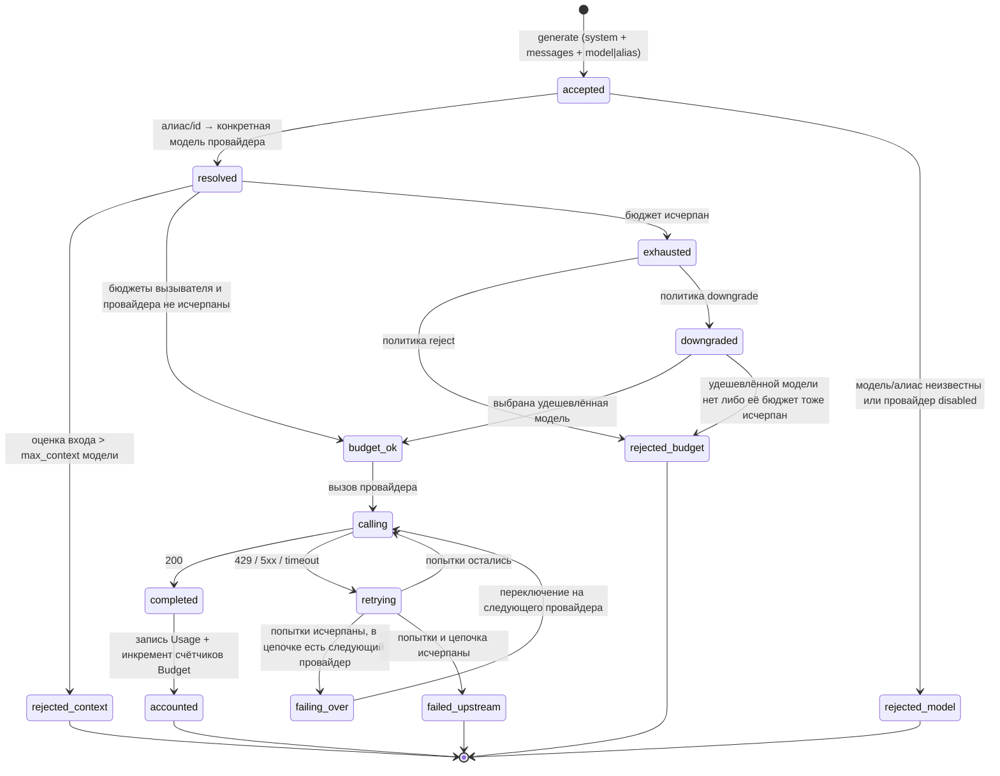
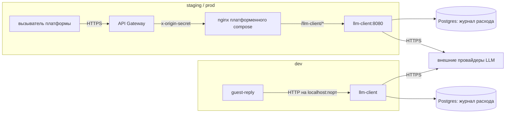
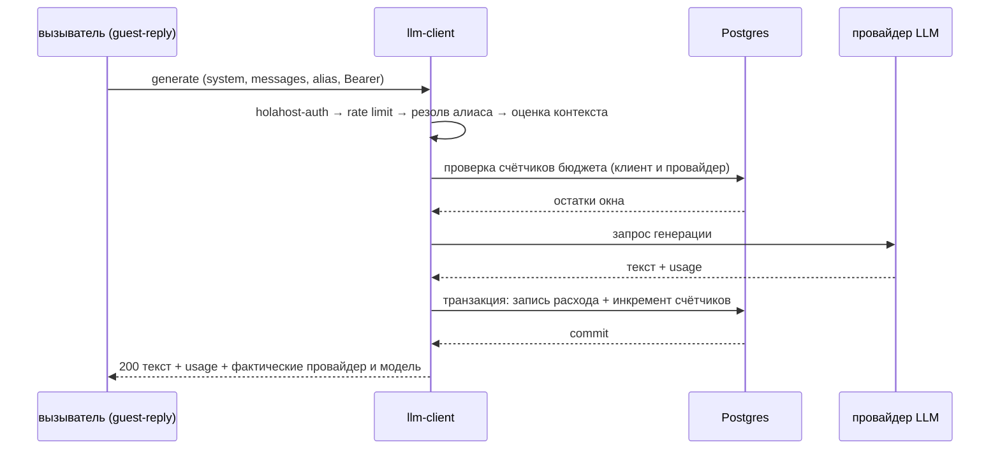

# llm-client — техническая спецификация микросервиса

> **Resource Service** платформы Holahost (см. `holahost/docs/holahost_frame.md`). Фасад над внешними
> провайдерами больших языковых моделей; владеет доменом **Provider + Model + Budget + Usage**
> (реестр провайдеров и моделей приходит из git-конфига, а не из БД).
>
> **Соглашение о путях:** `backend/…`, `infra/…`, `docs/…` — относительно корня сервиса
> (`holahost/services/llm-client/`); «корень репо» — корень монорепозитория.
>
> **Самодостаточность:** документ читается без спек других сервисов. Всё общее для платформы —
> в рамочной спеке, на неё и ссылка.
>
> **Динамические разделы** в конце документа: «Отложенные решения», «Расширения», «ADR-черновики».

---

## Этап 1. Problem Statement + Opportunity Brief + Карта пользовательского пути

### 1.1 Problem Statement

Основание для разработки: сервисам Holahost нужен доступ к внешним LLM-провайдерам. Без общего фасада
в каждом сервисе дублируются SDK провайдера, его ключ, политика ретраев на `429`/overload и учёт
расхода; расход платформы не виден ни в одной точке, а смена модели требует правок в N сервисах.

### 1.2 Opportunity Brief

Строим Resource Service — единственную точку платформы, через которую идут вызовы к LLM. Домен:
`Provider` (реестр провайдеров), `Model` (модель провайдера: `max_context`, `max_output`, цена за 1M
токенов), `Budget` (потолок расхода в окне + политика поведения при исчерпании), `Usage` (факт
расхода по вызову). Единственная содержательная операция — **generate**: `system` + `messages` +
параметры → текст + usage. Что сервис даёт остальным:

| Возможность | Что снимает с вызывателя |
|---|---|
| Единая операция `generate` | знание SDK и HTTP-контракта провайдера |
| Логические алиасы моделей (`fast` / `quality` / `default`) с резолвом в конфиге | хардкод вендорских имён моделей; смена модели платформы = правка конфига одного сервиса |
| Централизованные ретраи с backoff на upstream `429`/overload/5xx | своя retry-политика в каждом сервисе |
| Fallback на следующего провайдера в цепочке при исчерпании ретраев | отказ всех потребителей LLM при падении одного провайдера |
| Бюджеты с активной политикой: `reject` либо `downgrade` на удешевлённую модель | неконтролируемые траты и жёсткий отказ там, где приемлем более дешёвый ответ |
| Журнал расхода расхода в разрезе вызывателя, провайдера и модели | отсутствие видимости трат платформы |
| Единая таксономия ошибок наружу (бюджет, переполнение контекста, upstream) | разбор вендорских кодов ошибок |
| Ключи провайдеров — только у этого сервиса | размножение секрета по сервисам, ротация в N местах |

Продуктового домена у сервиса нет: промпт всегда приходит извне, сценарии («ответ гостю» и прочие)
живут у вызывателя. Стыковка с продуктом: сервис входит в первый вертикальный срез платформы, на
котором проверяется топология рамочной спеки — сеть `backbone`, оффлайн-валидация JWT, послойный
rate limiting, независимый деплой.

**Критерий успеха итерации** (продуктовых метрик у инфраструктурного сервиса нет — зафиксировано):
генерация отрабатывает end-to-end на локальном dev-стеке по вызову CLI `guest-reply`, обновление
сервиса не затрагивает соседние. Технические метрики — **Этап 8**.

### 1.3 Карта пользовательского пути

Прямых пользователей-людей нет. Актор — вызывающий клиент с s2s-токеном; на этой итерации
единственный клиент — CLI `guest-reply`. Карта состоит из двух частей: жизненный цикл **запроса
генерации** (§1.3.1) и жизненный цикл **долгоживущих ресурсов** сервиса — `Provider`, `Model`,
`Budget`, `Usage` (§1.3.3).

#### 1.3.1 State machine запроса генерации



#### 1.3.2 Переходы и события

| Состояние | Событие | Следующее состояние | Наружу |
|---|---|---|---|
| `accepted` | алиас или `model_id` резолвится в доступную модель | `resolved` | — |
| `accepted` | алиас/`model_id` неизвестны либо провайдер выключен | `rejected_model` | 400 `UnknownModelError` |
| `resolved` | вход длиннее `max_context` модели | `rejected_context` | 422 `ContextOverflowError` |
| `resolved` | бюджет вызывателя или провайдера исчерпан, политика `reject` | `rejected_budget` | 429 `BudgetExhaustedError` + время сброса |
| `resolved` | бюджет исчерпан, политика `downgrade`, удешевлённая модель доступна | `budget_ok` | — (фактическая модель вернётся в ответе) |
| `downgraded` | удешевлённой модели нет либо её бюджет тоже исчерпан | `rejected_budget` | 429 `BudgetExhaustedError` + время сброса |
| `calling` | провайдер ответил `200` | `completed` → `accounted` | 200 + текст + usage + фактические провайдер и модель |
| `calling` | провайдер ответил `429`/5xx/таймаут, попытки остались | `retrying` → `calling` | — (наружу не видно) |
| `retrying` | попытки исчерпаны, есть следующий провайдер в цепочке | `failing_over` → `calling` | — (наружу не видно) |
| `retrying` | попытки и цепочка исчерпаны | `failed_upstream` | 502 `UpstreamLlmError` (retryable) |
| любое | нет/невалидный JWT, неверный `aud` | без изменений | 401 |
| любое | превышен per-service rate limit | без изменений | 429 + `Retry-After` |

Числа (лимит попыток, backoff, таймауты, окно и величина бюджета, состав цепочки fallback) — Этап 3.
Формат тела ошибки и полный перечень — Этап 7.

Ответ всегда содержит **фактические** провайдер и модель: и `downgrade` по бюджету, и `failover` по
отказу провайдера обязаны быть видимы вызывателю, иначе он не отличит удешевлённый ответ от
запрошенного.

#### 1.3.3 Долгоживущие ресурсы

| Ресурс | Состояния | Чем меняется |
|---|---|---|
| `Provider` | `enabled` ⇄ `disabled` → `removed` | изменение конфига сервиса (git) + выкат |
| `Model` | `available` ⇄ `deprecated` → `removed`; принадлежит провайдеру | то же; алиас переводится на другую модель без участия вызывателей |
| `Budget` | состояние текущего окна: `open` → `exhausted`; новое окно — новый бюджет с новой идентичностью | растёт с каждым успешным вызовом; репозиторий собирает его агрегатом по журналу расхода |
| `Usage` | append-only запись, неизменяемая | успешный вызов провайдера |

`Usage` пишется только по подтверждённым провайдером цифрам: успешный вызов → запись в журнал расхода и
инкремент счётчиков. Неуспешный вызов расход не начисляет; при `failover` расход начисляется тому
провайдеру, который фактически ответил. Проверка бюджета — до вызова провайдера, по счётчику
текущего окна; частично израсходованное окно не блокирует вызов, который может его превысить
(перерасход в пределах одного вызова принят).

#### 1.3.4 Точки входа

| Вызыватель | Токен | Операции | Итерация |
|---|---|---|---|
| CLI `guest-reply` | s2s, `client_credentials` | `generate` | да |
| Orchestration Service (напр. чат-ассистент) | s2s или exchanged | `generate` | нет (точка расширения) |
| Любой сервис Holahost | s2s | чтение собственного расхода и остатка бюджета | нет (точка расширения) |

---

## Этап 2. User Stories + Acceptance Criteria

Роли:
- **Caller** — сервис или инструмент платформы с s2s-токеном, вызывающий генерацию; на итерации это
  `guest-reply-cli`.
- **Operator** — тот, кто разворачивает сервис, ведёт реестр провайдеров и бюджеты и отвечает за
  расход платформы.

AC ссылаются на параметры по символическому имени; значения фиксируются на Этапе 3.

### 2.0 Таблица параметров

| Параметр | Назначение |
|---|---|
| `MODEL_ALIASES` | таблица «логический алиас → провайдер + модель» |
| `MODEL_TOKENS_PER_SECOND` | консервативная скорость генерации модели — вход pre-flight-проверки |
| `IDEMPOTENCY_KEY_TTL` | окно распознавания повторного запроса с тем же ключом |
| `PROVIDER_CHAIN` | порядок провайдеров при failover |
| `PROVIDER_TIMEOUT` | таймаут одного обращения к провайдеру |
| `RETRY_MAX_ATTEMPTS`, `RETRY_BACKOFF_BASE`, `RETRY_TOTAL_BUDGET` | политика ретраев upstream |
| `MAX_INPUT_BYTES` | максимальный размер запроса (`system` + `messages`) |
| `MAX_OUTPUT_TOKENS` | потолок длины ответа |
| `BUDGET_WINDOW`, `BUDGET_CAP_PER_CLIENT`, `BUDGET_CAP_PER_PROVIDER` | окно и потолки бюджета |
| `ON_BUDGET_EXHAUSTED`, `DOWNGRADE_MODEL` | политика при исчерпании бюджета и целевая удешевлённая модель |
| `GENERATION_P95_BUDGET` | целевой p95 времени генерации |
| `RATE_LIMIT_DEFAULT` | per-service лимит по паре `client_id`+`sub` |
| `JWT_CLOCK_SKEW` | допуск рассинхронизации часов при проверке `exp`/`iat` |
| `code` ошибки | имя класса ошибки; перечень и тело — Этап 7 |

### US-L01: Генерация по внешнему промпту

> As a Caller, I want to send my own system prompt and messages and get generated text back, so that I do not depend on any provider SDK.

**AC:**
- Запрос принимает `system`, список `messages`, идентификатор модели (алиас или `model_id`) и параметры генерации; успех → `200` с текстом.
- Сервис не подменяет и не дополняет присланный `system`: провайдеру уходит ровно то, что прислал вызыватель.
- Ответ содержит: текст, `usage` (input- и output-токены), **фактические** провайдер и модель, причину остановки генерации.
- Запрос больше `MAX_INPUT_BYTES` → `413 PayloadTooLargeError`, до чтения тела (§8.1).
- Пустой список `messages` → `422 InvalidPayloadError` (платформенная валидация, §7.4).
- Запрошенный `max_tokens` выше `MAX_OUTPUT_TOKENS` усекается до потолка; факт усечения виден в ответе.
- Время ответа при отсутствии ретраев ≤ `GENERATION_P95_BUDGET` (p95).
- Ни один продуктовый промпт в кодовой базе сервиса не хранится (проверяется отсутствием шаблонов промптов в репозитории).
- Роли передаются провайдеру в том составе и порядке, в каком пришли: `system` не склеивается с `messages`, порядок сообщений не меняется, собственных инструкций сервис не добавляет.
- Запрос принимает ключ идемпотентности. Повтор с тем же ключом в пределах `IDEMPOTENCY_KEY_TTL`, пока первый в работе либо уже завершён, → `409 DuplicateRequestError`; второй вызов провайдера не выполняется и второй записи расхода не появляется.
- Ответ на дубль не содержит текста первой генерации: по ключу хранится только состояние и `usage`, причём в памяти процесса — защита действует в пределах его жизни и одного инстанса.

### US-L02: Выбор модели через логический алиас

> As a Caller, I want to ask for `fast` or `quality` instead of a vendor model name, so that the platform can change models without touching my code.

**AC:**
- Алиас из `MODEL_ALIASES` резолвится в пару «провайдер + модель»; какая именно — видно в ответе.
- Неизвестный алиас или `model_id` → `400 UnknownModelError`; в `details` — список доступных алиасов.
- Алиас, указывающий на выключенного провайдера или на удалённую модель, → `400 UnknownModelError`.
- Смена цели алиаса в конфиге меняет фактическую модель без изменений на стороне вызывателя.

### US-L03: Прозрачные ретраи upstream

> As a Caller, I want transient provider failures retried inside the service, so that I do not implement backoff in every service.

**AC:**
- Ответ провайдера `429`, `5xx` или таймаут `PROVIDER_TIMEOUT` вызывает повтор с экспоненциальным backoff от `RETRY_BACKOFF_BASE`.
- Число попыток ограничено `RETRY_MAX_ATTEMPTS`, суммарное время — `RETRY_TOTAL_BUDGET`; исчерпание любого из них прекращает повторы.
- Успех после повторов возвращается вызывателю как обычный `200` — сколько было попыток, наружу не видно, но пишется в лог и метрику.
- Ошибки, не являющиеся транзиентными (`400`, `401`, отказ по контенту), не повторяются.
- Если провайдер прислал `Retry-After`, пауза берётся из него, а не из backoff-формулы.

### US-L04: Failover между провайдерами

> As a Caller, I want the service to switch to another provider when the primary is down, so that a single vendor outage does not stop the platform.

**AC:**
- Исчерпав ретраи у текущего провайдера, сервис переходит к следующему в `PROVIDER_CHAIN` и повторяет запрос там.
- Переключение выполняется только для транзиентных отказов; ошибка в самом запросе не переносится на следующего провайдера.
- Исчерпание цепочки → `502 UpstreamLlmError` с признаком «повторяемо».
- В ответе возвращается провайдер, который фактически ответил; расход начисляется ему же.
- Отключение провайдера в конфиге (`disabled`) исключает его из цепочки без рестарта вызывателей.

### US-L05: Отказ при исчерпании бюджета

> As an Operator, I want calls to stop when a budget cap is reached, so that a runaway caller cannot drain the platform's account.

**AC:**
- Проверка бюджета выполняется **до** обращения к провайдеру.
- Исчерпан потолок `BUDGET_CAP_PER_CLIENT` или `BUDGET_CAP_PER_PROVIDER` при политике `reject` → `429 BudgetExhaustedError`; в `details` — какой потолок исчерпан и время начала следующего окна.
- Отказ по бюджету не порождает записи расхода.
- Исчерпание бюджета одним вызывателем не влияет на остальных (потолки независимы).
- Начало нового окна `BUDGET_WINDOW` восстанавливает доступ без ручных действий.

### US-L06: Удешевление вместо отказа

> As a Caller, I want an optional cheaper answer instead of a hard refusal when the budget is out, so that non-critical flows keep working.

**AC:**
- При политике `downgrade` исчерпание бюджета переводит запрос на `DOWNGRADE_MODEL`, а не отказывает.
- Удешевлённая модель задаётся настройкой, отдельной от `MODEL_ALIASES`; изменение таблицы алиасов на неё не влияет.
- Ответ содержит фактическую модель — вызыватель может отличить деградацию от нормы, не догадываясь.
- Если `DOWNGRADE_MODEL` не задана либо её собственный бюджет тоже исчерпан → `429 BudgetExhaustedError`.
- Политика задаётся по умолчанию и переопределяется per `client_id`.

### US-L07: Границы входа и выхода

> As a Caller, I want oversized requests rejected predictably, so that I learn about limits from the contract and not from a vendor error.

**AC:**
- Оценка входа больше `max_context` выбранной модели → `422 ContextOverflowError`; в `details` — лимит модели и оценка запроса.
- Проверка выполняется до обращения к провайдеру: вендорская ошибка переполнения контекста наружу не пробрасывается.
- При `downgrade` контекст перепроверяется относительно `max_context` **новой** модели.
- Ответ не превышает `MAX_OUTPUT_TOKENS`.
- Если оценка времени генерации (`max_tokens` / `MODEL_TOKENS_PER_SECOND` плюс обработка входа) не помещается в остаток `RETRY_TOTAL_BUDGET`, запрос отклоняется **до** обращения к провайдеру отдельным кодом; в `details` — предельное `max_tokens`, которое поместилось бы.
- Pre-flight-отказ занимает миллисекунды и не создаёт ни вызова провайдера, ни записи расхода.

### US-L08: Учёт расхода

> As an Operator, I want every successful call recorded, so that I can see where the platform's LLM spend goes.

**AC:**
- Каждый успешный вызов создаёт запись с: `client_id`, `sub`, провайдером, моделью, input- и output-токенами, длительностью, `X-Request-ID`.
- Цифры берутся из ответа провайдера, а не из собственной оценки.
- Неуспешный вызов записи расхода не создаёт и счётчики бюджета не двигает.
- Записи неизменяемы: обновление и удаление контрактом не предусмотрены.
- Тексты `system`, `messages` и ответа в записи расхода не сохраняются.
- Исчерпанный потолок переживает рестарт контейнера: состояние бюджета выводится из журнала расхода, поэтому перезапуск не возвращает израсходованный лимит (в отличие от rate limit, US-L10).
- Вызов, завершившийся таймаутом провайдера, записи расхода не создаёт — при том что провайдер токены, вероятно, потратил. Этот пробел учёта зафиксирован в ADR B-12 и не закрывается самостоятельной оценкой расхода.

### US-L09: Аутентификация и авторизация

> As an Operator, I want every route except health to require a valid token, so that provider keys are reachable only through authorised calls.

**AC:**
- Подключена общая библиотека `holahost-auth` (рамочная спека, «Переиспользуемые общие сущности») на все роуты, кроме `GET /api/llm-client/health`. Её `AuthConfig` читает свои пять переменных из окружения сам — имена платформенные, сервису принадлежит только значение `EXPECTED_AUDIENCE`.
- Отсутствие `Bearer`-токена, непарсящийся JWT, неожиданный `alg`, неверная подпись, просроченный `exp` (с допуском `JWT_CLOCK_SKEW`), чужой `iss`, `aud` без `llm-client` → `401` без раскрытия причины в теле.
- Неизвестный `kid` → однократный re-fetch JWKS, затем `401`.
- `403` — только при валидном токене без прав.
- Ключи провайдеров не покидают сервис: не возвращаются ни в одном ответе, не пишутся в логи, не принимаются во входящих запросах (заголовка для BYOK в контракте нет).

### US-L10: Rate limiting

> As an Operator, I want per-caller request limits, so that one client cannot monopolise the service.

**AC:**
- Лимит применяется после `holahost-auth` и до обработчика; ключ — `(bucket, is_service)` поверх `client_id`/`sub`. Механизм — `holahost_http.RateLimitMiddleware` с `InMemoryRateLimiter`; сервис объявляет вёдра и потолки.
- Превышение → `429` с `Retry-After`.
- Счётчики живут в памяти процесса и не персистятся — рестарт обнуляет окно. Это допустимо: лимит защищает сервис от перегрузки. Бюджет (US-L05), напротив, персистится, поскольку про деньги и с длинным окном.
- Rate limit и бюджет — независимые механизмы: срабатывание одного не отменяет проверку другого, коды ошибок различаются.

### US-L11: Контракт ошибок

> As a Caller, I want one machine-readable error shape across providers, so that I never parse vendor errors.

**AC:**
- Тело ошибки — `{ error: { code, message, details } }` из `holahost-http`; `code` — **имя класса ошибки**, а не отдельная строковая таксономия.
- Вендорские коды и сообщения провайдера наружу не пробрасываются; они пишутся в лог.
- Каждой ошибке сопоставлена retry-семантика; `UpstreamLlmError` повторяем, `ContextOverflowError` и `UnknownModelError` — нет.
- `message` уходит на провод, но в публикуемую схему не попадает: он для человека, читающего лог, а вызыватель ветвится по `code` и читает `details`.
- Сообщение не содержит фрагментов промпта, ответа и ключей провайдера.

### US-L12: Health и smoke

> As an Operator, I want a health endpoint, so that deploys can be verified automatically.

**AC:**
- `GET /api/llm-client/health` доступен без авторизации и отвечает `200`, когда сервис готов принимать запросы. Путь — под базовым: гейтвей маршрутизирует `/api/<svc>/*` без переписывания, поэтому голый `/health` достижим только изнутри compose-сети и smoke-проверка выката до него не дойдёт.
- Готовность включает доступность БД учёта; обращения к провайдеру в health не выполняются (health не должен тратить деньги и зависеть от вендора).
- Контейнер слушает порт 8080 и подключён к сети `backbone`; наружу порт не публикуется.

### US-L13: Логи без промптов и секретов

> As an Operator, I want logs that never contain prompt text or keys, so that observability does not leak content.

**AC:**
- В логи не попадают: `system`, `messages`, текст ответа, ключи провайдеров, тело токена.
- В логи попадают: `X-Request-ID`, `client_id`, `sub`, провайдер, модель, число токенов, число попыток, факт `downgrade`/`failover`, коды ошибок, длительности.
- `X-Request-ID` входящего запроса логируется и пробрасывается в исходящие вызовы провайдера, если протокол это позволяет.
- Логи структурированы (JSON), состав полей задаётся allowlist'ом; механизм — `holahost-observability`, сервис объявляет только свои поля сверх платформенного ядра.
- Событие завершения — `op_completed`, одно на запрос, с платформенным ядром полей (рамочная спека, «Контракт события завершения операции»).

### US-L14: Управление реестром провайдеров

> As an Operator, I want to add, disable or re-point providers and models in config, so that vendor changes never require changes in calling services.

**AC:**
- Провайдер, модель и таблица алиасов задаются конфигом сервиса; вызыватели о правках не уведомляются и кода не меняют.
- Выключение провайдера исключает его из резолва алиасов и из `PROVIDER_CHAIN`.
- Ключ провайдера читается из Secrets Manager по ссылке из конфига; значение секрета в git не попадает.
- Некорректный конфиг (алиас на несуществующую модель, провайдер без ключа) обнаруживается на старте: сервис не поднимается и пишет причину.

### 2.15 Покрытие карты пользовательского пути (§1.3)

| Переход карты | Покрыто в |
|---|---|
| `accepted → resolved` | US-L02 |
| `accepted → rejected_model` | US-L02 |
| `resolved → rejected_context` | US-L07 |
| `resolved → budget_ok` | US-L05 |
| `resolved → exhausted → rejected_budget` | US-L05 |
| `exhausted → downgraded → budget_ok` | US-L06 |
| `calling → completed` | US-L01 |
| `calling → retrying → calling` | US-L03 |
| `retrying → failing_over → calling` | US-L04 |
| `retrying → failed_upstream` | US-L03, US-L04 |
| `completed → accounted` | US-L08 |
| Жизненный цикл `Provider` / `Model` (§1.3.3) | US-L14 |
| 401 / 403 на любой операции | US-L09 |
| 429 rate limit на любой операции | US-L10 |
| Все ветки отказов | US-L11 |

---

## Этап 3. Tech Constraints Doc

### 3.1 Системная архитектура

Самодостаточный деплой-юнит: контейнер приложения + контейнер Postgres (журнал расхода) в
собственном compose-проекте, сеть `backbone`. Единственный сервис платформы с исходящим трафиком в
интернет.



| Окружение | Вход | Кто вызывает |
|---|---|---|
| staging / prod | API Gateway → nginx платформенного compose → сервис:8080 (порт не публикуется) | сервисы платформы |
| dev | напрямую на опубликованный порт контейнера, без gateway и без nginx | CLI-инструменты разработчика |

Сервис ведёт себя одинаково в обоих контурах и отсутствие периметра ничем не компенсирует:
ветвлений по окружению и генерации недостающих заголовков в нём нет. `X-Request-ID` проставляет
вызыватель — на staging/prod это nginx, на dev это CLI-инструмент.

### 3.2 Архитектура кода

Clean architecture, слои и контракт `import-linter` — общие для платформы (рамочная спека,
«Переиспользуемые общие сущности»).

```
backend/
  app/
    config/                 # типизированные настройки и чтение git-конфига реестра провайдеров
                            # (источник для репозитория провайдеров, читается один раз при старте)
    domain/
      entities/             # идентифицируемые объекты с жизненным циклом
      value_objects/        # frozen-dataclass'ы с инвариантами и ID-классы
      exceptions.py
    application/
      dto/                  # команды и результаты use case'ов, только примитивы
      ports/                # Protocol'ы внешних зависимостей: провайдер генерации, репозитории
                            # учёта и бюджета, rate limit, unit of work
      use_cases/            # оркестрация поверх портов
      exceptions/
    infrastructure/
      providers/            # адаптеры провайдеров поверх langchain-моделей
      db/                   # SQLAlchemy Core, репозитории, миграции; engine и UoW — holahost-db
    interface/
      http/                 # FastAPI: роутер, схемы, контракт ошибок, значения для края
    scripts/                # composition root
```

Ретраи, выбор модели, failover и проверка бюджета — это оркестрация, поэтому живут в use case'е, а не
в адаптере провайдера. Адаптер знает только «вызови эту модель этими сообщениями» и переводит
вендорские ошибки в доменные классы.

Каталогов `infrastructure/auth/` и `interface/http/middleware/` нет: `holahost-auth` отдаёт готовую
мидлварь и `current_token`, адаптировать нечего, а мидлвари края и их порядок собирает
`holahost_http.create_edge_app`. Сервис объявляет значения — вёдра лимита, потолок тела, ошибку на
отсутствующий `X-Request-ID`, свой контракт ошибок, — но не последовательность (§8.1).

### 3.3 Моделирование домена

Lightweight DDD: `domain/entities/` с фабричными методами `create()` и `from_repo()`,
`domain/value_objects/` — frozen dataclass'ы с инвариантами в `__post_init__`, ID-классы поверх
`uuid.UUID`. Domain services, агрегаты и фабрики не применяются; репозитории — Protocol'ы в
`application/ports/`, не в `domain/`. Портов `Clock` и `IdGenerator` нет: `datetime.now(tz=UTC)`
inline, идентификаторы self-generating. Реестр провайдеров и моделей — конфигурация, а не
персистентное состояние (§3.6).

### 3.4 Технологический стек

| Слой | Выбор |
|---|---|
| Язык | Python 3.12 |
| HTTP | FastAPI + uvicorn, эндпоинты — **синхронные** `def` (ADR B-7) |
| Клиент провайдеров | стек `langchain`: чат-модели провайдеров (`langchain_anthropic` и аналоги) за портом |
| СУБД | Postgres 16, контейнер в compose сервиса |
| Доступ к БД | SQLAlchemy Core 2.0 поверх `psycopg[binary,pool]`; ORM не используется |
| Миграции | Alembic |
| Валидация | Pydantic v2 |
| Авторизация | общая библиотека `holahost-auth` |
| Тесты | pytest, fakes для портов; ни один тест не ходит к реальному провайдеру |
| Логи | structured JSON в stdout, allowlist полей |

### 3.5 Хранение и жизненный цикл данных

| Данные | Где | Жизненный цикл |
|---|---|---|
| Записи расхода (журнал) | Postgres, append-only | бессрочно; чистка — расширение |
| Состояние бюджета | нигде: агрегат по журналу расхода за текущее окно | вычисляется на каждой проверке (§6.1) |
| Ключи идемпотентности | память процесса | до истечения `IDEMPOTENCY_KEY_TTL` или до рестарта |
| Реестр провайдеров, моделей и алиасов | git-конфиг сервиса | меняется выкатом (§3.6) |
| Ключи провайдеров | Secrets Manager (staging/prod), `.env.dev` (dev) | ротация — замена значения + рестарт |
| Тексты промптов и ответов | **нигде** | живут только в памяти запроса |
| Счётчики rate limit, кэш JWKS | память процесса | до рестарта |

Правило одно: в БД лежит то, что обещано наружу, в памяти — то, что защищает сервис. Расход —
обещание (деньги, отчётность), поэтому журнал персистентен и бюджет через него переживает рестарт
автоматически. Rate limit и ключи идемпотентности защищают от перегрузки и двойной оплаты в пределах
жизни процесса — их сброс при рестарте безвреден (ADR B-9).

### 3.6 Реестр провайдеров, моделей и алиасов

Конфигурация в git репозитория сервиса; в файл попадают только имена и ссылки на секреты, значения
ключей — в SM. Изменение применяется **выкатом контейнера**; hot-reload не вводится — конфиг
участвует в валидации на старте, и «половина процессов на старом конфиге» хуже, чем короткий рестарт.

```yaml
providers:
  anthropic:
    enabled: true
    api_key_ref: "holahost/<env>/llm-client/anthropic-api-key"   # имя секрета в SM
    models:
      claude-sonnet-4-6:  { max_context: 200000, max_output: 8192, price_in: …, price_out: … }
      claude-haiku-4-5:   { max_context: 200000, max_output: 8192, price_in: …, price_out: … }

aliases:
  default: { provider: anthropic, model: claude-sonnet-4-6 }
  quality: { provider: anthropic, model: claude-sonnet-4-6 }
  fast:    { provider: anthropic, model: claude-haiku-4-5 }

fallback_chain: [anthropic]          # порядок провайдеров при failover
downgrade_model: { provider: anthropic, model: claude-haiku-4-5 }   # цель политики downgrade
```

Некорректный конфиг (алиас на несуществующую модель, включённый провайдер без секрета, пустая
`fallback_chain`) → сервис не стартует и пишет причину (US-L14).

### 3.7 Параметры и лимиты (числа)

Временны́е числа ниже описывают **синхронный режим** и выведены из потолка интеграции API Gateway
(30 с) с учётом всех ретраев и failover. Важная оговорка: сервис не может гарантировать попадание в
этот потолок — длительность генерации не выводится из размера входа, модель вправе отвечать дольше
при том же промпте. Поэтому потолок задаёт не обещание, а **границу применимости синхронного
режима**: всё, что в неё не помещается, обслуживается асинхронным режимом (Р-3), а не увеличением
таймаутов. До появления Р-3 нагрузка, не укладывающаяся в бюджет, сервисом не обслуживается — это
осознанное ограничение итерации, а не дефект.

| Параметр | Значение | Обоснование |
|---|---|---|
| `PROVIDER_TIMEOUT` | 20 с на попытку | генерация на `MAX_OUTPUT_TOKENS` укладывается с запасом; больше — не влезет в общий бюджет |
| `RETRY_MAX_ATTEMPTS` | 2 (первая + один повтор) | третий повтор не помещается в 30 с |
| `RETRY_BACKOFF_BASE` | 1 с, экспонента, jitter ±20 % | `Retry-After` провайдера, если он прислан, имеет приоритет |
| `RETRY_TOTAL_BUDGET` | 25 с на весь запрос, включая failover | оставляет 5 с на сеть и сериализацию до потолка интеграции |
| `FALLBACK_CHAIN` | конфиг, на итерации один провайдер | пока цепочка из одного элемента, failover не срабатывает — механика есть, применения нет |
| `MAX_INPUT_BYTES` | 256 KiB | больше в синхронный контур не имеет смысла: генерация по такому входу не уложится в бюджет |
| `MAX_OUTPUT_TOKENS` | 1000 | выше — риск не уложиться в `PROVIDER_TIMEOUT` |
| `BUDGET_WINDOW` | сутки, сброс 00:00 UTC, lazy при первом запросе нового окна | агрегируется по журналу расхода на лету, отдельный планировщик не нужен |
| `BUDGET_CAP_PER_CLIENT` | 2 000 000 input- и 200 000 output-токенов в сутки | считаются раздельно: цены различаются кратно, единый счётчик врал бы |
| `BUDGET_CAP_PER_PROVIDER` | 10 000 000 input- и 1 000 000 output-токенов в сутки | защита кошелька платформы поверх клиентских потолков |
| `ON_BUDGET_EXHAUSTED` | `reject` по умолчанию, переопределяется per `client_id` | молчаливое удешевление по умолчанию сюрпризом быть не должно |
| `DOWNGRADE_MODEL` | задана в конфиге, применяется только при политике `downgrade` | отдельно от таблицы алиасов (ADR B-4) |
| `MODEL_TOKENS_PER_SECOND` | консервативная оценка скорости генерации, задаётся в конфиге на модель | вход pre-flight-проверки (§3.7.1) |
| `IDEMPOTENCY_KEY_TTL` | 15 минут | окно, в котором повтор с тем же ключом распознаётся как дубль |
| `RATE_LIMIT_DEFAULT` | 600 req/час на пару `client_id`+`sub` | значение по умолчанию из рамочной спеки |
| `GENERATION_P95_BUDGET` | 15 с | путь без ретраев |
| `JWT_CLOCK_SKEW` | 30 с | из рамочной спеки |
| Таймаут запроса к БД | 5 с | учёт расхода не должен держать поток дольше самой генерации |

#### 3.7.1 Что делает синхронный режим предсказуемым

Раз попадание в потолок не гарантируется, вводятся три механизма — они дешевле полноценного
асинхронного режима и снимают его самые дорогие последствия (ADR B-12).

**Pre-flight отказ.** До обращения к провайдеру считается оценка: время генерации
`max_tokens / MODEL_TOKENS_PER_SECOND` плюс оценка обработки входа. Если оценка не помещается в
остаток `RETRY_TOTAL_BUDGET`, запрос отклоняется сразу отдельным кодом ошибки с указанием, какое
`max_tokens` поместилось бы. Вызыватель получает ответ за миллисекунды вместо таймаута на 30-й
секунде, а провайдер не получает заведомо обречённый запрос.

**Ключ идемпотентности.** Вызыватель присылает ключ; на время `IDEMPOTENCY_KEY_TTL` сервис помнит,
что запрос с таким ключом уже в работе или уже завершён, и на повтор отвечает конфликтом, а не
второй оплаченной генерацией. Ключ хранит только состояние и `usage` — **текст ответа не
сохраняется**, поэтому повтор не доставляет результат, а лишь предотвращает двойную оплату.
Доставка результата после разрыва соединения — часть асинхронного расширения Р-3.

**Признанный пробел учёта.** Если провайдер не ответил в `PROVIDER_TIMEOUT`, токены он, скорее всего,
уже потратил, а `Usage` пишется только по подтверждённым цифрам — значит этот расход в журнале расхода не
попадёт. Пробел принят осознанно: альтернатива — оценивать расход самостоятельно и портить
достоверность учёта. Сверка с биллингом провайдера — расширение.

### 3.8 Безопасность

| Аспект | Решение |
|---|---|
| Аутентификация | JWT оффлайн через `holahost-auth` на всех роутах, кроме `GET /api/llm-client/health` |
| Авторизация | по `client_id` из токена: бюджеты, лимиты и политики — на него |
| Ключи провайдеров | только в SM; читаются на старте, не возвращаются ни в одном ответе, не пишутся в логи, во входящих запросах не принимаются (BYOK-заголовка в контракте нет) |
| Исходящий трафик | только на домены провайдеров из конфига; проверка TLS-сертификата обязательна и не отключается ни в одном окружении |
| Данные вызывателя | `system`, `messages` и ответ не сохраняются и не логируются; в журнале расхода попадают только счётчики |
| Ошибки провайдера | не пробрасываются наружу дословно: вендорские коды и тексты остаются в логах |
| Ввод | размер тела ограничивается до разбора; оценка контекста выполняется до обращения к провайдеру |
| CORS | не настраивается — браузер в сервис не ходит; прямой доступ фронта к генерации не планируется вовсе (это операция Orchestration Service, а не UI) |
| Prompt injection | Инъекция — атака на смысл промпта, поэтому защита лежит на его владельце (на итерации — CLI): недоверенные данные только в user-роли, инструкции не берутся из найденного контента, вывод проверяется. Сервис в этом не участвует, но обязан **не разрушать** защиту вызывателя: роли передаются провайдеру в том же составе и порядке, `system` не склеивается с `messages`, собственных инструкций сервис не добавляет и содержимое не переписывает |

### 3.9 Out of scope итерации

- Streaming ответа (расширение).
- Tool use / function calling, structured output, multimodal-вход.
- Prompt caching провайдера.
- Эмбеддинги как операция сервиса: модель эмбеддингов платформы локальная, внешнего провайдера у неё нет, поэтому она живёт у владельца документов, а не за этим фасадом.
- Batch API провайдеров и отложенные генерации.
- Больше одного провайдера в `FALLBACK_CHAIN` (механика реализована, конфигурация — нет).
- Чтение вызывателем собственного расхода и остатка бюджета (расширение).
- Пересчёт расхода в деньги: цены хранятся в конфиге, но отчётность по ним не строится.

### 3.10 Happy path на уровне компонентов



---

## Этап 4. Domain Entities

Значения параметров, на которые ссылаются инварианты, — §3.7.

Критерий сущности — идентичность, сохраняющаяся при смене атрибутов: провайдер с
`enabled: false` остаётся тем же провайдером, бюджет клиента за сутки остаётся тем же бюджетом при
росте потраченного. Ни хранилище, ни время жизни объекта в памяти на это не влияют: источник данных
(таблица, git-конфиг, агрегат по журналу) — реализация репозитория, а не природа объекта. По этому
критерию сущностей пять: `Provider`, `Model`, `Budget`, `UsageRecord`, `IdempotencyRecord`.

### 4.1 Value objects

| VO | Основа | Инварианты |
|---|---|---|
| `RequestId` | `uuid.UUID` | генерируется своим `new()`; связывает запрос, запись расхода и лог |
| `ClientId` | `str` | непустой; берётся из claim токена, не из тела запроса |
| `Subject` | `str` | непустой; `sub` токена (для s2s совпадает с `client_id`) |
| `ProviderName` | `str` | значение из реестра; неизвестное имя — не VO, а ошибка резолва |
| `ModelId` | `str` | идентификатор модели у провайдера |
| `ModelAlias` | `str` | логическое имя (`fast`, `quality`, `default`); резолвится в пару провайдер + модель |
| `TokenCount` | `int` | ≥ 0 |
| `Usage` | пара `TokenCount` | input и output раздельно: цены различаются кратно, единый счётчик врал бы |
| `IdempotencyKey` | `str` | 1…128 символов; уникален в пределах `ClientId` и окна `IDEMPOTENCY_KEY_TTL` |
| `Message` | роль + текст | роль из фиксированного набора; текст непуст |
| `FinishReason` | перечисление | нормализованное значение, единое для всех провайдеров |

### 4.2 `Provider` и `Model`

Сущности с идентичностью `name` и `(provider, id)` соответственно. Их состояние меняется между
выкатами — выключение провайдера, пометка модели устаревшей, правка потолков, — и после любой такой
правки это те же провайдер и модель: на них ссылаются записи журнала расхода и алиасы. Источник
данных — git-конфиг (§3.6), а не таблица; репозиторий читает его один раз при старте и отдаёт
типизированные объекты, а не словари настроек.

`Provider`:

| Поле | Тип | Примечание |
|---|---|---|
| `name` | `ProviderName` | |
| `enabled` | `bool` | выключенный исключается из резолва алиасов и из цепочки failover |
| `api_key_ref` | `str` | ссылка на секрет, не значение |
| `models` | набор `Model` | непустой у включённого провайдера |

`Model`:

| Поле | Тип | Примечание |
|---|---|---|
| `provider` | `Provider` | модель без провайдера не существует, поэтому здесь сам объект, а не имя: отдельного типа «разрешённая пара провайдер + модель» тогда не требуется |
| `id` | `ModelId` | |
| `max_context` | `int` | > 0 |
| `max_output` | `int` | > 0; фактический потолок ответа — `min(max_output, MAX_OUTPUT_TOKENS)` |
| `price_in`, `price_out` | `Decimal` | цена за 1M токенов; хранится для отчётности, в расчётах итерации не участвует |
| `tokens_per_second` | `int` | > 0, иначе pre-flight-оценка (§3.7.1) делится на ноль |
| `deprecated` | `bool` | помеченная модель резолвится, но новые алиасы на неё не заводятся |

**Инварианты:** у включённого провайдера есть хотя бы одна доступная модель и разрешимая ссылка на
секрет; `max_context` строго больше `max_output`; `tokens_per_second` > 0. Нарушение обнаруживается
на старте — сервис не поднимается (US-L14). Значение ключа в объекте не хранится: оно читается при
обращении к провайдеру и в домен не попадает.

**Lifecycle:** состояние меняется выкатом новой конфигурации; удалённые из конфига провайдер и
модель перестают резолвиться, но остаются читаемыми в журнале расхода как исторический факт.

### 4.3 `Budget`

Сущность с идентичностью `(scope, key, window_start)`: «расход клиента X за сутки D» остаётся тем же
бюджетом по мере того, как `spent` растёт. Своей таблицы у него нет — репозиторий собирает его из
агрегата по журналу расхода за окно и потолков из конфига (§6.1); это способ реализации, а не
основание считать его чем-то иным.

| Поле | Тип | Примечание |
|---|---|---|
| `scope` | перечисление | `client` либо `provider` — два независимых измерения |
| `key` | `ClientId \| ProviderName` | субъект потолка |
| `window_start` | `datetime` (UTC) | начало текущих суток; границу задаёт запрос, а не хранимое поле |
| `spent` | `Usage` | агрегат по журналу расхода: input и output раздельно |
| `caps` | `Usage` | потолки окна из конфига |
| `policy` | перечисление | `reject` либо `downgrade` |

**Инварианты:** `spent` в пределах окна не убывает — следствие того, что журнал append-only; потолки
положительны; политика `downgrade` требует заданной удешевлённой модели, иначе вырождается в
`reject`.

**Lifecycle:** объект живёт внутри одной проверки. Сброс окна не событие и не операция: наступление
новых суток меняет диапазон агрегата, обнулять нечего.

### 4.4 `UsageRecord`

| Поле | Тип | Примечание |
|---|---|---|
| `id` | `RequestId` | совпадает с идентификатором запроса |
| `client_id` | `ClientId` | |
| `subject` | `Subject` | |
| `provider`, `model` | `ProviderName`, `ModelId` | **фактические**, а не запрошенные |
| `usage` | `Usage` | цифры провайдера, не собственная оценка |
| `latency_ms` | `int` | ≥ 0 |
| `downgraded`, `failed_over` | `bool` | признаки применённых политик |
| `created_at` | `datetime` (UTC) | |

**Инварианты:** запись неизменяема; создаётся только по подтверждённому успешному ответу провайдера;
текстов запроса и ответа не содержит.

**Lifecycle:** append-only, живёт бессрочно; чистка журнала расхода в итерацию не входит.

### 4.5 `IdempotencyRecord`

Живёт в памяти процесса, не в БД (B-9) — на принадлежность к сущностям это не влияет: идентичность
(клиент + ключ), автомат состояний и инвариант необратимости у него есть, а хранилище выражается
портом с in-memory-адаптером.

| Поле | Тип | Примечание |
|---|---|---|
| `key` | `IdempotencyKey` | |
| `client_id` | `ClientId` | ключи разных клиентов не пересекаются |
| `state` | перечисление | `in_flight` либо `completed` |
| `usage` | `Usage \| None` | заполняется при завершении |
| `expires_at` | `datetime` (UTC) | `created_at` + `IDEMPOTENCY_KEY_TTL` |

**Инварианты:** переход состояния только `in_flight → completed`, обратного нет; текст ответа в
записи не хранится — по этому ключу повтор получает конфликт, а не результат (§3.7.1).

**Lifecycle:** создаётся при приёме запроса с ключом, закрывается при завершении, исчезает по
истечении TTL либо вместе с процессом. Защита действует в пределах жизни процесса и одного
инстанса — этого достаточно для случая «вызыватель отвалился по таймауту, сервис жив»; рестарт
обрывает саму генерацию, поэтому помнить о ней нечего.

### 4.6 Transient-объекты одного вызова

`Generation` — результат обращения к провайдеру: текст, `Usage`, фактические провайдер и модель,
`FinishReason`. Идентичности и жизненного цикла не имеет, нигде не сохраняется, существует только
внутри вызова. Признаки `downgraded` и `failed_over` в него не входят: их знает не провайдер, а use
case, и он добавляет их в результат уже на своей стороне. Отдельного «нормализованного запроса»
сущностью не заводится — вход use case'а описан командным DTO (§8.2).

---

## Этап 5. Use Cases

Use case ровно один, и это не упущение: остальное, что могло бы им притвориться (резолв алиаса,
проверка бюджета, ретраи, failover, учёт расхода), — шаги одного сценария, а не самостоятельные
сценарии с собственным актором и результатом. Операции чтения расхода в итерацию не входят (Р-4).

### UC-L1. Сгенерировать ответ

- **Актор:** Caller
- **Input:** `client_id: str`, `subject: str`, `system: str`, `messages: list[(role: str, text: str)]`,
  `model: str` (алиас либо идентификатор модели), `max_tokens: int | None`,
  `idempotency_key: str | None`
- **Output:** `text: str`, `input_tokens: int`, `output_tokens: int`, `provider: str`, `model: str`,
  `finish_reason: str`, `downgraded: bool`, `failed_over: bool`
- **Поток:** резолвит `model` в конкретную пару провайдер + модель и отсекает неизвестные;
  проверяет ключ идемпотентности, контекст против `max_context` и pre-flight-оценку времени;
  сверяется с бюджетами вызывателя и провайдера, применяя политику `reject` либо `downgrade`;
  вызывает провайдера с ретраями и, при исчерпании попыток, со следующим провайдером цепочки;
  по подтверждённому ответу пишет расход и инкрементирует счётчики, после чего возвращает текст
  вместе с **фактическими** провайдером и моделью.

Порядок проверок — fail fast и от дешёвого к дорогому: резолв модели → идемпотентность → контекст →
pre-flight → бюджет → вызов провайдера. Всё, что можно отклонить без обращения наружу, отклоняется
без него; запись расхода — последнее действие и только по факту успеха.

---

## Этап 6. DB Schema

Postgres 16. Персистентен **только журнал расхода**. Из него же выводится состояние бюджета
(§6.1). Реестр провайдеров и моделей приходит из git-конфига (§3.6, B-8); счётчики rate limit и
ключи идемпотентности живут в памяти процесса (B-9); промпты и ответы не сохраняются нигде (§3.5).

```sql
-- Журнал расхода: одна строка на подтверждённый успешный вызов провайдера.
-- Append-only: обновлений и удалений контрактом не предусмотрено.
-- Он же источник истины для бюджета: потраченное за окно = агрегат по этой таблице.
CREATE TABLE usage_records (
    id            uuid        PRIMARY KEY,
    client_id     text        NOT NULL,
    subject       text        NOT NULL,
    provider      text        NOT NULL,
    model         text        NOT NULL,
    input_tokens  integer     NOT NULL,
    output_tokens integer     NOT NULL,
    latency_ms    integer     NOT NULL,
    downgraded    boolean     NOT NULL,
    failed_over   boolean     NOT NULL,
    created_at    timestamptz NOT NULL,
    CONSTRAINT usage_tokens_non_negative  CHECK (input_tokens >= 0 AND output_tokens >= 0),
    CONSTRAINT usage_latency_non_negative CHECK (latency_ms >= 0)
);

CREATE INDEX idx_usage_records_client_created   ON usage_records (client_id, created_at DESC);
CREATE INDEX idx_usage_records_provider_created ON usage_records (provider, created_at DESC);
```

### 6.1 Бюджет считается, а не хранится

Потраченное в текущем окне — агрегат по журналу расхода:

```sql
SELECT coalesce(sum(input_tokens), 0), coalesce(sum(output_tokens), 0)
  FROM usage_records
 WHERE client_id = :client_id
   AND created_at >= date_trunc('day', now() AT TIME ZONE 'UTC');
```

и симметрично по `provider`. Оба запроса обслуживаются существующими индексами и читают строки
только текущих суток.

Отдельная таблица счётчиков не заводится: она была бы денормализованной суммой этой же таблицы.
Атомарного резервирования бюджета она бы не дала — проверка выполняется до вызова провайдера, а
инкремент после, поэтому конкурентные генерации превышают потолок одинаково в обоих вариантах
(перерасход в пределах одного вызова принят явно, §1.3.3). Ленивый сброс окна получается сам собой:
новые сутки — новый диапазон фильтра, обнулять нечего. Материализация счётчиков — расширение Р-5, и
включается она по замеру, а не заранее.

### 6.2 Решения, стоящие за схемой

| Решение | Почему так |
|---|---|
| Провайдеров и моделей в схеме нет | B-8: реестр — конфигурация с ревью, а не данные. В журнале они лежат строками, потому что это исторический факт: модель могла быть удалена из конфига, а запись обязана остаться читаемой |
| В журнале — фактические провайдер и модель | запрошенное значение восстановимо из логов, а деньги списаны за фактическое; `downgraded`/`failed_over` показывают, что запрошенное и фактическое разошлись |
| Ключей идемпотентности в схеме нет | B-9: они защищают от двойной оплаты, пока процесс жив; рестарт обрывает саму генерацию, и помнить о ней нечего |
| Индексы по `(client_id, created_at)` и `(provider, created_at)` | два разреза, в которых расход спрашивают: «сколько потратил вызыватель» и «сколько ушло провайдеру». Они же обслуживают проверку бюджета |
| Журнал расхода не чистится | это вся история расхода; чистка и агрегация по завершённым суткам — вопрос, который встанет вместе с Р-5 |

### 6.3 Как схема обслуживает операции

| Операция | Что происходит в БД |
|---|---|
| Проверка бюджета | два агрегата по индексу: за текущие сутки для вызывателя и для провайдера |
| Успешный вызов | один `INSERT` в журнале расхода |
| Неуспешный вызов | ничего: ни строки, ни счётчика |
| Приём и завершение запроса с ключом идемпотентности | обращений к БД нет — состояние ключа в памяти процесса |

Миграции — Alembic, имена файлов `YYYYMMDD_HHMM_<slug>.py`.

---

## Этап 7. API Contracts

### 7.0 Конвенции

| Что | Значение |
|---|---|
| Базовый путь | `/api/llm-client` (сегмент = имя сервиса, рамочная спека) |
| Авторизация | `Authorization: Bearer <jwt>` на всех роутах, кроме `GET /api/llm-client/health`; ключей провайдеров контракт не принимает |
| Трассировка | `X-Request-ID` — **обязательный** входящий заголовок; логируется и возвращается в ответе. Его отсутствие — нарушение контракта, а не повод сгенерировать свой: каждый штатный путь входа проставляет его безусловно, поэтому пустое место означает вызывателя мимо гейтвея. Отвечается `422 MalformedRequestError` |
| Идемпотентность | необязательный заголовок `Idempotency-Key` |
| Формат | `application/json` |
| Время | ISO 8601 в UTC |
| Envelope ошибки | `{ "error": { "code": "...", "message": "...", "details": { ... } } }` — `holahost-http`. `code` — имя класса ошибки; `message` на проводе есть, но в публикуемой схеме его нет |
| Схема | `docs/openapi.json` генерируется из приложения и коммитится; CI пересобирает и сверяет диффом (`make openapi-check`). Схема авторизации объявляется `holahost_http.bearer_scheme` — она объявляет, но не проверяет: аутентификация ответила задолго до резолва зависимостей |

### 7.1 Перечень эндпоинтов

| Метод и путь | Назначение | Use case | Успех |
|---|---|---|---|
| `POST /api/llm-client/generate` | сгенерировать ответ | UC-L1 | `200` |
| `GET /api/llm-client/health` | готовность | — | `200` |

Ручка одна — по числу use case'ов. Чтение собственного расхода появится вместе с Р-4.

### 7.2 Генерация

```
POST /api/llm-client/generate
Idempotency-Key: 7c1f…            # необязательный

{
  "model": "fast",                 // алиас из конфига либо идентификатор модели
  "system": "You are …",
  "messages": [
    { "role": "user", "content": "Гость спрашивает: во сколько заезд?" }
  ],
  "max_tokens": 800,               // необязательное; усекается до MAX_OUTPUT_TOKENS
  "temperature": 0.3,              // необязательное
  "stop": ["\n\n"]                 // необязательное
}

200 OK
{
  "text": "Заезд с 15:00 …",
  "usage": { "input_tokens": 1240, "output_tokens": 310 },
  "provider": "anthropic",
  "model": "claude-haiku-4-5",
  "finish_reason": "stop",
  "downgraded": true,
  "failed_over": false
}
```

`system` — отдельное поле, а не сообщение с ролью `system` в общем списке. Это гарантия из §3.8:
сервис обязан сохранять ролевую границу, заданную вызывателем, и отдельное поле делает её
неразрушимой — склеить инструкцию с недоверенными данными по ошибке невозможно. В `messages`
допустимы роли `user` и `assistant`.

`provider` и `model` в ответе — **фактические**. Если они разошлись с запрошенными, это видно по
`downgraded` (сработала политика бюджета) и `failed_over` (сработало переключение провайдера);
вызыватель, которому важна модель, обязан сверять ответ, а не полагаться на запрос.

### 7.3 Health

```
GET /api/llm-client/health          # без авторизации

200 OK   { "status": "ok" }
503      { "status": "unavailable" }
```

Под базовым путём, как и всё остальное: гейтвей маршрутизирует `/api/<svc>/*` без переписывания
пути, поэтому голый `/health` снаружи недостижим и smoke-проверка выката до него не дойдёт.
Единственный публичный роут — он же объявлен в `public_paths` мидлвари аутентификации, и это же
объявление освобождает его от требования `X-Request-ID`.

Проверяется доступность БД журнала расхода. К провайдерам health не обращается: он не должен ни
тратить деньги, ни падать вместе с вендором.

### 7.4 Ошибки

Идентичность ошибки — **имя её класса** (`PlatformError.code` возвращает `type(self).__name__`),
а не отдельная строковая таксономия рядом с ним. Второй, поддерживаемый руками слой имён — это
второй источник правды: переименование класса перестаёт быть изменением контракта, а расхождение
обнаруживается у вызывателя. Классы уже названы правильно в §8.2 и §8.3, и здесь перечислены они же.

Статус — проекция идентичности, а не отдельный факт: таблица «ошибка → статус» живёт одним
объявлением в коде (`interface/http/errors.py`) и передаётся в `create_edge_app` данными.

**Собственные ошибки сервиса:**

| Класс | HTTP | Когда | `details` | Повторять? |
|---|---|---|---|---|
| `UnknownModelError` | 400 | алиас или модель не резолвятся, провайдер выключен | `requested`, `available_aliases` | нет |
| `ContextOverflowError` | 422 | оценка входа больше `max_context` модели | `max_context`, `estimated` | нет, пока вход не уменьшен |
| `RequestTooSlowForSyncError` | 422 | pre-flight: оценка времени не помещается в бюджет (§3.7.1) | `max_tokens_allowed`, `budget_seconds` | нет, пока `max_tokens` не уменьшен |
| `DuplicateRequestError` | 409 | `Idempotency-Key` уже в работе или уже завершён | `state` (`in_flight`/`completed`) | нет |
| `BudgetExhaustedError` | 429 | исчерпан потолок при политике `reject`; `Retry-After` обязателен | `scope` (`client`/`provider`), `resets_at` | да, после `resets_at` |
| `UpstreamLlmError` | 502 | попытки и цепочка провайдеров исчерпаны | `attempts`, `upstream_status` | да |

**Платформенные ответы** — их даёт край, а не этот сервис, и они одинаковы за каждым сервисом
платформы. В таблице выше их нет намеренно: описание одного факта в N документах превращает его в
N фактов, которые расходятся.

| Класс | HTTP | Откуда |
|---|---|---|
| `MalformedRequestError` | 422 | `RequestIdMiddleware` — отсутствует `X-Request-ID` |
| `InvalidPayloadError` | 422 | валидация фреймворка: пустой `messages`, неизвестная роль, `max_tokens` ≤ 0. `details` — `field`, `limit` |
| `PayloadTooLargeError` | 413 | `BodySizeLimitMiddleware` — тело больше транспортного потолка |
| `RateLimitExceededError` | 429 | `RateLimitMiddleware` — превышен per-caller лимит; `Retry-After` из исключения |
| `InternalError` | 500 | всё, чего нет в контракте сервиса: пустое тело, причина только в логе |

`InvalidPayloadError` отвечает `422`, а не `400`: по RFC 9110 §15.5.1 `400` — сломанный синтаксис
или фрейминг, а RFC 4918 §11.2 `422` — синтаксически верный запрос, содержимое которого не удалось
обработать. `400` остаётся за настоящим нарушением фрейминга; `UnknownModelError` держит его
законно — это не форма запроса, а несуществующая ссылка в ней.

Публиковать `InvalidPayloadError` обязан каждый сервис: `register_error_handlers` отказывается
регистрироваться без него, потому что валидация фреймворка отклоняет запрос до входа в любой роут —
в том числе по path- или query-параметру, так что сервис без тел запросов не исключение.

Два разных отказа отвечают `429` и различаются классом, а не статусом: `RateLimitExceededError` —
«слишком часто, подожди секунды», `BudgetExhaustedError` — «деньги на сегодня кончились, подожди до
сброса окна». Склеивать их нельзя: реакции у вызывателя разные.

`401` и `403` тела с кодом не имеют. Вендорские коды и сообщения провайдера наружу не пробрасываются
ни в одном случае — они остаются в логах вместе с числом попыток.

Публикуемые схемы собираются из `holahost_http.error_schemas` (`envelope()`, дискриминатор по `code`,
`INTERNAL_RESPONSES`, строгая база `Strict`); сервис объявляет только тела своих ошибок.

---

## Этап 8. Detailed Sequence Flow

### 8.0 Порты

```python
class ProvidersRepo(Protocol):
    def resolve(self, model_ref: str) -> Model | None: ...        # алиас или model_id
    def chain(self, exclude: list[ProviderName]) -> list[Provider]: ...   # порядок failover
    def downgrade_target(self) -> Model | None: ...
    # raises: —  (реестр загружен и провалидирован при старте; после старта только чтение)

class GenerationProvider(Protocol):
    def generate(self, model: Model, system: str, messages: list[Message],
                 max_tokens: int, temperature: float | None,
                 stop: list[str] | None, timeout_s: float) -> Generation: ...
    # Generation = (text: str, usage: Usage, provider: ProviderName,
    #               model: ModelId, finish_reason: FinishReason)
    # raises: TransientProviderError (429, 5xx, таймаут — повторяемо),
    #         PermanentProviderError (отказ по контенту, неверный запрос — не повторяемо)

class BudgetRepo(Protocol):
    def state(self, scope: BudgetScope, key: str) -> Budget: ...     # агрегат по журналу за окно
    # raises: StorageUnavailableError
    # lock: **не берётся намеренно** — субъект нельзя удерживать на время генерации, она длится
    #       секунды. Отсюда принятый перерасход в пределах одного вызова (§1.3.3): две
    #       одновременные генерации обе увидят остаток и обе его потратят

class UsageRepo(Protocol):
    def add(self, record: UsageRecord) -> None: ...
    # raises: StorageUnavailableError
    # concurrency: вставка идемпотентна по `request_id` (реализация — `ON CONFLICT DO NOTHING`).
    #              Повторная вставка той же записи — штатный сценарий повторной доставки, а не
    #              ошибка, поэтому IntegrityError сюда не приходит и вызывающий код его не ловит.
    # lock: не нужен — append-only журнал, конкурирующих обновлений строки нет

class IdempotencyStore(Protocol):
    def begin(self, client_id: ClientId, key: IdempotencyKey,
              request_id: RequestId) -> None: ...
    def complete(self, client_id: ClientId, key: IdempotencyKey, usage: Usage) -> None: ...
    def release(self, client_id: ClientId, key: IdempotencyKey) -> None: ...
    # raises: begin — DuplicateRequestError (несёт состояние in_flight/completed);
    #         complete, release — —
    # concurrency: `begin` — атомарный claim ключа (compare-and-set) относительно других потоков
    #              пула; проверка и захват не разделяются, иначе два параллельных повтора оба
    #              пройдут и оплатят генерацию дважды

# RateLimiter — порта в этом слое нет: и он сам, и его in-memory реализация живут в
# holahost_http. Мидлварь зовёт лимитер до входа в use case (§8.1), поэтому ни один порт
# application-слоя его не видит. Сервис объявляет только значения: свои вёдра и потолки по
# (bucket, is_service). Сигнатура платформенного порта — keyword-only:
#     check(*, client_id: str, subject: str, bucket: str, is_service: bool) -> None
#     raises: RateLimitExceededError (несёт retry_after)
# is_service передаётся, а не выводится из subject == client_id внутри лимитера: это факт о
# модели токена, и владелец у него — holahost-auth.
```

`ProvidersRepo` читает git-конфиг, загруженный при старте; `IdempotencyStore` реализован в памяти
процесса; `BudgetRepo` и `UsageRepo` ходят в Postgres.

Сигнатуры следуют общей конвенции проекта: запрос возвращает объект, `None` или список;
команда возвращает `None`, а отказ выражает типизированным исключением; булев результат не
используется. Поэтому `begin` и `check` бросают, а не возвращают признак отказа — вместе с
исключением уходит контекст, который вызывающему коду всё равно понадобился бы: состояние дубля,
время до сброса лимита.

`UnitOfWork` и три типа сбоев хранилища (`StorageUnavailableError`, `ConcurrentUpdateError`,
`IntegrityError`) приходят из `holahost-db` и здесь не переобъявляются — контракт и перевод
вендорских ошибок общие для платформы.

Каждый метод объявляет `raises`; реализация не бросает ничего сверх объявленного, вызывающий код
обязан объявленное обработать либо осознанно пропустить наверх. Сбои хранилища разделены по реакции:
здесь возможен только `StorageUnavailableError` — конкурентных обновлений строк у сервиса нет
(журнал append-only, счётчиков в БД нет), а конфликт по ключу снимает идемпотентная вставка, а не
обработка исключения. Методы, работающие с разделяемым состоянием, объявляют и контракт конкурентности: он
выражает бизнес-требование («дубль не проходит дважды», «перерасход в пределах одного вызова
принят»), а механизм его исполнения выбирает реализация.

### 8.1 Общий контур запроса

Край собирает `holahost_http.create_edge_app`: сервис передаёт *что* работает, порядок решает
фабрика (рамочная спека, «Порядок мидлварей HTTP-края»). Получается стек, снаружи внутрь:

1. `RequestIdMiddleware` — читает `X-Request-ID`, стартует таймер, эхом возвращает заголовок;
   отсутствие → `422 MalformedRequestError`. Снаружи всех, иначе отказ любого следующего шага
   останется без идентификатора вызывателя.
2. `BodySizeLimitMiddleware` — `413 PayloadTooLargeError` по `Content-Length`, **до чтения тела**.
   Здесь, а не при разборе: фреймворк читает тело, когда собирает аргументы обработчика, то есть до
   резолва его зависимостей — проверка, выраженная через `Depends`, принимает весь запрос и лишь
   потом отказывает. Транспортный потолок выводится из `MAX_INPUT_BYTES`.
3. `HolahostAuthMiddleware` — `401` при неудаче; единственный, кто кладёт токен в `scope`.
4. `RateLimitMiddleware` — `429` + `Retry-After` при превышении; ключуется токеном из шага 3.
5. Роутинг → `interface/http/schemas.GenerateRequest`: разбор тела и заголовка `Idempotency-Key`;
   отказ валидации → `422 InvalidPayloadError`.
6. `GenerateUseCase.execute(cmd)`.
7. Обработчики исключений `holahost_http` — доменное исключение → статус и envelope по
   `ERROR_CONTRACT` сервиса.

### 8.2 UC-L1 «Сгенерировать ответ»

`GenerateUseCase.execute(cmd: GenerateCmd) -> GenerateResult`
`GenerateCmd = (client_id, subject, system, messages, model_ref, max_tokens, temperature, stop, idempotency_key, request_id)`

| # | Модуль и вызов | Что происходит |
|---|---|---|
| 1.1 | `ProvidersRepo.resolve(cmd.model_ref) -> Model` | `None` либо выключенный провайдер → `UnknownModelError`; провайдер достаётся как `model.provider` |
| 1.2 | `IdempotencyStore.begin(client_id, key, request_id)` | только если ключ прислан; при дубле бросает `DuplicateRequestError` с состоянием (`in_flight`/`completed`) |
| 1.3 | `max_tokens = min(cmd.max_tokens or model.max_output, MAX_OUTPUT_TOKENS, model.max_output)` | усечение фиксируется в ответе |
| 1.4 | `estimate_input_tokens(system, messages)` → сравнение с `model.max_context` | превышение → `ContextOverflowError` |
| 1.5 | `preflight_fits(max_tokens, model.tokens_per_second, RETRY_TOTAL_BUDGET)` | не помещается → `RequestTooSlowForSyncError` |
| 1.6 | `BudgetRepo.state("client", client_id)` и `BudgetRepo.state("provider", provider.name)` | два агрегата за текущее окно |
| 1.7 | если любой исчерпан и политика `reject` → `BudgetExhaustedError`; если `downgrade` → `ProvidersRepo.downgrade_target()` и повтор шагов 1.3–1.6 для новой модели | цели нет либо её бюджет тоже исчерпан → `BudgetExhaustedError` |
| 1.8 | цикл по `ProvidersRepo.chain(...)`: `GenerationProvider.generate(model, …, timeout_s=PROVIDER_TIMEOUT) -> Generation` | `TransientProviderError` → повтор с backoff в пределах `RETRY_MAX_ATTEMPTS` и `RETRY_TOTAL_BUDGET`; попытки исчерпаны → следующий провайдер цепочки; цепочка исчерпана → `UpstreamLlmError` |
| 1.9 | `UsageRecord.create(request_id, client_id, subject, generation.provider, generation.model, generation.usage, latency, downgraded, failed_over)` | фактические провайдер и модель берутся из `Generation`, а не из запроса |
| 1.10 | `with UnitOfWork(): UsageRepo.add(record)`; затем `IdempotencyStore.complete(...)` | неуспех на любом шаге до этого → `IdempotencyStore.release(...)`, записи расхода нет |
| 1.11 | `GenerateResult(text, usage, provider, model, finish_reason, downgraded, failed_over)` | |

Проверки идут от дешёвых к дорогим (§5): всё, что отклоняется без обращения наружу, отклоняется до
шага 1.8. Запись расхода — последнее действие и только по факту успеха.

### 8.3 Обработка объявленных исключений

| Исключение порта | Кто обрабатывает | Как |
|---|---|---|
| `DuplicateRequestError` | use case | транслирует в `409 DuplicateRequestError` с состоянием из исключения |
| `TransientProviderError` | use case, шаг 1.8 | повтор с backoff, затем следующий провайдер цепочки; исчерпание — `502 UpstreamLlmError` |
| `PermanentProviderError` | use case, шаг 1.8 | повтора и failover нет — другой провайдер откажет так же; наружу `502` с признаком неповторяемости |
| `StorageUnavailableError` на `BudgetRepo.state` | **осознанный пропуск** | наружу `500`. Пропустить генерацию при недоступном журнале нельзя: без проверки бюджета вызов означал бы неучтённые траты |
| `StorageUnavailableError` на `UsageRepo.add` | **осознанный пропуск** | наружу `500`, хотя генерация уже оплачена. Возвращать текст с несохранённым расходом хуже: это молча ломает учёт. Расход остаётся в логе события (§8.4) |
| `RateLimitExceededError` | платформенная мидлварь, до use case | `429` + `Retry-After` из исключения; событие отказа пишет `holahost_http.log_rejection` |

Отдельно: при любом исключении после успешного `begin` вызывается `IdempotencyStore.release` —
иначе ключ останется в `in_flight` до истечения TTL и заблокирует честный повтор.

### 8.4 Событие завершения операции

Метрика — структурное лог-событие; агрегация задаётся на стороне сбора логов (Этап 11). Имя события,
ядро его полей (`request_id`, `client_id`, `sub`, `route`, `outcome`, `duration_ms`, `error_reason`)
и уровни — **платформенный контракт**, см. рамочную спеку, «Контракт события завершения операции».
Здесь — только то, что этот сервис добавляет сверх ядра; сами метрики собраны в разделе «Метрики»
после беклога.

```
op_completed { <ядро платформы>,
               requested_model, provider, model,
               input_tokens, output_tokens,
               provider_ms, attempts,
               downgraded, failed_over, preflight_rejected }
```

Собственные поля объявлены списком в `config/logging.py` и передаются в `configure_logging`; ядро
приходит из `holahost-observability` и здесь не повторяется. Отказы до маршрутизации — их отвечает
мидлварь, не заходя в обработчик — пишет `holahost_http.log_rejection`, поэтому событие есть и у
запроса, который до use case'а не дошёл.

`provider` и `model` — **фактические**: разошедшись с запрошенными, они объясняются полями
`downgraded` и `failed_over`. `requested_model` держится рядом именно для этого сравнения.

Тексты `system`, `messages` и ответа, а также ключи провайдеров в события не попадают (US-L13): имя
поля вне allowlist роняет вызов, а не молча укорачивает строку.

---

## Этап 11. Инфраструктура

Окружения, состав dev-стека, terraform-root'ы (`infra/common`, `infra/envs/<env>`), хранение
состояния, работа с секретами и требования к runbook — умолчания рамочной спеки, раздел
«Инфраструктура сервиса — умолчания». Здесь только отклонения и дополнения.

| Ресурс | Отличие |
|---|---|
| **Контейнер БД** в compose сервиса | обычный Postgres 16: расширений схеме (§6) не требуется |
| **Секреты в SM** (`infra/envs/<env>`) | два вида: пароль БД и **по секрету на провайдера LLM**. Имена секретов провайдеров попадают в git-конфиг реестра (§3.6) как ссылки, значения — только в SM. Добавление провайдера означает и правку конфига, и создание секрета TF-root'ом |
| **Исходящий доступ в интернет** | единственный сервис платформы, которому он нужен: обращения к API провайдеров. Требование к сети — исходящий HTTPS на домены провайдеров; при появлении egress-фильтрации список доменов берётся из того же реестра |
| **Права instance role** | сверх умолчания — чтение секретов провайдеров; это единственная роль на платформе, которой они доступны (B-2) |
| **Требования к инстансу** | памяти под модели не нужно — вся тяжёлая работа у вендора. Ограничитель другой: каждая генерация занимает поток на всё время ожидания, поэтому размер пула потоков и есть предел пропускной способности (B-7) |
| **`infra/common`, ECR** | без отличий: вызов платформенного модуля `service-ecr` с именем сервиса |
| **Алармы** (`infra/envs/<env>`) | группа логов, SNS-топик, аларм на `5xx` и фильтры отказов авторизации и лимита приходят из платформенного модуля `service-observability`. Сверх него — доля `UpstreamLlmError`, утилизация суточного бюджета и доля `downgraded`: последняя ловит тихую деградацию качества, которую иначе никто не заметит (B-4). Им нужно знать роут и доменные поля, поэтому они живут в роуте сервиса |
| **Runbook, раздел «Проверить»** | профильная операция — генерация на дешёвой модели с коротким `max_tokens`; в логах смотреть `op_completed`. Проверка обязана быть дешёвой: она тратит настоящие деньги |
| **Runbook, дополнительный раздел** | ротация ключа провайдера: замена значения в SM, рестарт контейнера, контрольная генерация. Выката образа не требуется |

---

## Этап 12. CI/CD и конвенции

Ветки, коммиты, статический анализ, pre-commit, состав пайплайнов, стратегия выката и настройки
репозитория — умолчания рамочной спеки, раздел «CI/CD и конвенции — умолчания». Здесь только
отклонения и дополнения.

| Пункт | Отличие |
|---|---|
| **Тесты в `ci`** | ни один тест не обращается к реальному провайдеру: адаптеры проверяются фейками, а ретраи, failover, бюджет и pre-flight — сценариями поверх них. Это не только про деньги: тест, зависящий от вендора, становится нестабильным по чужой причине |
| **Валидация конфига** | отдельный шаг: реестр провайдеров и алиасов проверяется той же процедурой, что на старте сервиса (US-L14). Ошибка в конфиге обязана падать в PR, а не при выкате |
| **Проверка ссылок на секреты** | шаг сверяет, что каждому `api_key_ref` из конфига соответствует секрет, созданный TF-root'ом окружения. Расхождение означает сервис, который не поднимется |
| **Smoke после выката** | генерация на самой дешёвой модели с минимальным `max_tokens`. Это единственный smoke на платформе, который **стоит денег** — его нельзя ставить в цикл и нельзя ретраить без ограничения |
| **Доступ CI к ключам провайдеров** | у CI-роли его нет и не появляется: ключи читает только instance role (B-2). Поэтому smoke идёт через сам сервис, а не напрямую к вендору |
| **Порядок в `deploy`** | без отличий: миграции до подъёма контейнера |
| **`Makefile`** | `include ../../make/common.mk` плюс имя сервиса и потолок размера образа; цели общие |
| **Скелет сервиса** | копируется из `holahost/templates/service` — дерево clean-arch, тулинг, тестовый скелет и роуты TF уже на месте |
| **`openapi-check`** | шаг есть: `docs/openapi.json` пересобирается из приложения и сверяется диффом — изменившийся контракт обязан быть увиденным в PR |

---

## Этап 13. Backlog

### Общие библиотеки

Разработаны в объёме спеки `rag-documents` и обязательны для всех последующих сервисов (рамочная
спека, «Переиспользуемые общие сущности»). Здесь — подключение, а не разработка.

- `LIB-01` `holahost-auth` — валидация JWT, `AuthConfig` читает свои пять переменных из окружения сам; сервис задаёт только `EXPECTED_AUDIENCE`
- `LIB-02` `holahost-http` — конверт ошибок и `PlatformError`; мидлвари края и их сборка `create_edge_app`; `RateLimiter` и его in-memory реализация; обработчик исключений по контракту сервиса; платформенные ошибки и публикуемые схемы; `bearer_scheme`
- `LIB-03` `holahost-observability` — JSON-логгер, механизм allowlist полей, ядро полей `op_completed`, скрабер свободного текста
- `LIB-04` `holahost-db` — три типа сбоев хранилища и перевод вендорских ошибок, `UnitOfWork` и его SQLAlchemy-реализация, фабрика engine, настройки двух Postgres-идентичностей, провижининг роли, скелет `alembic/env.py`

### Backend — Domain

- `L-01` Value objects — идентификаторы, `Usage` как пара раздельных счётчиков, `Message`, `IdempotencyKey`, `FinishReason`
- `L-02` Сущности — `Provider`, `Model` (с объектом провайдера внутри), `Budget`, `UsageRecord`, `IdempotencyRecord`
- `L-03` Доменные исключения

### Backend — Application

- `L-04` Порты §8.0 — протоколы с объявленными `raises` и контрактом конкурентности
- `L-05` DTO команды и результата генерации
- `L-06` Application-исключения и таблица «ошибка → статус» для `create_edge_app`
- `L-07` UC-L1 — генерация: резолв модели, идемпотентность, контекст, pre-flight, бюджет с политикой, ретраи, failover, учёт расхода в объявленном порядке

### Backend — Infrastructure

- `L-08` Типизированные настройки, загрузка git-конфига реестра провайдеров и его валидация на старте
- `L-09` Схема БД и первая миграция — журнал расхода с индексами
- `L-10` Репозитории — запись журнала с идемпотентной вставкой, состояние бюджета агрегатом за окно
- `L-11` Адаптер провайдера на `langchain` — вызов модели, нормализация `finish_reason`, перевод вендорских ошибок в транзиентные и постоянные
- `L-12` In-memory idempotency store с TTL; rate limiter — `InMemoryRateLimiter` из `LIB-02`, сервис объявляет вёдра и потолки
- `L-13` Объявить свои поля события поверх ядра `LIB-03` и вызвать `configure_logging`; механизм allowlist'а — библиотечный

### Backend — Interface

- `L-14` FastAPI-приложение, роутер, схемы запроса и ответа, заголовок `Idempotency-Key`
- `L-15` `ERROR_CONTRACT` и значения для края (вёдра, потолок тела, ошибка на отсутствующий `X-Request-ID`); сборка — `create_edge_app` из `LIB-02`
- `L-16` `GET /api/llm-client/health` без обращения к провайдерам
- `L-17` Composition root

### Infrastructure

- `L-18` Dockerfile и `docker-compose.yml` — приложение и Postgres с volume
- `L-19` TF-root `infra/common` — ECR с lifecycle-политикой
- `L-20` TF-root `infra/envs/<env>` — секрет БД, секреты провайдеров, группа логов, алармы на upstream-отказы, утилизацию бюджета и долю `downgraded`
- `L-21` `docs/runbook.md` — разделы по окружениям плюс раздел ротации ключа провайдера

### CI/CD

- `L-22` Триггер-стаб и пайплайн `ci` — хуки, тесты на фейках, валидация конфига реестра, сверка ссылок на секреты, `docker build`, `terraform plan`
- `L-23` Пайплайн `deploy-staging` — apply, build и push, SSM с миграциями и выкатом, платный smoke на дешёвой модели
- `L-24` Пайплайн `promote-prod` — resolve digest, миграции, выкат, smoke, approve-гейт
- `L-25` Makefile — линт, типы, тесты, `lint-imports`, `dev-up`, миграции, `ci-local`

---

## Метрики

Единственный источник — структурное лог-событие (B-13): ни агента метрик, ни Prometheus в топологии
нет, поэтому **всё, что здесь перечислено, выводится из полей `op_completed`** — постоянным фильтром,
если из строки получается число, и запросом Logs Insights по той же группе, если нужны уникальные
значения или отношение метрик. Форма события — §8.4.

Фильтры разложены по двум местам, и граница проходит по знанию о сервисе: то, что выводится из ядра
`op_completed`, лежит в платформенном модуле `service-observability` и написано один раз на всю
платформу; всё, что матчит роут, идентичность своей ошибки или доменное поле, — в
`infra/envs/<env>/observability.tf` этого сервиса. У каждой публикуемой метрики есть либо аларм,
либо виджет на дашборде: фильтр без того и другого — расход на метрику, которую никто не откроет.

Литералы в фильтрах — контракт, скопированный руками: переименованный в коде класс ошибки, не
переименованный в TF, тихо перестаёт совпадать, а `treat_missing_data = "notBreaching"` читает
мёртвую метрику как здоровье.

### Технические метрики

| Метрика | Источник | Где фильтр | Аларм | Зачем |
|---|---|---|---|---|
| Частота 5xx | `outcome = InternalError` либо `5*` | модуль | да | единственный класс, который целиком вина сервиса |
| p95 длительности генерации | `duration_ms` | сервис | да | контроль `GENERATION_P95_BUDGET` |
| Доля времени провайдера | `provider_ms` ÷ `duration_ms` | сервис | нет | сколько сервис тратит поверх вендора; рост при неизменном `provider_ms` — регресс у нас |
| Success rate генерации | metric math `success ÷ (success + failure)` | сервис | да | ловит деградацию, которую ни один отдельный класс отказов не показывает |
| Доля отказов upstream | `outcome = UpstreamLlmError` | сервис | да | исчерпание попыток и цепочки провайдеров |
| Распределение `attempts` | `attempts` | сервис | нет | здоровье провайдера; устойчивый рост — повод пересмотреть `RETRY_*` |
| Доля таймаутов провайдера | `outcome = UpstreamLlmError` при `attempts` на максимуме | сервис | нет | оценивает расход, прошедший мимо журнала (B-12) |
| Частота pre-flight-отказов | `preflight_rejected` | сервис | нет | заметная доля означает, что синхронный режим перестал покрывать нагрузку — триггер Р-3 |
| Частота отказов авторизации | `outcome = 401` / `403` | модуль | нет | всплеск = вызыватель настроен неверно |
| Частота отказов по лимиту | `outcome = RateLimitExceededError` | модуль | нет | подтверждает адекватность `RATE_LIMIT_*` |
| Частота отказов по бюджету | `outcome = BudgetExhaustedError` | сервис | нет | другой отказ с тем же `429`; смешивать с лимитом нельзя |
| Частота отказов по контексту и модели | `outcome = ContextOverflowError` / `UnknownModelError` | сервис | нет | рост = вызыватель шлёт то, чего сервис не принимает: разъехавшийся конфиг алиасов либо непроверенный вход |
| Частота нарушений транспортного контракта | `outcome = MalformedRequestError` | сервис | нет | ненулевое значение = вызыватель идёт мимо гейтвея |
| Время прогрева процесса | `startup_completed.duration_ms` | сервис | нет | объясняет провал готовности после выката |

### Продуктовые метрики

| Метрика | Источник | Зачем |
|---|---|---|
| Генераций за период | `outcome = success` | базовая мера потребления |
| Расход токенов по вызывателю, провайдеру и модели | `input_tokens`, `output_tokens`, `client_id`, `provider`, `model` | основа отчётности и прогноза бюджета |
| Утилизация бюджета | расход за окно к `BUDGET_CAP_*` | предупреждение до того, как начнутся отказы |
| Доля `downgraded` | `downgraded` | **скрытая деградация качества**: вызыватели давно получают не ту модель, которую просят, и сами этого не видят |
| Доля `failed_over` | `failed_over` | то же про провайдера; устойчивый рост — повод пересмотреть цепочку |
| Доля запросов, где фактическая модель ≠ запрошенной | `requested_model` ≠ `model` | обе предыдущие одним числом — сколько ответов пришло не от того, что просили |
| Средняя длина ответа | `output_tokens` | вместе с расходом отвечает, во что обходится типичный ответ |
| Уникальных вызывателей за период | `client_id` | сколько интеграций реально пользуются |

Последняя строка и все отношения метрик — **запросы, а не постоянные фильтры**: фильтр CloudWatch
превращает совпавшую строку в число и не умеет ни считать уникальные значения, ни делить одну
метрику на другую. Они считаются запросом Logs Insights по той же группе логов; нового компонента
это не вводит, но и аларм на них повесить нельзя.

### Чего эти метрики не отвечают

- **Качество ответа.** Ни одно поле не говорит, был ли ответ полезен: тексты в события не попадают
  (US-L13). Судить о качестве по `finish_reason` или длине — самообман.
- **Что спрашивали.** Промпты и ответы не логируются ни при какой агрегации. Это цена allowlist'а,
  и она принята сознательно.
- **Сколько денег потрачено в валюте.** Событие несёт токены, а не стоимость: прайс живёт в реестре
  провайдеров и меняется без выката, поэтому перевод в деньги делается при отчёте, а не в логе.

---

## Расширения

Формат записи: зачем и при каких условиях → решение → что меняется в контракте → триггер. В коде
расширения нет — ни флагов, ни заглушек.

Расширения, общие для всех микросервисов платформы, ведутся в рамочной спеке, раздел «Общие
расширения» (О-1 асинхронное исполнение, О-2 персистентные счётчики rate limit, О-3 масштабирование,
О-4 прямые вызовы из браузера, О-5 локальные гранты, О-6 введение ORM). Здесь — только то, что
специфично для этого сервиса, включая его дельту к общим записям.

### Р-1. Streaming ответа

**Зачем.** Потолок синхронной интеграции (30 с) отсекает длинные генерации, а интерактивному
потребителю (чат в UI) нужен первый токен раньше, чем весь ответ.

**Решение.** SSE от провайдера до вызывателя со сквозной передачей чанков; `usage` приходит в
финальном событии, запись расхода — после завершения потока. Требует поддержки стриминга в
прокси-цепочке (nginx: буферизация отключается на этом маршруте; API Gateway: путь проверяется
отдельно).

**Что меняется в контракте.** Второй режим ответа с иным content-type; ошибка, случившаяся после
первого отданного чанка, приходит внутри потока, а не кодом ответа — вызыватель обязан это
обрабатывать.

**Триггер.** Появление интерактивного потребителя (чат-UI) либо потребности в ответах длиннее
`MAX_OUTPUT_TOKENS`.

### Р-2. Tool use и структурированный вывод

**Зачем.** Оркестраторам понадобится не свободный текст, а вызов функции или JSON по схеме —
без этого каждый вызыватель парсит текст регулярками.

**Решение.** Проброс определения инструментов и режима структурированного вывода в контракт
`generate`; нормализация ответа провайдера к единому виду «текст либо вызов инструмента с
аргументами». Исполнение инструментов остаётся у вызывателя — сервис их не запускает.

**Что меняется в контракте.** Необязательные поля с определением инструментов и схемой ответа;
ответ получает вариант «вызов инструмента» с той же таксономией ошибок.

**Триггер.** Первый Orchestration Service, которому нужен машинно-разбираемый ответ.

### Р-3. Асинхронная генерация (дельта к О-1)

**Зачем именно здесь.** Синхронный режим ограничен потолком интеграции (§3.7): длинные промпты,
большие `max_tokens` и пакетные сценарии в него не помещаются, а pre-flight-отказ (§3.7.1) их лишь
честно отклоняет. Плюс синхронный путь теряет уже оплаченный результат при разрыве соединения.

**Дельта к общему решению.** Тип задачи один — генерация; идемпотентность обработчика по
идентификатору запроса, чтобы повтор доставки не порождал второй вызов провайдера. Специфика,
которой нет в О-1: **сервис начинает хранить контент** — и промпт, и ответ обязаны лежать в БД до
момента забора. Свойство «ни промпт, ни ответ нигде не сохраняются» (§3.5, §3.8) для асинхронного
пути перестаёт действовать, и это самая дорогая часть расширения: появляются TTL результата, владение
результатом по `client_id` и вопрос о шифровании на покое.

**Что меняется в контракте.** Контракт становится двухфазным: постановка → идентификатор → чтение
результата. Бюджет списывается в момент завершения задачи, поэтому отказ по бюджету становится
асинхронным и вызывателю при постановке не виден. Ключ идемпотентности синхронного режима
(§3.7.1) заменяется полноценной доставкой результата — повтор перестаёт быть конфликтом.

**Триггер.** Первый вызыватель, чей запрос устойчиво отклоняется pre-flight-проверкой, либо первый
пакетный сценарий.

### Р-5. Материализация счётчиков бюджета

**Зачем.** Проверка бюджета — два агрегата по журналу расхода за текущие сутки (§6.1). Это дёшево, пока строк
в окне немного. Когда их станут сотни тысяч, агрегат на каждом вызове начнёт стоить заметно, а при
нескольких инстансах (О-3) появится и второй мотив — общее состояние.

**Решение.** Таблица счётчиков `(scope, scope_key, window_start)` с инкрементом
`INSERT … ON CONFLICT DO UPDATE`, обновляемая в той же транзакции, что и запись в журнал расхода. Журнал расхода
остаётся источником истины: счётчик проверяемо восстановим из него, и расхождение — сигнал дефекта,
а не повод чинить данные руками. Тем же шагом решается судьба ключей идемпотентности при нескольких
инстансах: общий стор вместо памяти процесса.

**Что меняется.** Ничего в контракте; в спеке появляется таблица и требование держать её
согласованной с журналом.

**Триггер.** Замер: время проверки бюджета становится заметной долей `GENERATION_P95_BUDGET`, либо
вводится вторая реплика.

### Р-4. Самообслуживание по расходу

**Зачем.** Сейчас увидеть расход и остаток бюджета может только оператор через БД; вызывателю
полезно знать остаток до того, как получить `429`.

**Решение.** Операции чтения собственного расхода за период и остатка текущего окна; доступ — строго
к своим данным по `client_id` из токена.

**Что меняется в контракте.** Появляются операции чтения; политика «свой `client_id` — только свой
расход» становится частью авторизации.

**Триггер.** Второй сервис-потребитель LLM на платформе.

---

## Отложенные решения

| Этап | Развилка |
|---|---|
| 1 | Запись сервиса в git-конфиг `auth`: `client_id` сервиса, список вызывателей с `llm-client` в `allowed_audiences`, TTL их токенов — Этап 11 |
| 3 | Значение `MODEL_TOKENS_PER_SECOND` для каждой модели: берётся из замера на целевом инстансе, а не из документации провайдера — фиксируется при первой реализации |
| 6 | Порог, при котором проверка бюджета агрегатом перестаёт укладываться в бюджет времени и включается Р-5 — задаётся замером, а не заранее |

## Этап 9. Architecture Decision Records

Консолидация черновиков, накопленных этапами 1–8. Идентификаторы сохранены — на них ссылается текст
спеки. Формат: Context → Decision → альтернативы → Consequences.

**B-1. Промпт приходит извне; продуктового домена у сервиса нет**
Context: ранее промпт «ответ гостю» жил рядом с LLM-адаптером; на платформе потребителей LLM будет несколько, со своими сценариями.
Decision: сервис принимает `system` и `messages` от вызывателя и не хранит ни одного продуктового промпта.
Отвергнуто: реестр именованных промптов внутри `llm-client` (сервис начинает знать сценарии продуктов, изменение текста промпта требует деплоя чужого сервиса); гибрид «дефолтный промпт с переопределением» (та же связанность, плюс неочевидность, чей промпт применился).
Consequences: сервис не знает продуктов, и текст промпта меняется без его выката. Взамен качество ответа перестаёт быть его зоной ответственности: жалобу «ассистент отвечает плохо» разбирает владелец промпта, а сервис может показать только числа.

**B-2. Ключи провайдеров — серверные, из Secrets Manager; BYOK не поддерживается**
Context: ранее ключ приносил конечный пользователь (`X-Api-Key`) — это было требованием публичного демо; здесь вызыватели — сервисы платформы.
Decision: ключ каждого провайдера хранится в SM и доступен только `llm-client`; вызыватель ключ не передаёт.
Отвергнуто: BYOK-заголовок (нет субъекта, который приносил бы ключ, а сквозной проброс секрета через сервисы платформы расширяет поверхность утечки); ключ в env-переменных сервиса (ротация без деплоя невозможна).
Consequences: секрет существует в одном месте, ротация — замена значения и рестарт одного контейнера. Взамен этот сервис становится единственной точкой, через которую платформа вообще может обратиться к LLM: его недоступность отключает функционал у всех потребителей сразу.

**B-3. `llm-client` — Resource Service, а не Orchestration и не новый тип**
Context: сервис ничего не оркеструет, но и «ресурс» его неочевиден — обсуждалось введение отдельного типа `Integration Service`.
Decision: классифицируется как Resource Service; его ресурсы — реестр провайдеров и моделей, бюджеты и записи расхода; правка таксономии рамочной спеки не требуется.
Отвергнуто: Orchestration Service (не вызывает другие сервисы платформы и не реализует продуктовый функционал); новый тип в таксономии (термин ради одного сервиса, при том что персистентность и тонкая авторизация у него ровно как у Resource Service).
Consequences: к сервису применяются готовые правила платформы — авторизация, лимиты, независимый деплой, — и таксономию рамочной спеки править не пришлось. Взамен название типа слегка натянуто: «ресурсом» здесь оказывается доступ к чужому API, а не собственные данные.

**B-4. Исчерпание бюджета — управляемая политика, а не только отказ**
Context: бюджет обязан защищать кошелёк платформы, но жёсткий отказ приемлем не во всех сценариях — часть вызывателей предпочтёт более дешёвый ответ отсутствию ответа.
Decision: поведение при исчерпании задаётся политикой `reject | downgrade`; `downgrade` переводит запрос на удешевлённую модель, заданную **отдельной настройкой**, независимой от таблицы логических алиасов; фактическая модель возвращается в ответе.
Отвергнуто: только `reject` (превращает бюджет в аварийный стоп-кран); молчаливое удешевление без возврата фактической модели (вызыватель не отличит деградацию от нормы); удешевление через подмену цели алиаса (смешивает две независимые настройки — «какая модель за что отвечает» и «что делать при исчерпании денег»).
Consequences: некритичные сценарии продолжают работать на удешевлённой модели вместо отказа, и вызыватель видит подмену в ответе. Взамен появляется режим тихой деградации качества: если никто не смотрит на долю `downgraded` (§8.4), платформа месяцами отвечает не той моделью, которую просят.

**B-5. Fallback между провайдерами предусмотрен на уровне дизайна**
Context: единственный провайдер — единая точка отказа для всех потребителей LLM на платформе.
Decision: исчерпав ретраи у текущего провайдера, сервис переключается на следующего в заданной конфигом цепочке; исчерпание цепочки → `502 UpstreamLlmError`; фактический провайдер возвращается в ответе.
Отвергнуто: отсутствие fallback (отказ провайдера кладёт весь LLM-функционал платформы); выбор провайдера вызывателем (возвращает вендорские детали в контракт и делает fallback обязанностью каждого сервиса).
Consequences: отказ одного вендора не кладёт LLM-функционал платформы, и переключение видно в ответе. Взамен цепочка ест общий бюджет времени: на второго провайдера остаётся тем меньше, чем дольше отвечал первый, — при цепочке длиннее двух это придётся пересматривать вместе с потолком интеграции.

**B-7. Синхронные обработчики в threadpool, без async-стека**
Context: горячий путь — ожидание ответа провайдера (секунды), CPU-работы почти нет; при этом платформа держит общие библиотеки (валидация JWT, rate limit, обработка ошибок), и они не должны существовать в двух вариантах — sync и async.
Decision: эндпоинты — синхронные `def`, FastAPI исполняет их в threadpool; SQLAlchemy Core и `psycopg` синхронные; конкурентность ограничена размером пула потоков, которого хватает при единицах одновременных генераций.
Отвергнуто: async-стек (async SQLAlchemy, async-пул `psycopg`, async-клиенты провайдеров) — заставляет держать общие библиотеки платформы в двух вариантах и вводит класс ошибок «блокирующий вызов в корутине» ради пропускной способности, которой на итерации не требуется. Пересмотр — когда число одновременных генераций устойчиво приближается к размеру пула потоков.
Consequences: общие библиотеки платформы существуют в одном варианте, а не в sync- и async-версиях. Взамен каждая генерация занимает поток на всё время ожидания вендора — при исчерпании пула запросы встают в очередь, и это единственный настоящий предел пропускной способности сервиса.

**B-8. Реестр провайдеров, моделей и алиасов — git-конфиг, применяется выкатом**
Context: набор провайдеров меняется редко и требует ревью; альтернатива — таблица в БД с горячим применением.
Decision: конфигурация в git репозитория сервиса, валидируется на старте, изменение применяется рестартом контейнера; в файле только имена и ссылки на секреты.
Отвергнуто: реестр в БД (правка вендорской конфигурации без ревью и без истории, плюс расхождение между репликами); hot-reload конфига (состояние «часть процессов на старом конфиге» хуже короткого рестарта, а валидация на старте перестаёт быть гарантией).
Consequences: изменение вендорской конфигурации проходит ревью и попадает в историю, а некорректный конфиг не поднимает сервис вместо того, чтобы падать в рантайме. Взамен смена модели или отключение провайдера требуют выката — реагировать на инцидент у вендора «за минуту» не получится.

**B-9. Персистентен только журнал расхода; бюджет считается по нему, ключи идемпотентности и rate limit — в памяти**
Context: у сервиса три вида счётного состояния — расход, суточный потолок и защита от дублей и перегрузки; вопрос в том, что из этого обязано пережить рестарт.
Decision: в БД лежит только append-only журнал расхода; состояние бюджета выводится из него агрегатом за текущее окно; ключи идемпотентности и счётчики rate limit живут в памяти процесса.
Отвергнуто: отдельная таблица счётчиков бюджета — это денормализованная сумма журнала расхода, а атомарного резервирования она не даёт (проверка до вызова, инкремент после — конкурентные генерации превышают потолок одинаково в обоих вариантах); материализация оправдана замером, а не заранее (расширение Р-5). Персистентные ключи идемпотентности отвергнуты отдельно: они защищали бы случай «рестарт между попытками», где первая генерация оборвана вместе с процессом и помнить о ней нечего, а реальный случай — «вызыватель отвалился по таймауту, сервис жив» — закрывается памятью. Правило целиком: в БД то, что обещано наружу; в памяти то, что защищает сервис.
Consequences: одна таблица вместо трёх, бюджет не может разойтись с журналом по определению, ленивый сброс окна не нужно программировать. Взамен проверка бюджета — два агрегата на каждый вызов, и с ростом журнала это станет заметно (Р-5), а защита от дублей действует только в пределах одного процесса.

**B-10. Postgres — контейнер в compose сервиса**
Context: рамочная спека требует, чтобы зависимости сервиса были контейнерами внутри его compose-проекта; альтернатива — общий инстанс платформы с базой на сервис.
Decision: собственный контейнер Postgres с именованным volume в compose `llm-client`.
Отвергнуто: общий инстанс (рестарт общей БД задевает все сервисы, ломая независимость деплой-юнита); managed RDS на dev (стоимость и время поднятия ради локальной разработки).
Consequences: сервис выкатывается и перезапускается ни с кем не согласуясь. Взамен на инстансе столько же контейнеров Postgres, сколько сервисов, и они делят его ресурсы без общего планирования.

**B-11. SQLAlchemy Core без ORM**
Context: сервису нужны запись в журнал расхода, агрегаты по окну и миграции; доменные сущности собираются репозиториями вручную и не должны знать о персистентности.
Decision: SQLAlchemy Core 2.0 — явные выражения и одна `MetaData`, общая с Alembic; ORM-слой не вводится, репозитории собирают сущности из строк вручную.
Отвергнуто: declarative-ORM — доменные классы наследовали бы `Base`, то есть `domain/` получил бы импорт библиотеки персистентности, запрещённый контрактом `import-linter`; отдельные ORM-модели с маппингом в сущности — та же ручная сборка плюс лишний слой. Imperative mapping снимает проблему зависимостей, но на домене такого размера identity map, отслеживание изменений и каскады применять не к чему, а время жизни сессии и ленивые атрибуты остаются; сверх того инкремент счётчиков бюджета всё равно выполняется атомарным SQL, а не через сессию. Сырое SQL строками отвергнуто отдельно: нет единой `MetaData` для Alembic и типовой поддержки выражений. Пересмотр — общее расширение О-6 рамочной спеки.
Consequences: запросы явные, одна `MetaData` общая с Alembic, `domain/` свободен от персистентности, агрегат бюджета пишется как обычный SQL. Взамен репозитории собирают сущности вручную — с ростом числа связей это станет заметной долей кода инфраструктуры.

**B-12. Синхронный режим с pre-flight-отказом и ключом идемпотентности; асинхронный — расширение**
Context: попадание в потолок синхронной интеграции не гарантируется — длительность генерации не выводится из размера входа; при этом полноценный двухфазный режим заставил бы сервис хранить промпты и ответы в БД.
Decision: остаёмся синхронными, но добавляем pre-flight-отказ по оценке времени, ключ идемпотентности против двойной оплаты и явно фиксируем пробел учёта при таймауте; двухфазный режим описан расширением Р-3.
Отвергнуто: асинхронный режим в этой итерации (ломает свойство «сервис не хранит контент», требует очереди, воркера, TTL результата и поллинга у вызывателя ради нагрузки, которой на итерации нет); увеличение таймаутов (потолок интеграции неподвижен, а вызыватель получает зависание вместо ответа); самостоятельная оценка расхода при таймауте (портит достоверность журнала расхода ради полноты).
Consequences: вызыватель получает отказ за миллисекунды вместо таймаута на тридцатой секунде, а повтор после обрыва не оплачивается дважды. Взамен часть нагрузки сервис просто не обслуживает, а расход по оборванным вызовам не попадает в журнал — пробел учёта принят и измеряется (§8.4).

**B-6. Ответ отдаётся целиком; streaming не поддерживается**
Context: потребители — сервисы и CLI, интерактивной по-токенной отрисовки нет; путь наружу идёт через nginx и API Gateway.
Decision: ответ формируется полностью и возвращается одним телом.
Отвергнуто: SSE/чанкованная выдача (усложняет прокси-цепочку, адаптеры вызывателей и учёт `Usage` ради UX, которого у машинных потребителей нет).
Consequences: контракт остаётся одним ответом с полным `usage`, прокси-цепочка не требует особой настройки. Взамен интерактивный UI поверх платформы невозможен без Р-1, а длинные ответы упираются в тот же потолок времени, что и всё остальное.

**B-13. Метрики — структурные лог-события, без отдельной системы метрик**
Context: шаблон требует зафиксировать технические метрики, но в топологии рамочной спеки нет ни Prometheus, ни агента метрик — только сбор логов.
Decision: каждая генерация пишет одно событие завершения с фиксированным набором полей; метрики выводятся агрегацией этих событий на стороне сбора логов (Этап 11).
Отвергнуто: `/metrics` в формате Prometheus (нужен сборщик и его хранилище — компонентов в платформе нет); отправка метрик в облачный сервис из кода (сетевой вызов в горячем пути и вендорная зависимость в приложении).
Consequences: наблюдаемость расхода, деградаций и отказов появляется без единого нового компонента, а состав полей проверяется тем же allowlist'ом, что защищает промпты от попадания в логи. Взамен перцентили и суммы считаются запросом по логам, с задержкой доставки, и алерт «бюджет на исходе» получается отложенным.

**B-14. `system` — отдельное поле контракта, а не сообщение с ролью**
Context: провайдеры принимают системную инструкцию по-разному — отдельным полем либо первым сообщением списка; при этом §3.8 обязывает сервис не разрушать ролевую границу, заданную вызывателем.
Decision: `system` — отдельное поле запроса; в `messages` допустимы только роли `user` и `assistant`.
Отвергнуто: единый список с ролью `system` (инструкцию можно случайно поставить после недоверенных данных или потерять при склейке — граница, от которой зависит защита от инъекции, становится необязательной); нормализация «первое сообщение считается системным» (неявное правило, которое вызыватель обязан помнить).
Consequences: склеить инструкцию с недоверенным содержимым по ошибке невозможно, и адаптер любого провайдера получает границу в явном виде. Взамен контракт слегка расходится с теми вендорскими API, где системная роль лежит в общем списке, — адаптер обязан выполнять преобразование.
