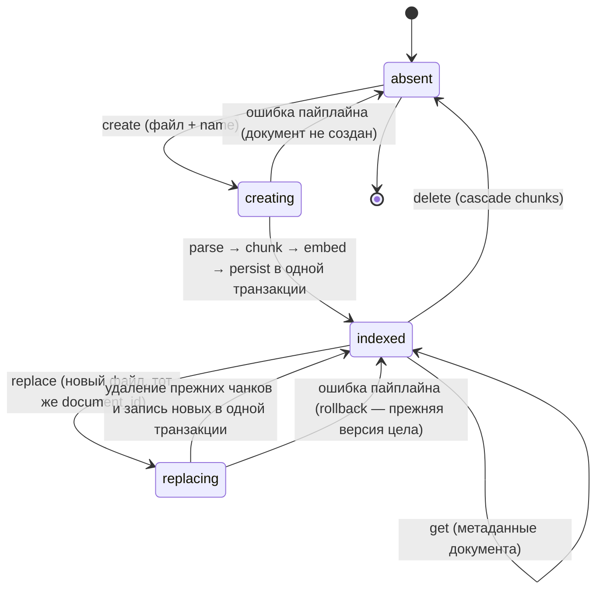
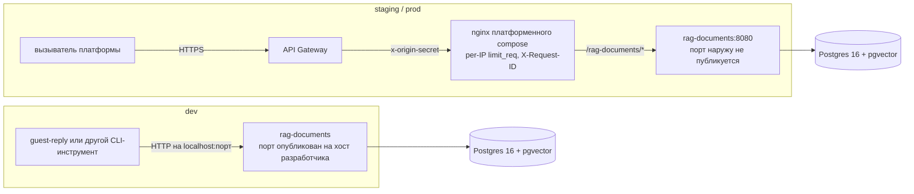
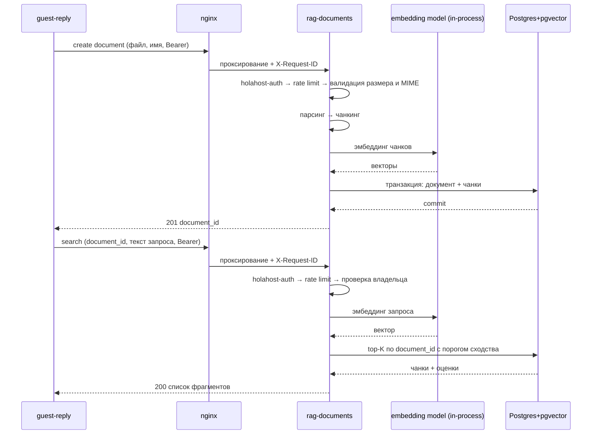

# rag-documents — техническая спецификация микросервиса

> **Resource Service** платформы Holahost (см. `holahost/docs/holahost_frame.md`). Владеет доменом
> **Document + Chunk**.
>
> **Соглашение о путях:** `backend/…`, `infra/…`, `docs/…` — относительно корня сервиса
> (`holahost/services/rag-documents/`); «корень репо» — корень монорепозитория.
>
> **Самодостаточность:** документ читается без спек других сервисов. Всё общее для платформы —
> в рамочной спеке, на неё и ссылка.
>
> **Динамические разделы** в конце документа: «Отложенные решения», «Расширения», «ADR-черновики».

---

## Этап 1. Problem Statement + Opportunity Brief + Карта пользовательского пути

### 1.1 Problem Statement

Основание для разработки: любой продукт Holahost, отвечающий гостю или подсказывающий хосту, нуждается в фактах о конкретном
объекте — Wi-Fi, чек-ин, парковка, правила, район. Эти факты живут в документах хоста
(PDF/DOCX/MD/TXT).

### 1.2 Opportunity Brief

Строим Resource Service с одним ресурсом — `Document` (и его производными `Chunk`) — и одной
содержательной операцией: «по тексту запроса отдай top-K релевантных фрагментов документа». Внутри —
парсинг поддерживаемых форматов, токен-aware чанкинг, локальная модель эмбеддингов (внешнего
провайдера нет) и векторный поиск в Postgres. Наружу — ни LLM, ни промптов, ни продуктовой логики:
сервис не знает, кто и зачем ищет. Это снимает боль однократно и для всех потребителей: пайплайн
реализован в одном месте, модель эмбеддингов и параметры чанкинга меняются в одном месте, права на
документ проверяются в одном месте.

Стыковка с продуктом: `rag-documents` — первый Resource Service Holahost. Вместе с `llm-client` и CLI
`guest-reply` он образует первый вертикальный срез платформы, на в т.ч. котором проверяется топология
рамочной спеки: сеть `backbone`, оффлайн-валидация JWT, послойный rate limiting, независимый деплой
сервиса. В объём этой спеки дополнительно входит общая библиотека `holahost-auth` — мидлварь
оффлайн-валидации JWT, разрабатываемая здесь в минимально необходимом виде и потребляемая
`llm-client` (ADR A-5).

**Критерий успеха итерации** (продуктовых метрик у инфраструктурного сервиса нет — зафиксировано):
`guest-reply ask --file <гайдбук> "<сообщение гостя>"` отрабатывает end-to-end на локальном
dev-стеке, при этом обновление `rag-documents` не затрагивает `llm-client`. Технические метрики
(что именно измеряем в коде и инфраструктуре) определяются на **Этапе 8**.

### 1.3 Карта пользовательского пути

Прямых пользователей-людей у сервиса нет. Актор — вызывающий клиент с s2s-токеном; на этой итерации
единственный клиент — CLI `guest-reply`, будущие — Orchestration Services и фронт. Карта — жизненный
цикл ресурса `Document`.

#### 1.3.1 State machine ресурса `Document`



Ingest **синхронен**: состояние `indexed` достигается в рамках того же HTTP-запроса, промежуточного
`pending` наружу не существует (ADR-черновик A-1). Замена — **отдельная атомарная операция сервиса**
(ADR-черновик A-6): `document_id` сохраняется, содержимое и чанки заменяются целиком; наблюдаемых
промежуточных состояний нет — вызыватель видит либо прежнюю версию, либо новую.

#### 1.3.2 Переходы и события

| Состояние | Событие | Следующее состояние | Наружу |
|---|---|---|---|
| `absent` | create: валидный файл | `indexed` | 201 + `document_id` |
| `absent` | create: MIME вне whitelist | `absent` | 415 `ERR_UNSUPPORTED_MEDIA_TYPE` |
| `absent` | create: размер > лимита | `absent` | 413 `ERR_PAYLOAD_TOO_LARGE` |
| `absent` | create: после парсинга текста нет | `absent` | 422 `ERR_EMPTY_DOCUMENT` |
| `absent` | create: чанков > лимита | `absent` | 422 `ERR_TOO_MANY_CHUNKS` |
| `indexed` | replace: валидный файл | `indexed` (новое содержимое) | 200 + тот же `document_id` |
| `indexed` | replace: любая ошибка валидации или пайплайна | `indexed` (прежнее содержимое) | тот же код, что и у `create` для этой ошибки |
| `indexed` | search: есть чанки выше порога | `indexed` | 200 + top-K |
| `indexed` | search: чанков выше порога нет | `indexed` | 200 + пустой список |
| `indexed` | get | `indexed` | 200 + метаданные |
| `indexed` | delete | `absent` | 204 (идемпотентно) |
| `indexed` | любая операция с чужим `sub` | без изменений | 404 (существование чужого документа не раскрываем) |
| `absent` | search/get/delete по неизвестному id | `absent` | 404 `ERR_NOT_FOUND` |
| любое | нет/невалидный JWT, неверный `aud` | без изменений | 401 |
| любое | токен валиден, прав нет | без изменений | 403 |
| любое | превышен per-service rate limit | без изменений | 429 + `Retry-After` |

Конкретные числа лимитов, порог сходства и K — Этап 3. Полная таксономия `ERR_*` и формат тела
ошибки — Этап 7.

#### 1.3.3 Владение и видимость

Владелец документа — `sub` из токена (для s2s-клиента `sub == client_id`, см. рамочную спеку,
«Claims»). На итерации действует правило **owner-only**: видеть, искать и удалять документ может
только его владелец; локальные гранты другим субъектам не вводятся. Один владелец может иметь
несколько документов; поиск выполняется **по одному `document_id`** — мульти-документный поиск
не предусмотрен.

#### 1.3.4 Точки входа

| Вызыватель | Токен | Операции | Итерация |
|---|---|---|---|
| CLI `guest-reply` | s2s, `client_credentials` | create / search / get / delete | да |
| Orchestration Service (напр. чат-ассистент) | s2s или exchanged (on-behalf-of-user) | search | нет (точка расширения) |
| Фронт напрямую из браузера | user-токен | create / get / delete | нет (общее расширение О-4) |

---

## Этап 2. User Stories + Acceptance Criteria

Роли:
- **Owner** — субъект токена (`sub`), от имени которого создан документ; на итерации это s2s-клиент
  `guest-reply-cli`, в будущем — Orchestration Service или пользователь фронта.
- **Consumer** — вызыватель, выполняющий поиск. На итерации совпадает с Owner (правило owner-only,
  §1.3.3).
- **Operator** — тот, кто разворачивает сервис и проверяет его работоспособность.

AC ссылаются на параметры по символическому имени; значения фиксируются на Этапе 3.

### 2.0 Таблица параметров

| Параметр | Назначение |
|---|---|
| `ALLOWED_MIME_TYPES` | whitelist форматов загружаемого файла |
| `MAX_UPLOAD_SIZE` | максимальный размер файла |
| `MAX_DOCUMENT_NAME_LENGTH` | максимальная длина отображаемого имени документа |
| `MIN_EXTRACTED_TEXT_CHARS` | минимум извлечённого текста после парсинга |
| `MAX_PARSED_TEXT_LENGTH` | максимум длины текста после парсинга |
| `CHUNK_WINDOW_TOKENS`, `CHUNK_OVERLAP_TOKENS` | окно и перекрытие чанкинга (в токенах модели) |
| `MAX_CHUNKS_PER_DOCUMENT` | максимум чанков на документ |
| `EMBEDDING_MODEL`, `EMBEDDING_DIM` | модель эмбеддингов и размерность вектора |
| `SEARCH_TOP_K` | сколько чанков возвращает поиск |
| `SIMILARITY_THRESHOLD` | минимальное сходство, ниже которого чанк не возвращается |
| `MAX_QUERY_LENGTH` | максимальная длина поискового запроса |
| `INGESTION_P95_BUDGET` | целевой p95 времени от запроса до `indexed` |
| `SEARCH_P95_BUDGET` | целевой p95 времени поиска |
| `RATE_LIMIT_DEFAULT` | per-service лимит по паре `client_id`+`sub` |
| `JWT_CLOCK_SKEW` | допуск рассинхронизации часов при проверке `exp`/`iat` |
| `ERR_*` | символические коды ошибок; таксономия и тело — Этап 7 |

### US-R01: Создание документа

> As an Owner, I want to upload a file and get it indexed in one call, so that it becomes searchable immediately.

**AC:**
- Запрос принимает файл и отображаемое имя; успех → `201` и `document_id`.
- Владельцем созданного документа записывается `sub` из токена; передать владельца в запросе нельзя — поле в контракте отсутствует.
- Файл с MIME вне `ALLOWED_MIME_TYPES` → `415 ERR_UNSUPPORTED_MEDIA_TYPE`; в сообщении перечислены поддерживаемые форматы.
- Файл больше `MAX_UPLOAD_SIZE` → `413 ERR_PAYLOAD_TOO_LARGE`; в `details` — фактический лимит.
- Пустое имя или имя длиннее `MAX_DOCUMENT_NAME_LENGTH` → `422 ERR_INVALID_PAYLOAD` с указанием поля.
- Извлечено меньше `MIN_EXTRACTED_TEXT_CHARS` → `422 ERR_EMPTY_DOCUMENT`.
- Текст после парсинга длиннее `MAX_PARSED_TEXT_LENGTH` → `422 ERR_PAYLOAD_TOO_LARGE` с указанием лимита.
- Получилось больше `MAX_CHUNKS_PER_DOCUMENT` чанков → `422 ERR_TOO_MANY_CHUNKS`; в `details` — лимит и фактическое число.
- При любой ошибке пайплайна документ и чанки не остаются в БД: повторный `get` по `document_id` из неуспешного ответа невозможен (id не выдан), счётчик документов владельца не изменился.
- Успешный ответ возвращается только после того, как все чанки записаны: немедленный поиск по возвращённому `document_id` находит содержимое (промежуточного состояния наружу нет).
- Время от запроса до ответа ≤ `INGESTION_P95_BUDGET` (p95) для файла у верхней границы `MAX_UPLOAD_SIZE`.
- Чанки режутся окном `CHUNK_WINDOW_TOKENS` с перекрытием `CHUNK_OVERLAP_TOKENS`, измеренными токенайзером `EMBEDDING_MODEL`; чанк не превышает максимальную длину входа модели (иначе эмбеддер молча обрежет текст).
- Для PDF чанк не пересекает границу страницы, и у чанка сохраняется номер страницы; для форматов без страниц номер пуст.
- Каждому чанку сохраняется L2-нормализованный вектор размерности `EMBEDDING_DIM`.

### US-R02: Атомарная замена документа

> As an Owner, I want to replace a document's content in one call, so that consumers never observe a gap or a half-indexed state.

**AC:**
- Замена выполняется по существующему `document_id`; успех → `200`, `document_id` не меняется.
- Все прежние чанки документа заменяются новыми; чанков от предыдущей версии не остаётся (число чанков документа равно числу, полученному из нового файла).
- Поиск, выполненный конкурентно во время замены, возвращает либо только старые, либо только новые чанки — смесь версий недопустима.
- Любая ошибка валидации или пайплайна (те же коды, что в US-R01) оставляет прежнюю версию нетронутой: последующий поиск возвращает старое содержимое.
- Замена чужого или несуществующего документа → `404 ERR_NOT_FOUND`.
- Имя документа обновляется, если передано; иначе сохраняется прежнее.
- Время замены ≤ `INGESTION_P95_BUDGET` (p95).

### US-R03: Поиск релевантных фрагментов

> As a Consumer, I want the top-K relevant chunks of a document for a query text, so that I can build a grounded prompt without knowing how retrieval works.

**AC:**
- Запрос принимает `document_id` и текст запроса; ответ — список чанков, отсортированный по убыванию сходства.
- Возвращается не более `SEARCH_TOP_K` чанков; чанки со сходством ниже `SIMILARITY_THRESHOLD` не возвращаются.
- Если подходящих чанков нет — `200` с пустым списком, не ошибка.
- Каждый элемент ответа содержит текст чанка, его оценку сходства и провенанс (номер страницы, если известен).
- Запрос длиннее `MAX_QUERY_LENGTH` → `422 ERR_INVALID_PAYLOAD`.
- Пустой запрос → `422 ERR_INVALID_PAYLOAD`.
- Поиск по чужому или несуществующему `document_id` → `404 ERR_NOT_FOUND`.
- Поиск не меняет состояние документа: повторный идентичный запрос даёт идентичный ответ.
- Сходство считается косинусом на L2-нормализованных векторах; запрос эмбеддится той же `EMBEDDING_MODEL`, что и чанки.
- Время ответа ≤ `SEARCH_P95_BUDGET` (p95).
- Заземление (регресс-защита ретривала): документ с уникальным sentinel-фактом на запрос об этом факте возвращает чанк, содержащий sentinel.

### US-R04: Метаданные документа

> As an Owner, I want to read a document's metadata, so that I can confirm what is stored without downloading it.

**AC:**
- Ответ содержит `document_id`, имя, число чанков, время создания и время последнего изменения.
- Исходный файл и полный текст документа не возвращаются (сервис не является файловым хранилищем).
- Чужой или несуществующий документ → `404 ERR_NOT_FOUND`.

### US-R05: Удаление документа

> As an Owner, I want to delete a document, so that its content stops being retrievable.

**AC:**
- Успешное удаление → `204`; чанки удаляются вместе с документом.
- Последующий поиск и `get` по этому `document_id` → `404 ERR_NOT_FOUND`.
- Повторное удаление того же `document_id` → `404` (операция идемпотентна по наблюдаемому эффекту: документа нет).
- Удаление чужого документа → `404`, чужой документ остаётся нетронутым.

### US-R06: Изоляция владельцев

> As an Owner, I want other subjects to be unable to see or touch my documents, so that a shared service does not leak my data.

**AC:**
- Любая операция (`get`, `search`, `replace`, `delete`) с документом, у которого `owner` ≠ `sub` вызывающего токена, → `404 ERR_NOT_FOUND`; `403` в этом случае не используется, существование чужого документа не раскрывается.
- Владелец определяется исключительно из токена; заголовок или поле тела, задающие владельца, отсутствуют в контракте и игнорируются, если присланы.
- Список документов (если реализован) содержит только документы вызывающего `sub`.

### US-R07: Аутентификация и авторизация

> As an Operator, I want every route except health to require a valid token, so that the service is safe to expose behind the platform gateway.

**AC:**
- Мидлварь `holahost-auth` (общая библиотека, ADR A-5) подключена ко всем роутам, кроме `GET /health`.
- Отсутствующий заголовок `Authorization` или схема не `Bearer` → `401`.
- Непарсящийся JWT, `alg` вне ожидаемого (в частности `none` и HS*), неверная подпись → `401`; ожидаемый `alg` берётся из конфига сервиса, а не из токена.
- Просроченный `exp` (с допуском `JWT_CLOCK_SKEW`), чужой `iss`, `aud` без `rag-documents` → `401`.
- Неизвестный `kid` вызывает однократный re-fetch JWKS; если после него ключ не найден → `401`.
- Тело `401` не содержит причину отказа; причина пишется в лог.
- `403` возвращается только когда токен валиден, но прав на операцию нет.
- Валидация не ходит в `auth` ни в одном случае, кроме re-fetch JWKS.
- `GET /health` отвечает без токена.

### US-R08: Rate limiting

> As an Operator, I want per-caller limits inside the service, so that one client cannot exhaust it.

**AC:**
- Лимит применяется после `holahost-auth` и до обработчика; ключ — пара `client_id`+`sub` из токена.
- Превышение → `429` с заголовком `Retry-After`.
- Значения по умолчанию — `RATE_LIMIT_DEFAULT`; переопределение per `client_id` задаётся конфигом сервиса.
- После рестарта контейнера счётчик текущего окна начинается заново (следствие A-8).

### US-R09: Контракт ошибок

> As a Consumer, I want a single machine-readable error shape, so that I can react without parsing prose.

**AC:**
- Тело любой ошибки — `{ error: { code, message, details } }`; `code` — из таксономии `ERR_*`.
- Один и тот же класс ошибки всегда возвращает один и тот же `code` и одинаковый набор полей в `details`.
- Сообщение об ошибке не содержит stack trace, путей файлов и содержимого документа.
- Каждому `ERR_*` в контракте сопоставлена retry-семантика (повторять / не повторять) — Этап 7.

### US-R10: Health и smoke

> As an Operator, I want a health endpoint, so that deploys can be verified automatically.

**AC:**
- `GET /health` доступен без авторизации и отвечает `200`, когда сервис готов принимать запросы.
- Ответ подтверждает доступность БД и загруженность модели эмбеддингов; неготовность любого из них → не-`200`.
- Контейнер слушает порт 8080 и подключён к сети `backbone`; наружу порт не публикуется.

### US-R11: Логи без чувствительных данных

> As an Operator, I want logs that never contain document content, so that observability does not become a data leak.

**AC:**
- В логи не попадают: текст документа, текст чанков, текст поискового запроса, тело токена.
- В логи попадают: `X-Request-ID`, `client_id`, `sub`, `document_id`, коды ошибок, длительности этапов, число чанков.
- `X-Request-ID` из входящего запроса логируется и пробрасывается во все исходящие вызовы.
- Логи структурированы (JSON), состав полей задаётся allowlist'ом.

### 2.12 Покрытие карты пользовательского пути (§1.3)

| Переход карты | Покрыто в |
|---|---|
| `absent → creating → indexed` (create) | US-R01 |
| `creating → absent` (ошибка пайплайна) | US-R01 |
| `indexed → replacing → indexed` (replace, успех и ошибка) | US-R02 |
| `indexed → indexed` (search) | US-R03 |
| `indexed → indexed` (get) | US-R04 |
| `indexed → absent` (delete) | US-R05 |
| Операции с чужим `sub` → 404 | US-R06 |
| 401 / 403 на любой операции | US-R07 |
| 429 на любой операции | US-R08 |
| Все ветки `ERR_*` | US-R09 |

---

## Этап 3. Tech Constraints Doc

### 3.1 Системная архитектура

Сервис — самодостаточный деплой-юнит по рамочной спеке: контейнер приложения + контейнер Postgres в
собственном compose-проекте, сеть `backbone` (external). Разворачивается на всех окружениях
платформы (dev / staging / prod, Этап 11), но контур входа различается.



| Окружение | Вход | Кто вызывает |
|---|---|---|
| staging / prod | API Gateway → nginx платформенного compose → сервис:8080 (порт не публикуется) | сервисы платформы |
| dev | напрямую на опубликованный порт контейнера, без gateway и без nginx | CLI-инструменты разработчика |

Сервис в обоих контурах ведёт себя **одинаково** и отсутствие периметра ничем не компенсирует:
ветвлений по окружению, генерации недостающих заголовков и запасных проверок в нём нет.
`X-Request-ID` проставляет вызыватель — на staging/prod это nginx, на dev это CLI-инструмент
(тонкий оркестратор для dev, см. спеку `guest-reply`). `x-origin-secret` и per-IP `limit_req` на dev
просто отсутствуют; защита сервиса в обоих контурах одна и та же — оффлайн-валидация JWT и
собственный per-caller лимит (US-R07, US-R08).

Межсервисных вызовов у сервиса нет: он никого не зовёт, его зовут. Единственный возможный исходящий
запрос — re-fetch JWKS при неизвестном `kid`.

| Компонент | Выбор | Назначение |
|---|---|---|
| Приложение | контейнер Python 3.12, uvicorn, порт 8080 | HTTP API сервиса |
| БД | `pgvector/pgvector:pg16`, контейнер в compose сервиса, именованный volume | документы, чанки, векторы |
| Модель эмбеддингов | загружается в память при старте процесса | эмбеддинг на ingest и на поиск |
| Вход | nginx платформенного compose (`/rag-documents/*`) | проверка `x-origin-secret`, per-IP `limit_req`, простановка `X-Request-ID` |
| Токены | dev-минтер (ADR C-4), JWKS кэшируется в процессе | оффлайн-валидация JWT |

Межсервисных вызовов у сервиса нет: он никого не зовёт, его зовут. Единственный возможный исходящий
запрос — re-fetch JWKS при неизвестном `kid`.

### 3.2 Архитектура кода

Clean architecture, слои и правила импортов: `import-linter`, контракт
`layers = ["interface", "infrastructure", "application", "domain"]`, `config` — leaf-исключение,
`scripts/` вне контракта. Адаптер интерфейса — FastAPI.

```
backend/
  app/
    config/                 # типизированные настройки, логирование
    domain/
      entities/             # идентифицируемые объекты с жизненным циклом
      value_objects/        # frozen-dataclass'ы с инвариантами и ID-классы
      exceptions.py
    application/
      dto/                  # команды и результаты use case'ов, только примитивы
      ports/                # Protocol'ы внешних зависимостей, по группам: парсинг и чанкинг,
                            # эмбеддинги, векторный поиск, репозитории, rate limit, unit of work
      use_cases/            # оркестрация поверх портов
      exceptions/
    infrastructure/
      db/                   # SQLAlchemy Core, репозитории, UoW, миграции
      embedding/            # fastembed
      vector/               # pgvector-запросы
      ingestion/            # pymupdf / python-docx / plain-text парсеры, чанкер
      auth/                 # адаптация общей библиотеки holahost-auth к FastAPI
    interface/
      http/                 # FastAPI: роутер, схемы запросов/ответов, middleware, error handler
    scripts/                # composition root: сборка Container, bootstrap
```

Зависимости инжектируются в конструктор use case'а типами-Protocol'ами из `application/ports/`;
конкретные реализации собираются в `scripts/` один раз при старте процесса (модель эмбеддингов и пул
соединений живут столько же, сколько процесс).

### 3.3 Моделирование домена

Lightweight DDD: `domain/entities/` с фабричными методами `create()` и
`from_repo()`, `domain/value_objects/` — frozen dataclass'ы с инвариантами в `__post_init__`,
ID-классы поверх `uuid.UUID` с `new()`/`from_str()`. Domain services, агрегаты и фабрики не
применяются; репозитории — Protocol'ы в `application/ports/`, не в `domain/`. Портов `Clock` и
`IdGenerator` нет: `datetime.now(tz=UTC)` inline, идентификаторы self-generating.

### 3.4 Технологический стек

| Слой | Выбор |
|---|---|
| Язык | Python 3.12 |
| HTTP | FastAPI + uvicorn (один воркер), эндпоинты — **синхронные** `def` |
| Модель конкурентности | sync-обработчики исполняются в threadpool; запись в БД занимает поток пула, а не event loop; async-стек не вводится — ADR A-9 |
| Чанкинг | стек `langchain` используется целиком: здесь `langchain-text-splitters`, чат-модели того же стека — в `llm-client` |
| СУБД | Postgres 16 + расширение `pgvector` |
| Доступ к БД | SQLAlchemy Core 2.0 поверх `psycopg[binary,pool]` (psycopg 3); ORM не используется |
| Миграции | Alembic (DDL из того же `MetaData`) |
| Эмбеддинги | `fastembed` (onnxruntime), модель `paraphrase-multilingual-MiniLM-L12-v2`, 384 измерения |
| Чанкинг | `RecursiveCharacterTextSplitter` (`langchain-text-splitters`), `length_function` — токенайзер той же модели |
| Парсеры | `pymupdf` (PDF), `python-docx` (DOCX), `bytes.decode("utf-8")` (MD/TXT) |
| Валидация | Pydantic v2 |
| Авторизация | общая библиотека `holahost-auth` (ADR A-5) |
| Тесты | pytest, fakes для портов |
| Логи | structured JSON в stdout, allowlist полей |

### 3.5 Хранение и жизненный цикл данных

| Данные | Где | Жизненный цикл |
|---|---|---|
| Документ (метаданные) | Postgres | до явного `delete`; TTL нет |
| Чанки + векторы | Postgres, колонка `vector(384)` | вместе с документом, cascade |
| Исходный файл | **не хранится** | живёт только в памяти запроса, после ingest отбрасывается |
| Счётчики rate limit | память процесса | до рестарта (US-R08) |
| Кэш JWKS | память процесса | до рестарта или неизвестного `kid` |

Исходный файл не сохраняется намеренно: сервис не файловое хранилище, а индекс. Следствие —
переиндексация при смене модели эмбеддингов потребует повторной загрузки файлов владельцем; это
принято и станет обязанностью асинхронного расширения.

### 3.6 Векторный поиск

ANN-индекс (HNSW/IVFFlat) **не создаётся** — ADR A-7. Поиск: btree-индекс по `chunks(document_id)`
сужает выборку до чанков одного документа (≤ `MAX_CHUNKS_PER_DOCUMENT`), внутри неё считается точное
косинусное расстояние оператором `pgvector`. Точность 100%, план запроса предсказуем, параметров
индекса для подбора нет.

### 3.7 Доменные параметры и лимиты (числа)

| Параметр | Значение | Обоснование |
|---|---|---|
| `ALLOWED_MIME_TYPES` | `application/pdf`, `application/vnd.openxmlformats-officedocument.wordprocessingml.document`, `text/markdown`, `text/plain` | форматы, для которых есть парсер; OCR не применяется |
| `MAX_UPLOAD_SIZE` | 8 MiB | `client_max_body_size` nginx выставляется в то же значение; ниже потолка полезной нагрузки API Gateway |
| `MAX_DOCUMENT_NAME_LENGTH` | 200 символов | отображаемое имя, не идентификатор |
| `MIN_EXTRACTED_TEXT_CHARS` | 200 | отсекает пустые и image-only PDF |
| `MAX_PARSED_TEXT_LENGTH` | 200 000 символов | вместе с окном чанкинга даёт ≈500 чанков — верх, укладывающийся в бюджет ingest |
| `CHUNK_WINDOW_TOKENS` | 120 | должно быть ≤ 128 — максимума входа MiniLM-L12; иначе эмбеддер молча обрежет чанк |
| `CHUNK_OVERLAP_TOKENS` | 16 | сохраняет контекст на границе окна |
| `MAX_CHUNKS_PER_DOCUMENT` | 500 | потолок времени ingest и объёма поиска по документу |
| `EMBEDDING_MODEL` | `sentence-transformers/paraphrase-multilingual-MiniLM-L12-v2` | многоязычная (гайдбуки не только на английском), 384 измерения, работает на CPU; полное имя обязательно — `fastembed`'s реестр моделей отклоняет короткое (проверено эмпирически) |
| `EMBEDDING_DIM` | 384 | размерность модели |
| `SEARCH_TOP_K` | 5 | столько фрагментов помещается в промпт вызывателя без вытеснения инструкции |
| `SIMILARITY_THRESHOLD` | 0.30 (косинус) | стартовое значение, калибруется на реальных гайдбуках; задаётся конфигом, не кодом |
| `MAX_QUERY_LENGTH` | 4000 символов | длина сообщения гостя, из которого строится запрос |
| `INGESTION_P95_BUDGET` | 20 с | запас до потолка синхронной интеграции (30 с). Величина выведена из потолка, а не измерена: при 500 чанках это ~0.04 с на чанк на парсинг + эмбеддинг. Бюджет подлежит замеру на первой реализации; если замер не укладывается — уменьшается `MAX_CHUNKS_PER_DOCUMENT`, а не поднимается бюджет (потолок интеграции неподвижен). Потребность в файлах, не влезающих в этот бюджет, закрывается расширением Р-1, а не ослаблением лимитов |
| `SEARCH_P95_BUDGET` | 500 мс | эмбеддинг запроса + один запрос к БД |
| `RATE_LIMIT_DEFAULT` (search/get) | 600 req/час на пару `client_id`+`sub` | по умолчанию из рамочной спеки |
| `RATE_LIMIT_INGEST` (create/replace) | 60 req/час на ту же пару | ingest на два порядка дороже поиска |
| `JWT_CLOCK_SKEW` | 30 с | из рамочной спеки |
| Таймаут запроса к БД | 5 с | не даёт зависшему запросу держать воркер |

Ограничение по репликам: счётчики лимитов в памяти процесса, поэтому сервис рассчитан на **один
инстанс**; при масштабировании лимит либо делится на N, либо переезжает в общий сторадж (US-R08).

### 3.8 Безопасность

| Аспект | Решение |
|---|---|
| Аутентификация | JWT оффлайн через `holahost-auth` на всех роутах, кроме `GET /health`; фиксированный `alg` из конфига |
| Авторизация | owner-only по `sub`; чужой ресурс → `404`, существование не раскрывается |
| Секреты (dev) | пароль БД — из `.env.dev`; в git попадает только `.env.dev.example` |
| Секреты (staging / prod) | AWS Secrets Manager: секреты сервиса создаются его собственным terraform-root'ом (рамочная спека, «Инфраструктура и CI/CD микросервиса»), значения заполняются вручную один раз; контейнер читает их на старте по instance role (у роли есть SM read), в образ не запекаются и в env compose-файла не хранятся. Ротация — замена значения в SM + рестарт контейнера |
| Ввод | размер тела ограничивается nginx и повторно проверяется приложением; MIME определяется по содержимому, а не по заголовку клиента |
| Парсинг | только in-memory, без временных файлов и без вызовов внешних утилит; OCR и исполнение вложенного контента не выполняются |
| SQL | только параметризованные запросы SQLAlchemy Core; конкатенации SQL нет |
| Ответы | ошибки без stack trace, путей и содержимого документа; `401` без причины |
| CORS | не настраивается: на итерации браузер в сервис не ходит — фронт работает через Orchestration Service. Это ограничение итерации, а не запрет; прямой доступ из браузера — общее расширение О-4 рамочной спеки, и оно требует правки её реестра клиентов `auth` |
| Prompt injection | не применимо: сервис не обращается к LLM; содержимое документа наружу отдаётся как данные |

### 3.9 Out of scope итерации

- Асинхронная индексация, очередь, воркер (описано как расширение ниже).
- Мульти-документный поиск и ANN-индекс.
- Локальные гранты и доступ не-владельцу.
- Хранение исходных файлов и их выдача.
- OCR и image-only PDF; извлечение текста из таблиц DOCX.
- Гибридный поиск (BM25 + вектор), реранкер.
- Версионирование документов и история изменений.
- Мультиарендность сверх owner-only, квоты на владельца.

### 3.10 Happy path на уровне компонентов



---

## Этап 4. Domain Entities

Значения параметров, на которые ссылаются инварианты, — §3.7.

### 4.1 Value objects

| VO | Основа | Инварианты |
|---|---|---|
| `DocumentId` | `uuid.UUID` | генерируется своим `new()`, разбирается из строки; извне не назначается |
| `ChunkId` | `uuid.UUID` | то же |
| `OwnerSubject` | `str` | непустой после `strip`; берётся из `sub` токена и никогда из тела запроса; сравнение — точное совпадение |
| `DocumentName` | `str` | 1…`MAX_DOCUMENT_NAME_LENGTH` символов после `strip`; управляющие символы запрещены |
| `MimeType` | `str` | только значение из `ALLOWED_MIME_TYPES` |
| `ChunkIndex` | `int` | ≥ 0; в пределах документа уникален и не имеет разрывов |
| `PageNumber` | `int \| None` | если задан — ≥ 1; `None` для форматов без страниц |
| `Embedding` | `tuple[float, ...]` | длина = `EMBEDDING_DIM`; все значения конечны (без `NaN`/`inf`); L2-норма = 1 с допуском 1e-6 |

Нормализация `Embedding` — инвариант, а не операция вызывателя: конструктор принимает уже
нормализованный вектор и отвергает остальные, поэтому косинус в поиске сводится к скалярному
произведению и «забыть нормализовать» невозможно.

`TextFragment` и `SimilarityScore` в этот список не входят — обе структуры оказались
application-слоя, не домена. Тест простой: становится ли значение полем `Document`/`Chunk`? Нет
у обеих: `TextFragment (text, page)` — только пайплайновая передача данных между `FileParser` и
`TextChunker` (§8.0), `Chunk` хранит `text`/`page` отдельными полями, а не вложенным
`TextFragment`; `SimilarityScore` явно не поле сущности (§4.4). Определены в `application/ports/`
рядом со своими портами.

### 4.2 `Document`

| Поле | Тип | Примечание |
|---|---|---|
| `id` | `DocumentId` | |
| `owner` | `OwnerSubject` | назначается при создании |
| `name` | `DocumentName` | единственное изменяемое поле |
| `mime_type` | `MimeType` | формат исходного файла; сам файл не хранится |
| `chunk_count` | `int` | 1…`MAX_CHUNKS_PER_DOCUMENT` |
| `created_at` | `datetime` (UTC, aware) | |
| `updated_at` | `datetime` (UTC, aware) | ≥ `created_at` |

**Инварианты:** `owner` неизменен после создания — передача владения на итерации не предусмотрена;
`chunk_count` ≥ 1, то есть документ без чанков не существует как состояние (пустой документ
отвергается на этапе парсинга, а не создаётся и удаляется); `updated_at` меняется при замене
содержимого и при переименовании.

**Lifecycle:** создаётся вместе с полным набором чанков в одной транзакции, заменяется целиком с
сохранением `id`, удаляется вместе с чанками; промежуточных состояний наружу нет (§1.3.1).

### 4.3 `Chunk`

`Chunk` — подчинённая сущность агрегата `Document` (§4.2): своего репозитория не имеет,
создаётся и заменяется только вместе с документом одной операцией (§8.0, `DocumentsRepo`).
Это не новое ограничение — `Chunk` и раньше был неизменяемым и жил только вместе со своим
документом (см. Lifecycle ниже); теперь то же самое верно и структурно, а не только по
соглашению.

| Поле | Тип | Примечание |
|---|---|---|
| `id` | `ChunkId` | |
| `document_id` | `DocumentId` | |
| `index` | `ChunkIndex` | порядок внутри документа |
| `text` | `str` | фрагмент исходного текста |
| `embedding` | `Embedding` | вектор этого фрагмента |
| `page` | `PageNumber` | провенанс: страница исходника либо `None` |

**Инварианты:** `text` непуст после `strip`; длина `text` в токенах модели ≤ `CHUNK_WINDOW_TOKENS` —
иначе эмбеддер молча обрежет фрагмент и вектор перестанет соответствовать тексту; чанк не пересекает
границу страницы, поэтому `page` однозначен; `embedding` соответствует именно этому `text`.

**Lifecycle:** неизменяем — рождается и умирает только вместе со своим документом; отдельной операции
изменения чанка не существует.

### 4.4 Что сущностями не является

`SearchQuery` и результат поиска не моделируются как доменные сущности: у запроса нет идентичности и
жизненного цикла, он живёт внутри одного вызова. Оценка сходства (`SimilarityScore`, application-слой
— см. §4.1) принадлежит паре «запрос ↔ чанк», а не чанку, и возвращается рядом с ним, не становясь
его полем.

---

## Этап 5. Use Cases

Актор везде один — вызывающий клиент с s2s-токеном; в input он представлен субъектом токена, который
приходит из мидлвари, а не из тела запроса. На границе use case'а — только примитивы и байты; VO и
сущности из §4 живут внутри.

### UC-R1. Создать документ

- **Актор:** Owner
- **Input:** `owner: str`, `name: str`, `content: bytes`, `mime_type: str`
- **Output:** `DocumentView` — представление документа (идентификатор, имя, формат, число чанков, время создания и изменения); одинаково для создания, замены и чтения
- **Поток:** проверяет размер и MIME, парсит содержимое в текст с провенансом страниц, режет на
  чанки токенайзером модели, считает эмбеддинги, затем в одной транзакции пишет документ и все чанки.
  Любая ошибка до коммита оставляет хранилище нетронутым.

### UC-R2. Заменить документ

- **Актор:** Owner
- **Input:** `document_id: str`, `owner: str`, `content: bytes`, `mime_type: str`, `name: str | None`
- **Output:** `DocumentView` с прежним идентификатором
- **Поток:** проверяет принадлежность документа владельцу, выполняет тот же пайплайн, что и создание,
  до открытия транзакции; в транзакции удаляет прежние чанки и записывает новые, обновляя метаданные.
  `document_id` сохраняется, при ошибке прежняя версия остаётся целой.

### UC-R3. Найти фрагменты

- **Актор:** Consumer
- **Input:** `document_id: str`, `owner: str`, `query: str`
- **Output:** `list[(chunk_id: str, text: str, page: int | None, score: float)]`
- **Поток:** проверяет принадлежность документа, эмбеддит запрос той же моделью, что и чанки,
  выбирает из хранилища top-K по косинусному расстоянию с отсечкой по порогу. Пустой результат —
  валидный ответ, а не ошибка.

### UC-R4. Прочитать метаданные документа

- **Актор:** Owner
- **Input:** `document_id: str`, `owner: str`
- **Output:** `DocumentView`
- **Поток:** проверяет принадлежность и возвращает представление. Ни исходный файл, ни текст чанков не
  отдаются.

### UC-R5. Удалить документ

- **Актор:** Owner
- **Input:** `document_id: str`, `owner: str`
- **Output:** ничего
- **Поток:** проверяет принадлежность и удаляет документ вместе с чанками одной транзакцией.

Во всех пяти проверка принадлежности даёт одинаковый исход для «чужого» и «несуществующего»
документа — наружу это `404` (US-R06), поэтому отдельного use case'а «проверить владение» нет: это
часть каждого из них.

---

## Этап 6. DB Schema

Postgres 16 с расширением `vector`. Персистентны только документы и чанки: счётчики rate limit живут
в памяти процесса (A-8), кэш JWKS — тоже, исходные файлы не хранятся (A-10).

```sql
CREATE EXTENSION IF NOT EXISTS vector;

-- Документ: единица владения и единица поиска. Исходный файл не хранится,
-- mime_type остаётся как признак происхождения текста.
CREATE TABLE documents (
    id            uuid        PRIMARY KEY,
    owner_subject text        NOT NULL,
    name          text        NOT NULL,
    mime_type     text        NOT NULL,
    chunk_count   integer     NOT NULL,
    created_at    timestamptz NOT NULL,
    updated_at    timestamptz NOT NULL,
    CONSTRAINT documents_name_not_blank      CHECK (btrim(name) <> ''),
    CONSTRAINT documents_chunk_count_positive CHECK (chunk_count >= 1),
    CONSTRAINT documents_updated_not_before  CHECK (updated_at >= created_at)
);

-- Чанк: фрагмент текста и его вектор. Живёт только вместе с документом,
-- отдельных операций изменения не имеет.
CREATE TABLE chunks (
    id          uuid        PRIMARY KEY,
    document_id uuid        NOT NULL REFERENCES documents(id) ON DELETE CASCADE,
    idx         integer     NOT NULL,
    text        text        NOT NULL,
    page        integer,
    embedding   vector(384) NOT NULL,
    CONSTRAINT chunks_idx_non_negative CHECK (idx >= 0),
    CONSTRAINT chunks_text_not_blank   CHECK (btrim(text) <> ''),
    CONSTRAINT chunks_page_positive    CHECK (page IS NULL OR page >= 1),
    CONSTRAINT chunks_document_idx_uniq UNIQUE (document_id, idx)
);

CREATE INDEX idx_documents_owner_subject ON documents (owner_subject);
CREATE INDEX idx_chunks_document_id      ON chunks (document_id);

-- Row-Level Security — единственный механизм изоляции по владельцу (§8.0): репо не
-- фильтрует owner в собственном SQL, привязка идёт через сессионную переменную
-- транзакции (set_config('app.current_owner', ..., true), выставляется адаптером
-- перед каждым вызовом). FORCE обязателен наряду с ENABLE — иначе RLS не действует на
-- роль-владельца таблицы. Суперпользовательское соединение обходит RLS безусловно,
-- никаким FORCE это не закрывается — за это отвечает то, какой ролью подключается
-- приложение, а не что-либо в этой миграции.
ALTER TABLE documents ENABLE ROW LEVEL SECURITY;
ALTER TABLE documents FORCE ROW LEVEL SECURITY;
CREATE POLICY owner_isolation ON documents
    USING (owner_subject = current_setting('app.current_owner', true))
    WITH CHECK (owner_subject = current_setting('app.current_owner', true));

-- chunks своей колонки owner не хранит (подчинён documents, §4.3) — видимость строки
-- выводится через подзапрос к уже отфильтрованному documents, а не через собственное
-- условие.
ALTER TABLE chunks ENABLE ROW LEVEL SECURITY;
ALTER TABLE chunks FORCE ROW LEVEL SECURITY;
CREATE POLICY owner_isolation ON chunks
    USING (document_id IN (SELECT id FROM documents))
    WITH CHECK (document_id IN (SELECT id FROM documents));
```

### 6.1 Решения, стоящие за схемой

| Решение | Почему так |
|---|---|
| `owner_subject` — `text`, не `uuid` | субъектом токена может быть и пользователь (uuid), и сервис (`client_id`-строка); приводить второе к uuid значило бы врать о типе |
| Исходный файл отсутствует в схеме | A-10; при переходе на асинхронную индексацию (Р-1) появится либо колонка `bytea`, либо ссылка на объектное хранилище |
| `chunk_count` денормализован | метаданные документа читаются без `COUNT(*)` по чанкам; согласованность держится тем, что оба изменения идут в одной транзакции — это принятая избыточность, а не кэш |
| ANN-индекса нет | A-7: `idx_chunks_document_id` сужает выборку до чанков одного документа, внутри неё считается точное расстояние. HNSW появится вместе с мульти-документным поиском (Р-2) |
| `idx_documents_owner_subject` | нужен не поиску (он идёт по `document_id`), а проверке владения и будущему перечислению документов владельца |
| Уникальность `(document_id, idx)` | защищает инвариант «порядок чанков без разрывов и дублей» на уровне БД, а не только в коде |
| FK с `ON DELETE CASCADE` | удаление документа и замена содержимого не оставляют осиротевших чанков даже при ошибке в коде |
| Row-Level Security вместо фильтрации в коде репо | гарантия на уровне движка БД, не зависящая от того, вспомнил ли конкретный метод репо (существующий или будущий) отфильтровать по owner — рассмотрен и отклонён отдельный `authorize()`-порт (вносит гонку между проверкой и записью) и owner-параметр на каждом методе репо (дублирует то, что уже даёт RLS) |

### 6.2 Как схема обслуживает операции

| Операция | Что происходит в БД |
|---|---|
| Создание | одна транзакция: `INSERT` документа + пакетный `INSERT` чанков |
| Замена | одна транзакция: `DELETE FROM chunks WHERE document_id = …` → пакетный `INSERT` новых → `UPDATE documents SET name, chunk_count, updated_at`. Прежняя версия видна конкурентным читателям до коммита |
| Поиск | один запрос: фильтр по `document_id` + сортировка по косинусному расстоянию + `LIMIT` top-K; отсечка по порогу сходства — в том же запросе |
| Метаданные | одна строка `documents`, чанки не читаются |
| Удаление | `DELETE FROM documents`, чанки уходят каскадом |

Миграции — Alembic, имена файлов `YYYYMMDD_HHMM_<slug>.py`. Расширение `vector` создаётся первой
миграцией, а не руками при разворачивании стенда.

---

## Этап 7. API Contracts

### 7.0 Конвенции

| Что | Значение |
|---|---|
| Базовый путь | `/api/rag-documents` (сегмент = имя сервиса, рамочная спека) |
| Авторизация | `Authorization: Bearer <jwt>` на всех роутах, кроме `GET /health`; иных способов передачи секретов в контракте нет |
| Трассировка | `X-Request-ID` — входящий заголовок; логируется и возвращается в ответе |
| Формат | `application/json`, кроме загрузки и замены (`multipart/form-data`) |
| Идентификаторы | UUID в строковом виде |
| Время | ISO 8601 в UTC (`2026-08-04T10:15:30Z`) |
| Envelope ошибки | `{ "error": { "code": "...", "message": "...", "details": { ... } } }` — общая библиотека платформы |
| Схема | OpenAPI сервиса версионируется в его репозитории (требование рамочной спеки) |

### 7.1 Перечень эндпоинтов

| Метод и путь | Назначение | Use case | Успех |
|---|---|---|---|
| `POST /api/rag-documents/documents` | создать документ | UC-R1 | `201` |
| `PUT /api/rag-documents/documents/{id}` | заменить содержимое | UC-R2 | `200` |
| `POST /api/rag-documents/documents/{id}/search` | найти фрагменты | UC-R3 | `200` |
| `GET /api/rag-documents/documents/{id}` | метаданные | UC-R4 | `200` |
| `DELETE /api/rag-documents/documents/{id}` | удалить | UC-R5 | `204` |
| `GET /health` | готовность | — | `200` |

Поиск — `POST`, а не `GET`: текст запроса доходит до `MAX_QUERY_LENGTH` и не должен попадать ни в
URL, ни в логи прокси. Замена — `PUT` по существующему идентификатору: операция идемпотентна по
результату и сохраняет `id` (A-6).

### 7.2 Создание и замена документа

```
POST /api/rag-documents/documents
Content-Type: multipart/form-data
  file: <binary>          # обязательное
  name: <string>          # обязательное, 1…MAX_DOCUMENT_NAME_LENGTH

201 Created
{
  "document_id": "8f14e45f-ceea-467a-9f0a-1c2d3e4f5a6b",
  "name": "Apartment guidebook",
  "mime_type": "application/pdf",
  "chunk_count": 128,
  "created_at": "2026-08-04T10:15:30Z",
  "updated_at": "2026-08-04T10:15:30Z"
}
```

```
PUT /api/rag-documents/documents/{id}
Content-Type: multipart/form-data
  file: <binary>          # обязательное
  name: <string>          # необязательное; отсутствует — прежнее имя сохраняется

200 OK
{
  "document_id": "8f14e45f-ceea-467a-9f0a-1c2d3e4f5a6b",
  "name": "Apartment guidebook",
  "mime_type": "application/pdf",
  "chunk_count": 96,
  "created_at": "2026-08-04T10:15:30Z",
  "updated_at": "2026-08-04T11:02:11Z"
}
```

Создание, замена и чтение возвращают **одно и то же представление документа** — различаются только
код ответа и то, что при создании `created_at` совпадает с `updated_at`. Отдельных усечённых форм
ответа нет: вызывателю не приходится помнить, какая ручка какие поля отдаёт.

Владелец в теле запроса отсутствует: он берётся из `sub` токена. MIME определяется по содержимому
файла, а не по заявленному клиентом типу; расхождение — основание для `415`.

### 7.3 Поиск фрагментов

```
POST /api/rag-documents/documents/{id}/search
{ "query": "во сколько заезд?" }

200 OK
{
  "chunks": [
    { "chunk_id": "…", "text": "Check-in с 15:00…", "page": 2, "score": 0.71 },
    { "chunk_id": "…", "text": "…",                  "page": null, "score": 0.44 }
  ]
}
```

Список отсортирован по убыванию `score` и содержит не более `SEARCH_TOP_K` элементов.

Пустым он бывает из-за `SIMILARITY_THRESHOLD`, а не из-за отсутствия чанков: документ всегда содержит
хотя бы один (инвариант `chunk_count ≥ 1`), поэтому чистый top-K возвращал бы ближайшие фрагменты
всегда — какими бы нерелевантными они ни были. Порог отсекает всё ниже планки, и на вопрос, к
документу не относящийся, выше планки не остаётся ничего. Пустой список — **сигнал «релевантного
контекста нет»**, и это `200`, а не ошибка: он позволяет вызывателю не тратить платную генерацию и
честно ответить «не знаю» вместо галлюцинации поверх нерелевантного текста.

`page` равен `null` для форматов без страниц. Параметров `top_k` и порога в запросе нет: они
принадлежат сервису, иначе вызыватель начнёт подбирать качество поиска на своей стороне.

### 7.4 Метаданные и удаление

```
GET /api/rag-documents/documents/{id}

200 OK
{
  "document_id": "…",
  "name": "Apartment guidebook",
  "mime_type": "application/pdf",
  "chunk_count": 128,
  "created_at": "2026-08-04T10:15:30Z",
  "updated_at": "2026-08-04T11:02:11Z"
}
```

```
DELETE /api/rag-documents/documents/{id}

204 No Content
```

Ни исходный файл, ни тексты чанков через метаданные не отдаются.

### 7.5 Health

```
GET /health          # без авторизации

200 OK   { "status": "ok" }
503      { "status": "unavailable" }
```

Проверяются доступность БД и загруженность модели эмбеддингов. Деталей о причине недоступности
ответ не содержит — они в логах.

### 7.6 Таксономия ошибок

| Код | HTTP | Когда | `details` | Повторять? |
|---|---|---|---|---|
| `ERR_INVALID_PAYLOAD` | 422 | пустое или слишком длинное имя, пустой или слишком длинный запрос, отсутствующее поле, отсутствующий `X-Request-ID`, файл повреждён или не разбирается (`DocumentParseError`) | `field`, `limit` | нет |
| `ERR_UNSUPPORTED_MEDIA_TYPE` | 415 | MIME вне `ALLOWED_MIME_TYPES` | `allowed` | нет |
| `ERR_PAYLOAD_TOO_LARGE` | 413 | файл больше `MAX_UPLOAD_SIZE` — проверка **до** парсинга | `limit`, `actual` | нет |
| `ERR_PAYLOAD_TOO_LARGE` | 422 | текст после парсинга длиннее `MAX_PARSED_TEXT_LENGTH` — проверка **после** парсинга | `limit`, `actual` | нет |
| `ERR_EMPTY_DOCUMENT` | 422 | извлечено меньше `MIN_EXTRACTED_TEXT_CHARS` | `min_chars` | нет |
| `ERR_TOO_MANY_CHUNKS` | 422 | чанков больше `MAX_CHUNKS_PER_DOCUMENT` | `limit`, `actual` | нет |
| `ERR_NOT_FOUND` | 404 | документа нет либо он принадлежит другому субъекту | — | нет |
| `ERR_RATE_LIMIT` | 429 | превышен per-caller лимит; заголовок `Retry-After` обязателен | `retry_after_seconds` | да, после паузы |
| `ERR_INTERNAL` | 500 | необработанная ошибка | — | да, однократно |

`ERR_PAYLOAD_TOO_LARGE` встречается дважды с разными статусами — это два разных исключения
(`UploadTooLargeError`/`ParsedTextTooLargeError`, §8.0) с одним wire-кодом: код описывает *факт*
для клиента («слишком большой»), а статус — *момент* проверки (413 до парсинга, дёшево; 422 после
парсинга, уже потрачен CPU на разбор файла). Обработчик интерфейсного слоя (R-22) различает их по
типу исключения, не по коду.

`ERR_INVALID_PAYLOAD` — всегда `422`, не `400`: по RFC 9110 §15.5.1 `400` покрывает
испорченный синтаксис/фрейминг запроса, а по RFC 4918 §11.2 (происхождение `422`) этот код
обозначает синтаксически корректный запрос, содержимое которого не удалось обработать — ровно
случай отсутствующего или невалидного поля. Совпадает с поведением FastAPI по умолчанию для
`RequestValidationError`. Тем же кодом и той же формой `details.field` описано и отсутствие
заголовка `X-Request-ID` (§8.1) — оба случая, «поле отсутствует» и «поле есть, но невалидно»,
неразличимы для вызывающего кода на уровне статуса, различаясь только тем, какой слой их
поднял. `400` в этом сервисе не используется ни одним `ApplicationError`-мэппингом — зарезервирован
за нарушением HTTP-фрейминга, которое сервис сейчас не производит.

`401` и `403` тела с кодом не имеют: `401` не раскрывает причину (не помогаем перебору), `403`
означает только «токен валиден, прав нет». Обе дисциплины принадлежат общей библиотеке авторизации.

Сообщения об ошибках не содержат stack trace, путей файлов и содержимого документа.

---

## Этап 8. Detailed Sequence Flow

### 8.0 Порты

Типы портов из `application/ports/` — большинство `Protocol`; `DocumentsRepo`/`VectorSearch` —
`ABC` (см. ниже, почему). Реализации — в `infrastructure/`, сборка — в `scripts/`.

```python
# TextFragment и SimilarityScore — application-слоя, не домена (§4.1): обе структуры не
# становятся полем Document/Chunk, а только переносят значение между портами/этапами пайплайна.

class TextFragment:
    """Текст с провенансом страницы. Один и тот же тип на обоих этапах пайплайна:
    выход FileParser (фрагмент размером со страницу) и выход TextChunker (фрагмент
    размером с окно)."""
    text: str
    page: PageNumber

class FileParser(Protocol):
    def parse(self, content: bytes, mime_type: MimeType) -> list[TextFragment]: ...
    # фрагмент размером со страницу
    # raises: UnsupportedMediaTypeError, DocumentParseError (файл повреждён или не разбирается)

class TextChunker(Protocol):
    def split(self, fragments: list[TextFragment]) -> list[TextFragment]: ...
    # фрагмент размером с окно; чанк не пересекает исходный фрагмент, поэтому page сохраняется
    # raises: —

class EmbeddingModel(Protocol):
    def embed_texts(self, texts: list[str]) -> list[Embedding]: ...
    def embed_query(self, text: str) -> Embedding: ...
    # raises: EmbeddingFailedError
    # concurrency: реализация обязана быть потокобезопасной — модель одна на процесс,
    #              вызовы приходят из разных потоков пула (A-9)

class DocumentsRepo(ABC):
    # owner привязывается один раз в конструкторе, не на каждый вызов — авторизация
    # обеспечивается Postgres Row-Level Security (§6), а не фильтрацией внутри репо.
    # Публичные методы конкретны здесь, в самом ABC, и вызывают _bind_owner() (SET
    # текущего owner для транзакции) перед делегированием в _*_impl-хук, который
    # реализует конкретный адаптер — обойти привязку через публичный API невозможно.
    # (Альтернативы рассмотрены и отклонены: отдельный authorize()-порт — вносит TOCTOU
    # между проверкой и записью; owner как параметр каждого метода — фильтрация в коде
    # репо дублирует то, что уже даёт RLS. См. clarifications.md.)
    def __init__(self, uow: UnitOfWork, owner: OwnerSubject) -> None: ...

    def add(self, document: Document) -> None: ...
    def get(self, document_id: DocumentId, *, lock: bool = False) -> Document | None: ...
    def update(self, document: Document) -> None: ...
    def delete(self, document_id: DocumentId) -> None: ...
    # add(): document.chunks обязателен (не None) — Document является агрегатом над
    #        Chunk (§4.3), отдельного порта для чанков нет, документ и его чанки
    #        пишутся одним вызовом.
    # update(): document.chunks is None — чанки не меняются (например, только rename);
    #           list[Chunk] — заменяются целиком.
    # get(): возвращённый Document.chunks всегда None — обычному чтению содержимое
    #        чанков не нужно, только chunk_count.
    # raises: StorageUnavailableError, ConcurrentUpdateError, IntegrityError,
    #         NotFoundError (update/delete: 0 строк задето — RLS делает несуществующий
    #         и чужой документ неразличимыми на уровне БД, ровно как в US-R06/A-13)
    # lock: `lock=True` удерживает строку документа до конца транзакции. Обязателен для замены и
    #       удаления: без него две конкурентные замены смешают наборы чанков — каждая удалит только
    #       то, что видит в своём снимке, и допишет свои. Для чтения и поиска не нужен:
    #       согласованность снимка обеспечивает сама транзакция.

DocumentsRepoFactory = Callable[[OwnerSubject], DocumentsRepo]
# Единственный способ получить owner-bound репо: owner известен только на момент
# запроса, поэтому юзкейс внедряет конструктором не сам репо, а фабрику.

class SimilarityScore:
    """Косинусное сходство двух L2-нормализованных векторов, диапазон [-1, 1]. Значение,
    привязанное к паре запрос↔чанк, а не к самому Chunk — не становится его полем."""
    value: float

# VectorSearch — CQRS-lite read-side Chunk'а (DocumentsRepo — write-side, одна БД/схема,
# не отдельное хранилище): вычисление косинусного сходства выполняет pgvector на стороне
# БД (A-2), поэтому порт принимает document_id, а не список чанков — юзкейс не вычитывает
# чанки, чтобы передать их сюда. Свой порт, не метод DocumentsRepo, несмотря на то что у
# Chunk нет отдельного репо (§4.3): возвращает узкую проекцию (SearchHit), никогда не
# реконструирует саму сущность — это не «репозиторий чанков» в смысле, требующем слияния
# с репозиторием агрегата.
class VectorSearch(ABC):
    # owner привязывается так же, как у DocumentsRepo — тот же механизм RLS (§6),
    # тот же _bind_owner()-перед-хуком паттерн.
    def __init__(self, uow: UnitOfWork, owner: OwnerSubject) -> None: ...

    def top_k(self, document_id: DocumentId, query: Embedding,
              k: int, threshold: float) -> list[SearchHit]: ...
    # SearchHit = (chunk_id: ChunkId, text: str, page: PageNumber, score: SimilarityScore)
    # Это проекция, а не дубль Chunk: вернуть сам Chunk нельзя — его инвариант обязывает нести
    # вектор, а отдавать вектор наружу и тянуть его из БД на каждый поиск незачем.
    # raises: StorageUnavailableError, ConcurrentUpdateError, IntegrityError
    # lock: не берётся; поиск не блокируется на конкурентной замене документа — конкурентная
    #       замена видна атомарно: до её коммита поиск возвращает прежний набор чанков, после —
    #       новый, смеси не бывает

VectorSearchFactory = Callable[[OwnerSubject], VectorSearch]
# то же обоснование, что и у DocumentsRepoFactory выше

class UnitOfWork(Protocol):
    def __enter__(self) -> "UnitOfWork": ...
    def __exit__(self, exc_type, exc_value, traceback) -> None: ...
    def commit(self) -> None: ...
    def rollback(self) -> None: ...
    # __exit__: коммит при чистом выходе, откат и re-raise при исключении
    # raises: StorageUnavailableError, ConcurrentUpdateError, IntegrityError на commit
    # lock: границы транзакции задаёт он; блокировки, взятые внутри, держатся до commit/rollback

# RateLimiter — мидлварь вызывает его до входа в юзкейс (§8.1 шаг 3), не use case сам.
# Остаётся портом application-слоя: кодирует бизнес-правило (per-bucket квоты, US-R08), а не
# деталь хранилища — та же логика, что и для holahost-auth (LIB-01) как отдельной библиотеки, а
# не inline-кода мидлвари. Реализуется в тикете R-18 (in-memory per-bucket счётчики); общей
# платформенной либой пока не становится — счётчики намеренно process-local (A-8).
class RateLimiter(Protocol):
    def check(self, client_id: str, subject: str, bucket: str) -> None: ...
    # raises: RateLimitExceededError (несёт retry_after)
    # concurrency: check-and-increment должен быть атомарным — счётчик защищён локом
    #              (например, threading.Lock на bucket-ключ) или атомарным примитивом;
    #              иначе два конкурентных запроса читают одно pre-increment-значение и оба
    #              проходят, лимит протекает. Не сравним по цене с отказом от блокировки строки
    #              в top_k: это in-process мьютекс вокруг инкремента целого числа (наносекунды,
    #              без сети), а не кросс-транзакционная блокировка, чьё время ожидания зависит
    #              от чужого round trip к БД.
```

Сигнатуры следуют общей конвенции проекта: запрос возвращает объект, `None` или список;
команда возвращает `None`, а отказ выражает типизированным исключением; булев результат не
используется. Поэтому проверка существования и владения — отдельный `get` перед командой.

Каждый метод объявляет `raises` — реализация не бросает ничего сверх объявленного, вызывающий код
обязан объявленное обработать либо осознанно пропустить наверх. Сбои хранилища разделены на три типа,
потому что реакция на них разная: `StorageUnavailableError` (повторять внутри запроса бессмысленно),
`ConcurrentUpdateError` (транзакция откачена — её следует повторить) и `IntegrityError` (дефект,
который должны были снять инварианты или блокировка). Вендорские ошибки драйвера в application-слой
не попадают. Методы, работающие с разделяемым состоянием, объявляют и контракт
конкурентности — он часть бизнес-требования (атомарность замены, A-6), а не деталь реализации БД.

`FileParser` и `EmbeddingModel` не участвуют в транзакции — они вызываются до её открытия, чтобы
секунды CPU не удерживали соединение и блокировки.

Каждый вызов `DocumentsRepo`/`VectorSearch` — включая незаблокированное чтение и поиск — обязан
идти внутри явного `with uow:`; отдельного «облегчённого» пути без транзакции нет ни у одного
метода. Это не то же самое, что «согласованность снимка обеспечивает сама транзакция» из
описания `lock` выше: та фраза — про то, что даёт транзакция, эта — про то, что транзакция
обязана существовать для любого вызова, а не только там, где нужна блокировка строки.

Классы исключений application-слоя несут только `code` и `details_dict()` — без HTTP-статуса:
статус — деталь HTTP-протокола и принадлежит обработчику ошибок интерфейсного слоя (тикет R-22, ещё
не реализован), который сопоставляет **тип** исключения статусу (`@app.exception_handler(SpecificType)`
в идиоме FastAPI), а не `code` статусу — `ERR_PAYLOAD_TOO_LARGE` требует двух разных статусов в
зависимости от того, какой из `UploadTooLargeError`/`ParsedTextTooLargeError` брошен, а сопоставление
по типу решает это без дополнительной логики.

### 8.1 Общий контур запроса

`interface/http/middleware.RequestIdMiddleware` оборачивает приложение целиком и применяется
безусловно ко всем роутам, включая `GET /health`: читает `X-Request-ID` (или фиксирует его
отсутствие) в контекст логирования, запускает таймер запроса, эхом возвращает заголовок в ответе,
когда он был. Заголовок никогда не синтезируется — только читается то, что уже пришло.

Далее — контур, одинаковый для всех роутов, кроме `GET /health`:

1. `interface/http/dependencies.require_request_id` — требует, чтобы `X-Request-ID` присутствовал;
   оба реальных входа (§3.1) архитектурно гарантируют его — nginx на staging/prod, CLI-инструмент на
   dev, — поэтому его отсутствие для остальных роутов не остаётся молчаливым фактом в логе, а
   трактуется как нарушение контракта: `422 ERR_INVALID_PAYLOAD` (`details.field = "X-Request-ID"`).
   Не применяется к `GET /health` (health-проверки не проставляют трейсинговые заголовки). Проверка
   зацеплена перед авторизацией (шаг 2).
2. `holahost_auth.middleware.authenticate(request) -> TokenContext` — валидация подписи и claims; `401` при неудаче. `TokenContext = (subject, client_id, roles, act)`.
3. `RateLimiter.check(client_id, subject, bucket)` — `429 + Retry-After` при превышении; bucket = `"ingest"` для create/replace, `"read"` для search/get/delete — деление по операции, не по HTTP-методу (`POST /{id}/search` — `"read"`).
4. `interface/http/schemas` — разбор и валидация тела Pydantic-моделью; `422` при несоответствии.
5. Вызов use case'а.
6. `interface/http/errors.handler` — доменное исключение → код и envelope.

### 8.2 UC-R1 «Создать документ»

`CreateDocumentUseCase.execute(cmd: CreateDocumentCmd) -> DocumentView`
`CreateDocumentCmd = (owner: str, name: str, content: bytes, mime_type: str)`
`DocumentView = (document_id, name, mime_type, chunk_count, created_at, updated_at)` — единое
представление документа, общее для создания, замены и чтения; только примитивы.

| # | Модуль и вызов | Что происходит |
|---|---|---|
| 1.1 | `domain.value_objects.MimeType(cmd.mime_type)` | MIME определён по содержимому и сверен с whitelist; иначе `UnsupportedMediaTypeError` |
| 1.2 | `domain.value_objects.DocumentName(cmd.name)` | длина и непустота; иначе `InvalidPayloadError` |
| 1.3 | проверка `len(cmd.content) <= MAX_UPLOAD_SIZE` | иначе `UploadTooLargeError` (413, проверка до парсинга) |
| 1.4 | `FileParser.parse(cmd.content, mime) -> list[TextFragment]` | текст с провенансом страниц, всё в памяти; парсер сам бросает `UnsupportedMediaTypeError`/`DocumentParseError`, юзкейс их не транслирует |
| 1.5 | проверка суммарной длины и `MIN_EXTRACTED_TEXT_CHARS` | иначе `EmptyDocumentError` / `ParsedTextTooLargeError` (422, проверка после парсинга) |
| 1.6 | `TextChunker.split(fragments) -> list[TextFragment]` | окно и перекрытие по токенайзеру модели |
| 1.7 | проверка `len(fragments) <= MAX_CHUNKS_PER_DOCUMENT` | иначе `TooManyChunksError` |
| 1.8 | `EmbeddingModel.embed_texts([f.text for f in fragments]) -> list[Embedding]` | самый дорогой шаг, вне транзакции |
| 1.9 | `DocumentId.new() -> document_id` | id нужен заранее — чанкам он нужен раньше, чем можно создать `Document` (следующий шаг требует уже готовый список чанков) |
| 1.10 | `Chunk.create(document_id, index, fragment, embedding) -> Chunk` для каждого | `index` — позиция во списке фрагментов |
| 1.11 | `Document.create(document_id, owner, name, mime, chunks) -> Document` | инварианты сущности — включая «каждый chunk.document_id == document_id», проверяется здесь же |
| 1.12 | `documents_repo = DocumentsRepoFactory(owner)`; `with UnitOfWork(): documents_repo.add(document)` | одна транзакция, один вызов — `document.chunks` пишутся вместе с самим документом; ошибка → откат, документа не существует |
| 1.13 | `DocumentView.of(document)` | |

### 8.3 UC-R2 «Заменить документ»

`ReplaceDocumentUseCase.execute(cmd: ReplaceDocumentCmd) -> DocumentView`

| # | Модуль и вызов | Что происходит |
|---|---|---|
| 2.1 | `documents_repo = DocumentsRepoFactory(owner)`; `documents_repo.get(document_id)` — без блокировки | `None` → `NotFoundError` (чужой и несуществующий неразличимы). Дешёвая проверка до пайплайна, чтобы не тратить эмбеддинг впустую |
| 2.2–2.7 | шаги 1.1, 1.3–1.8, затем `Chunk.create(document_id, ...)` для каждого (`document_id` уже есть — документ существует) | тот же пайплайн до открытия транзакции |
| 2.8 | `document.rename(new_name)` / `document.replace_content(mime_type, new_chunks)` | обновление изменяемых полей сущности; `replace_content` заменяет весь набор чанков и проверяет их инварианты так же, как `Document.create` |
| 2.9 | `with UnitOfWork(): documents_repo.get(document_id, lock=True)` | блокировка берётся **после** пайплайна, поэтому транзакция короткая (A-6). Повторная проверка обязательна: документ мог быть удалён или заменён, пока считались эмбеддинги; `None` → `NotFoundError` |
| 2.10 | в той же транзакции: `documents_repo.update(document)` | один вызов — `document.chunks` (выставлены на шаге 2.8) заменяют старые чанки целиком внутри того же метода; вторая конкурентная замена ждёт на блокировке и работает уже с новым состоянием; конкурентный поиск до коммита видит прежнюю версию |
| 2.11 | `DocumentView.of(document)` | `document_id` прежний |

### 8.4 UC-R3 «Найти фрагменты»

`SearchDocumentUseCase.execute(cmd: SearchCmd) -> SearchResult`

| # | Модуль и вызов | Что происходит |
|---|---|---|
| 3.1 | `documents_repo = DocumentsRepoFactory(owner)`; `documents_repo.get(document_id)` | `None` → `NotFoundError` |
| 3.2 | валидация длины `cmd.query` | иначе `InvalidPayloadError` |
| 3.3 | `EmbeddingModel.embed_query(cmd.query) -> Embedding` | та же модель, что и на ingest |
| 3.4 | `vector_search = VectorSearchFactory(owner)`; `vector_search.top_k(document_id, vector, SEARCH_TOP_K, SIMILARITY_THRESHOLD) -> list[SearchHit]` | один SQL-запрос, фильтр по документу и порогу внутри него |
| 3.5 | `SearchResult(hits)` | пустой список — валидный результат |

### 8.5 UC-R4 и UC-R5

`GetDocumentUseCase.execute(cmd: GetDocumentCmd) -> DocumentView` — шаг 3.1 и возврат представления.
`DeleteDocumentUseCase.execute(cmd: DeleteDocumentCmd) -> None` — в одной транзакции
`documents_repo.get(..., lock=True)`, `None` → `NotFoundError`, затем `documents_repo.delete(...)`
(`documents_repo` получен из `DocumentsRepoFactory(owner)`, как в UC-R2/UC-R3).
`GetDocumentCmd`/`DeleteDocumentCmd = (document_id: str, owner: str)` — выделены как отдельные DTO
ради единообразия с Cmd-паттерном UC-R1–UC-R3, а не потому что параметров тут больше двух.
Пайплайна здесь нет, поэтому блокировка берётся сразу и транзакция всё равно короткая. Чанки уходят
каскадом на уровне БД (`ON DELETE CASCADE`, §6) — отдельного вызова для них нет, `Document` — сам
себе агрегат (§4.3). Конкурентная замена ждёт на той же блокировке: она либо успеет до удаления,
либо получит `NotFoundError` на своей повторной проверке.

### 8.6 Обработка объявленных исключений

| Исключение порта | Кто обрабатывает | Как |
|---|---|---|
| `UnsupportedMediaTypeError`, `DocumentParseError` | `FileParser.parse` бросает напрямую | use case не транслирует и не перехватывает — оба уже являются `ApplicationError`-типами (§8.0); наружу `415` либо `422` через type-based dispatch обработчика (R-22) |
| `EmbeddingFailedError` | **никто по пути** — осознанный пропуск | наружу `500 ERR_INTERNAL`; сбой модели не восстановим повтором в рамках запроса и не должен маскироваться |
| `ConcurrentUpdateError` | use case | транзакция замены или удаления повторяется целиком, но **не более двух раз** — конкурентная замена того же документа встречается и обязана завершаться, а не отдавать `500`. Пайплайн при этом не пересчитывается: векторы уже готовы |
| `StorageUnavailableError` | осознанный пропуск до обработчика | наружу `500 ERR_INTERNAL`; повтор внутри запроса бессмыслен |
| `IntegrityError` | осознанный пропуск до обработчика | наружу `500 ERR_INTERNAL`; это дефект — инварианты сущностей или блокировка должны были снять конфликт раньше |
| `RateLimitExceededError` | мидлварь, до use case | `429` + `Retry-After` из самого исключения |
| `NotFoundError` (application, не порт) | обработчик | `404` |
| голый `ValueError` (VO-инварианты, вкл. `TextFragment`/`SimilarityScore` — application-слой, §4.1) | декоратор use case `wrap_value_error` | перехватывает и перевызывает как базовый `ApplicationError` (`code=ERR_INTERNAL`), `from e` — наружу `500`; вызывающий код видит только `ApplicationError`-типы, никогда голый `ValueError` |

### 8.7 Технические метрики

Prometheus в топологии нет, поэтому метрика — это **структурное лог-событие с фиксированными
полями**, а агрегация задаётся на стороне сбора логов (Этап 11). Каждая операция пишет ровно одно
событие завершения:

```
op_completed { request_id, route, outcome, duration_ms,
               client_id, subject, document_id?,
               stage_ms: { parse, chunk, embed, persist }?,   # только ingest
               chunk_count?, hits?, top_score? }              # ingest / search
```

| Метрика | Из какого поля | Зачем |
|---|---|---|
| p50/p95/p99 длительности по роутам | `duration_ms`, `route` | контроль `SEARCH_P95_BUDGET` и `INGESTION_P95_BUDGET` |
| Разбивка ingest по стадиям | `stage_ms` | показывает, во что упирается бюджет: парсинг, эмбеддинг или запись |
| Доля неуспешных ответов по классам | `outcome` | отделяет ошибки вызывателя (4xx) от собственных (5xx) |
| Доля пустых поисков | `hits == 0` | прокси качества `SIMILARITY_THRESHOLD`: рост доли — сигнал, что порог завышен |
| Распределение `top_score` | `top_score` | прямая база для калибровки порога замером |
| Распределение числа чанков | `chunk_count` | показывает, насколько близко документы к `MAX_CHUNKS_PER_DOCUMENT` |
| Частота отказов по лимиту | `outcome = ERR_RATE_LIMIT` | подтверждает адекватность `RATE_LIMIT_*` |
| Частота отказов авторизации | `outcome = 401/403` | всплеск = ошибка конфигурации вызывателя либо перебор |

Отдельно при старте пишется событие `startup_completed` с временем загрузки модели эмбеддингов и
результатом миграций — оно объясняет провалы готовности после выката.

Содержимое документов, текст запросов и токены в события не попадают (US-R11).

---

## Этап 11. Инфраструктура

Окружения, состав dev-стека, terraform-root'ы (`infra/common`, `infra/envs/<env>`), хранение
состояния, работа с секретами и требования к runbook — умолчания рамочной спеки, раздел
«Инфраструктура сервиса — умолчания». Здесь только отклонения и дополнения.

| Ресурс | Отличие |
|---|---|
| **Контейнер БД** в compose сервиса | образ `pgvector/pgvector:pg16` вместо обычного Postgres: схеме (§6) нужно расширение `vector`, оно создаётся первой миграцией |
| **Volume `model-cache`** — добавляется сверх умолчания | монтируется в контейнер приложения; без него библиотека скачивает модель эмбеддингов заново при каждом пересобранном образе, а на staging/prod это удлиняет первый ответ после выката (время загрузки видно в `startup_completed`, §8.7) |
| **Секреты в SM** (`infra/envs/<env>`) | один секрет — пароль БД сервиса; внешних провайдеров у него нет, ключей в SM не появляется |
| **Требования к инстансу** | помимо БД, инстанс несёт модель эмбеддингов **в памяти каждого процесса** приложения; при выборе размера инстанса это отдельная статья, а при увеличении числа воркеров она умножается (Р-3) |
| **`infra/common`, ECR** | без отличий |
| **Алармы** (`infra/envs/<env>`) | сверх умолчания — на долю ответов `5xx` и на p95 длительности `POST /documents`: именно ingest первым упирается в потолок интеграции (§3.7) |
| **Runbook, раздел «Проверить»** | профильная операция — создать документ, найти в нём фрагмент, удалить; в логах смотреть `op_completed` с разбивкой `stage_ms` |

---

## Этап 12. CI/CD и конвенции

Ветки, коммиты, статический анализ, pre-commit, состав пайплайнов, стратегия выката и настройки
репозитория — умолчания рамочной спеки, раздел «CI/CD и конвенции — умолчания». Здесь только
отклонения и дополнения.

| Пункт | Отличие |
|---|---|
| **Тесты в `ci`** | сверх юнит-тестов обязателен интеграционный прогон против поднятого `pgvector`: схема с типом `vector` и запрос с оператором расстояния не проверяются фейками. Контейнер БД поднимается самим job'ом |
| **Тест заземления** | контрактный тест: документ с уникальным sentinel-фактом → поиск по этому факту возвращает содержащий его фрагмент. Он ловит регресс ретривала, который юнит-тесты пропускают (порог, нормализация, несовпадение модели ingest и запроса) |
| **`docker build` в `ci`** | образ тяжёлый из-за `onnxruntime`; слои кэшируются, но модель в образ **не запекается** (§11), поэтому размер контролируется отдельной проверкой в пайплайне |
| **Миграции** | первая миграция создаёт расширение `vector` и требует прав, которые есть у владельца БД в контейнере сервиса; на managed-СУБД это стало бы отдельным вопросом |
| **Smoke после выката** | `GET /health` отвечает `200` только после загрузки модели в память, а она на холодном volume скачивается. Smoke обязан ретраить до готовности с ограниченным окном ожидания, иначе выкат будет ложно падать |
| **Порядок в `deploy`** | без отличий: миграции до подъёма контейнера |

---

## Этап 13. Backlog

### Общая библиотека

- `LIB-01` `holahost-auth` — валидация JWT оффлайн: разбор, фиксированный `alg`, подпись по `kid`, стандартные claims с допуском skew, кэш JWKS с однократным re-fetch, контекст токена, дисциплина 401/403 без деталей в теле (A-5)

### Backend — Domain

- `R-01` Value objects — идентификаторы, `OwnerSubject`, `DocumentName`, `MimeType`, `ChunkIndex`, `PageNumber`, `Embedding` с проверкой размерности и нормы
- `R-02` Сущности `Document` и `Chunk` — фабричные методы и инварианты §4.2–4.3
- `R-03` Доменные исключения

### Backend — Application

- `R-04` Порты §8.0 — протоколы с объявленными `raises` и контрактом конкурентности; включает `TextFragment` и `SimilarityScore` (application-слой, не домен — §4.1)
- `R-05` DTO — команды use case'ов и `DocumentView`
- `R-06` Application-исключения и их соответствие кодам `ERR_*`
- `R-07` UC-R1 — создание документа
- `R-08` UC-R2 — замена: пайплайн вне транзакции, блокировка и повторная проверка внутри, повтор при `ConcurrentUpdateError`
- `R-09` UC-R3 — поиск с порогом и top-K
- `R-10` UC-R4 и UC-R5 — метаданные и удаление

### Backend — Infrastructure

- `R-11` Типизированные настройки и загрузка секретов на старте
- `R-12` Схема БД и первая миграция — расширение `vector`, таблицы, ограничения, индексы
- `R-13` Репозиторий документов (документ как агрегат над чанками, §4.3) и Unit of Work на SQLAlchemy Core; трансляция ошибок драйвера в три типа; Row-Level Security (§6) как механизм изоляции по владельцу
- `R-14` Векторный поиск на `pgvector` — один запрос с фильтром, порогом и `LIMIT`
- `R-15` Парсеры PDF, DOCX, MD, TXT с провенансом страниц
- `R-16` Чанкер на токенайзере модели — окно и перекрытие, без пересечения фрагментов
- `R-17` Эмбеддер `fastembed` — загрузка модели при старте, кэш в volume, потокобезопасность
- `R-18` In-memory rate limiter с раздельными корзинами ingest и чтения
- `R-19` Структурное логирование — allowlist полей, `X-Request-ID`, события `op_completed` и `startup_completed`

### Backend — Interface

- `R-20` FastAPI-приложение, роутер, схемы запросов и ответов
- `R-21` Мидлвари — `request_id`, авторизация через `LIB-01`, rate limit
- `R-22` Обработчик ошибок — envelope, коды, `details`, `Retry-After`
- `R-23` `GET /health` с проверкой БД и готовности модели
- `R-24` Composition root — сборка контейнера зависимостей

### Infrastructure

- `R-25` Dockerfile и `docker-compose.yml` — приложение, `pgvector`, volume БД и volume кэша модели
- `R-26` TF-root `infra/common` — ECR с lifecycle-политикой
- `R-27` TF-root `infra/envs/<env>` — секрет пароля БД, группа логов, алармы на `5xx` и p95 ingest
- `R-28` `docs/runbook.md` — разделы по окружениям, четыре обязательных вопроса

### CI/CD

- `R-29` Триггер-стаб и пайплайн `ci` — хуки, юнит-тесты, интеграционный прогон против `pgvector`, тест заземления, `docker build`, `terraform plan`
- `R-30` Пайплайн `deploy-staging` — apply, build и push, SSM с миграциями и выкатом, smoke с ожиданием прогрева модели
- `R-31` Пайплайн `promote-prod` — resolve digest без пересборки, миграции, выкат, smoke, approve-гейт
- `R-32` Makefile — линт, типы, тесты, `lint-imports`, `dev-up`, миграции, `ci-local`

---

## Отложенные решения

| Этап | Развилка |
|---|---|
| 3 | Значение `SIMILARITY_THRESHOLD`: 0.30 — стартовая величина, калибруется замером на реальных гайдбуках при первой реализации |
| 3 | Подтверждение `INGESTION_P95_BUDGET` замером на целевом инстансе; при непопадании уменьшается `MAX_CHUNKS_PER_DOCUMENT` |

## Расширения

Раздел динамический: сюда попадает функциональность, сознательно не входящая в итерацию, но
предусмотренная дизайном. Формат записи: **зачем и при каких условиях** → **решение** → **что
меняется в контракте** → **триггер пересмотра**. Пока запись здесь, в коде её нет — ни флагов, ни
заглушек.

Расширения, общие для всех микросервисов платформы, ведутся в рамочной спеке, раздел «Общие
расширения» (О-1 асинхронное исполнение, О-2 персистентные счётчики rate limit, О-3 масштабирование,
О-4 прямые вызовы из браузера, О-5 локальные гранты, О-6 введение ORM). Здесь — только то, что
специфично для этого сервиса, включая его дельту к общим записям.

### Р-1. Асинхронная индексация (дельта к О-1)

**Зачем именно здесь.** Синхронный ingest (A-1) не выдерживает четырёх сценариев:

| Сценарий | Почему синхронно не получится |
|---|---|
| Крупные документы (сотни страниц) | цепочка parse → chunk → embed упирается в потолок интеграции раньше, чем в собственные лимиты; вызыватель получает таймаут, хотя работа продолжается |
| Bulk-загрузка корпуса | десятки документов подряд занимают воркеры онлайн-запросов и вытесняют поиск |
| Смена `EMBEDDING_MODEL` | переиндексация всего корпуса синхронно невозможна в принципе — это фоновая операция по определению |
| Транзиентный сбой эмбеддера или БД | сейчас ошибка возвращается вызывателю, и файл он должен прислать заново |

**Дельта к общему решению.** Тип задачи один — индексация документа; идемпотентность обработчика — по
паре «документ + версия набора чанков». Специфика, которой нет в О-1: **исходный файл придётся
хранить** между приёмом и обработкой (A-10 перестаёт действовать) — либо `bytea` в БД, либо S3-бакет
сервиса с IAM-политикой инстанса. Это, а не очередь, самая дорогая часть расширения здесь.

**Что меняется в контракте.** `create` и `replace` → `202` + `document_id` + `status`; в метаданных
появляются `status` (`pending | indexing | indexed | failed`) и `failure_reason`; поиск по документу в
`pending` → `409 ERR_DOCUMENT_NOT_READY`. При замене прежняя версия остаётся доступной для поиска,
пока новая индексируется, — атомарность A-6 сохраняется, но обеспечивается версией набора чанков, а
не одной короткой транзакцией.

**Триггер.** p95 ingest приближается к потолку интеграции, либо появляется первый bulk/reindex-сценарий.
Сюда же относится «нужны файлы крупнее `MAX_UPLOAD_SIZE`»: поднимать лимит, оставаясь синхронным,
нельзя — упрёмся в тот же потолок.

### Р-2. ANN-индекс для векторного поиска

**Зачем.** Точный перебор внутри одного документа (A-7) перестаёт быть дешёвым, когда поиск идёт не
по одному `document_id`, а по набору документов владельца или по всему корпусу: число сравниваемых
векторов растёт с сотен до сотен тысяч.

**Решение.** HNSW-индекс `pgvector` по колонке векторов с оператором косинусного расстояния;
параметры (`m`, `ef_construction`, `ef_search`) подбираются замером recall против точного перебора на
реальном корпусе. IVFFlat — альтернатива при существенно большем объёме и допустимости перестроения
списков.

**Что меняется в контракте.** Для вызывателя ничего, кроме того, что результат становится
приближённым: recall < 100 %, и это должно быть зафиксировано явно, иначе расхождение с точным
поиском выглядит как дефект.

**Триггер.** Появление мульти-документного поиска либо рост числа чанков на владельца до величины,
при которой `SEARCH_P95_BUDGET` перестаёт выдерживаться.

### Р-3. Масштабирование сервиса (дельта к О-3)

**Специфика.** Модель эмбеддингов загружается в память **каждого** процесса, поэтому число воркеров
умножает потребление RAM инстанса — это здесь главный ограничитель, а не CPU. Ingest и поиск
конкурируют за CPU в пределах одного процесса; разделение ролей (процессы под ingest и под поиск)
снимает конкуренцию и естественно стыкуется с Р-1.

**Триггер.** p95 поиска перестаёт укладываться в бюджет при фоновых ingest'ах.

## Этап 9. Architecture Decision Records

Консолидация черновиков, накопленных этапами 1–8. Идентификаторы сохранены — на них ссылается текст
спеки. Формат: Context → Decision → альтернативы → Consequences.

**A-1. Синхронный ingest**
Context: рамочная спека фиксирует только синхронный HTTP между компонентами, очередей и event-интеграций в топологии нет; документ хоста — единицы мегабайт.
Decision: парсинг, чанкинг, эмбеддинг и запись выполняются внутри одного HTTP-запроса; наружу отдаётся уже `indexed` документ.
Отвергнуто: асинхронная индексация со статусом `pending` и polling'ом (требует воркера и очереди — компонентов, которых нет в топологии); фоновая задача внутри процесса (теряется при рестарте контейнера, нет обратной связи об ошибке).
Consequences: вызыватель получает готовый к поиску документ одним запросом и не строит поллинг. Взамен потолок размера файла оказывается привязан к бюджету времени, а транзиентный сбой пайплайна возвращается вызывателю — файл придётся присылать заново.

**A-2. Векторный поиск — `pgvector` в собственной БД сервиса**
Context: хранение embeddings в `bytea` и подсчёт cosine numpy в процессе оправданы для короткоживущего процесса с одним документом на сессию; здесь сервис always-on и документов много.
Decision: embeddings хранятся в `pgvector`-колонке Postgres сервиса, поиск — SQL-запросом с cosine-расстоянием.
Отвергнуто: numpy cosine в процессе с загрузкой чанков нужного документа (лишний трафик БД и память на каждый запрос, деградация с ростом документов); внешняя векторная БД (Qdrant/Pinecone — отдельный деплой-юнит и ещё одна зависимость ради объёма, которого нет).
Consequences: поиск выполняется одним SQL-запросом, векторы не путешествуют в приложение и не занимают память процесса. Взамен сервис привязан к образу Postgres с расширением `vector` и к его версии — обновление БД перестаёт быть безразличным.

**A-3. Эмбеддинги считает сам сервис, а не `llm-client`**
Context: `llm-client` — фасад над внешними LLM-провайдерами; модель эмбеддингов в Holahost локальная (`fastembed`, ONNX в процессе), внешнего провайдера у неё нет.
Decision: эмбеддинги остаются внутри `rag-documents`; через `llm-client` они не проходят.
Отвергнуто: эмбеддинги как ещё один тип операции `llm-client` (добавляет сетевой hop и сериализацию векторов в горячий путь ingest ради унификации, которой на локальной модели нет).
Consequences: ingest и поиск не зависят от доступности другого сервиса и не платят сетевой hop на каждый чанк. Взамен модель занимает память в каждом процессе, что умножает RAM при масштабировании (О-3), а смена модели остаётся локальным решением этого сервиса.

**A-4. Единица владения и поиска — `Document`, без сущности `Collection`**
Context: ранее действовала жёсткая связка «email ↔ один guidebook»; на платформе владельцем становится субъект токена, и обсуждался домен-агностичный контейнер `Collection`.
Decision: сущности `Collection` нет; владелец — `sub` из токена, поиск — по `document_id`.
Отвергнуто: `Collection` как namespace с `external_ref` (лишний уровень при кардинальности «один документ на поиск», введение отложено до появления мульти-документного поиска); привязка к `property_id` из будущего `pms-api` (втягивает продуктовый домен в Resource Service).
Consequences: на одну сущность и один уровень косвенности меньше — проще схема, контракт и проверка владения. Взамен мульти-документный поиск и связь с внешними идентификаторами потребуют ввести контейнер позже, уже с миграцией данных.

**A-6. Замена документа — атомарная операция сервиса, а не пара вызовов вызывателя**
Context: замена содержимого — обязательный сценарий (гайдбук обновился); если её собирает вызыватель из `delete` + `create`, между вызовами существует окно, в котором документа нет, а падение второго вызова теряет данные.
Decision: `rag-documents` предоставляет операцию замены по существующему `document_id`; парсинг, чанкинг и эмбеддинг выполняются до открытия транзакции, в транзакции — только удаление прежних чанков и запись новых; при любой ошибке пайплайна прежняя версия остаётся целой, `document_id` не меняется.
Отвергнуто: `delete` + `create` на стороне вызывателя (неатомарно, теряет данные при сбое, меняет `document_id` и ломает ссылки потребителей); create-then-delete в обратном порядке (нет окна пустоты, но при сбое остаётся осиротевший документ и вызыватель обязан его подчищать); версионирование документа с несколькими живыми версиями (лишняя сущность и правила выбора версии при поиске — не нужны на итерации).
Consequences: идентификаторы у потребителей не протухают, повтор замены после таймаута сходится к тому же состоянию, наблюдатель никогда не видит документ в промежуточном виде. Взамен откат к предыдущей версии невозможен — история содержимого не ведётся.

**A-5. Мидлварь `holahost-auth` — общая библиотека монорепо, разрабатывается в объёме этой спеки**
Context: рамочная спека обязывает каждый сервис валидировать JWT оффлайн одной и той же процедурой; на итерации таких сервисов уже два, дальше их будет больше.
Decision: `holahost-auth` — общая библиотека в `holahost/libs/holahost-auth/`, подключается сервисами как path-зависимость; её разработка входит в объём **этой** спеки в минимально необходимом виде (валидация подписи и стандартных claims, кэш JWKS с однократным re-fetch по неизвестному `kid`, фиксированный `alg` из конфига, проброс `sub`/`client_id`/`roles`/`act` в контекст запроса, дисциплина 401/403 без деталей причины в теле); `llm-client` её потребляет, своей копии не заводит.
Отвергнуто: копия мидлвари в каждом сервисе (расхождение реализаций критичной проверки, правка уязвимости в N местах); отдельный репозиторий и публикация пакета (версионирование и релизный цикл ради двух потребителей в одном монорепо).
Consequences: критичная проверка существует в одном экземпляре, правится и тестируется один раз. Взамен изменение библиотеки затрагивает все сервисы сразу — ломающая правка требует согласованного выката, а не «по одному».

**A-7. ANN-индекс не создаётся: точный поиск внутри документа**
Context: `pgvector` выбран (A-2), но у него два режима — точный перебор и приближённый ANN-индекс (HNSW/IVFFlat); поиск на итерации всегда ограничен одним `document_id`, то есть выборкой ≤ `MAX_CHUNKS_PER_DOCUMENT`.
Decision: ANN-индекс не создаётся; btree по `chunks(document_id)` сужает выборку, внутри неё считается точное косинусное расстояние.
Отвергнуто: HNSW сразу (recall < 100 % и три параметра для подбора ради выборки в сотни строк, где перебор быстрее); IVFFlat (то же плюс необходимость перестроения списков при росте данных). Введение ANN описано как расширение Р-2 и включается вместе с мульти-документным поиском.
Consequences: recall ровно 100 %, план запроса предсказуем, подбирать нечего. Взамен стоимость поиска линейна по числу чанков в выборке — как только выборка перестанет ограничиваться одним документом, потребуется Р-2.

**A-8. Счётчики rate limit — в памяти процесса, без персистентности**
Context: рамочная спека предписывает in-memory-счётчики без общего стораджа; вопрос в том, что происходит при рестарте — окно обнуляется, и исчерпавший лимит клиент сразу получает полную квоту.
Decision: счётчики живут в памяти и не переживают рестарт; это принято, потому что лимит защищает сервис от перегрузки, а не гарантирует клиенту квоту, а рестарты редки и инициируются оператором.
Отвергнуто: Redis или таблица в БД сразу (новый компонент либо запись в БД в горячем пути ради свойства, которое никому не обещано). Персистентность становится обязательной, если лимит превращается в договорную квоту, если окно становится длинным относительно частоты выкатов или если появляется вторая реплика — общее расширение О-2. Счётчики, которые про деньги и с суточным окном, персистятся всегда — здесь таких нет.
Consequences: ни нового компонента, ни записи в БД в горячем пути. Взамен рестарт обнуляет текущее окно, а вторая реплика делает лимит неавторитетным — оба случая переводят в О-2.

**A-9. Синхронные обработчики в threadpool, без async-стека**
Context: горячий путь — CPU-bound эмбеддинг (`fastembed`/`onnxruntime`, синхронный API без асинхронного аналога) плюс короткие запросы к БД; внешних долгих вызовов у сервиса нет.
Decision: эндпоинты — синхронные `def`, FastAPI исполняет их в threadpool; SQLAlchemy Core и `psycopg` — синхронные.
Отвергнуто: async-обработчики с async SQLAlchemy и async-пулом `psycopg` — эмбеддинг всё равно пришлось бы уводить в `to_thread` (иначе один event loop на процесс блокируется на секунды и все параллельные запросы встают), то есть threadpool не исчезает, а к нему добавляется ручной мост и тихая деградация в случае «забыли `to_thread`»; выигрыша в пропускной способности при профиле «единицы соединений, миллисекунды ожидания I/O» нет. Пересмотр — при появлении исходящих вызовов в горячем пути (очередь, удалённый провайдер эмбеддингов, обращения к другим сервисам).
Consequences: простой синхронный инфраструктурный слой, класса ошибок «блокирующий вызов в корутине» не существует. Взамен конкурентность ограничена размером пула потоков, и при её исчерпании запросы встают в очередь, а не отклоняются явно.

**A-10. Исходный файл не хранится**
Context: после парсинга и чанкинга исходник больше не нужен для поиска; его хранение требует либо `bytea` в БД, либо S3-бакета с IAM-политикой.
Decision: файл живёт только в памяти запроса и отбрасывается; сервис хранит чанки и векторы, но не документы как файлы.
Отвергнуто: хранение исходника ради переиндексации при смене `EMBEDDING_MODEL` (перекладывает на сервис роль файлового хранилища; на итерации переиндексации нет, а с приходом Р-1 хранилище появится как его часть — там оно и обязательно) и ради выдачи файла вызывателю (это отдельная ответственность, не заявленная в домене сервиса).
Consequences: сервис не становится файловым хранилищем — ни S3, ни IAM-политики, ни вопросов о шифровании файлов на покое. Взамен переиндексация при смене `EMBEDDING_MODEL` требует, чтобы владелец прислал файлы заново.

**A-12. SQLAlchemy Core без ORM**
Context: сервису нужны запись документов и чанков, векторный поиск и миграции; домен — две сущности без графов объектов и без инвариантов поверх коллекций.
Decision: SQLAlchemy Core 2.0 — явные выражения и одна `MetaData`, общая с Alembic; ORM-слой не вводится, репозитории собирают сущности из строк.
Отвергнуто: declarative-ORM — доменные классы наследовали бы `Base`, то есть `domain/` получил бы импорт библиотеки персистентности, запрещённый контрактом `import-linter`; отдельные ORM-модели с маппингом в сущности — та же ручная сборка плюс лишний слой. Imperative mapping снимает проблему зависимостей, но на домене такого размера identity map, отслеживание изменений и каскады применять не к чему, а время жизни сессии и ленивые атрибуты остаются. Сырое SQL строками отвергнуто отдельно: нет единой `MetaData` для Alembic и типовой поддержки выражений. Пересмотр — общее расширение О-6 рамочной спеки.
Consequences: запросы явные, одна `MetaData` общая с Alembic, `domain/` свободен от персистентности. Взамен репозитории собирают сущности вручную — с ростом числа связей это станет заметной долей кода инфраструктуры.

**A-11. Postgres — контейнер в compose сервиса, а не общий инстанс платформы**
Context: рамочная спека требует, чтобы зависимости сервиса (БД, кэш) были контейнерами внутри его compose-проекта; альтернатива — один общий Postgres на платформу с базой на сервис.
Decision: собственный контейнер `pgvector/pgvector:pg16` с именованным volume в compose `rag-documents`.
Отвергнуто: общий инстанс платформы (ломает независимость деплой-юнита: рестарт общей БД задевает все сервисы, а расширение `pgvector` и версия Postgres становятся общим решением); managed RDS на dev (стоимость и время поднятия ради локальной разработки).
Consequences: сервис остаётся самодостаточным деплой-юнитом — его выкат и рестарт БД никого не задевают. Взамен на инстансе столько же контейнеров Postgres, сколько сервисов, и они делят его ресурсы без общего планирования.

**A-13. Чужой ресурс — `404`, а не `403`** ⚠ Пропуск: решение принято в §1.3.2 и US-R06, но черновиком не оформлялось.
Context: при операции с документом другого субъекта возможны два ответа — `403` («существует, но не твой») и `404` («нет такого»).
Decision: любая операция с чужим документом отвечает `404`; `403` используется только там, где прав не хватает на собственный ресурс.
Отвергнуто: `403` как более честный код — он подтверждает существование идентификатора и превращает перебор `document_id` в средство разведки чужого содержимого.
Consequences: существование чужих документов не раскрывается, и вызывателю не нужно различать два кода для одного действия. Взамен диагностика беднее: «опечатался в id» и «чужой документ» неразличимы, и разбираться приходится по логам.

**A-14. Метрики — структурные лог-события, без отдельной системы метрик** ⚠ Пропуск: решение принято в §8.6, черновиком не оформлялось.
Context: шаблон требует зафиксировать технические метрики, но в топологии рамочной спеки нет ни Prometheus, ни агента метрик — только сбор логов.
Decision: каждая операция пишет одно событие завершения с фиксированным набором полей; метрики выводятся агрегацией этих событий на стороне сбора логов (Этап 11).
Отвергнуто: `/metrics` в формате Prometheus (нужен сборщик и его хранилище — компоненты, которых в платформе нет); отправка кастомных метрик в облачный сервис из кода (сетевой вызов в горячем пути и вендорная зависимость в приложении).
Consequences: наблюдаемость появляется без единого нового компонента, а состав полей проверяется тем же allowlist'ом, что защищает от утечки содержимого. Взамен нет гистограмм «из коробки» и мгновенных алертов — перцентили считаются запросом по логам, с задержкой доставки.

**A-15. Модель эмбеддингов — многоязычная MiniLM-L12, 384 измерения** ⚠ Пропуск: выбор перенесён из более ранней итерации, отдельным черновиком не оформлялся.
Context: гайдбуки пишутся не только по-английски, а сервис работает на CPU внутри того же контейнера, что и API.
Decision: `sentence-transformers/paraphrase-multilingual-MiniLM-L12-v2` через `fastembed` (полное имя — `fastembed`'s реестр отклоняет короткое, проверено эмпирически), вектор 384 измерения, окно 120 токенов при пределе входа 128 (предел подтверждён замером `tokenizer.truncation["max_length"]` реальной модели, не только документацией).
Отвергнуто: англоязычные модели с более высоким качеством (теряют язык оригинала гайдбука — на многоязычном корпусе это дороже, чем разница в качестве); крупные многоязычные модели (не укладываются в бюджет ingest на CPU и утраивают память процесса); эмбеддинги внешнего провайдера (сетевой вызов на каждый чанк и плата за ingest, см. A-3).
Consequences: язык документа не ограничивает продукт, размерность 384 держит таблицу чанков и память компактными. Взамен качество ретривала ниже, чем у современных крупных моделей, а окно чанка жёстко ограничено 128 токенами — длинные смысловые куски приходится резать.
