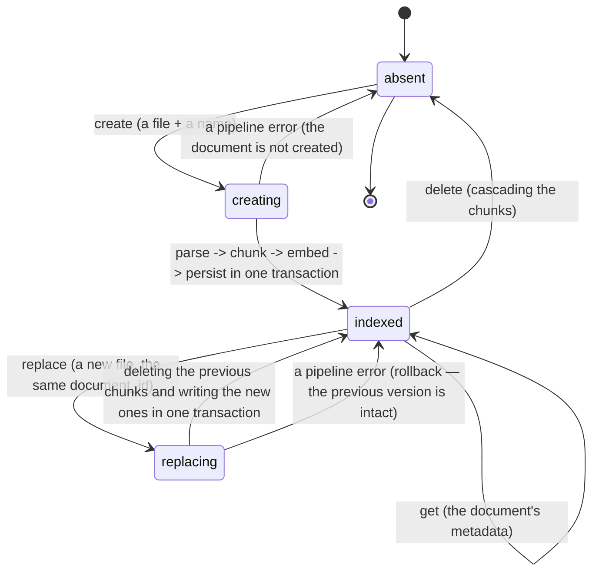
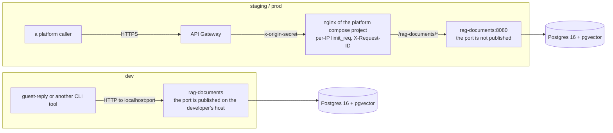
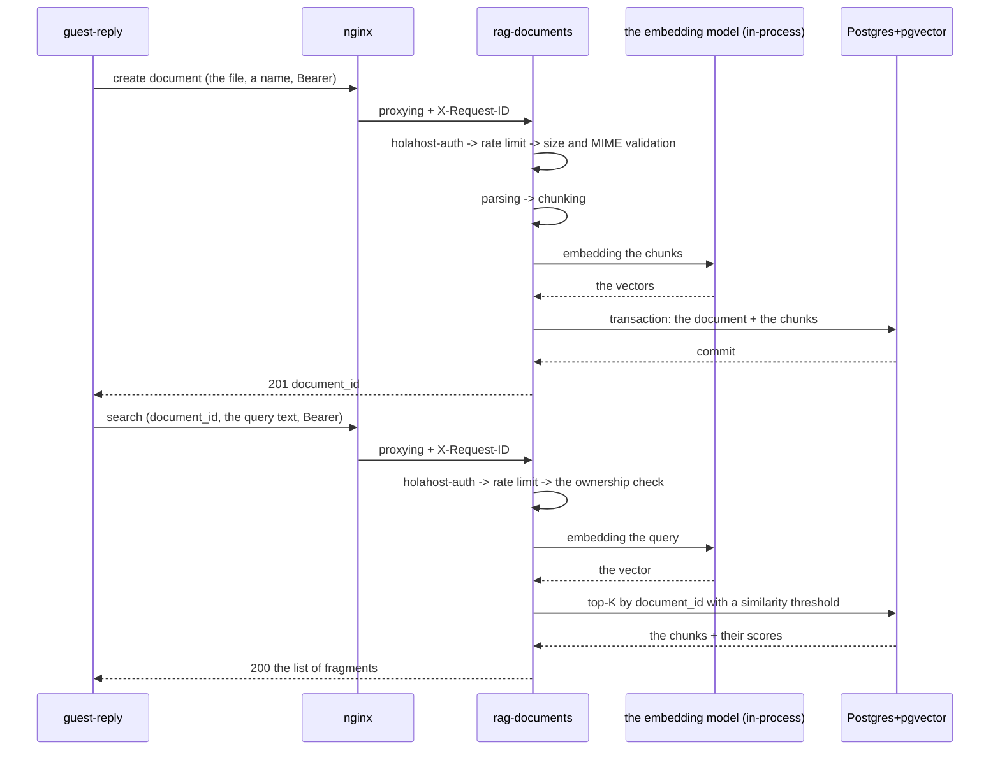

# rag-documents — technical specification of the microservice

> A **Resource Service** of the Holahost platform (see `holahost/docs/holahost_frame.md`). It owns the
> **Document + Chunk** domain.
>
> **Path convention:** `backend/…`, `infra/…`, `docs/…` are relative to the service's root
> (`holahost/services/rag-documents/`); "the repository root" means the root of the monorepo.
>
> **Self-containedness:** this document reads without the specifications of other services.
> Everything shared platform-wide is in the framework specification, and that is what is referenced.
>
> **Dynamic sections** at the end of the document: "Deferred decisions", "Extensions", "Draft ADRs".

---

## Stage 1. Problem Statement + Opportunity Brief + User journey map

### 1.1 Problem Statement

The reason to build this: any Holahost product that answers a guest or prompts a host needs facts
about a specific property — Wi-Fi, check-in, parking, house rules, the neighbourhood. Those facts live
in the host's documents (PDF/DOCX/MD/TXT).

### 1.2 Opportunity Brief

We are building a Resource Service with one resource — `Document`, and its derived `Chunk`s — and one
substantive operation: "given a query text, return the top-K relevant fragments of a document".
Inside: parsing the supported formats, token-aware chunking, a local embedding model (there is no
external provider) and vector search in Postgres. Outward: no LLM, no prompts, no product logic — the
service does not know who is searching or why. That removes the pain once and for every consumer: the
pipeline is implemented in one place, the embedding model and the chunking parameters change in one
place, and the rights over a document are checked in one place.

How it joins the product: `rag-documents` is Holahost's first Resource Service. Together with
`llm-client` and the `guest-reply` CLI it forms the platform's first vertical slice, on which the
framework specification's topology is checked: the `backbone` network, offline JWT validation, layered
rate limiting, independent deployment of a service. This specification's scope additionally includes
the shared `holahost-auth` library — the offline JWT validation middleware, built here in the minimum
necessary form and consumed by `llm-client` (ADR A-5).

**The iteration's success criterion** (an infrastructure service has no product metrics — recorded
deliberately): `guest-reply ask --file <guidebook> "<guest message>"` works end to end against the
local dev stack, while updating `rag-documents` does not touch `llm-client`. The technical metrics —
what exactly is measured in the code and the infrastructure — are settled in **Stage 8**.

### 1.3 User journey map

The service has no direct human users. The actor is a calling client with an s2s token; in this
iteration the only client is the `guest-reply` CLI, and the future ones are Orchestration Services and
the frontend. The map is the `Document` resource's lifecycle.

#### 1.3.1 State machine of the `Document` resource



Ingest is **synchronous**: the `indexed` state is reached within the same HTTP request, and no
intermediate `pending` exists on the outside (draft ADR A-1). Replacement is **a separate atomic
operation of the service** (draft ADR A-6): the `document_id` is preserved while the content and the
chunks are replaced whole; there are no observable intermediate states — a caller sees either the
previous version or the new one.

#### 1.3.2 Transitions and events

| State | Event | Next state | What the caller sees |
|---|---|---|---|
| `absent` | create: a valid file | `indexed` | 201 + `document_id` |
| `absent` | create: the MIME type is outside the whitelist | `absent` | 415 `UnsupportedMediaTypeError` |
| `absent` | create: the size exceeds the limit | `absent` | 413 `UploadTooLargeError` |
| `absent` | create: no text after parsing | `absent` | 422 `EmptyDocumentError` |
| `absent` | create: more chunks than the limit | `absent` | 422 `TooManyChunksError` |
| `indexed` | replace: a valid file | `indexed` (the new content) | 200 + the same `document_id` |
| `indexed` | replace: any validation or pipeline error | `indexed` (the previous content) | the same code `create` would give for that error |
| `indexed` | search: there are chunks above the threshold | `indexed` | 200 + the top-K |
| `indexed` | search: there are no chunks above the threshold | `indexed` | 200 + an empty list |
| `indexed` | get | `indexed` | 200 + the metadata |
| `indexed` | delete | `absent` | 204 (idempotent) |
| `indexed` | any operation with another `sub` | unchanged | 404 (the existence of someone else's document is not disclosed) |
| `absent` | search/get/delete by an unknown id | `absent` | 404 `NotFoundError` |
| any | no JWT, an invalid one, or the wrong `aud` | unchanged | 401 |
| any | the token is valid, the rights are not there | unchanged | 403 |
| any | the per-service rate limit was exceeded | unchanged | 429 + `Retry-After` |

The concrete limit values, the similarity threshold and K are Stage 3. The full error contract and the
error body's format are Stage 7.

#### 1.3.3 Ownership and visibility

A document's owner is the `sub` from the token (for an s2s client `sub == client_id`, see the
framework specification, "Claims"). In this iteration the **owner-only** rule applies: only the owner
can see, search and delete a document, and local grants to other subjects are not introduced. One
owner may have several documents; a search runs **against a single `document_id`** — multi-document
search is not provided for.

#### 1.3.4 Entry points

| Caller | Token | Operations | In this iteration |
|---|---|---|---|
| the `guest-reply` CLI | s2s, `client_credentials` | create / search / get / delete | yes |
| an Orchestration Service (e.g. a chat assistant) | s2s or exchanged (on-behalf-of-user) | search | no (an extension point) |
| the frontend directly from a browser | a user token | create / get / delete | no (the platform-wide extension S-4) |

---

## Stage 2. User Stories + Acceptance Criteria

The roles:
- **Owner** — the token's subject (`sub`) on whose behalf a document was created; in this iteration
  that is the `guest-reply-cli` s2s client, and in future an Orchestration Service or a frontend user.
- **Consumer** — the caller performing a search. In this iteration it coincides with the Owner (the
  owner-only rule, §1.3.3).
- **Operator** — whoever deploys the service and checks that it works.

The acceptance criteria reference parameters by symbolic name; the values are fixed in Stage 3.

### 2.0 Parameter table

| Parameter | Purpose |
|---|---|
| `ALLOWED_MIME_TYPES` | the whitelist of formats for an uploaded file |
| `MAX_UPLOAD_SIZE` | the maximum file size |
| `MAX_DOCUMENT_NAME_LENGTH` | the maximum length of a document's display name |
| `MIN_EXTRACTED_TEXT_CHARS` | the minimum text extracted after parsing |
| `MAX_PARSED_TEXT_LENGTH` | the maximum length of the text after parsing |
| `CHUNK_WINDOW_TOKENS`, `CHUNK_OVERLAP_TOKENS` | the chunking window and overlap, in the model's tokens |
| `MAX_CHUNKS_PER_DOCUMENT` | the maximum number of chunks per document |
| `EMBEDDING_MODEL`, `EMBEDDING_DIM` | the embedding model and the vector's dimensionality |
| `SEARCH_TOP_K` | how many chunks a search returns |
| `SIMILARITY_THRESHOLD` | the minimum similarity below which a chunk is not returned |
| `MAX_QUERY_LENGTH` | the maximum length of a search query |
| `INGESTION_P95_BUDGET` | the target p95 of the time from request to `indexed` |
| `SEARCH_P95_BUDGET` | the target p95 of search time |
| `RATE_LIMIT_DEFAULT` | the per-service limit per `client_id`+`sub` pair |
| `JWT_CLOCK_SKEW` | the clock-skew allowance when checking `exp`/`iat` |
| `code` | an error's identity — the exception class's name; the contract and the body are Stage 7 |

### US-R01: Creating a document

> As an Owner, I want to upload a file and get it indexed in one call, so that it becomes searchable immediately.

**AC:**
- The request takes a file and a display name; on success, `201` and a `document_id`.
- The created document's owner is recorded as the `sub` from the token; the owner cannot be passed in
  the request — there is no such field in the contract.
- A file whose MIME type is outside `ALLOWED_MIME_TYPES` → `415 UnsupportedMediaTypeError`, with the
  supported formats listed in the message.
- A file larger than `MAX_UPLOAD_SIZE` → `413 UploadTooLargeError`, with the actual limit in `details`.
- An empty name, or one longer than `MAX_DOCUMENT_NAME_LENGTH` → `422 InvalidPayloadError` naming the
  field.
- Fewer than `MIN_EXTRACTED_TEXT_CHARS` extracted → `422 EmptyDocumentError`.
- Text longer than `MAX_PARSED_TEXT_LENGTH` after parsing → `422 ParsedTextTooLargeError` stating the
  limit.
- More than `MAX_CHUNKS_PER_DOCUMENT` chunks produced → `422 TooManyChunksError`, with the limit and
  the actual number in `details`.
- On any pipeline error, neither the document nor the chunks stay in the database: a later `get` by a
  `document_id` from an unsuccessful response is impossible (no id was issued), and the owner's
  document count is unchanged.
- A successful response is returned only after every chunk has been written: an immediate search by
  the returned `document_id` finds the content (there is no intermediate state on the outside).
- The time from request to response is within `INGESTION_P95_BUDGET` (p95) for a file at the upper
  bound of `MAX_UPLOAD_SIZE`.
- Chunks are cut with a `CHUNK_WINDOW_TOKENS` window and `CHUNK_OVERLAP_TOKENS` overlap, measured by
  `EMBEDDING_MODEL`'s tokenizer; a chunk does not exceed the model's maximum input length, or the
  embedder would silently truncate the text.
- For a PDF a chunk does not cross a page boundary and keeps its page number; for formats without
  pages the number is empty.
- Every chunk is stored with an L2-normalized vector of dimensionality `EMBEDDING_DIM`.

### US-R02: Atomic replacement of a document

> As an Owner, I want to replace a document's content in one call, so that consumers never observe a gap or a half-indexed state.

**AC:**
- The replacement is performed against an existing `document_id`; on success, `200`, and the
  `document_id` does not change.
- All the document's previous chunks are replaced by new ones; none from the previous version remain
  (the document's chunk count equals the number produced from the new file).
- A search running concurrently with a replacement returns either only the old chunks or only the new
  ones — a mixture of versions is not permissible.
- Any validation or pipeline error (the same codes as in US-R01) leaves the previous version
  untouched: a later search returns the old content.
- Replacing a document that belongs to someone else, or does not exist → `404 NotFoundError`.
- The document's name is updated if one was passed; otherwise the previous one is kept.
- The replacement time is within `INGESTION_P95_BUDGET` (p95).

### US-R03: Searching for relevant fragments

> As a Consumer, I want the top-K relevant chunks of a document for a query text, so that I can build a grounded prompt without knowing how retrieval works.

**AC:**
- The request takes a `document_id` and a query text; the response is a list of chunks sorted by
  descending similarity.
- At most `SEARCH_TOP_K` chunks are returned; chunks with a similarity below `SIMILARITY_THRESHOLD`
  are not returned.
- If there are no suitable chunks — `200` with an empty list, not an error.
- Every element of the response carries the chunk's text, its similarity score and its provenance (the
  page number, where known).
- A query longer than `MAX_QUERY_LENGTH` → `422 InvalidPayloadError`.
- An empty query → `422 InvalidPayloadError`.
- A search against someone else's `document_id`, or one that does not exist → `404 NotFoundError`.
- A search does not change the document's state: an identical repeat request gives an identical
  answer.
- Similarity is cosine over L2-normalized vectors; the query is embedded by the same `EMBEDDING_MODEL`
  as the chunks.
- The response time is within `SEARCH_P95_BUDGET` (p95).
- Grounding (a regression guard on retrieval): for a document with a unique sentinel fact, a query
  about that fact returns a chunk containing the sentinel.

### US-R04: A document's metadata

> As an Owner, I want to read a document's metadata, so that I can confirm what is stored without downloading it.

**AC:**
- The response contains the `document_id`, the name, the chunk count, the creation time and the time
  of the last change.
- Neither the source file nor the document's full text is returned (the service is not a file store).
- A document that belongs to someone else, or does not exist → `404 NotFoundError`.

### US-R05: Deleting a document

> As an Owner, I want to delete a document, so that its content stops being retrievable.

**AC:**
- A successful deletion → `204`; the chunks are deleted along with the document.
- A later search or `get` by that `document_id` → `404 NotFoundError`.
- Deleting the same `document_id` again → `404` (the operation is idempotent by observable effect: the
  document is not there).
- Deleting someone else's document → `404`, and that document stays untouched.

### US-R06: Isolation between owners

> As an Owner, I want other subjects to be unable to see or touch my documents, so that a shared service does not leak my data.

**AC:**
- Any operation (`get`, `search`, `replace`, `delete`) on a document whose `owner` ≠ the calling
  token's `sub` → `404 NotFoundError`; `403` is not used in that case, and the existence of someone
  else's document is not disclosed.
- The owner is determined solely from the token; a header or body field setting the owner is absent
  from the contract and is ignored if sent.
- A list of documents, if implemented, contains only the documents of the calling `sub`.

### US-R07: Authentication and authorization

> As an Operator, I want every route except health to require a valid token, so that the service is safe to expose behind the platform gateway.

**AC:**
- The `holahost-auth` middleware (a shared library, ADR A-5) is mounted on every route except
  `GET /api/rag-documents/health`.
- A missing `Authorization` header, or a scheme other than `Bearer` → `401`.
- A JWT that does not parse, an `alg` other than the expected one (notably `none` and HS*), or an
  invalid signature → `401`; the expected `alg` comes from the service's config, not from the token.
- An expired `exp` (with the `JWT_CLOCK_SKEW` allowance), a foreign `iss`, or an `aud` without
  `rag-documents` → `401`.
- An unknown `kid` triggers one JWKS re-fetch; if the key is still not found after it → `401`.
- A `401` body does not carry the reason for the refusal; the reason goes to the log.
- `403` is returned only when the token is valid but the rights for the operation are absent.
- Validation never reaches `auth`, except for the JWKS re-fetch.
- `GET /api/rag-documents/health` answers without a token.

### US-R08: Rate limiting

> As an Operator, I want per-caller limits inside the service, so that one client cannot exhaust it.

**AC:**
- The limit is applied after `holahost-auth` and before the handler; the key is the `client_id`+`sub`
  pair from the token.
- Exceeding it → `429` with a `Retry-After` header.
- The defaults are `RATE_LIMIT_DEFAULT`; an override per `client_id` is set by the service's config.
- After a container restart the current window's counter starts again (a consequence of A-8).

### US-R09: The error contract

> As a Consumer, I want a single machine-readable error shape, so that I can react without parsing prose.

**AC:**
- Any error's body is `{ error: { code, message, details } }`; `code` is the error's identity from the
  service's contract.
- The same error class always returns the same `code` and the same set of fields in `details`.
- An error message contains no stack trace, no file paths and no document content.
- Every error in the contract has retry semantics attached (retry / do not retry) — Stage 7.

### US-R10: Health and smoke

> As an Operator, I want a health endpoint, so that deploys can be verified automatically.

**AC:**
- `GET /api/rag-documents/health` is reachable without authorization and answers `200` when the
  service is ready to take requests. It is under the service's base path, like every other route (the
  framework specification): the gateway does not rewrite the path, so a bare `/health` is unreachable
  from outside and the deploy's smoke check would never get to it.
- The response confirms that the database is reachable and the embedding model is loaded; either of
  them not being ready → a non-`200`.
- The container listens on port 8080 and is attached to the `backbone` network; the port is not
  published outside.

### US-R11: Logs without sensitive data

> As an Operator, I want logs that never contain document content, so that observability does not become a data leak.

**AC:**
- What never reaches the logs: the document's text, the chunks' text, the search query's text, a
  token's body.
- What does reach the logs: `X-Request-ID`, `client_id`, `sub`, `document_id`, error codes, the stage
  durations, the chunk count.
- The incoming request's `X-Request-ID` is logged and propagated into every outgoing call.
- The logs are structured (JSON) and the set of fields is governed by an allowlist.

### 2.12 Coverage of the user journey map (§1.3)

| Transition on the map | Covered by |
|---|---|
| `absent → creating → indexed` (create) | US-R01 |
| `creating → absent` (a pipeline error) | US-R01 |
| `indexed → replacing → indexed` (replace, success and error) | US-R02 |
| `indexed → indexed` (search) | US-R03 |
| `indexed → indexed` (get) | US-R04 |
| `indexed → absent` (delete) | US-R05 |
| Operations with another `sub` → 404 | US-R06 |
| 401 / 403 on any operation | US-R07 |
| 429 on any operation | US-R08 |
| Every error branch | US-R09 |

---

## Stage 3. Tech Constraints Doc

### 3.1 System architecture

A self-contained deploy unit per the framework specification: the application container plus a
Postgres container in its own compose project, on the `backbone` network (external). It is deployed to
every platform environment (dev / staging / prod, Stage 11), but the entry path differs.



| Environment | Entry | Who calls |
|---|---|---|
| staging / prod | API Gateway → the platform compose project's nginx → service:8080 (the port is not published) | the platform's services |
| dev | straight to the container's published port, with no gateway and no nginx | a developer's CLI tools |

The service behaves **identically** in both paths and compensates for the absent perimeter in no way:
it has no branching on environment, generates no missing headers, and holds no fallback checks.
`X-Request-ID` is set by the caller — nginx on staging and prod, a CLI tool on dev (a thin dev
orchestrator). `x-origin-secret` and the per-IP `limit_req` are simply absent on dev; the service's
protection is the same in both paths — offline JWT validation and its own per-caller limit (US-R07,
US-R08).

The service makes no inter-service calls: it calls nobody, it is called. The only possible outgoing
request is a JWKS re-fetch on an unknown `kid`.

| Component | Choice | Purpose |
|---|---|---|
| Application | a Python 3.12 container, uvicorn, port 8080 | the service's HTTP API |
| Database | `pgvector/pgvector:pg16`, a container in the service's compose project, with a named volume | documents, chunks, vectors |
| Embedding model | loaded into memory at process start | embedding on ingest and on search |
| Entry | the platform compose project's nginx (`/rag-documents/*`) | checking `x-origin-secret`, the per-IP `limit_req`, setting `X-Request-ID` |
| Tokens | the dev minter (ADR C-4), with JWKS cached in the process | offline JWT validation |

### 3.2 Code architecture

Clean architecture, with the layers and import rules enforced by `import-linter`, contract
`layers = ["interface", "infrastructure", "application", "domain"]`, `config` as a leaf exception and
`scripts/` outside the contract. The interface adapter is FastAPI.

```
backend/
  app/
    config/                 # typed settings, logging
    domain/
      entities/             # identifiable objects with a lifecycle
      value_objects/        # frozen dataclasses with invariants, and ID classes
      exceptions.py
    application/
      dto/                  # use-case commands and results, primitives only
      ports/                # Protocols for external dependencies, by group: parsing and chunking,
                            # embeddings, vector search, repositories, rate limit, unit of work
      use_cases/            # orchestration on top of the ports
      exceptions/
    infrastructure/
      db/                   # SQLAlchemy Core, repositories, UoW, migrations
      embedding/            # fastembed
      vector/               # pgvector queries
      ingestion/            # pymupdf / python-docx / plain-text parsers, the chunker
    interface/
      http/                 # FastAPI: the router, request/response schemas, middleware, the error handler
    scripts/                # the composition root: assembling the Container, bootstrap
```

Dependencies are injected into a use case's constructor as Protocol types from `application/ports/`;
the concrete implementations are assembled in `scripts/` once at process start (the embedding model
and the connection pool live as long as the process does).

Not everything in this tree belongs to the service. `config/logging.py` declares only the service's own
event fields; `application/ports/{exceptions,uow}.py` re-export platform types; `infrastructure/db/`
holds the schema, the repository and one local `engine.py` (the same engine factory plus the `pgvector`
codec), while the UoW, the translation of driver errors and RLS binding come from `holahost-db`;
`interface/http/errors.py` is a status table rather than a handler. What lives where is in the
framework specification, "Reusable shared entities".

### 3.3 Domain modelling

Lightweight DDD: `domain/entities/` with the `create()` and `from_repo()` factory methods,
`domain/value_objects/` as frozen dataclasses with invariants in `__post_init__`, and ID classes over
`uuid.UUID` with `new()`/`from_str()`. Domain services, aggregates and factories are not used;
repositories are Protocols in `application/ports/`, not in `domain/`. There are no `Clock` or
`IdGenerator` ports: `datetime.now(tz=UTC)` inline, and identifiers are self-generating.

### 3.4 Technology stack

| Layer | Choice |
|---|---|
| Language | Python 3.12 |
| HTTP | FastAPI + uvicorn (one worker), with **synchronous** `def` endpoints |
| Concurrency model | sync handlers run in a threadpool; a database write occupies a pool thread rather than the event loop; no async stack is introduced — ADR A-9 |
| Chunking | the `langchain` stack is used throughout: here `langchain-text-splitters`, while the chat models of the same stack live in `llm-client` |
| Database | Postgres 16 with the `pgvector` extension |
| Database access | SQLAlchemy Core 2.0 over `psycopg[binary,pool]` (psycopg 3); no ORM |
| Migrations | Alembic (DDL from the same `MetaData`) |
| Embeddings | `fastembed` (onnxruntime), the `paraphrase-multilingual-MiniLM-L12-v2` model, 384 dimensions |
| Chunking | `RecursiveCharacterTextSplitter` (`langchain-text-splitters`), with the same model's tokenizer as the `length_function` |
| Parsers | `pymupdf` (PDF), `python-docx` (DOCX), `bytes.decode("utf-8")` (MD/TXT) |
| Validation | Pydantic v2 |
| Authorization | the shared `holahost-auth` library (ADR A-5) |
| The platform's shared libraries | `holahost-observability` (the JSON logger and the allowlist), `holahost-http` (the error envelope, the edge's middleware and their assembly, the exception handler), `holahost-auth` (JWT validation and its config, which reads the environment itself), `holahost-db` (the storage-failure contract, the UoW, the Postgres settings, RLS, role provisioning) — framework specification, "Reusable shared entities" |
| Tests | pytest, with fakes for the ports |
| Logs | structured JSON on stdout, with a field allowlist |

### 3.5 Data storage and lifecycle

| Data | Where | Lifecycle |
|---|---|---|
| A document's metadata | Postgres | until an explicit `delete`; there is no TTL |
| Chunks and vectors | Postgres, a `vector(384)` column | together with the document, by cascade |
| The source file | **not stored** | it lives for the duration of the request and is discarded after the response; the upload's body is meanwhile spooled into an anonymous temporary file (§3.8, "Parsing") |
| Rate-limit counters | process memory | until a restart (US-R08) |
| The JWKS cache | process memory | until a restart, or an unknown `kid` |

The source file is deliberately not kept: the service is an index, not a file store. The consequence
is that reindexing after a change of embedding model requires the owner to upload the files again;
that is accepted and will become the responsibility of the asynchronous extension.

### 3.6 Vector search

An ANN index (HNSW/IVFFlat) is **not created** — ADR A-7. The search: a btree index on
`chunks(document_id)` narrows the set to one document's chunks (at most
`MAX_CHUNKS_PER_DOCUMENT`), and exact cosine distance is computed within it by a `pgvector` operator.
Recall is 100 %, the query plan is predictable, and there are no index parameters to tune.

### 3.7 Domain parameters and limits (numbers)

| Parameter | Value | Rationale |
|---|---|---|
| `ALLOWED_MIME_TYPES` | `application/pdf`, `application/vnd.openxmlformats-officedocument.wordprocessingml.document`, `text/markdown`, `text/plain` | the formats a parser exists for; no OCR is applied |
| `MAX_UPLOAD_SIZE` | 8 MiB | nginx's `client_max_body_size` is set to the same value; below the API Gateway's payload ceiling |
| `MAX_DOCUMENT_NAME_LENGTH` | 200 characters | a display name, not an identifier |
| `MIN_EXTRACTED_TEXT_CHARS` | 200 | cuts off empty and image-only PDFs |
| `MAX_PARSED_TEXT_LENGTH` | 200,000 characters | together with the chunking window this gives ≈500 chunks — the upper end that fits the ingest budget |
| `CHUNK_WINDOW_TOKENS` | 120 | must be ≤ 128, MiniLM-L12's maximum input, or the embedder silently truncates the chunk |
| `CHUNK_OVERLAP_TOKENS` | 16 | preserves the context at a window boundary |
| `MAX_CHUNKS_PER_DOCUMENT` | 500 | the ceiling on ingest time and on the volume searched per document |
| `EMBEDDING_MODEL` | `sentence-transformers/paraphrase-multilingual-MiniLM-L12-v2` | multilingual (guidebooks are not only in English), 384 dimensions, runs on CPU; the fully-qualified name is mandatory — `fastembed`'s model registry rejects the short one |
| `EMBEDDING_DIM` | 384 | the model's dimensionality |
| `SEARCH_TOP_K` | 5 | as many fragments as fit a caller's prompt without crowding out the instruction |
| `SIMILARITY_THRESHOLD` | 0.30 (cosine) | a starting value, calibrated on real guidebooks; set by config rather than in code |
| `MAX_QUERY_LENGTH` | 4000 characters | the length of a guest message from which a query is built |
| `INGESTION_P95_BUDGET` | 20 s | headroom under the synchronous integration ceiling (30 s). The figure is derived from the ceiling rather than measured: at 500 chunks it is ~0.04 s per chunk for parsing plus embedding. The budget is to be measured at first implementation; if the measurement does not fit, `MAX_CHUNKS_PER_DOCUMENT` is lowered rather than the budget raised — the integration ceiling does not move. The need for files that do not fit this budget is served by extension E-1, not by loosening the limits |
| `SEARCH_P95_BUDGET` | 500 ms | embedding the query plus one database query |
| `RATE_LIMIT_DEFAULT` (search/get) | 600 req/hour per `client_id`+`sub` pair | the default from the framework specification |
| `RATE_LIMIT_INGEST` (create/replace) | 60 req/hour on the same pair | ingest is two orders of magnitude more expensive than search |
| `JWT_CLOCK_SKEW` | 30 s | from the framework specification |
| Database query timeout | 5 s | keeps a hung query from holding a worker |

A constraint on replicas: the limit counters live in process memory, so the service is designed for **a
single instance**; when it is scaled, the limit is either divided by N or moved to shared storage
(US-R08).

### 3.8 Security

| Aspect | Decision |
|---|---|
| Authentication | JWT offline through `holahost-auth` on every route except `GET /api/rag-documents/health`; a fixed `alg` from the config |
| Authorization | owner-only by `sub`; someone else's resource → `404`, and its existence is not disclosed |
| Database roles | two, and this is a precondition for isolation working at all: the database container's **bootstrap superuser** (created by initdb, applies the migrations, owns the tables) and the **application role** (created by the deploy's provisioning step as `NOSUPERUSER NOBYPASSRLS`, granted DML only, owning no tables). Owner isolation rests entirely on RLS, which a superuser bypasses unconditionally — if the application connects as a superuser there is no isolation on any route. The application refuses to start if its role can bypass RLS |
| Secrets (dev) | both database passwords — the application role's and the bootstrap superuser's — come from the dev environment's `.env`; only `.env.example` reaches git |
| Secrets (staging / prod) | AWS Secrets Manager, **two** secrets: `db-password` (the application role) and `db-superuser-password` (the database container's bootstrap superuser). They are created by the service's own Terraform root (framework specification, "A microservice's infrastructure and CI/CD") with values filled in by hand once; they are not baked into the image and are not stored in the compose file's env. The values are required to differ — see "Database roles" above. Rotating `db-password` completes on the **next rollout**, not on a restart: the role's password is changed by the provisioning step, while the postgres image sets it only at initdb |
| Input | the body size is bounded by nginx and re-checked by the application; the MIME type is determined from the content rather than from the client's header |
| Parsing | no external utilities are invoked; no OCR and no execution of embedded content. The source is not stored as an artefact (A-10): no bucket, no column, no path — after the response it is unreachable. The application does not, and cannot, guarantee that plaintext never touches disk: Starlette spools an upload's body into an anonymous temporary file (no name in the filesystem, with the blocks freed by the kernel when the descriptor closes, including on a process crash), and whatever sits in process memory can reach disk through swap or a core dump. That is a set of host properties — no swap, dumps disabled, an encrypted volume — and it is settled where the instance is defined |
| SQL | parameterised SQLAlchemy Core queries only; there is no SQL concatenation |
| Responses | errors carry no stack trace, no paths and no document content; `401` carries no reason |
| CORS | not configured: in this iteration no browser reaches the service — the frontend works through an Orchestration Service. That is a constraint of the iteration rather than a prohibition; direct browser access is the platform-wide extension S-4, and it requires an edit to the framework specification's `auth` client registry |
| Prompt injection | not applicable: the service does not call an LLM, and a document's content is handed out as data |

### 3.9 Out of scope for this iteration

- Asynchronous indexing, a queue, a worker (described as an extension below).
- Multi-document search and an ANN index.
- Local grants and access by a non-owner.
- Storing source files and serving them back.
- OCR and image-only PDFs; extracting text from DOCX tables.
- Hybrid search (BM25 + vector) and a reranker.
- Versioning documents and a change history.
- Multi-tenancy beyond owner-only, and quotas per owner.

### 3.10 Happy path at component level



---

## Stage 4. Domain Entities

The values of the parameters the invariants reference are in §3.7.

### 4.1 Value objects

| VO | Based on | Invariants |
|---|---|---|
| `DocumentId` | `uuid.UUID` | generated by its own `new()`, parsed from a string; never assigned from outside |
| `ChunkId` | `uuid.UUID` | the same |
| `OwnerSubject` | `str` | non-empty after `strip`; taken from the token's `sub` and never from the request body; compared for exact equality |
| `DocumentName` | `str` | 1…`MAX_DOCUMENT_NAME_LENGTH` characters after `strip`; control characters are forbidden |
| `MimeType` | `str` | only a value from `ALLOWED_MIME_TYPES` |
| `ChunkIndex` | `int` | ≥ 0; unique within a document and without gaps |
| `PageNumber` | `int \| None` | if set, ≥ 1; `None` for formats without pages |
| `Embedding` | `tuple[float, ...]` | length = `EMBEDDING_DIM`; every value finite (no `NaN`/`inf`); L2 norm = 1 within a tolerance of 1e-6 |

Normalising an `Embedding` is an invariant rather than an operation for the caller: the constructor
accepts an already-normalized vector and rejects the rest, so cosine in a search reduces to a dot
product and "forgetting to normalise" is impossible.

`TextFragment` and `SimilarityScore` are not on this list — both turned out to belong to the
application layer rather than the domain. The test is simple: does the value become a field of
`Document` or `Chunk`? Neither does: `TextFragment (text, page)` only carries data through the
pipeline between `FileParser` and `TextChunker` (§8.0), and `Chunk` stores `text` and `page` as
separate fields rather than as a nested `TextFragment`; `SimilarityScore` is explicitly not a field of
an entity (§4.4). Both are defined in `application/ports/` next to their ports.

### 4.2 `Document`

| Field | Type | Note |
|---|---|---|
| `id` | `DocumentId` | |
| `owner` | `OwnerSubject` | assigned at creation |
| `name` | `DocumentName` | the only mutable field |
| `mime_type` | `MimeType` | the source file's format; the file itself is not stored |
| `chunk_count` | `int` | 1…`MAX_CHUNKS_PER_DOCUMENT` |
| `created_at` | `datetime` (UTC, aware) | |
| `updated_at` | `datetime` (UTC, aware) | ≥ `created_at` |

**Invariants:** `owner` is immutable after creation — transferring ownership is not provided for in
this iteration; `chunk_count` ≥ 1, meaning a document with no chunks does not exist as a state (an
empty document is rejected at the parsing stage rather than created and deleted); `updated_at` changes
on a content replacement and on a rename.

**Lifecycle:** created together with its full set of chunks in one transaction, replaced whole with
the `id` preserved, and deleted together with its chunks; no intermediate states exist on the outside
(§1.3.1).

### 4.3 `Chunk`

`Chunk` is a subordinate entity of the `Document` aggregate (§4.2): it has no repository of its own,
and it is created and replaced only together with the document, by one operation (§8.0,
`DocumentsRepo`). The constraint is structural rather than by convention: `Chunk` is immutable and
lives only together with its document (see the Lifecycle below).

| Field | Type | Note |
|---|---|---|
| `id` | `ChunkId` | |
| `document_id` | `DocumentId` | |
| `index` | `ChunkIndex` | the order within the document |
| `text` | `str` | a fragment of the source text |
| `embedding` | `Embedding` | that fragment's vector |
| `page` | `PageNumber` | provenance: the source's page, or `None` |

**Invariants:** `text` is non-empty after `strip`; the length of `text` in the model's tokens is ≤
`CHUNK_WINDOW_TOKENS` — otherwise the embedder silently truncates the fragment and the vector stops
corresponding to the text; a chunk does not cross a page boundary, so `page` is unambiguous;
`embedding` corresponds to exactly this `text`.

**Lifecycle:** immutable — it is born and dies only together with its document, and there is no
separate operation to change a chunk.

### 4.4 What is not an entity

`SearchQuery` and a search's result are not modelled as domain entities: a query has neither identity
nor a lifecycle, and it lives inside one call. A similarity score (`SimilarityScore`, in the
application layer — see §4.1) belongs to the query-chunk pair rather than to the chunk, and it is
returned alongside it without becoming one of its fields.

---

## Stage 5. Use Cases

There is a single actor everywhere — the calling client with an s2s token; in the input it is
represented by the token subject, which comes from the middleware rather than from the request body.
At a use case's boundary there are only primitives and bytes; the VOs and entities from §4 live
inside.

### UC-R1. Create a document

- **Actor:** Owner
- **Input:** `owner: str`, `name: str`, `content: bytes`, `mime_type: str`
- **Output:** `DocumentView` — the document's representation (identifier, name, format, chunk count,
  creation and modification time); the same for creation, replacement and reading
- **Flow:** checks the size and the MIME type, parses the content into text with page provenance,
  cuts it into chunks with the model's tokenizer, computes the embeddings, then writes the document
  and all its chunks in a single transaction. Any error before the commit leaves the storage
  untouched.

### UC-R2. Replace a document

- **Actor:** Owner
- **Input:** `document_id: str`, `owner: str`, `content: bytes`, `mime_type: str`, `name: str | None`
- **Output:** `DocumentView` with the same identifier
- **Flow:** checks that the document belongs to the owner, runs the same pipeline as creation up to
  the point the transaction opens; inside the transaction it deletes the previous chunks and writes
  the new ones, updating the metadata. `document_id` is preserved, and on an error the previous
  version stays intact.

### UC-R3. Search for fragments

- **Actor:** Consumer
- **Input:** `document_id: str`, `owner: str`, `query: str`
- **Output:** `list[(chunk_id: str, text: str, page: int | None, score: float)]`
- **Flow:** checks that the document belongs to the owner, embeds the query with the same model as
  the chunks, and selects the top K by cosine distance from the storage with a threshold cut-off. An
  empty result is a valid answer, not an error.

### UC-R4. Read a document's metadata

- **Actor:** Owner
- **Input:** `document_id: str`, `owner: str`
- **Output:** `DocumentView`
- **Flow:** checks ownership and returns the representation. Neither the source file nor the chunks'
  text is handed out.

### UC-R5. Delete a document

- **Actor:** Owner
- **Input:** `document_id: str`, `owner: str`
- **Output:** nothing
- **Flow:** checks ownership and deletes the document together with its chunks in a single
  transaction.

In all five, the ownership check gives the same outcome for someone else's document and for a
non-existent one — outwards that is a `404` (US-R06), which is why there is no separate "check
ownership" use case: it is part of each of them.

---

## Stage 6. DB Schema

Postgres 16 with the `vector` extension. Only documents and chunks are persistent: the rate-limit
counters live in the process's memory (A-8), so does the JWKS cache, and source files are not stored
(A-10).

```sql
CREATE EXTENSION IF NOT EXISTS vector;

-- A document: the unit of ownership and the unit of search. The source file is not
-- stored; mime_type remains as a marker of where the text came from.
CREATE TABLE documents (
    id            uuid        PRIMARY KEY,
    owner_subject text        NOT NULL,
    name          text        NOT NULL,
    mime_type     text        NOT NULL,
    chunk_count   integer     NOT NULL,
    created_at    timestamptz NOT NULL,
    updated_at    timestamptz NOT NULL,
    CONSTRAINT documents_name_not_blank      CHECK (btrim(name) <> ''),
    CONSTRAINT documents_chunk_count_positive CHECK (chunk_count >= 1),
    CONSTRAINT documents_updated_not_before  CHECK (updated_at >= created_at)
);

-- A chunk: a fragment of text and its vector. It lives only together with its
-- document and has no modification operations of its own.
CREATE TABLE chunks (
    id          uuid        PRIMARY KEY,
    document_id uuid        NOT NULL REFERENCES documents(id) ON DELETE CASCADE,
    idx         integer     NOT NULL,
    text        text        NOT NULL,
    page        integer,
    embedding   vector(384) NOT NULL,
    CONSTRAINT chunks_idx_non_negative CHECK (idx >= 0),
    CONSTRAINT chunks_text_not_blank   CHECK (btrim(text) <> ''),
    CONSTRAINT chunks_page_positive    CHECK (page IS NULL OR page >= 1),
    CONSTRAINT chunks_document_idx_uniq UNIQUE (document_id, idx)
);

CREATE INDEX idx_documents_owner_subject ON documents (owner_subject);
CREATE INDEX idx_chunks_document_id      ON chunks (document_id);

-- Row-Level Security is the only mechanism of owner isolation (§8.0): the repository
-- does not filter by owner in its own SQL, the binding goes through a transaction-scoped
-- session variable (set_config('app.current_owner', ..., true), set by the adapter
-- before every call). FORCE is mandatory alongside ENABLE — otherwise RLS does not apply
-- to the table's owning role. A superuser connection bypasses RLS unconditionally, and no
-- FORCE closes that — what protects against it is the role the application connects as,
-- not anything in this migration. See §8.0: the environment must keep the DB container's
-- bootstrap superuser and the application role apart, otherwise this policy has no effect
-- anywhere except in the tests.
ALTER TABLE documents ENABLE ROW LEVEL SECURITY;
ALTER TABLE documents FORCE ROW LEVEL SECURITY;
CREATE POLICY owner_isolation ON documents
    USING (owner_subject = current_setting('app.current_owner', true))
    WITH CHECK (owner_subject = current_setting('app.current_owner', true));

-- chunks stores no owner column of its own (it is subordinate to documents, §4.3) — a
-- row's visibility is derived through a subquery against the already filtered documents
-- rather than through a condition of its own.
ALTER TABLE chunks ENABLE ROW LEVEL SECURITY;
ALTER TABLE chunks FORCE ROW LEVEL SECURITY;
CREATE POLICY owner_isolation ON chunks
    USING (document_id IN (SELECT id FROM documents))
    WITH CHECK (document_id IN (SELECT id FROM documents));
```

### 6.1 The decisions behind the schema

| Decision | Why |
|---|---|
| `owner_subject` is `text`, not `uuid` | a token's subject can be either a user (a uuid) or a service (a `client_id` string); coercing the latter to a uuid would mean lying about the type |
| The source file is absent from the schema | A-10; when indexing moves to being asynchronous (E-1) either a `bytea` column or a reference to object storage will appear |
| `chunk_count` is denormalised | a document's metadata is read without a `COUNT(*)` over the chunks; consistency holds because both changes go in one transaction — this is accepted redundancy, not a cache |
| There is no ANN index | A-7: `idx_chunks_document_id` narrows the selection down to one document's chunks, and the exact distance is computed within it. HNSW will arrive together with multi-document search (E-2) |
| `idx_documents_owner_subject` | it is needed not by search (which goes by `document_id`) but by the ownership check and by a future listing of an owner's documents |
| Uniqueness of `(document_id, idx)` | it protects the "chunk order without gaps or duplicates" invariant at the database level, not only in the code |
| FK with `ON DELETE CASCADE` | deleting a document and replacing its content leave no orphaned chunks even if the code has a bug |
| Row-Level Security instead of filtering in the repository code | a guarantee at the database-engine level, independent of whether a particular repository method (existing or future) remembered to filter by owner — a separate `authorize()` port was considered and rejected (it introduces a race between the check and the write), as was an owner parameter on every repository method (it duplicates what RLS already gives) |

### 6.2 How the schema serves the operations

| Operation | What happens in the database |
|---|---|
| Creation | one transaction: `INSERT` of the document + a batch `INSERT` of the chunks |
| Replacement | one transaction: `DELETE FROM chunks WHERE document_id = …` → a batch `INSERT` of the new ones → `UPDATE documents SET name, chunk_count, updated_at`. The previous version is visible to concurrent readers until the commit |
| Search | one query: a filter by `document_id` + ordering by cosine distance + `LIMIT` top K; the similarity threshold cut-off is in the same query |
| Metadata | one `documents` row, the chunks are not read |
| Deletion | `DELETE FROM documents`, the chunks go away by cascade |

Migrations are Alembic, with file names `YYYYMMDD_HHMM_<slug>.py`. The `vector` extension is created
by the first migration rather than by hand when a stand is being set up.

---

## Stage 7. API Contracts

### 7.0 Conventions

| What | Value |
|---|---|
| Base path | `/api/rag-documents` (the segment is the service name, per the framework specification). Declared once and derived from the service name; every router is mounted under it, health included |
| Authorization | `Authorization: Bearer <jwt>` on every route except `GET /api/rag-documents/health`; the contract has no other way of passing secrets |
| Tracing | `X-Request-ID` is an incoming header; it is logged and returned in the response |
| Format | `application/json`, except for upload and replacement (`multipart/form-data`) |
| Identifiers | UUIDs in string form |
| Time | ISO 8601 in UTC (`2026-08-04T10:15:30Z`) |
| Error envelope | `{ "error": { "code": "...", "message": "...", "details": { ... } } }` — the shared platform library |
| Schema | A service's OpenAPI is versioned in its own repository (a requirement of the framework specification) |

### 7.1 The endpoints

| Method and path | Purpose | Use case | Success |
|---|---|---|---|
| `POST /api/rag-documents/documents` | create a document | UC-R1 | `201` |
| `PUT /api/rag-documents/documents/{id}` | replace the content | UC-R2 | `200` |
| `POST /api/rag-documents/documents/{id}/search` | find fragments | UC-R3 | `200` |
| `GET /api/rag-documents/documents/{id}` | metadata | UC-R4 | `200` |
| `DELETE /api/rag-documents/documents/{id}` | delete | UC-R5 | `204` |
| `GET /api/rag-documents/health` | readiness | — | `200` |

Search is a `POST`, not a `GET`: the query text reaches up to `MAX_QUERY_LENGTH` and must end up
neither in the URL nor in a proxy's logs. Replacement is a `PUT` against an existing identifier: the
operation is idempotent in its result and preserves the `id` (A-6).

### 7.2 Creating and replacing a document

```
POST /api/rag-documents/documents
Content-Type: multipart/form-data
  file: <binary>          # required
  name: <string>          # required, 1…MAX_DOCUMENT_NAME_LENGTH

201 Created
{
  "document_id": "8f14e45f-ceea-467a-9f0a-1c2d3e4f5a6b",
  "name": "Apartment guidebook",
  "mime_type": "application/pdf",
  "chunk_count": 128,
  "created_at": "2026-08-04T10:15:30Z",
  "updated_at": "2026-08-04T10:15:30Z"
}
```

```
PUT /api/rag-documents/documents/{id}
Content-Type: multipart/form-data
  file: <binary>          # required
  name: <string>          # optional; when absent the previous name is kept

200 OK
{
  "document_id": "8f14e45f-ceea-467a-9f0a-1c2d3e4f5a6b",
  "name": "Apartment guidebook",
  "mime_type": "application/pdf",
  "chunk_count": 96,
  "created_at": "2026-08-04T10:15:30Z",
  "updated_at": "2026-08-04T11:02:11Z"
}
```

Creation, replacement and reading return **the same document representation** — only the response
code differs, plus the fact that on creation `created_at` equals `updated_at`. There are no separate
truncated response forms: the caller does not have to remember which handle gives back which fields.

The owner is absent from the request body: it is taken from the token's `sub`. The MIME type is
determined from the file's content rather than from the type the client declares; a mismatch is
grounds for a `415`.

### 7.3 Searching for fragments

```
POST /api/rag-documents/documents/{id}/search
{ "query": "what time is check-in?" }

200 OK
{
  "chunks": [
    { "chunk_id": "…", "text": "Check-in from 15:00…", "page": 2, "score": 0.71 },
    { "chunk_id": "…", "text": "…",                     "page": null, "score": 0.44 }
  ]
}
```

The list is sorted by descending `score` and holds at most `SEARCH_TOP_K` elements.

It comes back empty because of `SIMILARITY_THRESHOLD`, not because there are no chunks: a document
always contains at least one (the `chunk_count ≥ 1` invariant), so a pure top-K would always return
the nearest fragments, however irrelevant they were. The threshold cuts off everything below the bar,
and for a question that has nothing to do with the document nothing stays above it. An empty list is
a **"there is no relevant context" signal**, and it is a `200`, not an error: it lets the caller spend
no paid generation and answer honestly "I don't know" instead of hallucinating on top of irrelevant
text.

`page` is `null` for formats without pages. There are no `top_k` or threshold parameters in the
request: they belong to the service, otherwise the caller would start tuning search quality on its
own side.

### 7.4 Metadata and deletion

```
GET /api/rag-documents/documents/{id}

200 OK
{
  "document_id": "…",
  "name": "Apartment guidebook",
  "mime_type": "application/pdf",
  "chunk_count": 128,
  "created_at": "2026-08-04T10:15:30Z",
  "updated_at": "2026-08-04T11:02:11Z"
}
```

```
DELETE /api/rag-documents/documents/{id}

204 No Content
```

Neither the source file nor the chunks' text is handed out through the metadata.

### 7.5 Health

```
GET /api/rag-documents/health          # no authorization

200 OK   { "status": "ok" }
503      { "status": "unavailable" }
```

The database's availability and the embedding model's readiness are checked. The response holds no
detail about the reason for the unavailability — that is in the logs.

### 7.6 The error contract

The contract is fixed by the service: here are the errors it raises. Each is described by two things
and only those — its **identity** and the **shape of its `details`**:

| Identity (`code`) | HTTP | When | `details` | Retry? |
|---|---|---|---|---|
| `InvalidPayloadError` | 422 | an empty or overlong name, an empty or overlong query, a missing field | `field`, `limit` | no |
| `DocumentParseError` | 422 | the file is corrupted or cannot be parsed | — | no |
| `MalformedRequestError` | 422 | a missing `X-Request-ID` | — | no |
| `UnsupportedMediaTypeError` | 415 | a MIME type outside `ALLOWED_MIME_TYPES` | `allowed` | no |
| `UploadTooLargeError` | 413 | the file is larger than `MAX_UPLOAD_SIZE` — the check happens **before** parsing | `limit`, `actual` | no |
| `ParsedTextTooLargeError` | 422 | the text after parsing is longer than `MAX_PARSED_TEXT_LENGTH` | `limit`, `actual` | no |
| `EmptyDocumentError` | 422 | less than `MIN_EXTRACTED_TEXT_CHARS` was extracted | `min_chars` | no |
| `TooManyChunksError` | 422 | there are more chunks than `MAX_CHUNKS_PER_DOCUMENT` | `limit`, `actual` | no |
| `NotFoundError` | 404 | the document does not exist or belongs to another subject | — | no |
| `InternalError` | 500 | everything that is not in this table | — | yes, once |

Separately, there are the **platform responses**. They are produced by the shared edge, they are the
same behind any service of the platform, and they are not part of this service's contract:

| Response | Who | When |
|---|---|---|
| `401` `{"detail": "Unauthorized"}` | `holahost-auth` | the token is absent, damaged or rejected |
| `503` `{"detail": "Service Unavailable"}` | `holahost-auth` | JWKS is unavailable — not an accounts problem |
| `429 RateLimitExceededError` (`retry_after_seconds`) | `holahost-http` | the per-caller limit is exceeded; `Retry-After` is mandatory |
| `413 PayloadTooLargeError` (`limit`, `actual`) | `holahost-http` | the request body is larger than the transport cap — refused before it is read |

`docs/openapi.json` deliberately does not describe them: repeating one and the same fact in every
service's document turns it into N facts that will drift apart. `MalformedRequestError` is not an
exception to that rule but a confirmation of it: it is delivered by the platform's
`RequestIdMiddleware`, but the error itself belongs to the service (its identity and its mute
`details` are declared in `application/exceptions`), which is why it is in the table above and in the
schema.

Three identities from the table — `InvalidPayloadError`, `MalformedRequestError` and `NotFoundError`
— are declared not here but in `holahost-http`: every service of the platform answers with them, with
the same `details` shape. `application/exceptions` re-exports them, so the service still names all of
its errors in one place, and `ERROR_CONTRACT` maps statuses onto them on a par with its own.

**An identity is the class name, verbatim** (`PlatformError.code` returns `type(self).__name__`). It
is not declared next to the class and not transformed: the identity and the shape of `details` are
two halves of one contract, and `details_dict()` already lives on the class, so a separate `code`
string would pull the contract apart into two places that are only equal by hand. A value from a log
greps back to the class that produced it, and renaming a class is a change to the contract: it
produces a diff in `docs/openapi.json` and fails `make openapi-check`.

The only identity without a class behind it is `InternalError`. The absence of a class is deliberate:
introducing a class that is never raised would hint that someone raises it, whereas the meaning is
exactly the opposite — it is the "none of the above" response.

**There are no shared codes: one error, one identity.** The caller assembles the user-facing text out
of `details`, so an identity is obliged to name *which error the service raised*, not the category it
falls into.

**Not part of the contract:**

- **the text (`message`)** — it is for a human reading a log or a response by hand. The caller does
  not parse it and does not show it to the user: what the user sees is assembled from `code` and
  `details`. That is also why it is **not published**: it is there on the wire, but it is in
  `docs/openapi.json` for none of the errors. Declaring it in the schema would invite exactly the
  parsing this point forbids;
- **the HTTP status** — a projection applied by the interface layer (`ERROR_CONTRACT` in
  `interface/http/errors.py`). That is why two errors can answer with the same status, and why
  changing a status is not a change to this section.

`details` is a tagged union and the identity is its tag: the shape depends on which error was raised,
and `details.limit` can only be read by knowing that this error has such a key. Hence the rule:
**one identity always has the same set of keys**, with `null` instead of a missing key (US-R09). So
`InvalidPayloadError` always gives back both `field` and `limit`, where `limit = null` means "this
field has no length limit".

The contract is published by a machine, not by prose: `interface/http/error_schemas.py` describes the
service's own errors as Pydantic models (the platform ones arrive ready-made from
`holahost_http.error_schemas`), the routes declare them in `responses`, and it all goes into
`docs/openapi.json`, which CI diffs (`make openapi-check`). Two declarations of one contract are a
conscious price of layering (the application layer must not depend on serialization), and
`tests/unit/interface/http/test_error_schemas.py` catches them diverging.

FastAPI's generator reads **only a route's signature** — `response_model`, `status_code`,
`responses=`, the parameters and the dependencies; neither exception handlers nor middleware are
visible to it. That is why what the caller is obliged to send itself is declared right there: the
bearer token through `HTTPBearer(auto_error=False)`. The dependency checks nothing: the edge answered
long before its turn comes, and a duplicate gate would stand behind the first one, in a different
order and with a body of its own.

`X-Request-ID` is no less strictly mandatory and is **not published**. It is not the caller's: both
normal entrances set it unconditionally (§3.1) — that is what distinguishes it from the token, which
the caller obtains and presents itself. And publishing it would take away `MalformedRequestError`'s
muteness: that error says nothing about which header was missing precisely because a request without
it arrived by a path it should not have taken — and a schema naming the header would hand such a
caller the one hint it needs.

**What gets published is decided by membership in `ERROR_CONTRACT`.** A class is not there — then it
is not an error of the service, whatever it may be: an unaccounted-for subclass of
`ApplicationError`, a `DomainValidationError`, a `KeyError` from somebody else's library. They all
get a `500 InternalError` with an empty body; the reason goes to the log. That is how the dictionary
stays closed even though Python's space of exceptions is open. A subclass of a published error answers
with the **ancestor's** identity rather than its own: its own is not in the schema.

`InvalidPayloadError` is a `422`, not a `400`: per RFC 9110 §15.5.1 a `400` covers damaged request
syntax or framing, while per RFC 4918 §11.2 (where `422` comes from) that code denotes a
syntactically correct request whose content could not be processed. It matches FastAPI's default
behaviour for `RequestValidationError`. No mapping in this service uses `400` — it is reserved for a
violation of HTTP framing, which the service does not currently produce.

Three errors are raised by the middleware, which answers with them right away, before routing:
`MalformedRequestError`, `PayloadTooLargeError` and `RateLimitExceededError`. They are not in
`ERROR_CONTRACT` — each one's status is given as an argument where the stack is assembled
(`interface/http/app.py`), and a row in the handler's table would be a second source of the same
number. The handler's mechanics are nonetheless platform-level
(`holahost_http.register_error_handlers`); exactly three things belong to this service, and they live
in `interface/http/errors.py`: the table itself, the logger the refusals go to, and the list of types
that answer `500` mutely (here, `DomainValidationError`). Only `MalformedRequestError` is described in
`openapi.json`: the other two are platform responses (the table above), and the service's document
does not repeat them.

`401` and `503` have no code at all — they answer with `{"detail": "..."}` and belong to the shared
authorization library. `401` does not disclose the reason (no help for brute-forcing); that goes to
the log. `503` is an unavailable JWKS: a refusal for every valid token, and returning it as a `401`
would pass off an incident as a wave of bad credentials. This service does not produce `403`:
someone else's resource is a `404` (A-13), which is to say there is no "the token is valid, the rights
are not" path here.

Error messages contain no stack traces, file paths or document content.

---

## Stage 8. Detailed Sequence Flow

### 8.0 Ports

The port types from `application/ports/` are mostly `Protocol`s; `DocumentsRepo`/`VectorSearch` are
`ABC`s (see below for why). The implementations are in `infrastructure/`, the wiring in `scripts/`.

```python
# TextFragment and SimilarityScore belong to the application layer, not to the domain (§4.1):
# neither structure becomes a field of Document/Chunk, they only carry a value between ports
# and pipeline stages.

class TextFragment:
    """Text with page provenance. The same type at both pipeline stages: the output of
    FileParser (a page-sized fragment) and the output of TextChunker (a window-sized
    fragment)."""
    text: str
    page: PageNumber

class FileParser(Protocol):
    def parse(self, content: bytes, mime_type: MimeType) -> list[TextFragment]: ...
    # a page-sized fragment
    # raises: UnsupportedMediaTypeError, DocumentParseError (the file is corrupted or unparsable)

class TextChunker(Protocol):
    def split(self, fragments: list[TextFragment]) -> list[TextFragment]: ...
    # a window-sized fragment; a chunk does not cross a source fragment, so page is preserved
    # raises: —

class EmbeddingModel(Protocol):
    def embed_texts(self, texts: list[str]) -> list[Embedding]: ...
    def embed_query(self, text: str) -> Embedding: ...
    # raises: EmbeddingFailedError
    # concurrency: the implementation must be thread-safe — there is one model per process
    #              and the calls arrive from different pool threads (A-9)

class DocumentsRepo(ABC):
    # The owner is bound once in the constructor, not on every call — authorization is
    # provided by Postgres Row-Level Security (§6), not by filtering inside the repository.
    # The public methods are concrete here, in the ABC itself, and call _bind_owner() (a SET
    # of the current owner for the transaction) before delegating to the _*_impl hook that a
    # concrete adapter implements — the binding cannot be bypassed through the public API.
    # (Alternatives were considered and rejected: a separate authorize() port introduces a
    # TOCTOU between the check and the write; an owner parameter on every method means
    # filtering in the repository code duplicates what RLS already gives.)
    def __init__(self, uow: UnitOfWork, owner: OwnerSubject) -> None: ...

    def add(self, document: Document) -> None: ...
    def get(self, document_id: DocumentId, *, lock: bool = False) -> Document | None: ...
    def update(self, document: Document) -> None: ...
    def delete(self, document_id: DocumentId) -> None: ...
    # add(): document.chunks is mandatory (not None) — Document is an aggregate over Chunk
    #        (§4.3), there is no separate port for chunks, and a document and its chunks are
    #        written by one call.
    # update(): document.chunks is None — the chunks do not change (a rename, say);
    #           list[Chunk] — they are replaced wholesale.
    # get(): the returned Document.chunks is always None — an ordinary read does not need the
    #        chunks' content, only chunk_count.
    # raises: StorageUnavailableError, ConcurrentUpdateError, IntegrityError,
    #         NotFoundError (update/delete: 0 rows affected — RLS makes a non-existent and
    #         someone else's document indistinguishable at the database level, exactly as in
    #         US-R06/A-13)
    # lock: `lock=True` holds the document's row until the end of the transaction. Mandatory for
    #       replacement and deletion: without it two concurrent replacements would mix the chunk
    #       sets — each would delete only what it sees in its own snapshot and then append its
    #       own. Not needed for reading and search: the transaction itself provides snapshot
    #       consistency.

DocumentsRepoFactory = Callable[[OwnerSubject], DocumentsRepo]
# The only way to obtain an owner-bound repository: the owner is known only at request time,
# so a use case takes a factory rather than the repository itself through its constructor.

class SimilarityScore:
    """The cosine similarity of two L2-normalized vectors, in the range [-1, 1]. A value bound
    to the query-chunk pair rather than to the Chunk itself — it does not become its field."""
    value: float

# VectorSearch is Chunk's read side (DocumentsRepo is the write side, the same database):
# cosine similarity is computed by pgvector on the database's side (A-2), which is why the port
# takes a document_id rather than a list of chunks. A port of its own rather than a method on
# DocumentsRepo: it returns a narrow projection (SearchHit) and never reconstructs the entity.
class VectorSearch(ABC):
    # The owner is bound the same way as in DocumentsRepo — the same RLS mechanism (§6), the
    # same _bind_owner()-before-the-hook pattern.
    def __init__(self, uow: UnitOfWork, owner: OwnerSubject) -> None: ...

    def top_k(self, document_id: DocumentId, query: Embedding,
              k: int, threshold: float) -> list[SearchHit]: ...
    # SearchHit = (chunk_id: ChunkId, text: str, page: PageNumber, score: SimilarityScore)
    # This is a projection, not a duplicate of Chunk: returning the Chunk itself is impossible —
    # its invariant obliges it to carry a vector, and there is no reason to hand a vector outwards
    # and pull it from the database on every search.
    # raises: StorageUnavailableError, ConcurrentUpdateError, IntegrityError
    # lock: none is taken; a search does not block on a concurrent replacement of the document —
    #       a concurrent replacement is visible atomically: before its commit the search returns
    #       the previous set of chunks, after it the new one, and there is never a mixture

VectorSearchFactory = Callable[[OwnerSubject], VectorSearch]
# the same rationale as for DocumentsRepoFactory above

class UnitOfWork(Protocol):
    def __enter__(self) -> "UnitOfWork": ...
    def __exit__(self, exc_type, exc_value, traceback) -> None: ...
    def commit(self) -> None: ...
    def rollback(self) -> None: ...
    # __exit__: commit on a clean exit, rollback and re-raise on an exception
    # raises: StorageUnavailableError, ConcurrentUpdateError, IntegrityError on commit
    # lock: it sets the transaction's boundaries; locks taken inside are held until
    #       commit/rollback

# RateLimiter — there is no port in this layer: both it and its in-memory implementation live in
# holahost_http (LIB-02). The middleware calls the limiter before entering the use case (§8.1
# step 3), so no application-layer port sees it and there is nothing to declare here. The service
# declares only the values: its buckets (bucket_for) and the ceilings by (bucket, is_service).
#
# The platform port's signature is keyword-only and carries is_service:
#     check(*, client_id: str, subject: str, bucket: str, is_service: bool) -> None
#     raises: RateLimitExceededError (carries retry_after)
#     concurrency: check-and-increment must be atomic — otherwise two concurrent requests read
#                  the same pre-increment value, both pass, and the limit leaks.
# is_service is passed in rather than derived from subject == client_id inside the limiter: that
# is a fact about the token model, and it already has an owner — holahost-auth (LIB-01).
# The counters stay process-local (A-8): what became a library is the mechanics, not the
# counters' storage.
```

The signatures follow the project's common convention: a query returns an object, `None` or a list;
a command returns `None` and expresses a refusal through a typed exception; a boolean result is not
used. That is why checking existence and ownership is a separate `get` before the command.

Every method declares its `raises` — an implementation raises nothing beyond what is declared, and
the calling code is obliged either to handle what is declared or to knowingly let it through. The
three storage-failure types and the translation of the driver's vendor errors into them are
platform-level, from `holahost-db`: `application/ports/exceptions.py` re-exports them and adds only
its own `EmbeddingFailedError`. The same goes for `UnitOfWork` — the Protocol is platform-level and
is re-exported in `application/ports/uow.py`. Methods that work with shared state also declare a
concurrency contract — it is part of the business requirement (the atomicity of replacement, A-6),
not a detail of the database implementation.

`FileParser` and `EmbeddingModel` do not take part in the transaction — they are called before it is
opened, so that seconds of CPU do not hold a connection and locks.

Every `DocumentsRepo`/`VectorSearch` call — an unlocked read and a search included — is obliged to go
inside an explicit `with uow:`; no method has a "lightweight" path without a transaction.

The application layer's exception classes carry only `details_dict()` — no HTTP status and no declared
`code`. The identity is the class's own name (§7.6), and the status is a detail of the HTTP protocol
that belongs to the interface layer's error handler, which maps a status onto an exception **type**
(`ERROR_CONTRACT`, the `@app.exception_handler(SpecificType)` idiom). That is why two errors can answer
with the same status, and why changing a status touches no class at all.

### 8.1 The common request outline

`holahost_http.RequestIdMiddleware` (parameterized in `interface/http/edge.py`) wraps the whole
application and applies unconditionally to every route, `GET /api/rag-documents/health` included: it
reads `X-Request-ID` (or records its absence) into the logging context, starts the request timer, and
echoes the header back in the response when there was one. The header is never synthesized — only
what already arrived is read.

Then comes the outline, the same for every route except `GET /api/rag-documents/health`:

1. the same `holahost_http.RequestIdMiddleware` — for these routes it no longer only reads the header
   but also requires `X-Request-ID` to be present (which error to answer its absence with is taken by
   the library as an argument — `interface/http/edge.py::MISSING_REQUEST_ID_ERROR`); both real
   entrances (§3.1) guarantee it architecturally — nginx on staging/prod, the CLI tool on dev — so for
   the remaining routes its absence does not stay a silent fact in the log but is treated as a breach
   of contract: `422 InvalidPayloadError` **with empty `details`** — the only `InvalidPayloadError`
   returned before authentication, which is why the reason goes to the log rather than into the body
   (the same discipline as for `401`, §7.6): naming the header would tell a caller who came by the
   wrong path exactly how this checkpoint is passed.
   It does not apply to `GET /api/rag-documents/health` (health checks do not set tracing headers).
   The check is hooked in before authorization (step 2).
2. `holahost_auth.middleware.authenticate(request) -> TokenContext` — validation of the signature and
   the claims; `401` on failure. `TokenContext = (subject, client_id, roles, act)`.
3. `RateLimiter.check(client_id=…, subject=…, bucket=…, is_service=…)` — `429 + Retry-After` when
   exceeded; the bucket is `"ingest"` for create/replace and `"read"` for search/get/delete — a split
   by operation, not by HTTP method (`POST /{id}/search` is `"read"`). The ceiling is set by the pair
   `(bucket, is_service)`: a service token has one counter for the whole integration, an exchanged one
   has a counter per user.
4. `interface/http/schemas` — parsing and validation of the body by a Pydantic model; `422` on a
   mismatch.
5. The use case call.
6. `interface/http/errors.handler` — a domain exception into a code and an envelope.

### 8.2 UC-R1 "Create a document"

`CreateDocumentUseCase.execute(cmd: CreateDocumentCmd) -> DocumentView`
`CreateDocumentCmd = (owner: str, name: str, content: bytes, mime_type: str)`
`DocumentView = (document_id, name, mime_type, chunk_count, created_at, updated_at)` — the single
document representation, shared by creation, replacement and reading; primitives only.

| # | Module and call | What happens |
|---|---|---|
| 1.1 | `domain.value_objects.MimeType(cmd.mime_type)` | the MIME type is determined from the content and checked against the whitelist; otherwise `UnsupportedMediaTypeError` |
| 1.2 | `domain.value_objects.DocumentName(cmd.name)` | length and non-emptiness; otherwise `InvalidPayloadError` |
| 1.3 | the `len(cmd.content) <= MAX_UPLOAD_SIZE` check | otherwise `UploadTooLargeError` (413, checked before parsing) |
| 1.4 | `FileParser.parse(cmd.content, mime) -> list[TextFragment]` | text with page provenance, all in memory; the parser raises `UnsupportedMediaTypeError`/`DocumentParseError` itself, and the use case does not translate them |
| 1.5 | the check of the total length and of `MIN_EXTRACTED_TEXT_CHARS` | otherwise `EmptyDocumentError` / `ParsedTextTooLargeError` (422, checked after parsing) |
| 1.6 | `TextChunker.split(fragments) -> list[TextFragment]` | the window and the overlap by the model's tokenizer |
| 1.7 | the `len(fragments) <= MAX_CHUNKS_PER_DOCUMENT` check | otherwise `TooManyChunksError` |
| 1.8 | `EmbeddingModel.embed_texts([f.text for f in fragments]) -> list[Embedding]` | the most expensive step, outside the transaction |
| 1.9 | `DocumentId.new() -> document_id` | the id is needed up front — the chunks need it before a `Document` can be created (the next step requires a ready list of chunks) |
| 1.10 | `Chunk.create(document_id, index, fragment, embedding) -> Chunk` for each | `index` is the position in the fragment list |
| 1.11 | `Document.create(document_id, owner, name, mime, chunks) -> Document` | the entity's invariants — including "every chunk.document_id == document_id" — are checked right here |
| 1.12 | `documents_repo = DocumentsRepoFactory(owner)`; `with UnitOfWork(): documents_repo.add(document)` | one transaction, one call — `document.chunks` are written together with the document itself; an error means a rollback and the document does not exist |
| 1.13 | `DocumentView.of(document)` | |

### 8.3 UC-R2 "Replace a document"

`ReplaceDocumentUseCase.execute(cmd: ReplaceDocumentCmd) -> DocumentView`

| # | Module and call | What happens |
|---|---|---|
| 2.1 | `documents_repo = DocumentsRepoFactory(owner)`; `documents_repo.get(document_id)` — without a lock | `None` → `NotFoundError` (someone else's and non-existent are indistinguishable). A cheap check before the pipeline, so that the embedding is not computed for nothing |
| 2.2–2.7 | steps 1.1, 1.3–1.8, then `Chunk.create(document_id, ...)` for each (`document_id` already exists — the document does) | the same pipeline up to the point the transaction opens |
| 2.8 | `document.rename(new_name)` / `document.replace_content(mime_type, new_chunks)` | an update of the entity's mutable fields; `replace_content` replaces the whole set of chunks and checks their invariants the same way `Document.create` does |
| 2.9 | `with UnitOfWork(): documents_repo.get(document_id, lock=True)` | the lock is taken **after** the pipeline, so the transaction is short (A-6). The repeated check is mandatory: the document could have been deleted or replaced while the embeddings were being computed; `None` → `NotFoundError` |
| 2.10 | in the same transaction: `documents_repo.update(document)` | one call — `document.chunks` (set at step 2.8) replace the old chunks wholesale inside that same method; a second concurrent replacement waits on the lock and then works with the new state; a concurrent search sees the previous version until the commit |
| 2.11 | `DocumentView.of(document)` | the `document_id` is unchanged |

### 8.4 UC-R3 "Search for fragments"

`SearchDocumentUseCase.execute(cmd: SearchCmd) -> SearchResult`

| # | Module and call | What happens |
|---|---|---|
| 3.1 | `documents_repo = DocumentsRepoFactory(owner)`; `documents_repo.get(document_id)` | `None` → `NotFoundError` |
| 3.2 | validation of `cmd.query`'s length | otherwise `InvalidPayloadError` |
| 3.3 | `EmbeddingModel.embed_query(cmd.query) -> Embedding` | the same model as on ingest |
| 3.4 | `vector_search = VectorSearchFactory(owner)`; `vector_search.top_k(document_id, vector, SEARCH_TOP_K, SIMILARITY_THRESHOLD) -> list[SearchHit]` | one SQL query, with the document filter and the threshold inside it |
| 3.5 | `SearchResult(hits)` | an empty list is a valid result |

### 8.5 UC-R4 and UC-R5

`GetDocumentUseCase.execute(cmd: GetDocumentCmd) -> DocumentView` — step 3.1 and the return of the
representation.
`DeleteDocumentUseCase.execute(cmd: DeleteDocumentCmd) -> None` — in a single transaction,
`documents_repo.get(..., lock=True)`, `None` → `NotFoundError`, then `documents_repo.delete(...)`
(`documents_repo` is obtained from `DocumentsRepoFactory(owner)`, as in UC-R2/UC-R3).
`GetDocumentCmd`/`DeleteDocumentCmd = (document_id: str, owner: str)` — they are set apart as separate
DTOs for uniformity with the Cmd pattern of UC-R1–UC-R3, not because there are more than two
parameters here.

There is no pipeline here, so the lock is taken straight away and the transaction is short anyway.
The chunks go away by cascade at the database level (`ON DELETE CASCADE`, §6) — there is no separate
call for them, `Document` is its own aggregate (§4.3). A concurrent replacement waits on the same
lock: it either makes it before the deletion or gets a `NotFoundError` on its repeated check.

### 8.6 Handling the declared exceptions

| Port exception | Who handles it | How |
|---|---|---|
| `UnsupportedMediaTypeError`, `DocumentParseError` | `FileParser.parse` raises them directly | the use case neither translates nor intercepts them — both are already `ApplicationError` types (§8.0); outwards they are a `415` or a `422` through the handler's type-based dispatch (R-22) |
| `EmbeddingFailedError` | **nobody along the way** — a deliberate pass-through | outwards a `500 InternalError`; a model failure is not recoverable by a retry within the request and must not be masked |
| `ConcurrentUpdateError` | the use case | the replacement or deletion transaction is retried whole, but **no more than twice** — a concurrent replacement of the same document does happen and is obliged to complete rather than give back a `500`. The pipeline is not recomputed: the vectors are already there |
| `StorageUnavailableError` | a deliberate pass-through up to the handler | outwards a `500 InternalError`; a retry within the request is pointless |
| `IntegrityError` | a deliberate pass-through up to the handler | outwards a `500 InternalError`; this is a defect — the entities' invariants or the lock should have removed the conflict earlier |
| `RateLimitExceededError` | the middleware, before the use case | `429` + `Retry-After` from the exception itself |
| `NotFoundError` (application, not a port) | the handler | `404` |
| `DomainValidationError` with a `field` set (a VO/entity, an invariant broken by the caller's data) | the use case, at the very construction that can raise it | translates it into its own error from §7.6 (`InvalidPayloadError`, `UnsupportedMediaTypeError`), taking `field` from the exception (US-R01) |
| `ChunkCountExceededError` (a subclass, more chunks than `MAX_CHUNKS_PER_DOCUMENT`) | the use case | translates it into `TooManyChunksError` — outwards a `422 TooManyChunksError` |
| `DomainValidationError` without a `field` (VO invariants, `TextFragment`/`SimilarityScore` included — the application layer, §4.1) | a deliberate pass-through up to the handler | outwards a `500 InternalError`, the reason going to the log only; this is an internal defect, caused by nothing in the request, and there is nothing to translate it into a `4xx` with |

What tells the client half from the internal one is `field`; the absence of a separate type for an
internal defect is deliberate — the calling code does not react to it in any way, it simply flies
upwards. `ChunkCountExceededError`, on the other hand, is a type, and by exactly the same rule:
`Document.create` raises `DomainValidationError` on three invariants, of which only one is the
client's, and the use case is obliged to pick out precisely that one while letting the other two
through into a `500`. A choice made by string (`field == "chunk_count"`) is invisible to the type
checker and quietly stops matching when the field is renamed — from that moment on an internal defect
starts being returned as the caller's error. Where a `try` wraps a single construction that can only
fail in its own way (`DocumentName`, `MimeType`) there is nothing to choose between — there the base
type with a `field` is enough and no subclass is introduced.

An untranslated `DomainValidationError` is caught by one explicit handler in the interface layer —
there is no decorator on top of every use case: it would be implicit in both directions (easy to
forget on a new use case, and, since `DomainValidationError` is itself a `ValueError`, it would
swallow the client half too, returning a `500` where §7.6 requires a `422`).

### 8.7 The operation-completed event

A metric is a structured log event; aggregation is set on the log-collection side (Stage 11). The
event's name, the core of its fields (`request_id`, `client_id`, `sub`, `route`, `outcome`,
`duration_ms`, `error_reason`) and the levels are a **platform contract** — see the framework
specification, "The operation-completed event contract". Here there is only what this service adds on
top of the core; the metrics themselves, technical and product alike, are gathered in the "Metrics"
section after the backlog.

```
op_completed { <the platform core>,
               document_id?,
               stage_ms: { parse, chunk, embed, persist }?,   # ingest only
               chunk_count?,                                  # ingest only
               hits?, top_score? }                            # search only
```

The service's own fields are declared as a list in `config/logging.py` — they are `document_id`,
`chunk_count`, `hits`, `top_score`, `stage_ms`; that is also where they are passed into
`configure_logging`. The core comes from `holahost-observability` and is not repeated here; refusals
before routing are written by `holahost_http.log_rejection`, so even a request that never reached a
handler has an event.

**`route` arrives in two different formats, and that is a load-bearing fact for every filter.** On
success the router writes the *template* without the prefix — `POST /documents`,
`PUT /documents/{id}`, `POST /documents/{id}/search`, `GET /documents/{id}`,
`DELETE /documents/{id}`. On a refusal the platform's handler writes `f"{method} {request.url.path}"`
— the **resolved** path, with the `/api/rag-documents` prefix and the real `document_id`. The prefix
never appears on the successful path, so its presence alone reliably separates a refusal from a
success without reading `outcome`.

`outcome` is either `success`, or an error's identity (the class name), or a bare numeric status. The
identities have no common prefix, so "all 4xx" cannot be expressed by a single filter — the refusal
share is computed through the `route` format, and specific refusals are enumerated by name.

Separately, a `startup_completed` event is written at start-up with the embedding model's load time
and the migrations' result — it explains readiness failures after a rollout.

Document content, query text and tokens do not get into the events (US-R11).

---

## Stage 11. Infrastructure

The environments, the composition of the dev stack, the terraform roots (`infra/common`,
`infra/envs/<env>`), state storage, handling of secrets and the requirements for the runbook are the
framework specification's defaults, section "A service's infrastructure — defaults". Only the
deviations and additions are here.

| Resource | Difference |
|---|---|
| **The database container** in the service's compose | the image is `pgvector/pgvector:pg16` rather than plain Postgres: the schema (§6) needs the `vector` extension, which is created by the first migration |
| **The `model-cache` volume** — added on top of the default | mounted into the application's container; without it the library downloads the embedding model anew for every rebuilt image, and on staging/prod that lengthens the first response after a rollout (the load time is visible in `startup_completed`, §8.7) |
| **Secrets in SM** (`infra/envs/<env>`) | the set of secrets is in §3.8, the "Secrets (staging / prod)" row; it is not duplicated here. The service has no external providers, so no keys to them appear in SM |
| **Requirements on the instance** | besides the database, the instance carries the embedding model **in the memory of every application process**; when choosing the instance size that is a line item of its own, and it multiplies as the number of workers grows (E-3) |
| **`infra/common`, ECR** | no difference: a call to the platform's `service-ecr` module with the service's name |
| **Alarms** (`infra/envs/<env>`) | the alarm on `5xx` and the filters for authorization and limit refusals come from the platform's `service-observability` module. On top of it: the p95 duration of `POST /documents` (it is ingest that first runs into the integration's ceiling, §3.7), the p95 of search, the success shares and the route metrics of §8.7 — they need to know the route, so they live in the service's root |
| **The runbook's "Verify" section** | the characteristic operation is to create a document, find a fragment in it and delete it; in the logs, look at `op_completed` with the `stage_ms` breakdown |

---

## Stage 12. CI/CD and conventions

Branches, commits, static analysis, pre-commit, the composition of the pipelines, the rollout strategy
and the repository's settings are the framework specification's defaults, section "CI/CD and
conventions — defaults". Only the deviations and additions are here.

| Item | Difference |
|---|---|
| **Tests in `ci`** | on top of the unit tests, an integration run against a running `pgvector` is mandatory: a schema with the `vector` type and a query with a distance operator are not checked by fakes. The database container is brought up by the job itself |
| **The grounding test** | a contract test: a document with a unique sentinel fact → a search for that fact returns the fragment containing it. It catches a retrieval regression that the unit tests let through (the threshold, normalization, a mismatch between the ingest model and the query model) |
| **`docker build` in `ci`** | the image is heavy because of `onnxruntime`; the layers are cached, but the model is **not** baked into the image (§11), so the size is kept in check by a separate step in the pipeline |
| **Migrations** | the first migration creates the `vector` extension and needs privileges that the database owner has in the service's container; on a managed DBMS that would become a separate question |
| **Smoke after a rollout** | `GET /api/rag-documents/health` answers `200` only after the model is loaded into memory, and on a cold volume it is downloaded first. The smoke check is obliged to retry until readiness within a bounded waiting window, otherwise the rollout will fail spuriously |
| **The order in `deploy`** | no difference: migrations before the container comes up |

---

## Stage 13. Backlog

### Shared libraries

Developed within the scope of this specification and mandatory from this point on for every
subsequent service (the framework specification, "Reusable shared entities").

- `LIB-01` `holahost-auth` — offline JWT validation: parsing, a fixed `alg`, the signature by `kid`, the standard claims with a skew allowance, a JWKS cache with a single re-fetch, the token context, the 401/403 discipline with no details in the body (A-5)
- `LIB-02` `holahost-http` — the error envelope and `PlatformError`; the `X-Request-ID`, body-limit and rate-limit middlewares; `RateLimiter` and its in-memory implementation; the exception handler driven by a service's contract; the platform errors and their published schemas; the `bearerAuth` declaration
- `LIB-03` `holahost-observability` — the JSON logger, the field allowlist mechanism, the core of the `op_completed` fields, the free-text scrubber
- `LIB-04` `holahost-db` — the three storage-failure types and the translation of vendor errors, `UnitOfWork` and its SQLAlchemy implementation, the engine factory, the retry on a conflict, the settings for the two Postgres identities, the RLS binding and the start-up guard, role provisioning, the `alembic/env.py` skeleton

### Backend — Domain

- `R-01` Value objects — the identifiers, `OwnerSubject`, `DocumentName`, `MimeType`, `ChunkIndex`, `PageNumber`, `Embedding` with dimension and norm checks
- `R-02` The `Document` and `Chunk` entities — the factory methods and the invariants of §4.2–4.3
- `R-03` Domain exceptions

### Backend — Application

- `R-04` The ports of §8.0 — protocols with declared `raises` and a concurrency contract; includes `TextFragment` and `SimilarityScore` (the application layer, not the domain — §4.1)
- `R-05` DTOs — the use cases' commands and `DocumentView`
- `R-06` Application exceptions and their identities on the wire
- `R-07` UC-R1 — creating a document
- `R-08` UC-R2 — replacement: the pipeline outside the transaction, the lock and the repeated check inside, the retry on `ConcurrentUpdateError`
- `R-09` UC-R3 — search with a threshold and top K
- `R-10` UC-R4 and UC-R5 — metadata and deletion

### Backend — Infrastructure

- `R-11` Typed settings and loading the secrets at start-up
- `R-12` The database schema and the first migration — the `vector` extension, the tables, the constraints, the indexes
- `R-13` The documents repository (a document as an aggregate over chunks, §4.3) on SQLAlchemy Core; the Row-Level Security policies (§6) as the mechanism of owner isolation. The UoW, the translation of driver errors and the owner binding come from `LIB-04`
- `R-14` Vector search on `pgvector` — one query with the filter, the threshold and a `LIMIT`
- `R-15` PDF, DOCX, MD and TXT parsers with page provenance
- `R-16` A chunker on the model's tokenizer — the window and the overlap, without crossing fragments
- `R-17` The `fastembed` embedder — loading the model at start-up, the cache in a volume, thread safety
- `R-18` The ingest/read buckets, the mapping of routes onto them and the ceilings by identity kind; the counter is `InMemoryRateLimiter` from `LIB-02`
- `R-19` The declaration of the service's own event fields (`document_id`, `chunk_count`, `hits`, `top_score`, `stage_ms`) on top of the core from `LIB-03`; the `stage_ms` instrumentation in the interface layer

### Backend — Interface

- `R-20` The FastAPI application, the router, the request and response schemas
- `R-21` The middlewares — `request_id`, authorization through `LIB-01`, rate limit
- `R-22` `ERROR_CONTRACT` — the "error → status" table, the refusal logger and the list of types that answer `500` mutely; the mechanics come from `LIB-02`
- `R-23` `GET /api/rag-documents/health` with a database check and a model-readiness check
- `R-24` The composition root — assembling the dependency container

### Infrastructure

- `R-25` The Dockerfile and `docker-compose.yml` — the application, `pgvector`, the database volume and the model-cache volume
- `R-26` The `infra/common` TF root — a call to the platform's `service-ecr` module
- `R-27` The `infra/envs/<env>` TF root — a call to the platform's `service-observability` module (the log group, the SNS topic, the `5xx` alarm), its own value-less secrets, the metric filters of the "Metrics" section, four alarms (ingest p95, search p95, two success shares) and a dashboard on which **every** published metric is visible: a filter with no alarm and no widget is a metric nobody will ever open
- `R-28` `docs/runbook.md` — sections per environment, the four mandatory questions

### CI/CD

- `R-29` The trigger stub and the `ci` pipeline — the hooks, the unit tests, the integration run against `pgvector`, the grounding test, `docker build`, `terraform plan`
- `R-30` The `deploy-staging` pipeline — apply, build and push, SSM with the migrations and the rollout, smoke with a wait for the model to warm up
- `R-31` The `promote-prod` pipeline — resolving the digest without a rebuild, the migrations, the rollout, smoke, the approval gate
- `R-32` The Makefile — `include ../../make/common.mk` plus the service's name and the image size ceiling

---

## Metrics

The single source is the structured log event (A-14): there is neither a metrics agent nor Prometheus
in the topology, so **everything listed here is derived from `op_completed`'s fields** — by a standing
filter when a number can be got out of the line, and by a Logs Insights query over the same group when
unique values or a ratio of metrics are needed. A metric with no field behind it in the event does not
appear here — instead there is a line about what is missing. The event's shape is §8.7; the core of
the fields and its name are a platform contract (the framework specification).

The filters are split between two places, and the boundary runs along knowledge of the service: what is
derived from the `op_completed` core and knows nothing about routes lives in the platform's
`service-observability` module and is written once for the whole platform; everything that matches a
route name, one of the service's own error identities or a domain field lives in this service's
`infra/envs/<env>/observability.tf`, next to the names it matches on.

The literals in the filters are a contract copied by hand: an error class renamed in the code but not
renamed in TF quietly stops matching, and `treat_missing_data = "notBreaching"` reads a dead metric as
health. That is why the tables below name the field and the value verbatim.

### Technical metrics

They answer the question "is the service healthy and within its budgets?".

| Metric | Source | Where the filter is | Alarm | Why |
|---|---|---|---|---|
| 5xx rate | `outcome = InternalError` or `5*` | the module | yes | the only class that is entirely the service's fault |
| ingest p95 duration | `duration_ms` where `route = POST /documents` | the service | yes, `extended_statistic = p95` | keeping `INGESTION_P95_BUDGET` in check |
| search p95 duration | `duration_ms` where `route = POST /documents/{id}/search` | the service | yes | keeping `SEARCH_P95_BUDGET` in check |
| ingest success rate | metric math `success / (success + failure)` | the service | yes | catches a degradation that no single error class shows |
| search success rate | the same over the search routes | the service | yes | likewise |
| ingest breakdown by stage | `stage_ms.{parse,chunk,embed,persist}` | the service | no | shows what the budget runs into before it is exceeded |
| authorization refusal rate | `outcome = 401` / `403` | the module | no | a spike means the caller is configured wrongly, or brute force |
| limit refusal rate | `outcome = RateLimitExceededError` | the module | no | confirms that `RATE_LIMIT_*` is adequate |
| size refusal rate | `outcome = UploadTooLargeError` / `PayloadTooLargeError` | the service | no | tells "ran into the application limit" from "ran into the transport one", that is, into different numbers of §7.6 |
| file-type refusal rate | `outcome = UnsupportedMediaTypeError` | the service | no | growth means the caller sends a format that is not in the whitelist |
| parse refusal rate | `outcome = DocumentParseError` | the service | no | separates "the file is broken" from "the format is unsupported"; growth with the set of formats unchanged means a parser regression |
| transport contract violation rate | `outcome = MalformedRequestError` | the service | no | `X-Request-ID` is set by every normal entry path, so a non-zero value means the caller is going around the gateway |
| process warm-up time | `startup_completed.duration_ms` | the service | no | explains a readiness failure after a rollout; the smoke check waits for exactly this |

What is not on this list and why: **retries on `ConcurrentUpdateError`** — `retry_on_concurrent_update`
retries the transaction silently, and what comes out is either a success or a refusal, so the number of
retries does not land in any field; counting it needs a separate event, not a filter. **Log delivery
latency** is a property of the collector, not of the service.

### Product metrics

They answer the question "is the service being used, and is it useful?". They are read without
knowledge of the code, so the wording here is in the language of the product rather than of the fields.

| Metric | Source | Why |
|---|---|---|
| Documents uploaded over a period | a `COUNT(*)` query | the corpus's growth; the basic measure of the service's adoption |
| Document replacements over a period | `route = PUT /documents/{id}`, `outcome = success` | how often content is updated rather than added — different host scenarios |
| Deletions over a period | `route = DELETE /documents/{id}`, `outcome = success` | together with the uploads it gives the corpus's net growth |
| Searches over a period | `route = POST /documents/{id}/search`, `outcome = success` | consumption activity; the denominator for almost everything below |
| Searches per document | searches ÷ documents | whether the upload pays off: a document nobody searches was ingested for nothing |
| Share of productive searches | `hits > 0` ÷ all searches | **the main product quality metric**: the share of queries the service answered with anything at all |
| Share of empty searches | `hits = 0` | the same from the other side, and a proxy for an inflated `SIMILARITY_THRESHOLD` |
| `top_score` distribution | `top_score` | a direct basis for calibrating the threshold by measurement rather than by eye |
| Distribution of the number of chunks per document | `chunk_count` | the size of a typical document in the units the service operates in; it also shows how close `MAX_CHUNKS_PER_DOCUMENT` is getting |
| Unique owners over a period | `sub` | how many subjects actually use the service, rather than how many integrations are connected |
| Unique callers over a period | `client_id` | the same from the integrations' side |

The last two rows and "searches per document" are **queries, not standing filters**: a CloudWatch
filter turns a matched line into a number and can neither count unique values nor divide one metric by
another by key. They are computed by a Logs Insights query (`stats count_distinct(sub)`) over the same
log group. That introduces no new component — the group is the same — but they will not yield a
standing metric an alarm can be hung on either; that is the price of the event model (A-14), not an
omission.

---

## Deferred decisions

| Stage | The fork |
|---|---|
| 3 | The value of `SIMILARITY_THRESHOLD`: 0.30 is a starting value, to be calibrated by measurement on real guidebooks at the first implementation |
| 3 | Confirming `INGESTION_P95_BUDGET` by measurement on the target instance; if it is missed, `MAX_CHUNKS_PER_DOCUMENT` is reduced |

## Extensions

The section is dynamic: it collects functionality deliberately left out of the iteration but provided
for by the design. The format of an entry: **why and under what conditions** → **the decision** →
**what changes in the contract** → **the trigger for revisiting**. While an entry is here, it is not in
the code — no flags, no stubs.

Extensions common to every microservice of the platform are kept in the framework specification,
section "Shared extensions" (S-1 asynchronous execution, S-2 persistent rate-limit counters, S-3
scaling, S-4 direct calls from the browser, S-5 local grants, S-6 introducing an ORM). Here there is
only what is specific to this service, including its delta to the shared entries.

### E-1. Asynchronous indexing (a delta to the shared S-1)

**Why here in particular.** Synchronous ingest (A-1) does not hold up in four scenarios:

| Scenario | Why synchronous will not work |
|---|---|
| Large documents (hundreds of pages) | the parse → chunk → embed chain runs into the integration's ceiling before it runs into the service's own limits; the caller gets a timeout even though the work continues |
| A bulk upload of a corpus | dozens of documents in a row occupy the online-request workers and crowd search out |
| A change of `EMBEDDING_MODEL` | re-indexing the whole corpus synchronously is impossible in principle — that is a background operation by definition |
| A transient failure of the embedder or the database | right now the error is returned to the caller, and they have to send the file again |

**The delta to the shared decision.** There is one task type — indexing a document; the handler's
idempotency goes by the "document + version of the chunk set" pair. What is specific and not in the
shared S-1: **the source file will have to be stored** between acceptance and processing (A-10 stops
applying) — either as a `bytea` in the database or in an S3 bucket of the service with an IAM policy on
the instance. That, not the queue, is the most expensive part of the extension here.

**What changes in the contract.** `create` and `replace` → `202` + `document_id` + `status`; the
metadata gains `status` (`pending | indexing | indexed | failed`) and `failure_reason`; a search over a
document in `pending` → `409 DocumentNotReadyError`. On a replacement the previous version stays
available for search while the new one is being indexed — A-6's atomicity is preserved, but it is
provided by the chunk set's version rather than by one short transaction.

**The trigger.** The ingest p95 approaches the integration's ceiling, or the first bulk/reindex scenario
appears. The same goes for "files larger than `MAX_UPLOAD_SIZE` are needed": the limit cannot be raised
while staying synchronous — it would run into that same ceiling.

### E-2. An ANN index for vector search

**Why.** An exact scan within one document (A-7) stops being cheap once a search goes not by a single
`document_id` but over a set of an owner's documents or over the whole corpus: the number of vectors
compared grows from hundreds to hundreds of thousands.

**The decision.** A `pgvector` HNSW index on the vector column with the cosine distance operator; the
parameters (`m`, `ef_construction`, `ef_search`) are chosen by measuring recall against an exact scan on
a real corpus. IVFFlat is the alternative at a substantially larger volume and where rebuilding the
lists is acceptable.

**What changes in the contract.** Nothing for the caller, except that the result becomes approximate:
recall < 100 %, and that has to be stated explicitly, otherwise a divergence from exact search looks
like a defect.

**The trigger.** Multi-document search appears, or the number of chunks per owner grows to a point
where `SEARCH_P95_BUDGET` stops holding.

### E-3. Scaling the service (a delta to the shared S-3)

**What is specific.** The embedding model is loaded into the memory of **every** process, so the number
of workers multiplies the instance's RAM consumption — that, not CPU, is the main constraint here.
Ingest and search compete for CPU within one process; splitting the roles (processes for ingest and
processes for search) removes the competition and fits naturally with E-1.

**The trigger.** The search p95 stops fitting into the budget while ingests run in the background.

## Stage 9. Architecture Decision Records

A consolidation of the drafts accumulated over stages 1–8. The identifiers are preserved — the
specification's text refers to them. The format: Context → Decision → alternatives → Consequences.

**A-1. Synchronous ingest**
Context: the framework specification fixes only synchronous HTTP between components, and there are no queues or event integrations in the topology; a host's document is a few megabytes.
Decision: parsing, chunking, embedding and writing are performed inside a single HTTP request; what is returned outwards is an already `indexed` document.
Rejected: asynchronous indexing with a `pending` status and polling (it requires a worker and a queue — components the topology does not have); a background task inside the process (it is lost on a container restart and gives no feedback about an error).
Consequences: the caller gets a search-ready document in one request and builds no polling. In exchange, the file size ceiling turns out to be tied to a time budget, and a transient failure of the pipeline is returned to the caller — the file will have to be sent again.

**A-2. Vector search — `pgvector` in the service's own database**
Context: storing embeddings in a `bytea` and computing the cosine with numpy inside the process is justified for a short-lived process with one document per session; here the service is always-on and there are many documents.
Decision: the embeddings are stored in a `pgvector` column of the service's Postgres, and the search is an SQL query with a cosine distance.
Rejected: a numpy cosine inside the process with the chunks of the relevant document loaded in (extra database traffic and memory on every request, degrading as the documents grow in number); an external vector database (Qdrant/Pinecone means a separate deploy unit and one more dependency for a volume that does not exist).
Consequences: a search is performed by one SQL query, the vectors do not travel into the application and do not occupy the process's memory. In exchange, the service is tied to a Postgres image with the `vector` extension and to its version — upgrading the database stops being a matter of indifference.

**A-3. The embeddings are computed by the service itself, not by `llm-client`**
Context: `llm-client` is a facade over external LLM providers; the embedding model in Holahost is local (`fastembed`, ONNX inside the process) and has no external provider.
Decision: the embeddings stay inside `rag-documents`; they do not pass through `llm-client`.
Rejected: embeddings as one more kind of `llm-client` operation (it adds a network hop and the serialization of vectors to ingest's hot path, for a uniformity that does not exist with a local model).
Consequences: ingest and search do not depend on another service's availability and do not pay a network hop per chunk. In exchange, the model occupies memory in every process, which multiplies RAM when scaling (S-3), and changing the model stays this service's local decision.

**A-4. The unit of ownership and of search is `Document`, with no `Collection` entity**
Context: previously a rigid "email ↔ one guidebook" binding was in force; on the platform the owner becomes the token's subject, and a domain-agnostic `Collection` container was discussed.
Decision: there is no `Collection` entity; the owner is the token's `sub`, and search goes by `document_id`.
Rejected: `Collection` as a namespace with an `external_ref` (an extra level at a cardinality of "one document per search"; introducing it is deferred until multi-document search appears); a binding to a `property_id` from a future `pms-api` (it pulls the product domain into a Resource Service).
Consequences: one entity and one level of indirection fewer — a simpler schema, contract and ownership check. In exchange, multi-document search and a link to external identifiers will require introducing a container later, with a data migration by then.

**A-6. Replacing a document is an atomic operation of the service, not a pair of calls by the caller**
Context: replacing the content is a mandatory scenario (the guidebook was updated); if the caller assembles it from `delete` + `create`, there is a window between the calls in which the document does not exist, and a failure of the second call loses the data.
Decision: `rag-documents` provides a replacement operation against an existing `document_id`; parsing, chunking and embedding are performed before the transaction opens, and the transaction holds only the deletion of the previous chunks and the writing of the new ones; on any error in the pipeline the previous version stays intact and the `document_id` does not change.
Rejected: `delete` + `create` on the caller's side (not atomic, loses data on a failure, changes the `document_id` and breaks consumers' references); create-then-delete in the reverse order (there is no window of emptiness, but on a failure an orphaned document remains and the caller is obliged to clean it up); versioning the document with several live versions (an extra entity and rules for choosing a version during search — not needed for this iteration).
Consequences: consumers' identifiers do not go stale, a repeated replacement after a timeout converges to the same state, and an observer never sees the document in an intermediate form. In exchange, rolling back to the previous version is impossible — no history of the content is kept.

**A-5. The `holahost-auth` middleware is a shared library of the monorepo, developed within the scope of this specification**
Context: the framework specification obliges every service to validate JWTs offline by one and the same procedure; there are already two such services in this iteration, and there will be more.
Decision: `holahost-auth` is a shared library in `holahost/libs/holahost-auth/`, wired into services as a path dependency; its development is part of the scope of **this** specification in the minimum necessary form (validation of the signature and the standard claims, a JWKS cache with a single re-fetch on an unknown `kid`, a fixed `alg` from the config, passing `sub`/`client_id`/`roles`/`act` into the request context, the 401/403 discipline with no detail about the reason in the body); `llm-client` consumes it and does not keep a copy of its own.
Rejected: a copy of the middleware in every service (the implementations of a critical check diverge, and a vulnerability has to be fixed in N places); a separate repository and a published package (versioning and a release cycle for the sake of two consumers in one monorepo).
Consequences: a critical check exists in a single copy and is fixed and tested once. In exchange, a change to the library affects all the services at once — a breaking change requires a coordinated rollout rather than one "one at a time".

**A-7. No ANN index is created: exact search within a document**
Context: `pgvector` is chosen (A-2), but it has two modes — an exact scan and an approximate ANN index (HNSW/IVFFlat); in this iteration a search is always limited to a single `document_id`, that is, to a selection of ≤ `MAX_CHUNKS_PER_DOCUMENT`.
Decision: no ANN index is created; a btree on `chunks(document_id)` narrows the selection, and the exact cosine distance is computed within it.
Rejected: HNSW right away (recall < 100 % and three parameters to tune for the sake of a selection of hundreds of rows, where a scan is faster); IVFFlat (the same, plus the need to rebuild the lists as the data grows). Introducing ANN is described as extension E-2 and is switched on together with multi-document search.
Consequences: recall is exactly 100 %, the query plan is predictable, and there is nothing to tune. In exchange, the cost of a search is linear in the number of chunks in the selection — as soon as the selection stops being limited to one document, E-2 will be needed.

**A-8. The rate-limit counters are in the process's memory, without persistence**
Context: the framework specification prescribes in-memory counters without shared storage; the question is what happens on a restart — the window is zeroed, and a client that had exhausted the limit immediately gets its full quota back.
Decision: the counters live in memory and do not survive a restart; this is accepted because the limit protects the service from overload rather than guaranteeing the client a quota, and restarts are rare and operator-initiated.
Rejected: Redis or a table in the database right away (a new component, or a write to the database on the hot path, for a property that was promised to nobody). Persistence becomes mandatory if the limit turns into a contractual quota, if the window becomes long relative to the frequency of rollouts, or if a second replica appears — the shared extension S-2. Counters that are about money and have a daily window are always persisted — there are none such here.
Consequences: neither a new component nor a write to the database on the hot path. In exchange, a restart zeroes the current window, and a second replica makes the limit non-authoritative — both cases lead to S-2.

**A-9. Synchronous handlers in a threadpool, without an async stack**
Context: the hot path is a CPU-bound embedding (`fastembed`/`onnxruntime`, a synchronous API with no asynchronous counterpart) plus short database queries; the service makes no long external calls.
Decision: the endpoints are synchronous `def`s, which FastAPI executes in a threadpool; SQLAlchemy Core and `psycopg` are synchronous.
Rejected: async handlers with async SQLAlchemy and an async `psycopg` pool — the embedding would have to be moved into `to_thread` anyway (otherwise the one event loop per process blocks for seconds and every parallel request stalls), which is to say the threadpool does not disappear but a manual bridge and a silent degradation in the "forgot the `to_thread`" case are added to it; and there is no throughput gain with a profile of "a few connections, milliseconds of I/O waiting". A revisit is due when outgoing calls appear on the hot path (a queue, a remote embeddings provider, calls to other services).
Consequences: a simple synchronous infrastructure layer, and the "a blocking call inside a coroutine" class of error does not exist. In exchange, concurrency is bounded by the thread pool's size, and when it is exhausted requests queue up rather than being refused explicitly.

**A-10. The source file is not stored**
Context: after parsing and chunking the source is no longer needed for search; storing it requires either a `bytea` in the database or an S3 bucket with an IAM policy.
Decision: the file lives within the request and is discarded; the service stores chunks and vectors, but not documents as files. "Not stored" here means "not saved as an artifact" — there is no bucket, no column and no path; it is a statement about the service, not about whether the bytes touched a disk (see §3.8, "Parsing").
Rejected: storing the source for the sake of re-indexing when `EMBEDDING_MODEL` changes (it shifts the role of a file store onto the service; there is no re-indexing in this iteration, and with E-1's arrival storage appears as part of it — that is where it is mandatory) and for the sake of handing the file back to the caller (that is a separate responsibility, not declared in the service's domain).
Consequences: the service does not become a file store — no S3, no IAM policy, no questions about encrypting files at rest. In exchange, re-indexing when `EMBEDDING_MODEL` changes requires the owner to send the files again.

**A-12. SQLAlchemy Core without an ORM**
Context: the service needs to write documents and chunks, to search vectors and to run migrations; the domain is two entities with no object graphs and no invariants over collections.
Decision: SQLAlchemy Core 2.0 — explicit expressions and one `MetaData` shared with Alembic; no ORM layer is introduced, and the repositories assemble entities from rows.
Rejected: a declarative ORM — the domain classes would inherit `Base`, which is to say `domain/` would gain an import of a persistence library, forbidden by the `import-linter` contract; separate ORM models mapped into entities — the same manual assembly plus an extra layer. Imperative mapping removes the dependency problem, but on a domain of this size there is nothing to apply the identity map, change tracking and cascades to, while the session's lifetime and lazy attributes remain. Raw SQL as strings is rejected separately: there is no single `MetaData` for Alembic and no typed support for expressions. A revisit is the framework specification's shared extension S-6.
Consequences: the queries are explicit, one `MetaData` is shared with Alembic, and `domain/` is free of persistence. In exchange, the repositories assemble entities by hand — as the number of relations grows that will become a noticeable share of the infrastructure code.

**A-11. Postgres is a container in the service's compose, not a shared platform instance**
Context: the framework specification requires a service's dependencies (the database, a cache) to be containers inside its compose project; the alternative is one shared Postgres for the platform with a database per service.
Decision: its own `pgvector/pgvector:pg16` container with a named volume in `rag-documents`'s compose.
Rejected: a shared platform instance (it breaks the deploy unit's independence: restarting the shared database affects every service, and the `pgvector` extension and the Postgres version become a shared decision); a managed RDS on dev (cost and set-up time for the sake of local development).
Consequences: the service stays a self-sufficient deploy unit — its rollout and its database restart affect nobody. In exchange, the instance carries as many Postgres containers as there are services, and they share its resources without any common planning.

**A-13. Someone else's resource is a `404`, not a `403`**
Context: for an operation on another subject's document two answers are possible — a `403` ("it exists, but it is not yours") and a `404` ("there is no such thing").
Decision: any operation on someone else's document answers `404`; `403` is used only where the rights are insufficient for one's own resource.
Rejected: `403` as the more honest code — it confirms that the identifier exists and turns enumerating `document_id`s into a means of reconnaissance over someone else's content.
Consequences: the existence of other people's documents is not disclosed, and the caller does not have to distinguish two codes for one action. In exchange, diagnostics are poorer: "mistyped the id" and "someone else's document" are indistinguishable, and it has to be worked out from the logs.

**A-14. Metrics are structured log events, without a separate metrics system**
Context: the template requires the technical metrics to be fixed, but the framework specification's topology has neither Prometheus nor a metrics agent — only log collection.
Decision: every operation writes one completion event with a fixed set of fields; the metrics are derived by aggregating those events on the log-collection side (Stage 11).
Rejected: a `/metrics` endpoint in the Prometheus format (it needs a scraper and its storage — components the platform does not have); sending custom metrics to a cloud service from the code (a network call on the hot path and a vendor dependency inside the application).
Consequences: observability appears without a single new component, and the set of fields is checked by the same allowlist that protects against content leaking. In exchange, there are no histograms out of the box and no instant alerts — the percentiles are computed by a query over the logs, with the delivery delay.

**A-15. The embedding model is a multilingual MiniLM-L12, 384 dimensions**
Context: guidebooks are not written only in English, and the service runs on CPU inside the same container as the API.
Decision: `sentence-transformers/paraphrase-multilingual-MiniLM-L12-v2` through `fastembed` (the full name is mandatory — `fastembed`'s registry rejects the short one), a 384-dimension vector, a 120-token window against an input limit of 128.
Rejected: English-only models of higher quality (they lose the language the guidebook was written in — on a multilingual corpus that costs more than the difference in quality); large multilingual models (they do not fit into the ingest budget on CPU and triple the process's memory); an external provider's embeddings (a network call per chunk and a charge for ingest, see A-3).
Consequences: the document's language does not constrain the product, and the 384 dimensions keep the chunks table and the memory compact. In exchange, retrieval quality is lower than that of modern large models, and a chunk's window is hard-limited to 128 tokens — long units of meaning have to be cut.
