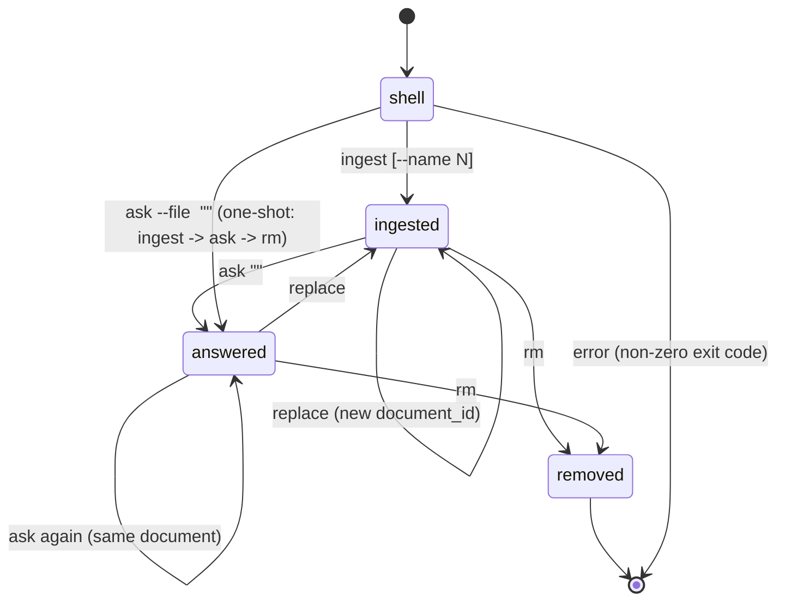
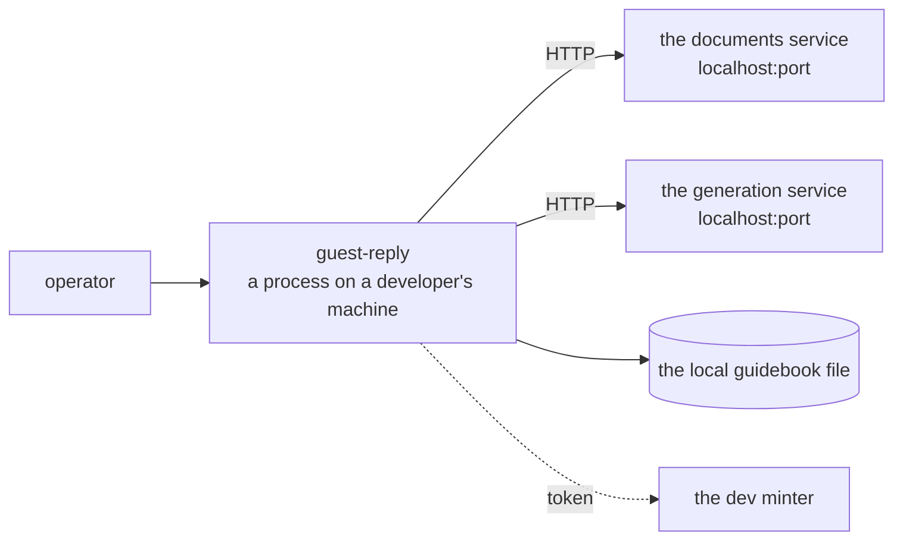
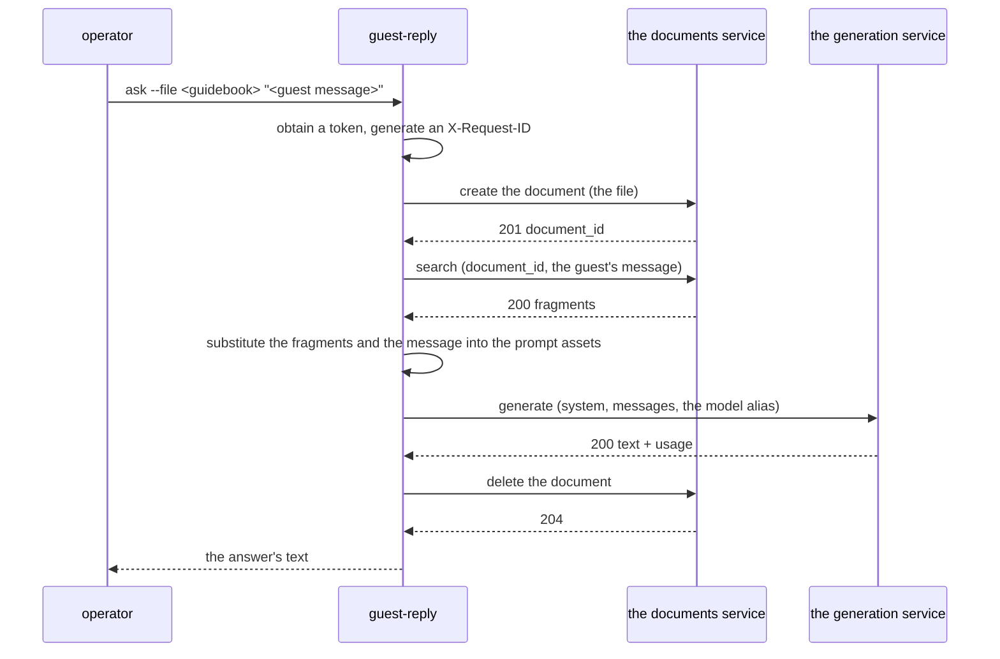

# guest-reply — technical specification of the console orchestrator

> A CLI tool of the Holahost platform (see `holahost/docs/holahost_frame.md`). Not a microservice and
> not a deploy unit: it lives in `holahost/tools/guest-reply/` and is installed on an operator's
> machine. It calls `rag-documents` and `llm-client` in sequence and implements the iteration's only
> product scenario — answering a guest from a local guidebook.
>
> **Path convention:** `src/…`, `docs/…` are relative to the tool's root
> (`holahost/tools/guest-reply/`); "the repository root" means the root of the monorepo.
>
> **Dynamic sections:** this document keeps the iteration's **cross-service** "Deferred decisions"
> and "Draft ADRs" — decisions that touch both services and the CLI. Decisions scoped to a single
> service live in that service's own specification.

---

## Stage 1. Problem Statement + Opportunity Brief + User journey map

### 1.1 Problem Statement

The reason to build this: `rag-documents` and `llm-client` on their own do not produce an answer for
a guest — a caller is needed to tie retrieval over the guidebook to generation. There is no
full-blown Orchestration Service and no frontend in this iteration.

### 1.2 Opportunity Brief

We are building a console tool that does exactly what an Orchestration Service will do later: it
uploads a local guidebook file into `rag-documents`, and for every guest message it fetches the
relevant chunks and passes them together with a prompt to `llm-client`, then prints the answer. The
"answer the guest" prompt — the iteration's only piece of product logic — lives here: the services
know nothing about prompts.

What justifies it in this iteration: the CLI gives an executable check of both services' contracts
and of the platform's topology without requiring a frontend or another deploy unit, and it stays
useful after the orchestrator arrives — as a tool for diagnostics and for populating documents.

**Scope — dev only.** The tool works against the local dev stack and nowhere else: it is not
installed on staging or prod and holds no credentials for them. The services themselves are deployed
to every environment of the platform.

**The iteration's success criterion:** `guest-reply ask --file <guidebook> "<guest message>"` works
end to end against the local dev stack, and each service comes up and is updated independently of the
other. There are no product metrics in this iteration; the technical metrics are **Stage 8**.

### 1.3 User journey map

The only human in this iteration is the **operator**: someone with a guidebook file and the text of a
guest message on disk. They have no account: the CLI calls the services under its own s2s token (see
ADR C-3).

#### 1.3.1 State machine



#### 1.3.2 Commands

| Command | What it does | Output |
|---|---|---|
| `guest-reply ingest <file> [--name N]` | creates a document in `rag-documents` | `document_id` |
| `guest-reply replace <document_id> <file> [--name N]` | one call of the replace operation in the documents service; the replacement is atomic on its side | the same `document_id` |
| `guest-reply ask <document_id> "<msg>"` | search in `rag-documents` → generation in `llm-client` | the answer's text |
| `guest-reply ask --file <file> "<msg>"` | one-shot: `ingest` → `ask` → `rm` | the answer's text |
| `guest-reply rm <document_id>` | deletes the document (idempotent) | — |

There is one common flag: `--json`, for machine-readable output instead of text. There is no
environment selection — the base URL is always the local dev stack. The exact signatures, exit codes
and `--json` format are Stage 7.

Every command except `ask` and the one-shot is **exactly one** service call. `ask` is two (search and
generation), and the one-shot is four (plus `ingest` and `rm`).

#### 1.3.3 The end-to-end `ask` path, at component level

| Step | Where | What happens |
|---|---|---|
| 1 | `auth` (in this iteration, the dev minter — ADR C-4) | an s2s token by `client_credentials`, cached in process memory until roughly its `exp`. While there is no `auth`: the token is issued by the `holahost/infra/scripts/mint-dev-token.py` script and the CLI takes it ready-made from an environment variable; the arrival of `auth` changes only the source of the token, not the other steps |
| 2 | `rag-documents` | search by `document_id` → the top-K chunks |
| 3 | locally | assembling the prompt: `system` (the host's role and the rules for answering) + `user` (the chunks as context plus the guest's message) |
| 4 | `llm-client` | `generate` → text plus usage plus the actual provider and model |
| 5 | stdout | printing the answer (or `--json` with the answer and its metadata) |

#### 1.3.4 Error branches

| Event | What the CLI does |
|---|---|
| The token expired, or a service answered `401` | request the token once more and repeat the call; a second `401` → an error |
| `404` from `rag-documents` (the document does not exist or belongs to someone else) | the message "document not found", non-zero exit |
| The search returned an empty list of chunks | generation is not called; the message "there is no relevant context in the document" |
| `429` + `Retry-After` from any service | wait the stated time, a bounded number of repeats, then an error |
| `502 ERR_UPSTREAM_LLM` | a message that the provider is unavailable, non-zero exit; retrying is at the operator's discretion |
| An error at the `ingest` step of the one-shot | the document is not created; the `ask` and `rm` steps are not performed |
| An error at the `ask` step of the one-shot | the document is deleted anyway — `rm` always runs |

#### 1.3.5 Invariant: the CLI has no logic of its own

The CLI is a sequential caller. Anything that is not a sequence of calls, the handling of their
errors, or console input and output has to live in the services. The checkable list:

| Responsibility | Where it lives |
|---|---|
| Parsing the file, chunking, embedding, vector search, the similarity threshold, top-K | `rag-documents` |
| Atomicity of replacing a document, cascading deletion of chunks | `rag-documents` |
| Checking ownership of a document and the right to the operation | `rag-documents` |
| Choosing the specific model and provider, upstream retries and backoff, failover, the budget and its policy, usage accounting | `llm-client` |
| JWT validation | the shared `holahost-auth` library, inside the services |
| Limits on file size and message length, the rate limit | the services |
| The text of the `system` prompt and the template for substituting chunks | an **asset** shipped with the CLI — a static file, not code (ADR C-5) |

On dev there is no platform nginx: the services are reachable directly on their published ports.
Everything the perimeter does on staging and prod that the caller still needs falls to the CLI as the
thin dev orchestrator: setting `X-Request-ID` on every outgoing call. The services are not obliged to
compensate for the missing perimeter internally, and they will not.

What stays with the CLI: obtaining and caching the s2s token, the order of the calls, the reaction to
error codes (repeating after `Retry-After`, one token re-request on `401`), deleting the document in
the one-shot, reading the file from disk and printing the result. Any item one is later tempted to
add beyond this list is a sign that the decision is being taken in the wrong component.

---

## Stage 2. User Stories + Acceptance Criteria

There is one role — the **Operator**: someone with a guidebook file and the text of a guest message
on disk. They have no account; the CLI calls the services under its own s2s token (ADR C-3).

The acceptance criteria are checked by running a command and observing stdout, stderr and the exit
code. Everything to do with the services' behaviour is checked in their own specifications; here
there is only the sequence of calls and the reaction to the answers (the invariant in §1.3.5).

### 2.0 Parameter table

| Parameter | Purpose |
|---|---|
| `HOLAHOST_API_BASE` | the base URL of the local dev stack |
| `HOLAHOST_CLIENT_ID`, `HOLAHOST_CLIENT_SECRET` | the s2s client's credentials (dev) |
| `HOLAHOST_TOKEN` | a ready-made token from the dev minter, while `auth` is not built (ADR C-4) |
| `RETRY_ON_429_MAX` | how many times to wait out `Retry-After` before giving up |
| `MODEL_ALIAS` | the model alias the CLI passes to `llm-client` |
| `EXIT_*` | the exit codes per class of error (the list is Stage 7) |

### US-C01: Uploading a guidebook

> As an Operator, I want to upload a local guidebook file with one command, so that I get a document id to work with.

**AC:**
- `guest-reply ingest <file>` performs **one** document-creation call and prints the `document_id`.
- The file is read from disk as is; the CLI does not parse, split or transform its content.
- `--name` sets the display name; without the flag the file's name is used.
- A path that does not exist or cannot be read → an error message and a non-zero exit code, with no
  service call made.
- A service error (format, size, empty document, chunk limit) is printed with its `code` and a
  human-readable text; no `document_id` is printed.
- With `--json`, stdout carries only the JSON object, and diagnostics go to stderr.

### US-C02: Replacing a guidebook

> As an Operator, I want to replace a document's content, so that consumers keep the same id after an update.

**AC:**
- `guest-reply replace <document_id> <file>` performs **one** replace call, and the same
  `document_id` is printed.
- The CLI does not do `delete` + `create`: there is no two-call sequence in the command.
- A failed replacement leaves the previous version in place (a property of the service) — the CLI
  prints the error and does not try to force the change through.
- Replacing a document that belongs to someone else or does not exist → the message "document not
  found" and a non-zero exit code.

### US-C03: Answering a guest message

> As an Operator, I want an answer to a guest message grounded in my guidebook, so that I can judge the quality of the platform's RAG path.

**AC:**
- `guest-reply ask <document_id> "<msg>"` performs exactly two calls: the search in `rag-documents`,
  then the generation in `llm-client`.
- The prompt is assembled by substituting the chunks found and the guest's message into static assets
  (the `system` prompt and the context template); there is no branching on chunk content in the code.
- `MODEL_ALIAS` is passed to `llm-client`, not a vendor model name.
- Only the answer's text is printed to stdout; with `--json`, an object with the text, `usage`, the
  actual provider and model, and the number of chunks used.
- Running it again with the same `document_id` does not require re-uploading the file.
- Grounding: for a document with a unique sentinel fact, the answer to a question about that fact
  contains the sentinel.

### US-C04: One-shot

> As an Operator, I want a single command that ingests, asks and cleans up, so that I can check the whole platform path without leaving artefacts.

**AC:**
- `guest-reply ask --file <file> "<msg>"` performs `ingest` → search → generation → `rm`.
- `rm` runs even when the generation step fails: no temporary document is left in the service.
- An error at the `ingest` step stops execution: search, generation and `rm` are not called.
- The temporary document's `document_id` is not printed in normal mode, and is present with `--json`.
- `--file` and the positional `document_id` are mutually exclusive; giving both → a usage error.

### US-C05: Deleting a document

> As an Operator, I want to delete a document I no longer need, so that its content stops being retrievable.

**AC:**
- `guest-reply rm <document_id>` performs one delete call; on success, a zero exit code and no output
  beyond `--json`.
- Deleting a document that does not exist prints "document not found" and exits with the "not found"
  code, rather than as a success.

### US-C06: No relevant context

> As an Operator, I want to be told when the guidebook has nothing relevant, so that I do not mistake a generic answer for a grounded one.

**AC:**
- An empty chunk list from `rag-documents` → generation is **not called**, and the message "there is
  no relevant context in the document" is printed.
- The exit code differs both from the code for a successful answer and from the service-error codes.
- With `--json`, an object with an empty chunk list and no answer field is returned.

### US-C07: Reacting to service errors

> As an Operator, I want predictable behaviour on transient failures, so that I can tell a platform problem from my own mistake.

**AC:**
- `401` from any service → one token re-request and a repeat of the call; a second `401` → an
  authorization error message and a non-zero exit code.
- `429` with `Retry-After` → waiting the stated time, at most `RETRY_ON_429_MAX` times, then giving
  up with a statement of how long to wait.
- `502 ERR_UPSTREAM_LLM` → a message that the provider is unavailable; the CLI makes no automatic
  retries (retrying is `llm-client`'s job, US-L03).
- A service being unreachable over the network is distinguishable in the output from an error that
  came back with a code.
- Each class of error has its own `EXIT_*`; the codes are listed in the contract (Stage 7).
- A service's error body is printed from its `code` and `message` fields; raw JSON is not dumped in
  normal mode.

### US-C08: Machine-readable output

> As an Operator, I want machine-readable output, so that the tool is usable from scripts.

**AC:**
- `--json` turns stdout into a single JSON object; in that mode nothing else is printed to stdout.
- Without `--json` the output is human-readable, and diagnostics go to stderr.
- The base URL comes from `HOLAHOST_API_BASE` and points at the local dev stack; there is no
  environment-selection flag.
- A missing `HOLAHOST_API_BASE` → a configuration error before any network call.

### US-C09: Obtaining a token

> As an Operator, I want the tool to obtain its own token, so that I do not paste credentials into every command.

**AC:**
- The token is requested by `client_credentials` from `HOLAHOST_CLIENT_ID` / `HOLAHOST_CLIENT_SECRET`
  and cached in process memory until it expires.
- While `auth` is not built, a ready-made token from `HOLAHOST_TOKEN` is used instead of the request
  (ADR C-4); the arrival of `auth` changes only this step.
- Having neither the credentials nor `HOLAHOST_TOKEN` → a configuration error before any service call.
- Neither the secret nor the token is printed in normal output, in `--json`, or in error messages.
- The token is not written to disk.

### US-C10: The end-to-end request identifier

> As an Operator, I want every call to carry a request id, so that I can trace one command across both services' logs.

**AC:**
- The CLI generates an `X-Request-ID` and sets it on every outgoing call; on dev it is the only thing
  that does — there is no nginx in the path.
- All the calls of one command — four in the one-shot — carry **the same** identifier.
- With `--json` the identifier is present in the output, so that the corresponding entries can be
  found in the services' logs.
- The identifier is not reused between runs of a command.

### 2.10 Coverage of the user journey map (§1.3)

| Transition on the map | Covered by |
|---|---|
| `shell → ingested` (`ingest`) | US-C01 |
| `ingested → ingested` / `answered → ingested` (`replace`) | US-C02 |
| `ingested → answered`, `answered → answered` (`ask`) | US-C03 |
| `shell → answered` (one-shot) | US-C04 |
| `ingested → removed`, `answered → removed` (`rm`) | US-C05 |
| The "search returned nothing" branch (§1.3.4) | US-C06 |
| The `401` / `429` / `502` / network-failure branches (§1.3.4) | US-C07 |
| Step 1 of the end-to-end `ask` path (§1.3.3) | US-C09 |
| Setting `X-Request-ID` on every call (§1.3.5) | US-C10 |
| The `--json` flag (§1.3.2) | US-C08 |

---

## Stage 3. Tech Constraints Doc

### 3.1 System architecture

The tool is a process on a developer's machine that lives exactly as long as the command runs. It has
no infrastructure of its own: no database, no background daemon, no state between runs. The token is
cached in process memory and dies with it; the `document_id` is printed for the operator and stored
nowhere — which is why the one-shot has to delete the document it created itself, as there will be no
second chance to recall its identifier.



It works only against the local dev stack (§1.2). There is neither a gateway nor nginx in the path —
the calls go to the containers' published ports, so the tool sets `X-Request-ID` on every request
itself (US-C10).

### 3.2 Code architecture

Clean architecture is not applied here: there are no layers, because there is no domain (§1.3.5). The
structure is flat and reflects three roles — parsing commands, calling services, and the prompt
assets.

```
src/guest_reply/
  cli.py              # command and flag declarations, exit codes, printing
  config.py           # typed settings from the environment
  clients/            # HTTP clients for the platform's services: one per service, plus token retrieval
  flows.py            # the sequence of calls for each command
  prompt/             # assets: the system prompt and the context-substitution template (files, not code)
```

There is one dependency rule: `flows.py` knows about `clients/` and reads the assets; `clients/`
knows nothing about commands. There is no branching in `flows.py` on the content of the services'
answers — only on error codes.

### 3.3 Technology stack

| Layer | Choice |
|---|---|
| Language | Python 3.12 — the same toolchain as the services, with shared linters and hooks |
| CLI framework | `typer` (on top of `click`): typed command signatures and generated `--help` |
| HTTP client | `httpx` (synchronous) — connect and read timeouts set separately |
| Validation | Pydantic v2 for settings and for parsing responses |
| Packaging | poetry, as part of the monorepo; installed with `poetry install`, with no separate distribution |
| Tests | pytest; HTTP is mocked and the tests never reach real services |

### 3.4 Parameters and limits (numbers)

| Parameter | Value | Rationale |
|---|---|---|
| Connect timeout | 5 s | the services are local; longer means the stack is not up |
| Read timeout for search and metadata | 10 s | with headroom over the documents service's search budget |
| Read timeout for ingest and generation | 35 s | slightly more than the services' synchronous ceiling, so that their own error reaches the operator instead of a client-side cut-off |
| `RETRY_ON_429_MAX` | 3 | after three `Retry-After` waits there is no point continuing — the limit is set too low for the scenario |
| Repeat after `401` | exactly 1 | a second `401` means a problem with the credentials, not a stale token |
| Retries on `5xx` and timeouts | 0 | upstream retries are the services' job; duplicating them here would multiply the load |
| Maximum file size | not checked | the limit belongs to the documents service; duplicating the number in two places guarantees divergence |

### 3.5 Security

| Aspect | Decision |
|---|---|
| Credentials | `client_id` / `client_secret` or a ready-made dev token, taken from the environment; never written to disk, never shown in the output, and masked in error messages |
| Token | in process memory only, and never in `--json` |
| Transport | the dev stack is local, so HTTP is acceptable; a non-local address requires HTTPS |
| The operator's input | the guest's message and the document's name are passed as data; they are substituted into the prompt in the user role and no instructions are taken from them — the protection against injection sits here because the prompt lives here |
| The file | read as bytes, never executed and never interpreted |

### 3.6 Out of scope for this iteration

- Any environment other than local dev.
- Storing a command history, caching answers, a configuration file.
- An interactive mode and a multi-turn dialogue.
- Processing several documents or messages in parallel.
- Retries of upstream errors and limits of the tool's own.
- Output formats other than text and `--json`.

### 3.7 Happy path at component level



---

## Stage 5. Use Cases

The actor is the same throughout — the operator. The input is what they typed on the command line and
set in the environment; the output is what is printed, plus the exit code. There is no logic of the
tool's own in these flows: they are sequences of calls (§1.3.5).

### UC-C1. Upload a guidebook

- **Actor:** Operator
- **Input:** `file_path: Path`, `name: str | None`
- **Output:** `document_id: str`
- **Flow:** reads the file from disk, obtains a token, creates the document in the documents service
  with a single call, and prints the identifier.

### UC-C2. Replace a guidebook

- **Actor:** Operator
- **Input:** `document_id: str`, `file_path: Path`, `name: str | None`
- **Output:** `document_id: str` (the same one)
- **Flow:** reads the file and replaces the document's content with a single call. It does not do a
  delete-then-create pair — atomicity is the service's to provide.

### UC-C3. Answer a guest message

- **Actor:** Operator
- **Input:** `document_id: str`, `guest_message: str`
- **Output:** `answer: str` (or, in machine-readable mode, a structure with `usage` and the actual
  provider and model)
- **Flow:** searches the documents service for relevant fragments; on an empty result it stops
  without touching generation; otherwise it substitutes the fragments and the message into the prompt
  assets, calls generation, and prints the text it gets back.

### UC-C4. Answer from a local file (one-shot)

- **Actor:** Operator
- **Input:** `file_path: Path`, `guest_message: str`
- **Output:** `answer: str`
- **Flow:** performs UC-C1, then UC-C3, then UC-C5 over the document it created. The deletion happens
  even when generation fails; an upload error stops the scenario before the remaining steps.

### UC-C5. Delete a document

- **Actor:** Operator
- **Input:** `document_id: str`
- **Output:** nothing
- **Flow:** deletes the document with a single call.

Obtaining and caching the token and setting the end-to-end request identifier are not use cases of
their own: they happen in each of the five and have no standalone result for the operator.

---

## Stage 7. CLI Contract

The tool's contract is its command line, its output stream and its exit code.

### 7.1 Commands and arguments

```
guest-reply ingest  <file> [--name <str>] [--json]
guest-reply replace <document_id> <file> [--name <str>] [--json]
guest-reply ask     <document_id> "<guest_message>" [--json]
guest-reply ask     --file <file> "<guest_message>" [--json]
guest-reply rm      <document_id> [--json]
```

| Argument / flag | Type | Rules |
|---|---|---|
| `<file>` | path | an existing readable file; the content is not checked — the service does that |
| `<document_id>` | UUID string | the syntax is checked locally, the existence by the service |
| `<guest_message>` | string | passed through as is; the length is bounded by the service |
| `--name` | string | the display name; without the flag, `ingest` takes the file's name and `replace` keeps the previous one |
| `--file` | path | for `ask` only; mutually exclusive with the positional `<document_id>` |
| `--json` | flag | machine-readable output |

### 7.2 Environment variables

| Variable | Required | Purpose |
|---|---|---|
| `HOLAHOST_API_BASE` | yes | the base URL of the local dev stack |
| `HOLAHOST_TOKEN` | yes, while there is no `auth` | a ready-made token from the dev minter |
| `HOLAHOST_CLIENT_ID`, `HOLAHOST_CLIENT_SECRET` | once `auth` exists | the s2s client's credentials |

A missing required variable is a configuration error raised before any network call. The values are
printed in no output mode, error messages included.

### 7.3 Output

Without `--json`, `stdout` carries only the useful result: the `document_id` for `ingest` and
`replace`, the answer's text for `ask`, nothing for `rm`. Diagnostics and errors go to `stderr`.

With `--json`, `stdout` carries exactly one object and nothing else:

```jsonc
// ingest, replace
{ "document_id": "…", "chunk_count": 128, "request_id": "…" }

// ask (success)
{ "answer": "…", "chunks_used": 4, "usage": { "input_tokens": 1240, "output_tokens": 310 },
  "provider": "anthropic", "model": "claude-haiku-4-5", "document_id": "…", "request_id": "…" }

// ask (no relevant context)
{ "answer": null, "chunks_used": 0, "document_id": "…", "request_id": "…" }

// rm
{ "document_id": "…", "deleted": true, "request_id": "…" }

// any error
{ "error": { "code": "ERR_NOT_FOUND", "message": "document not found" }, "request_id": "…" }
```

`request_id` is always present — it is what locates a command's run in both services' logs (US-C10).
In the one-shot, the temporary document's `document_id` is visible only in machine-readable mode.

### 7.4 Exit codes

| Code | Situation |
|---|---|
| `0` | success |
| `1` | a usage error: an unknown command, a missing argument, `--file` together with `<document_id>` |
| `2` | a configuration error: a required environment variable is unset |
| `3` | the file does not exist or cannot be read |
| `4` | the document was not found (the service answered `404`) |
| `5` | there is no relevant context — the search came back empty and generation was never called |
| `6` | refused by a limit: `Retry-After` was honoured `RETRY_ON_429_MAX` times without success |
| `7` | the LLM provider is unavailable (`502` from the generation service) |
| `8` | a service was unreachable over the network, or did not answer within the timeout |
| `9` | a service returned an error the tool does not interpret (`5xx`, an unexpected format) |

Code `5` is deliberately distinct from `0`: "there is no answer, because there is nothing in the
document to find" is not a success, and a script calling the tool has to be able to tell the
difference without parsing prose.

### 7.5 Service errors in the output

The tool prints the `code` and `message` from the service's error body, adding only what the operator
can act on: which file to replace, how long to wait, which variable to set. The raw response body is
not shown in normal mode — it is available with `--json`. The tool neither overrides nor renames the
services' error codes.

---

## Stage 8. Detailed Sequence Flow

### 8.0 Modules

```python
# clients/auth.py
def get_token(settings: Settings) -> str: ...          # a ready-made token from the environment, or client_credentials; cached in memory

# clients/documents.py
def create(file: bytes, name: str, filename: str) -> CreatedDocument: ...   # (document_id, chunk_count)
def replace(document_id: str, file: bytes, name: str | None) -> CreatedDocument: ...
def search(document_id: str, query: str) -> list[Chunk]: ...                # (chunk_id, text, page, score)
def delete(document_id: str) -> None: ...

# clients/generation.py
def generate(system: str, messages: list[Message], model: str) -> Generated: ...
# Generated = (text, usage, provider, model)

# prompt/render.py
def render(chunks: list[Chunk], guest_message: str) -> tuple[str, list[Message]]: ...
# reads the prompt/system.txt and prompt/context.tmpl assets and substitutes the values

# flows.py
def ingest(path: Path, name: str | None) -> CreatedDocument: ...
def replace(document_id: str, path: Path, name: str | None) -> CreatedDocument: ...
def ask(document_id: str, guest_message: str) -> Answer | None: ...   # None = no relevant context
def ask_from_file(path: Path, guest_message: str) -> Answer | None: ...
def remove(document_id: str) -> None: ...
```

Every client sets `Authorization: Bearer` and the `X-Request-ID` that is shared across the whole run
of a command (US-C10) on the request, and translates the HTTP response into an exception of its own
class — the services' codes are not parsed a second time in `flows.py`.

### 8.1 UC-C3 "Answer a guest message"

| # | Module and call | What happens |
|---|---|---|
| 1.1 | `config.load() -> Settings` | a missing required variable → exit with code `2` |
| 1.2 | `clients.auth.get_token(settings)` | the token goes into process memory |
| 1.3 | `clients.documents.search(document_id, guest_message) -> list[Chunk]` | `404` → code `4`; `429` → waiting out `Retry-After`, at most `RETRY_ON_429_MAX` times |
| 1.4 | if the list is empty → return `None` | generation is not called, exit code `5` |
| 1.5 | `prompt.render(chunks, guest_message) -> (system, messages)` | substitution into the assets; no branching on content |
| 1.6 | `clients.generation.generate(system, messages, settings.model_alias) -> Generated` | `502` → code `7` |
| 1.7 | printing `text` or the JSON object | |

### 8.2 UC-C4 "One-shot"

| # | Call | What happens |
|---|---|---|
| 2.1 | `flows.ingest(path, name=None)` | on error, exit; steps 2.2–2.3 are not performed |
| 2.2 | `flows.ask(document_id, guest_message)` | the result is remembered, and so is an exception |
| 2.3 | `flows.remove(document_id)` in a `finally` block | runs even when step 2.2 failed |
| 2.4 | printing the result, or re-raising the original error | a deletion error does not replace the generation error; it is appended to `stderr` |

### 8.3 UC-C1, UC-C2, UC-C5

One client call each — `create`, `replace`, `delete` — plus the common outline of steps 1.1–1.2 and
the printing.

### 8.4 Metrics

The tool collects none: it is run by hand and lives for seconds. Observability of a run comes from
the `request_id` being printed in machine-readable mode and present in both services' events — it is
what reconstructs a run in full from their logs.

---

## Stage 13. Backlog

The tool has no layers (§3.2), so the order follows the dependencies: settings and clients, then the
scenarios, then the command layer.

### Platform-wide (cross-service)

- `P-01` `infra/scripts/mint-dev-token.py` — issuing dev tokens and publishing JWKS for the local
  stack; it is needed both by the services (validation) and by the tool (calls), so it comes first
  (C-4)
- `P-02` Registering the `guest-reply-cli` client in `auth`'s git config — `client_id`,
  `allowed_audiences`, TTLs; until `auth` exists this is recorded as a draft of the config

### The tool

- `C-01` Typed settings from the environment, with the required variables checked before any network
  call
- `C-02` Obtaining and caching the token; the source is the dev minter or `client_credentials`
- `C-03` HTTP clients for the services — setting `Authorization` and the shared `X-Request-ID`,
  separate timeouts, translating response codes into the client's own exceptions
- `C-04` The prompt assets — the `system` prompt and the context template as files, plus rendering
  them by substitution
- `C-05` The command scenarios — `ingest`, `replace`, `ask`, the one-shot with deletion in `finally`,
  and `rm`
- `C-06` The command layer — commands and flags, human-readable and `--json` output, exit codes per
  class of error, waiting out `Retry-After`
- `C-07` Tests — HTTP is mocked, and what is checked is the order of the calls, the reaction to codes,
  and the exit codes

---

## Deferred decisions (cross-service)

| Stage | The fork |
|---|---|
| 1 | When `auth` arrives relative to this iteration, and how much of its contract has to be fixed in advance (`/token`, JWKS) — decided together with building `auth`, outside this iteration |

The `holahost-auth` middleware (a shared library of the monorepo) and the atomicity of replacing a
document are both settled on the documents service's side.

## Stage 9. Architecture Decision Records (cross-service)

A consolidation of the drafts accumulated over stages 1–8. The decisions kept here are the ones
touching both sides of the iteration; decisions scoped to a single service live in that service's
specification. The format: Context → Decision → alternatives → Consequences.

**C-1. The iteration is two Resource Services, not one combined service**
Context: the functionality (ingestion + retrieval + LLM) previously existed as a single piece; on the
platform it has two different consumers and two different reasons to change.
Decision: split it into `rag-documents` (Document + Chunk) and `llm-client` (Provider + Budget +
Usage), with no shared code between them.
Rejected: carrying the previous service over whole as one service (the LLM key and the budgets end up
inside the documents service, and any other LLM consumer is forced to go through the documents
service); extracting only `rag-documents` with the LLM calls inside it (the same coupling, plus two
owners for one secret).
Consequences: each service changes for its own reason and is deployed independently, and the
provider's key is available to exactly one of them. In exchange, the "answer the guest" scenario
ceases to exist as a whole anywhere in the code: it is assembled only by the caller, and end-to-end
debugging means reading two services' logs by a shared `request_id`.

**C-2. The iteration's orchestration is a CLI, not an Orchestration Service**
Context: the "answer the guest" scenario requires calling two services in sequence; a full
orchestrator and a frontend are not in the iteration's scope.
Decision: the orchestrator's role is played by the console `guest-reply` in `holahost/tools/`, which
also holds the product prompt.
Rejected: an Orchestration Service (another deploy unit, infrastructure and CI/CD just to check
contracts); a script inside one of the services (product logic leaks into a Resource Service, against
the framework specification).
Consequences: both services' contracts are checked by an executable scenario, and the platform does
not acquire a third deploy unit, its infrastructure and its pipelines. In exchange, the product
scenario exists only on a dev machine: neither a frontend nor an external consumer can use it until a
real orchestrator appears.

**C-3. The CLI authenticates as a confidential s2s client; a document's owner is the token's subject**
Context: the operator has no account, `auth` does not issue user tokens yet, and documents have to
belong to someone.
Decision: the CLI is a confidential client using `client_credentials`; in its token `sub ==
client_id`, and the owner of a created document is that `sub`. The ownership rule is polymorphic and
will survive the arrival of user tokens.
Rejected: anonymous access to the services (it breaks the framework specification — JWT validation on
every route except `/health`); a public client with PKCE (there is no browser and no user to
authenticate).
Consequences: from day one the services work under the same authorization scheme as in production,
and the ownership rule — the token's `sub` — is not rewritten when users appear. In exchange, every
document the tool creates belongs to one subject: there is no separation between operators, and there
will not be one on dev.

**C-4. Until `auth` exists, tokens are issued by a dev minter**
Context: `auth` is not in the repository yet, but both services are obliged to validate JWTs offline
already in this iteration.
Decision: the `holahost/infra/scripts/mint-dev-token.py` script signs tokens with a dev key and
publishes JWKS; the services validate against it, and the token contract is taken from the framework
specification unchanged.
Rejected: turning authorization off for the iteration (the middleware and its tests would have to be
written later and blind); building `auth` first (it pushes the iteration out and deprives it of a
verifiable result).
Consequences: the validation middleware is written and tested against real tokens rather than filled
in blind later. In exchange, a temporary component appears that will have to be removed, along with
the risk that the real `auth`'s contract diverges from the one the validation was written against.

**C-5. The product prompt lives in the CLI — as an asset, not as code**
Context: the "answer the guest" prompt is the iteration's only product specificity; the generation
service stores no prompts, and the documents service knows nothing about generation.
Decision: the `system` prompt and the chunk-substitution template are static files shipped with
`guest-reply`; the code only reads them and substitutes values. This does not break the "the CLI has
no logic of its own" invariant (§1.3.5); when an Orchestration Service appears, the assets move to it.
Rejected: the prompt in `rag-documents` (the documents service knows nothing about generation); the
prompt in `llm-client`'s config (see B-1); assembling the prompt in the CLI's code by branching on
chunk content (that is product logic in a tool that must not have any).
Consequences: the prompt's text is edited without deploying the services, and the "the CLI has no
logic of its own" invariant stays checkable: assets are data, not code. In exchange, the quality of
an answer depends on a file that is versioned nowhere separately and that will travel with the
orchestrator when it moves.

**C-6. Zero retries of upstream errors in the tool** ⚠ Gap: the decision was taken in §3.4 and was
never written up as a draft.
Context: the tool sees `5xx` and timeouts from the services, while the generation service already
retries the vendor internally.
Decision: the CLI does not repeat `5xx` or timeouts; the only things repeated are waiting out
`Retry-After` on `429` and a single token re-request on `401`.
Rejected: retries with backoff of the tool's own (they multiply the load on top of the service's
retries and stretch out the time before the operator, who is at the terminal, hears about it and
repeats the command themselves).
Consequences: the load on a failing provider is not doubled, and the operator learns about the
failure straight away. In exchange, a one-off network failure requires repeating the command by hand,
which automation built on top of the tool has to account for.
