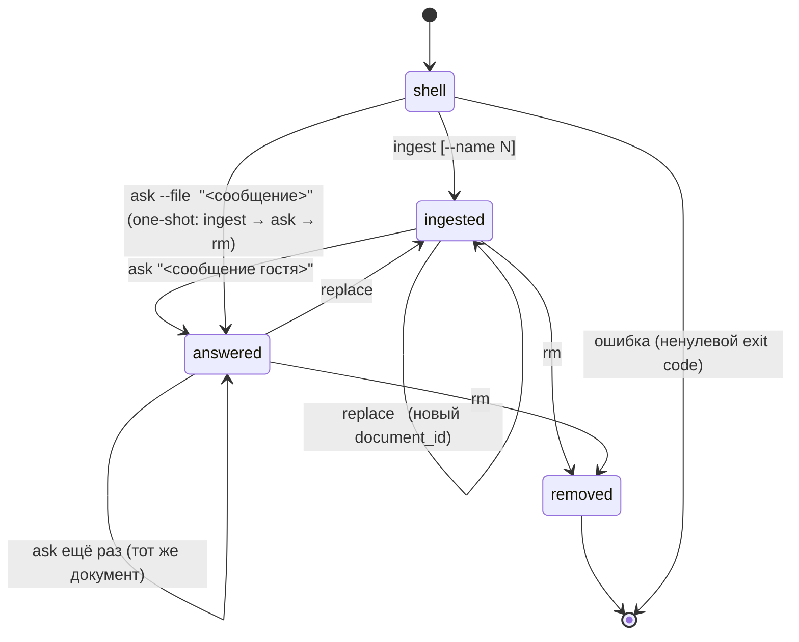
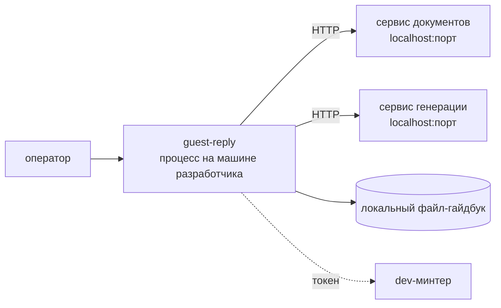
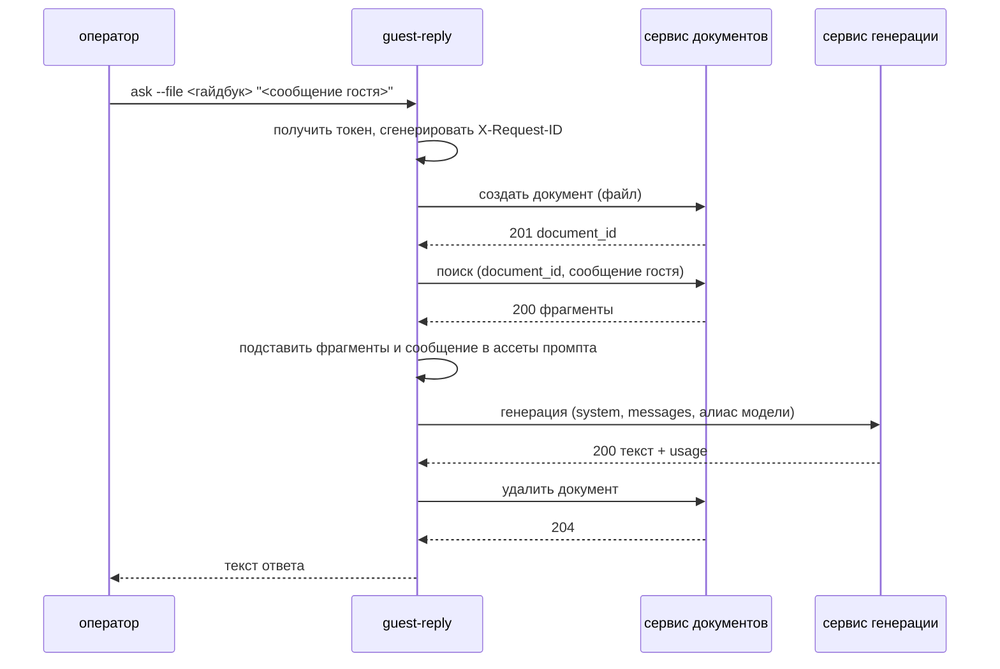

# guest-reply — техническая спецификация консольного оркестратора

> CLI-инструмент платформы Holahost (см. `holahost/docs/holahost_frame.md`). Не микросервис и не
> деплой-юнит: живёт в `holahost/tools/guest-reply/`, ставится на машину оператора. Последовательно
> вызывает `rag-documents` и `llm-client` и реализует единственный продуктовый сценарий итерации —
> ответ гостю по локальному гайдбуку.
>
> **Соглашение о путях:** `src/…`, `docs/…` — относительно корня инструмента
> (`holahost/tools/guest-reply/`); «корень репо» — корень монорепозитория.
>
> **Динамические разделы:** этот документ ведёт **кросс-сервисные** «Отложенные решения» и
> «ADR-черновики» итерации (решения, затрагивающие оба сервиса и CLI). Решения, скоупленные на один
> сервис, — в его собственной спеке.

---

## Этап 1. Problem Statement + Opportunity Brief + Карта пользовательского пути

### 1.1 Problem Statement

Основание для разработки: `rag-documents` и `llm-client` по отдельности не дают ответа гостю — нужен
вызыватель, который свяжет поиск по гайдбуку с генерацией. Полноценного Orchestration Service и
фронта в этой итерации нет.

### 1.2 Opportunity Brief

Строим консольный инструмент, который делает ровно то, что позже будет делать Orchestration Service:
загружает локальный файл-гайдбук в `rag-documents`, на каждое сообщение гостя достаёт релевантные
чанки и передаёт их вместе с промптом в `llm-client`, печатает ответ. Промпт «ответ гостю» —
единственная продуктовая логика итерации — живёт здесь: сервисы промптов не знают.

Чем это оправдано на итерации: CLI даёт исполняемую проверку контрактов обоих сервисов и топологии
платформы, не требуя ни фронта, ни ещё одного деплой-юнита, и остаётся полезен после появления
оркестратора — как инструмент диагностики и наполнения документов.

**Область применения — только dev.** Инструмент работает против локального dev-стека и нигде больше:
на staging и prod он не устанавливается и учётных данных для них не имеет. Сами сервисы
разворачиваются на всех окружениях платформы.

**Критерий успеха итерации:** `guest-reply ask --file <гайдбук> "<сообщение гостя>"` отрабатывает
end-to-end на локальном dev-стеке; каждый сервис поднимается и обновляется независимо от второго. Продуктовых метрик на итерации нет;
технические метрики — **Этап 8**.

### 1.3 Карта пользовательского пути

Единственный человек в итерации — **оператор**: разработчик или сотрудник, у которого на диске лежит
файл-гайдбук и текст сообщения гостя. Аккаунта у него нет: CLI ходит в сервисы под собственным
s2s-токеном (см. ADR C-3).

#### 1.3.1 State machine



#### 1.3.2 Команды

| Команда | Действие | Вывод |
|---|---|---|
| `guest-reply ingest <file> [--name N]` | создаёт документ в `rag-documents` | `document_id` |
| `guest-reply replace <document_id> <file> [--name N]` | один вызов операции замены в сервисе документов; замена атомарна на его стороне | тот же `document_id` |
| `guest-reply ask <document_id> "<msg>"` | поиск в `rag-documents` → генерация в `llm-client` | текст ответа |
| `guest-reply ask --file <file> "<msg>"` | one-shot: `ingest` → `ask` → `rm` | текст ответа |
| `guest-reply rm <document_id>` | удаляет документ (идемпотентно) | — |

Общий флаг один: `--json` (машинный вывод вместо текста). Выбора окружения нет — базовый URL всегда
локальный dev-стек. Точные сигнатуры, exit-коды и формат `--json` — Этап 7.

Каждая команда, кроме `ask` и one-shot, — **ровно один** вызов сервиса. `ask` — два (поиск и
генерация), one-shot — четыре (плюс `ingest` и `rm`).

#### 1.3.3 Сквозной путь `ask` (компонентный уровень)

| Шаг | Куда | Что происходит |
|---|---|---|
| 1 | `auth` (на итерации — dev-минтер, ADR C-4) | s2s-токен по `client_credentials`, кэш в памяти процесса до ~`exp`. Пока `auth` нет: токен выпускает скрипт `holahost/infra/scripts/mint-dev-token.py` и CLI берёт его готовым из переменной окружения; появление `auth` меняет только источник токена, не остальные шаги |
| 2 | `rag-documents` | поиск по `document_id` → top-K чанков |
| 3 | локально | сборка промпта: `system` (роль хоста и правила ответа) + `user` (чанки как контекст + сообщение гостя) |
| 4 | `llm-client` | `generate` → текст + usage + фактические провайдер и модель |
| 5 | stdout | печать ответа (или `--json` с ответом и метаданными) |

#### 1.3.4 Ветки ошибок

| Событие | Поведение CLI |
|---|---|
| Токен просрочен / `401` от сервиса | однократный перезапрос токена и повтор вызова; повторный `401` → ошибка |
| `404` от `rag-documents` (документ не найден или чужой) | сообщение «документ не найден», ненулевой exit |
| Поиск вернул пустой список чанков | генерация не вызывается; сообщение «в документе нет релевантного контекста» |
| `429` + `Retry-After` от любого сервиса | ожидание указанного времени, ограниченное число повторов, затем ошибка |
| `502 ERR_UPSTREAM_LLM` | сообщение о недоступности провайдера, ненулевой exit; ретрай на усмотрение оператора |
| Ошибка на шаге `ingest` в one-shot | документ не создан; шаги `ask`/`rm` не выполняются |
| Ошибка на шаге `ask` в one-shot | документ всё равно удаляется (`rm` выполняется всегда) |

#### 1.3.5 Инвариант: у CLI нет собственной логики

CLI — последовательный вызыватель. Всё, что не является последовательностью вызовов, обработкой их
ошибок и вводом-выводом консоли, обязано жить в сервисах. Проверяемый список:

| Ответственность | Где живёт |
|---|---|
| Парсинг файла, чанкинг, эмбеддинг, векторный поиск, порог сходства, top-K | `rag-documents` |
| Атомарность замены документа, каскадное удаление чанков | `rag-documents` |
| Проверка владения документом и права на операцию | `rag-documents` |
| Выбор конкретной модели и провайдера, ретраи и backoff на upstream, fallback, бюджет и его политика, учёт расхода | `llm-client` |
| Валидация JWT | общая библиотека `holahost-auth` внутри сервисов |
| Лимиты размера файла, длины сообщения, rate limit | сервисы |
| Текст `system`-промпта и шаблон подстановки чанков | **ассет** в составе CLI — статический файл, не код (ADR C-5) |

На dev платформенного nginx нет — сервисы доступны на опубликованных портах напрямую. Всё, что на
staging/prod делает периметр, но что при этом нужно вызывателю, ложится на CLI как на тонкий
dev-оркестратор: простановка `X-Request-ID` в каждый исходящий вызов. Компенсировать отсутствие
периметра внутри себя сервисы не обязаны и не будут.

Что остаётся на CLI: получение и кэширование s2s-токена, порядок вызовов, реакция на коды ошибок
(повтор по `Retry-After`, однократный перезапрос токена на `401`), удаление документа в one-shot,
чтение файла с диска и печать результата. Всякий пункт, который на следующих этапах захочется
добавить сверх этого списка, — сигнал, что решение принимается не в том компоненте.

---

## Этап 2. User Stories + Acceptance Criteria

Роль одна — **Оператор**: разработчик или сотрудник, у которого на диске лежит файл-гайдбук и текст
сообщения гостя. Аккаунта у него нет, CLI ходит в сервисы под собственным s2s-токеном (ADR C-3).

AC проверяются запуском команды и наблюдением stdout/stderr и кода возврата. Всё, что относится к
поведению сервисов, проверяется в их спеках — здесь только последовательность вызовов и реакция на
ответы (инвариант §1.3.5).

### 2.0 Таблица параметров

| Параметр | Назначение |
|---|---|
| `HOLAHOST_API_BASE` | базовый URL локального dev-стека |
| `HOLAHOST_CLIENT_ID`, `HOLAHOST_CLIENT_SECRET` | учётные данные s2s-клиента (dev) |
| `HOLAHOST_TOKEN` | готовый токен от dev-минтера, пока `auth` не разработан (ADR C-4) |
| `RETRY_ON_429_MAX` | сколько раз ждать `Retry-After` перед отказом |
| `MODEL_ALIAS` | алиас модели, который CLI передаёт в `llm-client` |
| `EXIT_*` | коды возврата по классам ошибок (перечень — Этап 7) |

### US-C01: Загрузка гайдбука

> As an Operator, I want to upload a local guidebook file with one command, so that I get a document id to work with.

**AC:**
- `guest-reply ingest <file>` выполняет **один** вызов создания документа и печатает `document_id`.
- Файл читается с диска как есть; CLI не парсит, не режет и не преобразует его содержимое.
- `--name` задаёт отображаемое имя; без флага используется имя файла.
- Несуществующий или нечитаемый путь → сообщение об ошибке и ненулевой код возврата, вызова сервиса не происходит.
- Ошибка сервиса (формат, размер, пустой документ, лимит чанков) печатается с её `code` и человекочитаемым текстом; `document_id` не печатается.
- При `--json` на stdout выводится только JSON-объект, диагностика — на stderr.

### US-C02: Замена гайдбука

> As an Operator, I want to replace a document's content, so that consumers keep the same id after an update.

**AC:**
- `guest-reply replace <document_id> <file>` выполняет **один** вызов замены; печатается тот же `document_id`.
- CLI не выполняет `delete` + `create`: последовательности из двух вызовов в команде нет.
- Ошибка замены оставляет прежнюю версию (свойство сервиса) — CLI печатает ошибку и не пытается «докатить» изменение.
- Замена чужого или несуществующего документа → сообщение «документ не найден», ненулевой код возврата.

### US-C03: Ответ на сообщение гостя

> As an Operator, I want an answer to a guest message grounded in my guidebook, so that I can judge the quality of the platform's RAG path.

**AC:**
- `guest-reply ask <document_id> "<msg>"` выполняет ровно два вызова: поиск в `rag-documents`, затем генерацию в `llm-client`.
- Промпт собирается подстановкой найденных чанков и сообщения гостя в статические ассеты (`system` и шаблон контекста); ветвлений по содержимому чанков в коде нет.
- В `llm-client` передаётся `MODEL_ALIAS`, а не вендорское имя модели.
- На stdout печатается только текст ответа; при `--json` — объект с текстом, `usage`, фактическими провайдером и моделью, числом использованных чанков.
- Повторный запуск с тем же `document_id` не требует повторной загрузки файла.
- Заземление: для документа с уникальным sentinel-фактом ответ на вопрос об этом факте содержит sentinel.

### US-C04: One-shot

> As an Operator, I want a single command that ingests, asks and cleans up, so that I can check the whole platform path without leaving artefacts.

**AC:**
- `guest-reply ask --file <file> "<msg>"` выполняет `ingest` → поиск → генерацию → `rm`.
- `rm` выполняется и при ошибке шага генерации: временный документ не остаётся в сервисе.
- Ошибка на шаге `ingest` прекращает выполнение: поиск, генерация и `rm` не вызываются.
- `document_id` временного документа в обычном режиме не печатается, при `--json` присутствует.
- `--file` и позиционный `document_id` взаимно исключают друг друга; указание обоих → ошибка использования.

### US-C05: Удаление документа

> As an Operator, I want to delete a document I no longer need, so that its content stops being retrievable.

**AC:**
- `guest-reply rm <document_id>` выполняет один вызов удаления; успех → нулевой код возврата и отсутствие вывода (кроме `--json`).
- Удаление отсутствующего документа печатает «документ не найден» и завершает работу с кодом «не найдено», а не как успех.

### US-C06: Отсутствие релевантного контекста

> As an Operator, I want to be told when the guidebook has nothing relevant, so that I do not mistake a generic answer for a grounded one.

**AC:**
- Пустой список чанков от `rag-documents` → генерация **не вызывается**, печатается сообщение «в документе нет релевантного контекста».
- Код возврата отличается от кода успешного ответа и от кодов ошибок сервисов.
- При `--json` возвращается объект с пустым списком чанков и без поля ответа.

### US-C07: Реакция на ошибки сервисов

> As an Operator, I want predictable behaviour on transient failures, so that I can tell a platform problem from my own mistake.

**AC:**
- `401` от любого сервиса → однократный перезапрос токена и повтор вызова; повторный `401` → сообщение об ошибке авторизации и ненулевой код возврата.
- `429` с `Retry-After` → ожидание указанного времени, не более `RETRY_ON_429_MAX` раз, затем отказ с указанием, сколько ждать.
- `502 ERR_UPSTREAM_LLM` → сообщение о недоступности провайдера; автоматических повторов CLI не делает (ретраи — обязанность `llm-client`, US-L03).
- Сетевая недоступность сервиса отличается в выводе от ошибки, вернувшейся с кодом.
- Каждому классу ошибки соответствует свой `EXIT_*`; коды перечислены в контракте (Этап 7).
- Тело ошибки сервиса печатается по полю `code` и `message`; сырой JSON в обычном режиме не вываливается.

### US-C08: Машинный вывод

> As an Operator, I want machine-readable output, so that the tool is usable from scripts.

**AC:**
- `--json` переводит stdout в один JSON-объект; в этом режиме на stdout не печатается ничего другого.
- Без `--json` вывод человекочитаемый, диагностика — на stderr.
- Базовый URL берётся из `HOLAHOST_API_BASE` и указывает на локальный dev-стек; флага выбора окружения нет.
- Отсутствие `HOLAHOST_API_BASE` → ошибка конфигурации до любого сетевого вызова.

### US-C09: Получение токена

> As an Operator, I want the tool to obtain its own token, so that I do not paste credentials into every command.

**AC:**
- Токен запрашивается по `client_credentials` из `HOLAHOST_CLIENT_ID`/`HOLAHOST_CLIENT_SECRET` и кэшируется в памяти процесса до истечения срока.
- Пока `auth` не разработан, вместо запроса используется готовый токен из `HOLAHOST_TOKEN` (ADR C-4); появление `auth` меняет только этот шаг.
- Отсутствие и учётных данных, и `HOLAHOST_TOKEN` → ошибка конфигурации до любого вызова сервисов.
- Секрет и токен не печатаются ни в обычном выводе, ни в `--json`, ни в сообщениях об ошибках.
- Токен не сохраняется на диск.

### US-C10: Сквозной идентификатор запроса

> As an Operator, I want every call to carry a request id, so that I can trace one command across both services' logs.

**AC:**
- CLI генерирует `X-Request-ID` и ставит его в каждый исходящий вызов; на dev это делает только он — nginx в контуре отсутствует.
- Все вызовы одной команды (в one-shot — четыре) несут **один и тот же** идентификатор.
- При `--json` идентификатор присутствует в выводе, чтобы по нему можно было найти записи в логах сервисов.
- Идентификатор не переиспользуется между запусками команды.

### 2.10 Покрытие карты пользовательского пути (§1.3)

| Переход карты | Покрыто в |
|---|---|
| `shell → ingested` (`ingest`) | US-C01 |
| `ingested → ingested` / `answered → ingested` (`replace`) | US-C02 |
| `ingested → answered`, `answered → answered` (`ask`) | US-C03 |
| `shell → answered` (one-shot) | US-C04 |
| `ingested → removed`, `answered → removed` (`rm`) | US-C05 |
| Ветка «поиск вернул пусто» (§1.3.4) | US-C06 |
| Ветки `401` / `429` / `502` / сетевой отказ (§1.3.4) | US-C07 |
| Шаг 1 сквозного пути `ask` (§1.3.3) | US-C09 |
| Простановка `X-Request-ID` во все вызовы (§1.3.5) | US-C10 |
| Флаг `--json` (§1.3.2) | US-C08 |

---

## Этап 3. Tech Constraints Doc

### 3.1 Системная архитектура

Инструмент — процесс на машине разработчика, живущий ровно столько, сколько выполняется команда.
Своей инфраструктуры у него нет: ни БД, ни фонового демона, ни состояния между запусками. Токен
кэшируется в памяти процесса и умирает вместе с ним; `document_id` печатается оператору и нигде не
сохраняется — поэтому one-shot обязан удалять созданный документ сам, второго шанса вспомнить его
идентификатор не будет.



Работает только против локального dev-стека (§1.2). Ни gateway, ни nginx в контуре нет — вызовы идут
на опубликованные порты контейнеров, поэтому `X-Request-ID` в каждый запрос ставит сам инструмент
(US-C10).

### 3.2 Архитектура кода

Clean architecture здесь не применяется: слоёв нет, потому что нет домена (§1.3.5). Структура
плоская и отражает три роли — разбор команд, вызовы сервисов, ассеты промпта.

```
src/guest_reply/
  cli.py              # объявление команд и флагов, коды возврата, печать
  config.py           # типизированные настройки из окружения
  clients/            # HTTP-клиенты сервисов платформы: по клиенту на сервис + получение токена
  flows.py            # последовательности вызовов для каждой команды
  prompt/             # ассеты: system-промпт и шаблон подстановки контекста (файлы, не код)
```

Правило зависимостей одно: `flows.py` знает про `clients/` и читает ассеты; `clients/` не знает про
команды. Ветвлений по содержимому ответов сервисов в `flows.py` нет — только по кодам ошибок.

### 3.3 Технологический стек

| Слой | Выбор |
|---|---|
| Язык | Python 3.12 — тот же тулчейн, что у сервисов, общие линтеры и хуки |
| CLI-фреймворк | `typer` (поверх `click`): типизированные сигнатуры команд, генерация `--help` |
| HTTP-клиент | `httpx` (синхронный) — таймауты на соединение и чтение раздельно |
| Валидация | Pydantic v2 для настроек и разбора ответов |
| Упаковка | poetry в составе монорепо; ставится `poetry install`, отдельного распространения нет |
| Тесты | pytest; HTTP замокан, к реальным сервисам тесты не ходят |

### 3.4 Параметры и лимиты (числа)

| Параметр | Значение | Обоснование |
|---|---|---|
| Таймаут соединения | 5 с | сервисы локальные, дольше — значит стек не поднят |
| Таймаут чтения для поиска и метаданных | 10 с | с запасом к бюджету поиска сервиса документов |
| Таймаут чтения для ingest и генерации | 35 с | чуть больше потолка синхронной операции сервисов, чтобы их собственная ошибка дошла до оператора вместо клиентского обрыва |
| `RETRY_ON_429_MAX` | 3 | после трёх ожиданий `Retry-After` продолжать бессмысленно — лимит настроен слишком низко для сценария |
| Повтор после `401` | ровно 1 | второй `401` означает проблему с учётными данными, а не протухший токен |
| Повторы на `5xx` и таймаут | 0 | ретраи upstream — обязанность сервисов; дублировать их здесь значит умножать нагрузку |
| Максимальный размер файла | не проверяется | лимит принадлежит сервису документов; дублировать число в двух местах — гарантированное расхождение |

### 3.5 Безопасность

| Аспект | Решение |
|---|---|
| Учётные данные | `client_id`/`client_secret` либо готовый dev-токен — из окружения; на диск не пишутся, в выводе не появляются, в сообщениях об ошибках маскируются |
| Токен | только в памяти процесса, в `--json` не попадает |
| Транспорт | dev-стек локальный, HTTP допустим; для не-локального адреса требуется HTTPS |
| Ввод оператора | сообщение гостя и имя документа передаются как данные; в промпт подставляются в user-роль, инструкции из них не берутся — защита от инъекции лежит здесь, потому что здесь живёт промпт |
| Файл | читается как байты, не исполняется и не интерпретируется |

### 3.6 Out of scope итерации

- Любое окружение, кроме локального dev.
- Хранение истории команд, кэш ответов, файл конфигурации.
- Интерактивный режим и диалог с несколькими репликами.
- Параллельная обработка нескольких документов и сообщений.
- Собственные ретраи upstream-ошибок и собственные лимиты.
- Вывод в форматах, кроме текста и `--json`.

### 3.7 Happy path на уровне компонентов



---

## Этап 5. Use Cases

Актор везде один — оператор. Input — то, что он ввёл в командной строке и в окружении; output — то,
что печатается, плюс код возврата. Собственной логики в потоках нет: это последовательности вызовов
(§1.3.5).

### UC-C1. Загрузить гайдбук

- **Актор:** Оператор
- **Input:** `file_path: Path`, `name: str | None`
- **Output:** `document_id: str`
- **Поток:** читает файл с диска, получает токен, одним вызовом создаёт документ в сервисе
  документов, печатает идентификатор.

### UC-C2. Заменить гайдбук

- **Актор:** Оператор
- **Input:** `document_id: str`, `file_path: Path`, `name: str | None`
- **Output:** `document_id: str` (тот же)
- **Поток:** читает файл, одним вызовом заменяет содержимое документа. Пары «удалить + создать» не
  выполняет — атомарность обеспечивает сервис.

### UC-C3. Ответить на сообщение гостя

- **Актор:** Оператор
- **Input:** `document_id: str`, `guest_message: str`
- **Output:** `answer: str` (либо структура с `usage`, фактическими провайдером и моделью — в
  машинном режиме)
- **Поток:** ищет релевантные фрагменты в сервисе документов; при пустом результате прекращает
  работу, не обращаясь к генерации; иначе подставляет фрагменты и сообщение в ассеты промпта и
  вызывает генерацию, печатая полученный текст.

### UC-C4. Ответить по локальному файлу (one-shot)

- **Актор:** Оператор
- **Input:** `file_path: Path`, `guest_message: str`
- **Output:** `answer: str`
- **Поток:** выполняет UC-C1, затем UC-C3, затем UC-C5 над созданным документом. Удаление
  выполняется и при неудаче генерации; ошибка загрузки прекращает сценарий до остальных шагов.

### UC-C5. Удалить документ

- **Актор:** Оператор
- **Input:** `document_id: str`
- **Output:** ничего
- **Поток:** одним вызовом удаляет документ.

Получение и кэширование токена и простановка сквозного идентификатора запроса — не отдельные use
case'ы: они выполняются в каждом из пяти и не имеют самостоятельного результата для оператора.

---

## Этап 7. CLI Contract

Контракт инструмента — это командная строка, поток вывода и код возврата.

### 7.1 Команды и аргументы

```
guest-reply ingest  <file> [--name <str>] [--json]
guest-reply replace <document_id> <file> [--name <str>] [--json]
guest-reply ask     <document_id> "<guest_message>" [--json]
guest-reply ask     --file <file> "<guest_message>" [--json]
guest-reply rm      <document_id> [--json]
```

| Аргумент / флаг | Тип | Правила |
|---|---|---|
| `<file>` | путь | существующий читаемый файл; содержимое не проверяется — это делает сервис |
| `<document_id>` | UUID-строка | синтаксис проверяется локально, существование — сервисом |
| `<guest_message>` | строка | передаётся как есть; длину ограничивает сервис |
| `--name` | строка | отображаемое имя; без флага в `ingest` берётся имя файла, в `replace` сохраняется прежнее |
| `--file` | путь | только для `ask`; взаимоисключим с позиционным `<document_id>` |
| `--json` | флаг | машинный вывод |

### 7.2 Переменные окружения

| Переменная | Обязательна | Назначение |
|---|---|---|
| `HOLAHOST_API_BASE` | да | базовый URL локального dev-стека |
| `HOLAHOST_TOKEN` | да, пока нет `auth` | готовый токен от dev-минтера |
| `HOLAHOST_CLIENT_ID`, `HOLAHOST_CLIENT_SECRET` | после появления `auth` | учётные данные s2s-клиента |

Отсутствие обязательной переменной — ошибка конфигурации до любого сетевого вызова. Значения не
печатаются ни в одном режиме вывода, в том числе в сообщениях об ошибках.

### 7.3 Вывод

Без `--json` на `stdout` идёт только полезный результат: `document_id` для `ingest`/`replace`, текст
ответа для `ask`, ничего для `rm`. Диагностика и ошибки — на `stderr`.

С `--json` на `stdout` печатается ровно один объект и ничего кроме него:

```jsonc
// ingest, replace
{ "document_id": "…", "chunk_count": 128, "request_id": "…" }

// ask (успех)
{ "answer": "…", "chunks_used": 4, "usage": { "input_tokens": 1240, "output_tokens": 310 },
  "provider": "anthropic", "model": "claude-haiku-4-5", "document_id": "…", "request_id": "…" }

// ask (релевантного контекста нет)
{ "answer": null, "chunks_used": 0, "document_id": "…", "request_id": "…" }

// rm
{ "document_id": "…", "deleted": true, "request_id": "…" }

// любая ошибка
{ "error": { "code": "ERR_NOT_FOUND", "message": "документ не найден" }, "request_id": "…" }
```

`request_id` присутствует всегда — по нему запуск команды находится в логах обоих сервисов (US-C10).
В one-shot `document_id` временного документа виден только в машинном режиме.

### 7.4 Коды возврата

| Код | Ситуация |
|---|---|
| `0` | успех |
| `1` | ошибка использования: неизвестная команда, отсутствующий аргумент, `--file` вместе с `<document_id>` |
| `2` | ошибка конфигурации: нет обязательной переменной окружения |
| `3` | файл не существует или не читается |
| `4` | документ не найден (сервис ответил `404`) |
| `5` | релевантного контекста нет — поиск вернул пусто, генерация не вызывалась |
| `6` | отказ по лимиту: `Retry-After` отработан `RETRY_ON_429_MAX` раз безуспешно |
| `7` | провайдер LLM недоступен (`502` от сервиса генерации) |
| `8` | сервис недоступен по сети или не ответил в таймаут |
| `9` | сервис вернул ошибку, которую инструмент не разбирает (`5xx`, неожиданный формат) |

Код `5` отделён от `0` намеренно: «ответа нет, потому что в документе нечего найти» — не успех, и
скрипт, вызывающий инструмент, должен уметь это различить, не разбирая текст.

### 7.5 Ошибки сервисов на выходе

Инструмент печатает `code` и `message` из тела ошибки сервиса, добавляя от себя только то, что
оператор может сделать: какой файл заменить, сколько ждать, какую переменную задать. Сырое тело
ответа в обычном режиме не показывается — оно доступно в `--json`. Коды ошибок сервисов инструмент
не переопределяет и не переименовывает.

---

## Этап 8. Detailed Sequence Flow

### 8.0 Модули

```python
# clients/auth.py
def get_token(settings: Settings) -> str: ...          # готовый токен из окружения либо client_credentials; кэш в памяти

# clients/documents.py
def create(file: bytes, name: str, filename: str) -> CreatedDocument: ...   # (document_id, chunk_count)
def replace(document_id: str, file: bytes, name: str | None) -> CreatedDocument: ...
def search(document_id: str, query: str) -> list[Chunk]: ...                # (chunk_id, text, page, score)
def delete(document_id: str) -> None: ...

# clients/generation.py
def generate(system: str, messages: list[Message], model: str) -> Generated: ...
# Generated = (text, usage, provider, model)

# prompt/render.py
def render(chunks: list[Chunk], guest_message: str) -> tuple[str, list[Message]]: ...
# читает ассеты prompt/system.txt и prompt/context.tmpl, подставляет значения

# flows.py
def ingest(path: Path, name: str | None) -> CreatedDocument: ...
def replace(document_id: str, path: Path, name: str | None) -> CreatedDocument: ...
def ask(document_id: str, guest_message: str) -> Answer | None: ...   # None = релевантного контекста нет
def ask_from_file(path: Path, guest_message: str) -> Answer | None: ...
def remove(document_id: str) -> None: ...
```

Каждый клиент ставит в запрос `Authorization: Bearer` и `X-Request-ID`, общий на весь запуск команды
(US-C10), и переводит HTTP-ответ в исключение своего класса — коды сервисов в `flows.py` не
разбираются повторно.

### 8.1 UC-C3 «Ответить на сообщение гостя»

| # | Модуль и вызов | Что происходит |
|---|---|---|
| 1.1 | `config.load() -> Settings` | отсутствие обязательной переменной → выход с кодом `2` |
| 1.2 | `clients.auth.get_token(settings)` | токен в память процесса |
| 1.3 | `clients.documents.search(document_id, guest_message) -> list[Chunk]` | `404` → код `4`; `429` → ожидание `Retry-After`, не более `RETRY_ON_429_MAX` раз |
| 1.4 | если список пуст → возврат `None` | генерация не вызывается, код выхода `5` |
| 1.5 | `prompt.render(chunks, guest_message) -> (system, messages)` | подстановка в ассеты; ветвлений по содержимому нет |
| 1.6 | `clients.generation.generate(system, messages, settings.model_alias) -> Generated` | `502` → код `7` |
| 1.7 | печать `text` либо JSON-объекта | |

### 8.2 UC-C4 «One-shot»

| # | Вызов | Что происходит |
|---|---|---|
| 2.1 | `flows.ingest(path, name=None)` | ошибка → выход, шаги 2.2–2.3 не выполняются |
| 2.2 | `flows.ask(document_id, guest_message)` | результат запоминается, исключение — тоже |
| 2.3 | `flows.remove(document_id)` в блоке `finally` | выполняется и при неудаче шага 2.2 |
| 2.4 | печать результата либо проброс исходной ошибки | ошибка удаления не подменяет ошибку генерации, а дописывается в `stderr` |

### 8.3 UC-C1, UC-C2, UC-C5

Один вызов клиента каждый: `create`, `replace`, `delete` — плюс общий контур шагов 1.1–1.2 и печать.

### 8.4 Метрики

Инструмент их не собирает: он запускается вручную и живёт секунды. Наблюдаемость запуска
обеспечивается тем, что `request_id` печатается в машинном режиме и присутствует в событиях обоих
сервисов, — по нему запуск восстанавливается из их логов целиком.

---

## Этап 13. Backlog

Слоёв у инструмента нет (§3.2), поэтому порядок — по зависимости: настройки и клиенты, затем
сценарии, затем командный слой.

### Платформенное (кросс-сервисное)

- `P-01` `infra/scripts/mint-dev-token.py` — выпуск dev-токенов и публикация JWKS для локального стека; нужен и сервисам (валидация), и инструменту (вызовы), поэтому делается первым (C-4)
- `P-02` Регистрация клиента `guest-reply-cli` в git-конфиге `auth` — `client_id`, `allowed_audiences`, TTL; до появления `auth` фиксируется как заготовка конфига

### Инструмент

- `C-01` Типизированные настройки из окружения с проверкой обязательных переменных до сетевых вызовов
- `C-02` Получение и кэширование токена; источник — dev-минтер либо `client_credentials`
- `C-03` HTTP-клиенты сервисов — простановка `Authorization` и общего `X-Request-ID`, раздельные таймауты, перевод кодов ответа в свои исключения
- `C-04` Ассеты промпта — `system` и шаблон контекста файлами, плюс их рендер подстановкой
- `C-05` Сценарии команд — `ingest`, `replace`, `ask`, one-shot с удалением в `finally`, `rm`
- `C-06` Командный слой — команды и флаги, человекочитаемый и `--json` вывод, коды возврата по классам ошибок, ожидание `Retry-After`
- `C-07` Тесты — HTTP замокан, проверяются порядок вызовов, реакция на коды и коды возврата

---

## Отложенные решения (кросс-сервисные)

| Этап | Развилка |
|---|---|
| 1 | Порядок появления `auth` относительно этой итерации и объём его контракта, который придётся зафиксировать заранее (`/token`, JWKS) — решается вместе с разработкой `auth`, вне этой итерации |

Мидлварь `holahost-auth` (общая библиотека монорепо) и атомарность замены документа решены на
стороне сервиса документов.

## Этап 9. Architecture Decision Records (кросс-сервисные)

Консолидация черновиков, накопленных этапами 1–8. Здесь ведутся решения, затрагивающие обе стороны
итерации; решения, скоупленные на один сервис, — в его спеке. Формат: Context → Decision →
альтернативы → Consequences.

**C-1. Итерация — два Resource Service, а не один совмещённый сервис**
Context: ранее функционал (ingestion + retrieval + LLM) существовал одним куском; на платформе у него два разных потребителя и две разные причины меняться.
Decision: разделяем на `rag-documents` (Document + Chunk) и `llm-client` (Provider + Budget + Usage); общего кода между ними нет.
Отвергнуто: перенос прежнего сервиса целиком как одного сервиса (LLM-ключ и бюджеты оказываются внутри сервиса документов, любой другой потребитель LLM вынужден ходить в сервис документов); выделение только `rag-documents` с LLM-вызовами внутри него (та же связанность, плюс два владельца у одного секрета).
Consequences: каждый сервис меняется по своей причине и выкатывается независимо, ключ провайдера доступен ровно одному из них. Взамен сценарий «ответ гостю» перестаёт существовать целиком где-либо в коде: он собирается только вызывателем, и сквозная отладка требует смотреть логи двух сервисов по общему `request_id`.

**C-2. Оркестрация итерации — CLI, а не Orchestration Service**
Context: сценарий «ответ гостю» требует последовательного вызова двух сервисов; полноценный оркестратор и фронт в объём итерации не входят.
Decision: роль оркестратора исполняет консольный `guest-reply` в `holahost/tools/`; он же держит продуктовый промпт.
Отвергнуто: Orchestration Service (ещё один деплой-юнит, инфра и CI/CD ради проверки контрактов); скрипт внутри одного из сервисов (продуктовая логика протекает в Resource Service вопреки рамочной спеке).
Consequences: контракты обоих сервисов проверяются исполняемым сценарием, а платформа не обзаводится третьим деплой-юнитом, инфраструктурой и пайплайнами. Взамен продуктовый сценарий существует только на dev-машине: ни фронт, ни внешний потребитель им воспользоваться не могут, пока не появится настоящий оркестратор.

**C-3. CLI аутентифицируется как confidential s2s-клиент; владелец документа — субъект токена**
Context: у оператора нет учётной записи, `auth` пользователей пока не выдаёт, а документы должны кому-то принадлежать.
Decision: CLI — confidential client с `client_credentials`; в токене `sub == client_id`, владелец созданного документа — этот `sub`; правило владения полиморфно и переживёт появление user-токенов.
Отвергнуто: анонимный доступ к сервисам (нарушает рамочную спеку — валидация JWT на всех роутах, кроме `/health`); public client с PKCE (нет браузера и нет пользователя, которого можно аутентифицировать).
Consequences: сервисы с первого дня работают по той же схеме авторизации, что и в бою, а правило владения (`sub` токена) не переписывается с появлением пользователей. Взамен все документы, созданные инструментом, принадлежат одному субъекту — разграничения между операторами нет и на dev не будет.

**C-4. До появления `auth` токены выпускает dev-минтер**
Context: `auth` в репозитории ещё нет, но оба сервиса обязаны валидировать JWT оффлайн уже на этой итерации.
Decision: скрипт `holahost/infra/scripts/mint-dev-token.py` подписывает токены dev-ключом и публикует JWKS; сервисы валидируют по нему, контракт токена берётся из рамочной спеки без изменений.
Отвергнуто: отключить авторизацию на итерации (мидлварь и её тесты пришлось бы дописывать позже и вслепую); сначала разработать `auth` (сдвигает итерацию и лишает её проверяемого результата).
Consequences: мидлварь валидации пишется и тестируется против настоящих токенов, а не дорисовывается позже вслепую. Взамен появляется временный компонент, который придётся убрать, и риск, что контракт настоящего `auth` разойдётся с тем, под который написана валидация.

**C-5. Продуктовый промпт живёт в CLI — как ассет, а не как код**
Context: промпт «ответ гостю» — единственная продуктовая специфика итерации; сервис генерации промптов не хранит, сервис документов о генерации не знает.
Decision: `system`-промпт и шаблон подстановки чанков — статические файлы в составе `guest-reply`; код только читает их и подставляет значения. Инвариант «у CLI нет собственной логики» (§1.3.5) этим не нарушается; при появлении Orchestration Service ассеты переезжают к нему.
Отвергнуто: промпт в `rag-documents` (сервис документов не знает о генерации); промпт в конфиге `llm-client` (см. B-1); сборка промпта в коде CLI ветвлениями по содержимому чанков (это уже продуктовая логика в инструменте, который её иметь не должен).
Consequences: текст промпта правится без выката сервисов, а инвариант «у CLI нет собственной логики» остаётся проверяемым: ассеты — данные, а не код. Взамен качество ответа зависит от файла, который нигде не версионируется отдельно и при переезде в оркестратор поедет вместе с ним.

**C-6. Ноль собственных ретраев upstream-ошибок** ⚠ Пропуск: решение принято в §3.4, черновиком не оформлялось.
Context: инструмент видит `5xx` и таймауты от сервисов, при этом сервис генерации уже ретраит вендора внутри себя.
Decision: CLI не повторяет `5xx` и таймауты; повторяется только ожидание `Retry-After` при `429` и однократный перезапрос токена при `401`.
Отвергнуто: собственные ретраи с backoff (умножают нагрузку поверх ретраев сервиса и растягивают время до сообщения оператору, который сидит перед терминалом и повторит команду сам).
Consequences: нагрузка на упавший провайдер не удваивается, а оператор узнаёт об отказе сразу. Взамен единичный сетевой сбой требует ручного повтора команды — для автоматизации поверх инструмента это придётся учитывать.
